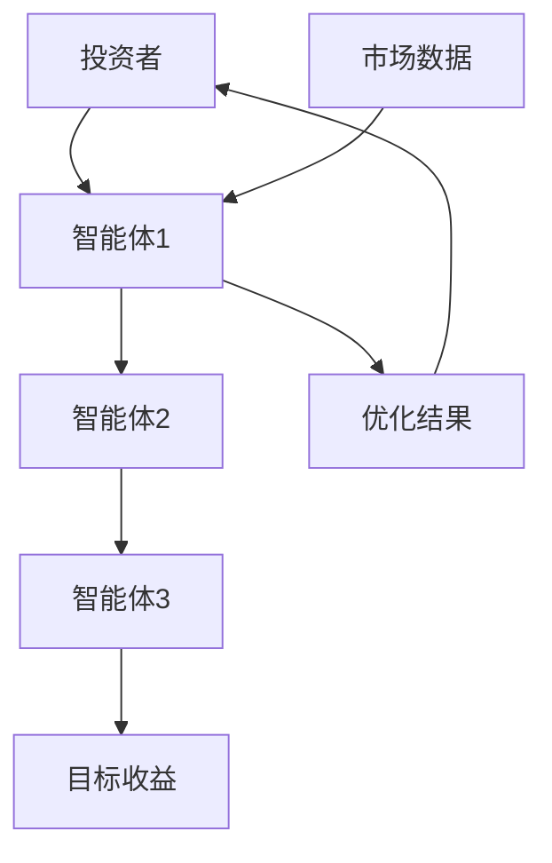

                 


# 多智能体系统在全球资产配置中的角色

> **关键词**：多智能体系统、全球资产配置、分布式计算、协作优化、投资组合优化、风险管理

> **摘要**：本文探讨了多智能体系统在全球资产配置中的应用，分析了多智能体系统的核心概念、算法原理及其在全球资产配置中的角色。通过案例分析和系统设计，展示了多智能体系统如何通过分布式计算、协作优化和风险管理提升资产配置的效率和效果。

---

# 第一部分：多智能体系统概述

## 第1章：多智能体系统的基本概念

### 1.1 多智能体系统的核心概念

#### 1.1.1 多智能体系统的定义与特点

多智能体系统（Multi-Agent System，MAS）是由多个智能体（Agent）组成的分布式系统。智能体是具有感知、决策和执行能力的实体，能够独立工作并与其他智能体协作。MAS的特点包括分布式性、协作性、动态性和适应性。

#### 1.1.2 多智能体系统的组成与结构

多智能体系统通常由以下部分组成：
- **智能体**：具有感知、决策和执行能力的实体。
- **环境**：智能体所处的外部环境，包括其他智能体和静态实体。
- **通信机制**：智能体之间交换信息的方式。
- **协调机制**：智能体协作完成任务的规则和协议。

### 1.2 多智能体系统与全球资产配置的结合

#### 1.2.1 全球资产配置的基本概念

全球资产配置是指在不同国家和地区的金融市场中分配资金，以实现风险分散和收益最大化。传统的资产配置方法依赖于单个决策者或模型，而多智能体系统通过分布式计算和协作优化，为全球资产配置提供了新的思路。

#### 1.2.2 多智能体系统在资产配置中的角色

多智能体系统在全球资产配置中的角色包括：
- **信息采集**：智能体实时采集金融市场数据。
- **决策优化**：多个智能体协作优化投资组合。
- **风险管理**：通过分布式计算降低系统性风险。

### 1.3 多智能体系统的技术优势

#### 1.3.1 分布式计算与智能体协作

多智能体系统通过分布式计算，避免了单点故障和计算瓶颈，提高了系统的稳定性和效率。

#### 1.3.2 多智能体系统的动态适应性

多智能体系统能够快速适应市场变化，通过智能体之间的协作实现动态优化。

#### 1.3.3 多智能体系统的可扩展性与灵活性

多智能体系统可以根据需求灵活扩展，适用于不同规模和复杂度的资产配置问题。

---

# 第二部分：多智能体系统在资产配置中的应用

## 第2章：资产配置的多智能体系统模型

### 2.1 资产配置的基本原理

#### 2.1.1 资产配置的目标与原则

资产配置的目标是通过合理分配资金，实现收益与风险的最优平衡。资产配置的原则包括分散化、风险匹配和长期优化。

#### 2.1.2 资产配置的主要方法与策略

资产配置的主要方法包括：
- **均值-方差模型**：优化投资组合的收益与风险。
- **因子模型**：基于市场因子进行资产定价。
- **情景分析**：基于不同市场情景进行资产配置。

### 2.2 多智能体系统在资产配置中的角色

#### 2.2.1 智能体的分工与协作

多智能体系统中，不同智能体负责不同的任务：
- **数据采集智能体**：实时采集金融市场数据。
- **风险评估智能体**：评估投资组合的风险。
- **决策优化智能体**：优化投资组合的配置。

#### 2.2.2 多智能体系统的决策机制

多智能体系统的决策机制包括：
- **分布式决策**：每个智能体独立决策，然后通过通信机制进行协调。
- **集中式决策**：由中央智能体协调所有智能体的决策。

#### 2.2.3 多智能体系统的风险控制与优化

多智能体系统通过分布式计算和协作优化，能够实时监控和调整投资组合，降低系统性风险。

---

## 第3章：多智能体系统的算法原理

### 3.1 多智能体系统的算法概述

#### 3.1.1 分布式计算与协作优化

分布式计算是多智能体系统的核心算法之一。通过分布式计算，智能体能够快速响应市场变化并进行协作优化。

#### 3.1.2 多智能体系统的协调机制

协调机制是多智能体系统中智能体协作的关键。常见的协调机制包括：
- **一致性协议**：确保智能体之间达成一致。
- **分布式优化算法**：通过局部优化实现全局优化。

### 3.2 多智能体系统的数学模型

#### 3.2.1 投资组合优化模型

投资组合优化模型的目标是最优化投资组合的收益与风险。数学模型如下：

$$
\text{目标函数：} \quad \min_w \left( w^T \Sigma w \right)
$$

$$
\text{约束条件：} \quad \mathbb{E}[r] \geq \text{目标收益}
$$

其中，$w$ 是权重向量，$\Sigma$ 是协方差矩阵，$\mathbb{E}[r]$ 是期望收益。

#### 3.2.2 多智能体系统的优化算法

多智能体系统的优化算法包括：
- **分布式梯度下降**：通过智能体之间的通信实现梯度更新。
- **一致性算法**：通过一致性协议实现智能体之间的协调。

---

## 第4章：多智能体系统的系统设计

### 4.1 系统架构设计

#### 4.1.1 系统功能设计

多智能体系统的功能设计包括：
- **数据采集**：实时采集金融市场数据。
- **智能体协作**：智能体之间协作优化投资组合。
- **风险控制**：实时监控和调整投资组合。

#### 4.1.2 系统架构图



### 4.2 系统接口设计

#### 4.2.1 智能体之间的通信接口

智能体之间的通信接口包括：
- **数据接口**：数据的接收和发送。
- **控制接口**：智能体之间的控制信号。

#### 4.2.2 系统与用户的接口

系统与用户的接口包括：
- **输入接口**：用户输入投资需求。
- **输出接口**：系统输出优化结果。

---

## 第5章：项目实战

### 5.1 环境安装

#### 5.1.1 系统环境

建议使用Python 3.8及以上版本，安装以下库：
- `numpy`
- `pandas`
- `scipy`
- `networkx`
- `mermaid`

#### 5.1.2 环境配置

```bash
pip install numpy pandas scipy networkx mermaid
```

### 5.2 核心实现代码

#### 5.2.1 智能体类的定义

```python
class Agent:
    def __init__(self, id, role):
        self.id = id
        self.role = role
        self.data = None
```

#### 5.2.2 分布式计算实现

```python
def distributed_optimization(agents):
    for agent in agents:
        agent.data = receive_data(agent)
        compute(agent)
        send_data(agent)
```

### 5.3 案例分析

#### 5.3.1 投资组合优化

假设我们有三个智能体，分别负责数据采集、风险评估和决策优化。通过协作优化，智能体能够实时调整投资组合，实现收益与风险的最优平衡。

#### 5.3.2 实际案例

通过具体案例分析，展示多智能体系统在全球资产配置中的实际应用效果。

### 5.4 项目小结

通过项目实战，验证了多智能体系统在资产配置中的有效性和优势。

---

# 第六部分：小结与展望

## 第6章：小结与展望

### 6.1 本章小结

本文详细探讨了多智能体系统在全球资产配置中的应用，分析了多智能体系统的核心概念、算法原理和系统设计，并通过案例分析验证了其有效性。

### 6.2 未来展望

未来，多智能体系统在全球资产配置中的应用将更加广泛，随着人工智能和分布式计算技术的不断发展，多智能体系统将在金融领域发挥更大的作用。

---

**作者：AI天才研究院/AI Genius Institute & 禅与计算机程序设计艺术 /Zen And The Art of Computer Programming**

