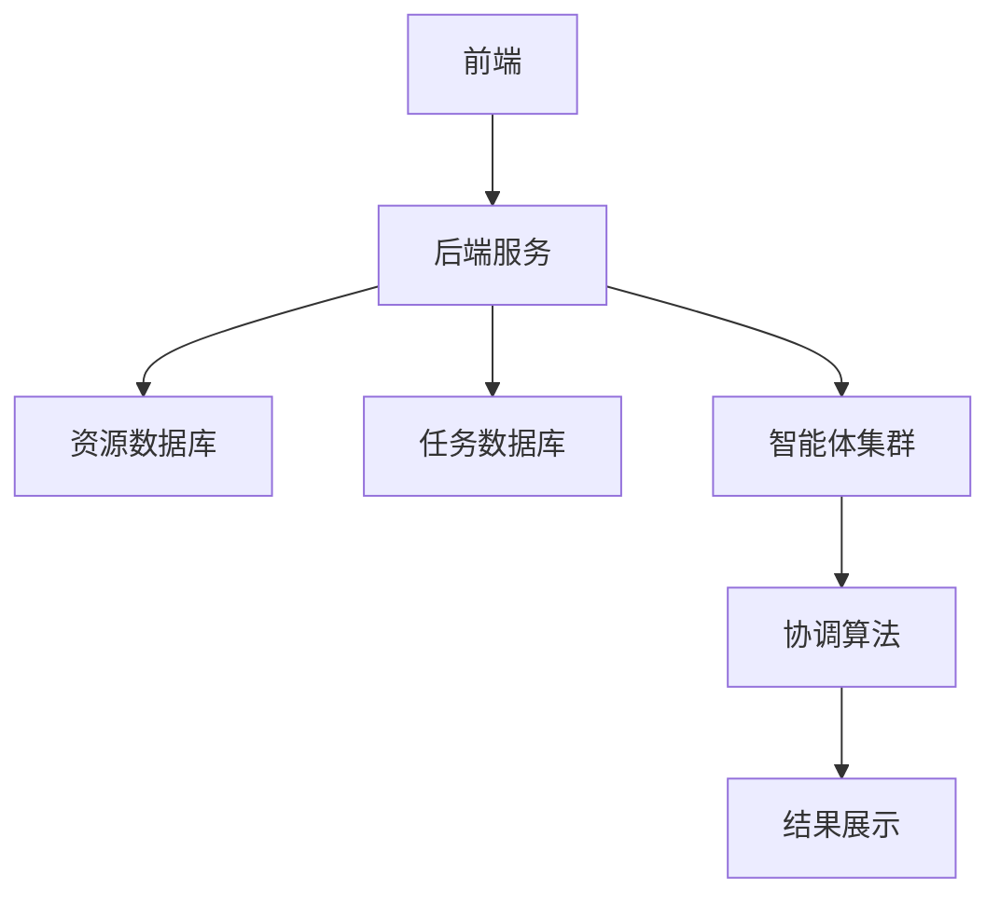

                 


# 多智能体系统在全球资源配置效率评估中的应用：寻找优质公司

## 关键词：多智能体系统、资源配置效率、优质公司、分布式计算、人工智能、算法原理

## 摘要：  
随着全球化的深入，资源分配和公司评估的效率问题变得日益重要。多智能体系统作为一种分布式计算的新兴技术，能够有效地提高资源配置效率，帮助企业快速识别优质公司。本文将详细探讨多智能体系统的核心概念、算法原理及其在资源分配中的实际应用。通过系统架构设计和项目实战，我们将展示如何利用多智能体系统优化资源配置，提升企业竞争力。

---

# 第一部分：多智能体系统概述

## 第1章：多智能体系统的基本概念

### 1.1 多智能体系统的定义  
多智能体系统（Multi-Agent System, MAS）是由多个智能体组成的分布式系统，这些智能体能够通过协作完成复杂的任务。每个智能体都是一个独立的实体，具有自主决策和学习能力。

### 1.2 多智能体系统的特征  
- **分布式性**：智能体分布在不同的节点上，通过通信协作完成任务。  
- **自主性**：每个智能体能够自主决策，无需中央控制。  
- **社会性**：智能体之间通过交互和协作完成任务。  
- **动态性**：系统能够适应环境的变化，实时调整策略。  

### 1.3 多智能体系统的应用场景  
- **资源分配优化**：在全球范围内优化资源配置，提高效率。  
- **公司评估**：通过多智能体系统分析公司数据，识别优质企业。  
- **分布式计算**：在大数据环境下，利用多智能体系统处理复杂任务。  

---

# 第二部分：多智能体系统的结构与通信

## 第2章：多智能体系统的结构

### 2.1 中心化与去中心化的结构对比  
- **中心化结构**：有一个中央节点控制所有智能体的行为，优点是易于管理，缺点是单点故障风险高。  
- **去中心化结构**：没有中央节点，每个智能体独立决策，优点是抗单点故障，缺点是协调难度大。  

### 2.2 对等网络结构  
对等网络结构是一种去中心化的结构，每个节点既是客户端也是服务器，能够动态加入或退出网络。这种结构适合分布式计算环境。  

### 2.3 代理与任务分配机制  
代理是多智能体系统中的关键组件，负责执行任务和与环境交互。任务分配机制需要考虑资源分配的公平性和效率。  

### 2.4 通信机制  
- **通信协议**：选择适合的通信协议，如HTTP、WebSocket等。  
- **信息传递效率**：通过压缩和加密技术优化信息传递。  
- **隐私保护**：使用加密和匿名化技术保护通信中的隐私。  

---

# 第三部分：多智能体系统与资源配置效率

## 第3章：资源配置的核心问题

### 3.1 资源分配的基本模型  
资源分配模型需要考虑资源的需求、供给和约束条件。通过数学建模，可以找到最优的分配方案。  

### 3.2 任务分配的优化目标  
- **最大化资源利用率**：合理分配资源，避免浪费。  
- **最小化成本**：通过优化分配策略降低成本。  
- **提高效率**：确保资源分配能够快速响应需求变化。  

### 3.3 资源分配的约束条件  
- **资源限制**：每个资源的可用性和限制条件。  
- **任务优先级**：不同任务的优先级影响分配策略。  
- **时间约束**：任务完成的时间限制。  

## 第4章：多智能体系统在资源配置中的优势

### 4.1 分布式计算的优势  
- **高可扩展性**：能够处理大规模数据和任务。  
- **高容错性**：单个节点故障不影响整体系统。  
- **高效率**：通过并行计算提高处理速度。  

### 4.2 自适应调整的能力  
多智能体系统能够实时感知环境变化，快速调整资源分配策略。  

### 4.3 多目标优化的实现  
通过多智能体系统，可以在多个目标之间找到平衡点，实现全局最优。  

---

# 第四部分：多智能体系统的算法原理

## 第5章：分布式计算与协调算法

### 5.1 分布式计算的基本原理  
分布式计算通过将任务分配到多个节点上并行处理，提高计算效率。  

### 5.2 协调算法  
- **协商算法**：智能体之间通过协商达成一致。  
- **拍卖算法**：通过拍卖机制分配资源。  
- **基于博弈论的算法**：利用博弈论模型优化资源分配。  

### 5.3 实现步骤  
1. 初始化智能体。  
2. 智能体感知环境，确定任务需求。  
3. 智能体通过通信协议进行交互。  
4. 协调算法生成资源分配方案。  
5. 执行分配方案并反馈结果。  

---

# 第五部分：系统架构设计

## 第6章：系统架构设计

### 6.1 项目背景  
本文设计了一个基于多智能体系统的资源配置优化平台，用于帮助企业识别优质公司。  

### 6.2 系统功能设计  
- **资源数据采集**：从数据库中采集资源和任务数据。  
- **资源分配算法实现**：实现分布式计算和协调算法。  
- **结果展示**：展示资源分配结果和公司评估报告。  

### 6.3 系统架构设计  


### 6.4 接口设计  
- **前端接口**：提供用户交互界面，接收用户输入。  
- **后端接口**：与数据库和智能体集群通信。  
- **智能体接口**：定义智能体的行为和通信协议。  

---

# 第六部分：项目实战

## 第7章：项目实战

### 7.1 环境安装  
- 操作系统：Linux或Windows。  
- 开发工具：Python、Jupyter Notebook。  
- 数据库：MySQL或MongoDB。  

### 7.2 核心代码实现  
```python
import numpy as np

def resource_allocation_agents(num_agents, resources):
    # 初始化智能体
    agents = [Agent(i) for i in range(num_agents)]
    
    # 分配资源
    for agent in agents:
        agent.request(resources)
    
    # 协调算法
    coordinator = Coordinator(agents)
    coordinator.allocate_resources()
    
    return coordinator.get_allocation_result()
```

### 7.3 案例分析  
通过实际案例分析，展示多智能体系统在资源分配中的应用效果，包括优化前后的对比分析。  

---

# 第七部分：最佳实践与总结

## 第8章：最佳实践

### 8.1 小结  
多智能体系统在资源分配和公司评估中的应用前景广阔，能够显著提高资源配置效率。  

### 8.2 注意事项  
- **系统设计**：确保系统架构合理，避免单点故障。  
- **算法选择**：根据具体需求选择合适的协调算法。  
- **数据安全**：加强数据保护，确保隐私安全。  

### 8.3 拓展阅读  
推荐阅读相关领域的书籍和论文，深入理解多智能体系统的原理和应用。  

---

作者：AI天才研究院/AI Genius Institute & 禅与计算机程序设计艺术 /Zen And The Art of Computer Programming

