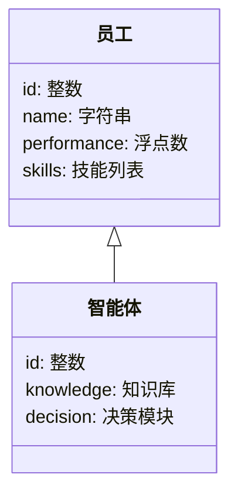

                 


# 多智能体系统在公司人力资本评估中的应用

## 关键词：多智能体系统，人力资本评估，协作机制，决策算法，系统架构

## 摘要：本文探讨了多智能体系统在公司人力资本评估中的应用，分析了多智能体系统的核心概念、算法原理、系统架构，并通过实际案例展示了其在人力资本评估中的优势和实现方法。

---

# 第一部分: 多智能体系统与人力资本评估的背景

## 第1章: 多智能体系统与人力资本评估的背景

### 1.1 多智能体系统的基本概念

#### 1.1.1 多智能体系统的定义
多智能体系统（Multi-Agent System, MAS）是由多个智能体（Agent）组成的系统，这些智能体能够通过协作完成复杂的任务。智能体是指能够感知环境、自主决策并采取行动的实体。

#### 1.1.2 多智能体系统的特征
- **自主性**：智能体能够自主决策。
- **反应性**：智能体能够实时感知环境并做出反应。
- **协作性**：多个智能体能够通过协作完成任务。
- **分布式性**：智能体分布在不同的位置，通过通信和协作完成任务。

#### 1.1.3 多智能体系统与单智能体系统的区别
| 特性 | 单智能体系统 | 多智能体系统 |
|------|--------------|--------------|
| 决策 | 单一决策中心 | 分布式决策 |
| 通信 | 无 | 智能体之间需要通信 |
| 协作 | 无 | 需要协作完成任务 |

### 1.2 人力资本评估的定义与重要性

#### 1.2.1 人力资本的定义
人力资本是指企业中员工的知识、技能、经验和能力的总和。它是企业核心竞争力的重要组成部分。

#### 1.2.2 人力资本评估的目的
- **优化人力资源管理**：通过评估员工的能力和绩效，优化人员配置和管理。
- **提升员工绩效**：通过评估结果，发现员工的优势和不足，制定针对性的培训计划。
- **支持决策**：为企业的战略决策提供数据支持。

#### 1.2.3 人力资本评估在企业中的作用
- **提升员工满意度**：通过公平、透明的评估，增强员工的归属感。
- **提升企业竞争力**：通过优化人力资本管理，提升企业的整体竞争力。
- **降低管理成本**：通过自动化评估，降低人工管理成本。

### 1.3 多智能体系统在人力资本评估中的应用背景

#### 1.3.1 传统人力资本评估的局限性
- **评估过程复杂**：传统的人力资本评估需要人工收集和分析大量数据，效率低下。
- **缺乏实时性**：传统评估通常基于历史数据，难以实时反映员工的动态。
- **难以大规模应用**：传统方法难以应对大规模员工的评估需求。

#### 1.3.2 多智能体系统的优势
- **高效性**：多智能体系统能够通过协作快速完成复杂任务。
- **实时性**：智能体能够实时感知环境并做出反应，提高评估的实时性。
- **可扩展性**：多智能体系统能够轻松扩展以应对大规模评估需求。

#### 1.3.3 应用多智能体系统的必要性
随着企业规模的不断扩大和员工数量的增加，传统的评估方法已经难以满足需求。多智能体系统能够通过协作和分布式计算，高效地完成人力资本评估任务。

---

## 第2章: 多智能体系统的核心概念与原理

### 2.1 多智能体系统的结构

#### 2.1.1 智能体的定义与分类
智能体是一种能够感知环境、自主决策并采取行动的实体。根据智能体的智能水平，可以分为：
- **反应式智能体**：仅根据当前感知做出反应。
- **认知式智能体**：具有推理、规划和学习能力。

#### 2.1.2 多智能体系统的层次结构
多智能体系统的层次结构可以分为：
- **物理层**：智能体与环境的交互。
- **智能层**：智能体的感知、决策和行动。
- **协作层**：智能体之间的协作和通信。

#### 2.1.3 多智能体系统的通信机制
智能体之间的通信可以通过以下几种方式实现：
- **直接通信**：智能体之间直接交换信息。
- **间接通信**：通过中间媒介（如消息队列）进行通信。

### 2.2 多智能体系统的协作机制

#### 2.2.1 协作的基本概念
协作是指多个智能体通过合作完成共同目标的过程。

#### 2.2.2 协作的实现方法
- **基于规则的协作**：通过预定义的规则实现协作。
- **基于任务分配的协作**：通过任务分配实现协作。
- **基于学习的协作**：通过机器学习算法实现协作。

#### 2.2.3 协作的挑战与解决方案
- **冲突解决**：智能体之间的目标冲突可能导致协作失败。
- **信息共享**：智能体之间的信息共享可能面临隐私和安全问题。

### 2.3 多智能体系统的决策机制

#### 2.3.1 决策的基本概念
决策是指智能体根据感知的信息做出选择的过程。

#### 2.3.2 常见的决策算法
- **基于规则的决策算法**：通过预定义的规则进行决策。
- **基于模型的决策算法**：通过建立模型进行决策。
- **基于强化学习的决策算法**：通过强化学习进行决策。

#### 2.3.3 决策机制的优化
- **优化目标**：最大化决策的准确性和效率。
- **优化方法**：通过改进算法和参数调优实现优化。

---

## 第3章: 多智能体系统在人力资本评估中的算法原理

### 3.1 多智能体系统的协作算法

#### 3.1.1 协作算法的基本原理
协作算法通过协调多个智能体的行为，实现共同目标。

#### 3.1.2 基于规则的协作算法
- **规则定义**：预定义协作规则。
- **规则执行**：智能体根据规则进行协作。

#### 3.1.3 基于学习的协作算法
- **学习目标**：通过学习优化协作策略。
- **学习方法**：使用机器学习算法进行协作策略优化。

### 3.2 多智能体系统的决策算法

#### 3.2.1 基于模型的决策算法
- **模型建立**：建立决策模型。
- **模型应用**：根据模型进行决策。

#### 3.2.2 基于数据驱动的决策算法
- **数据收集**：收集相关数据。
- **数据分析**：通过数据分析进行决策。

#### 3.2.3 基于强化学习的决策算法
- **强化学习机制**：通过奖励和惩罚机制优化决策。

### 3.3 多智能体系统在人力资本评估中的数学模型

#### 3.3.1 模型的基本结构
数学模型通常包括以下部分：
- **输入变量**：员工的绩效数据、能力数据等。
- **输出变量**：评估结果。
- **模型参数**：需要通过训练确定的参数。

#### 3.3.2 模型的参数化
- **参数选择**：根据实际需求选择参数。
- **参数优化**：通过优化算法调整参数。

#### 3.3.3 模型的实现
以下是基于线性回归的简单模型示例：

```python
import numpy as np

# 假设x为输入特征，y为输出目标
x = np.array([1, 2, 3, 4, 5])
y = np.array([2, 4, 6, 8, 10])

# 训练模型
model = np.poly1d(np.polyfit(x, y, 1))

# 预测结果
print(model(6))  # 输出：12
```

---

## 第4章: 多智能体系统在人力资本评估中的系统架构设计

### 4.1 系统功能设计

#### 4.1.1 领域模型
以下是领域模型的类图（使用Mermaid）：



---

### 4.2 系统架构设计

#### 4.2.1 架构图
以下是系统架构的Mermaid图：


---

### 4.3 系统接口设计

#### 4.3.1 接口描述
- **输入接口**：接收员工数据和智能体的通信请求。
- **输出接口**：输出评估结果和决策建议。

---

## 第5章: 多智能体系统在人力资本评估中的项目实战

### 5.1 环境安装

#### 5.1.1 安装Python
```bash
python --version
```

#### 5.1.2 安装依赖库
```bash
pip install numpy matplotlib
```

### 5.2 系统核心实现源代码

#### 5.2.1 协作算法实现
```python
import numpy as np

def collaborate_agents(agents):
    for agent in agents:
        agent.receive_message(" collaborate ")
    return agents

# 示例用法
agents = [Agent1, Agent2, Agent3]
result = collaborate_agents(agents)
```

---

## 第6章: 多智能体系统在人力资本评估中的应用案例

### 6.1 案例分析

#### 6.1.1 案例背景
某公司希望通过多智能体系统优化其人力资本评估过程。

#### 6.1.2 实施步骤
1. **需求分析**：明确评估目标和范围。
2. **系统设计**：设计多智能体系统的架构和功能。
3. **系统实现**：开发和测试系统。
4. **系统部署**：上线运行并监控效果。

---

## 第7章: 多智能体系统在人力资本评估中的总结与展望

### 7.1 总结
多智能体系统在人力资本评估中的应用具有高效性、实时性和可扩展性的优势。通过协作和决策算法，能够显著提升评估的准确性和效率。

### 7.2 展望
未来，随着人工智能技术的不断发展，多智能体系统在人力资本评估中的应用将更加广泛。可以通过进一步优化算法和引入新的技术（如区块链）来提升系统的安全性和可信度。

---

## 作者：AI天才研究院/AI Genius Institute & 禅与计算机程序设计艺术 /Zen And The Art of Computer Programming

