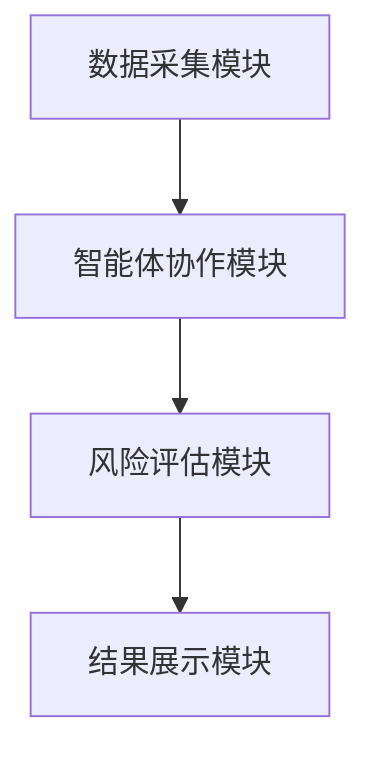
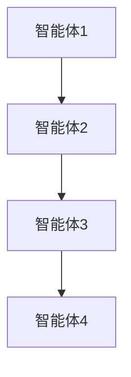
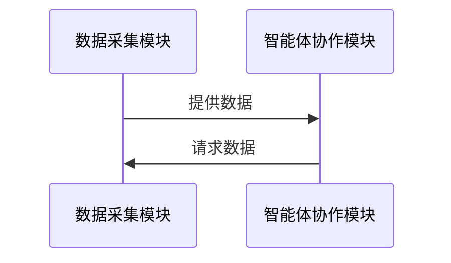

                 


# 多智能体系统在公司人才流失风险评估中的应用

> 关键词：多智能体系统, 人才流失风险评估, 多智能体建模, 多智能体协作, 强化学习, 人才管理

> 摘要：本文探讨了多智能体系统（MAS）在公司人才流失风险评估中的应用。通过分析多智能体系统的核心概念与算法原理，结合实际项目案例，详细讲解了如何利用多智能体系统构建高效的人才流失风险评估模型。文章内容涵盖多智能体系统概述、核心概念与联系、算法原理、系统架构设计、项目实战、总结与最佳实践等部分，为读者提供了从理论到实践的全面指导。

---

## 第一部分: 多智能体系统与人才流失风险评估概述

### 第1章: 多智能体系统（MAS）概述

#### 1.1 多智能体系统的核心概念

##### 1.1.1 多智能体系统的定义与特点
多智能体系统（Multi-Agent System, MAS）是由多个智能体（Agent）组成的系统，这些智能体能够通过协作完成复杂任务。MAS的特点包括：分布式、协作性、自治性、反应性和社会性。

##### 1.1.2 多智能体系统与单智能体系统的区别
单智能体系统依赖中央控制单元，而多智能体系统通过分布式智能体协作完成任务。MAS能够处理复杂环境中的动态问题，而单智能体系统在复杂性上较为受限。

##### 1.1.3 多智能体系统在人才流失评估中的优势
MAS能够处理多维度、多层次的复杂数据，适应动态变化的人才流失风险因素。通过多智能体协作，可以更准确地评估风险。

#### 1.2 人才流失风险评估的背景与意义

##### 1.2.1 人才流失对企业的影响
人才流失会导致企业核心竞争力下降，影响团队稳定性，增加招聘和培训成本。

##### 1.2.2 传统人才流失评估方法的局限性
传统方法依赖经验判断，数据单一，缺乏动态分析能力，难以应对复杂的人才流失风险。

##### 1.2.3 多智能体系统在人才流失评估中的优势
MAS能够整合多源数据，通过智能体协作动态评估风险，提供精准的决策支持。

---

### 第2章: 多智能体系统在人才流失评估中的应用背景

#### 2.1 人才流失风险评估的复杂性

##### 2.1.1 人才流失的影响因素分析
包括员工满意度、职业发展机会、薪酬福利、工作压力、团队氛围等多维度因素。

##### 2.1.2 多智能体系统如何应对复杂性
通过智能体协作，MAS能够综合分析多维度数据，捕捉潜在风险信号。

##### 2.1.3 企业内部信息的多维度分析需求
人才流失评估需要整合员工行为数据、绩效数据、离职意向调查等多源信息。

#### 2.2 多智能体系统的建模优势

##### 2.2.1 多智能体系统的建模方法
基于强化学习、博弈论等方法，构建智能体之间的协作与竞争模型。

##### 2.2.2 多智能体系统在人才流失评估中的建模优势
能够模拟员工行为，预测潜在离职风险，提供个性化解决方案。

##### 2.2.3 多智能体系统的可扩展性与灵活性
MAS支持动态调整模型参数，适应企业发展的变化。

---

### 第3章: 多智能体系统的核心概念与联系

#### 3.1 多智能体系统的核心原理

##### 3.1.1 多智能体系统的组成要素
包括智能体、环境、通信机制、协作协议和目标函数。

##### 3.1.2 智能体的属性与行为分析
智能体具有自主性、反应性和社会性，能够感知环境并采取行动。

##### 3.1.3 多智能体系统的通信机制
智能体之间通过消息传递进行协作，通信机制支持多种协议。

#### 3.2 多智能体系统与人才流失评估的关系

##### 3.2.1 人才流失评估的多维度分析需求
需要综合考虑员工、团队、组织等多个层面的因素。

##### 3.2.2 多智能体系统如何满足这些需求
通过智能体协作，MAS能够整合多维度数据，提供全面的评估结果。

##### 3.2.3 多智能体系统的动态适应性与评估准确性
MAS能够实时更新模型，适应动态变化的环境，提高评估准确性。

---

### 第4章: 多智能体系统在人才流失评估中的算法原理

#### 4.1 多智能体系统的建模与训练

##### 4.1.1 多智能体系统的基本建模方法
基于强化学习，构建智能体的策略网络，通过奖励机制优化智能体行为。

##### 4.1.2 基于强化学习的智能体训练
智能体通过与环境互动，学习最优策略，应用于人才流失评估。

##### 4.1.3 多智能体系统中的协作与竞争机制
智能体之间通过协作提高整体评估准确性，同时通过竞争机制优化个体行为。

#### 4.2 人才流失评估的数学模型与公式

##### 4.2.1 人才流失风险评估的数学模型
$$ R = f(x_1, x_2, \ldots, x_n) $$
其中，$R$ 表示人才流失风险，$x_i$ 表示影响因素。

##### 4.2.2 多智能体系统中的概率计算公式
$$ P(i) = \frac{1}{1 + e^{-\beta x_i}} $$
表示智能体对离职风险的预测概率。

##### 4.2.3 基于多智能体的动态评估公式
$$ D(t) = \alpha D(t-1) + (1-\alpha)R(t) $$
表示动态评估结果，$\alpha$ 为遗忘系数。

---

### 第5章: 多智能体系统在人才流失评估中的系统架构设计

#### 5.1 系统功能设计

##### 5.1.1 人才流失风险评估的模块划分
包括数据采集模块、智能体协作模块、风险评估模块和结果展示模块。

##### 5.1.2 智能体的交互与协作机制
智能体通过消息传递协作，共同完成风险评估任务。

##### 5.1.3 系统的输入输出设计
输入：员工数据、绩效数据、离职意向调查；
输出：人才流失风险报告、预警信息。

#### 5.2 系统架构图

##### 5.2.1 系统整体架构的mermaid图


##### 5.2.2 智能体协作的mermaid流程图


##### 5.2.3 系统接口设计的mermaid序列图


---

### 第6章: 多智能体系统在人才流失评估中的项目实战

#### 6.1 项目环境安装与配置

##### 6.1.1 开发环境的搭建
安装Python、TensorFlow、Keras等工具，配置虚拟环境。

##### 6.1.2 多智能体系统的依赖库安装
安装必要的库，如`numpy`、`pandas`、`scikit-learn`。

##### 6.1.3 数据集的准备与预处理
收集员工数据，进行数据清洗和特征工程。

#### 6.2 系统核心代码实现

##### 6.2.1 智能体的定义与实现
```python
class Agent:
    def __init__(self, model):
        self.model = model
    def act(self, state):
        return self.model.predict(state)
```

##### 6.2.2 基于强化学习的训练代码
```python
def train_agents(agents, env):
    for agent in agents:
        for state in env.states:
            action = agent.act(state)
            reward = env.get_reward(state, action)
            agent.model.update(reward)
```

##### 6.2.3 系统功能的实现
```python
def evaluate_agents(agents, env):
    total_risk = 0
    for state in env.states:
        risk = 0
        for agent in agents:
            action = agent.act(state)
            risk += env.get_risk(state, action)
        total_risk += risk / len(agents)
    return total_risk / len(env.states)
```

---

## 第七章: 总结与最佳实践

### 7.1 总结

本文详细探讨了多智能体系统在人才流失风险评估中的应用，通过理论分析和实际案例展示了MAS的优势。

### 7.2 最佳实践 tips

- 数据隐私保护：确保员工数据的安全性。
- 系统维护：定期更新模型，适应变化。
- 拓展阅读：深入学习强化学习和多智能体协作算法。

### 7.3 小结

多智能体系统在人才流失评估中的应用前景广阔，通过不断优化模型，可以为企业提供更精准的风险评估支持。

---

**作者：AI天才研究院/AI Genius Institute & 禅与计算机程序设计艺术 /Zen And The Art of Computer Programming**

