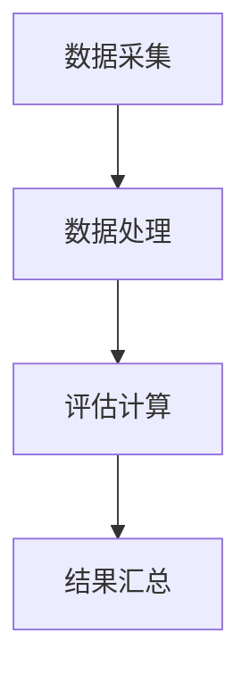
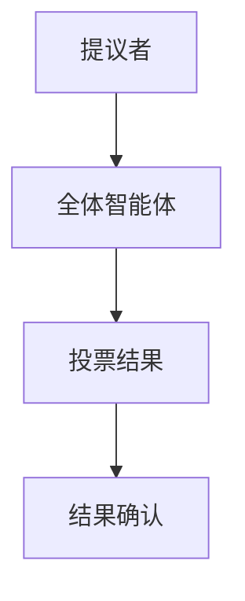
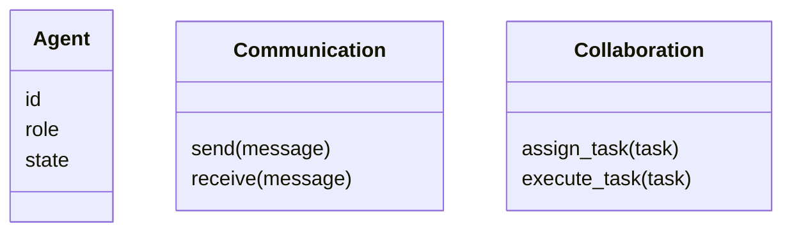
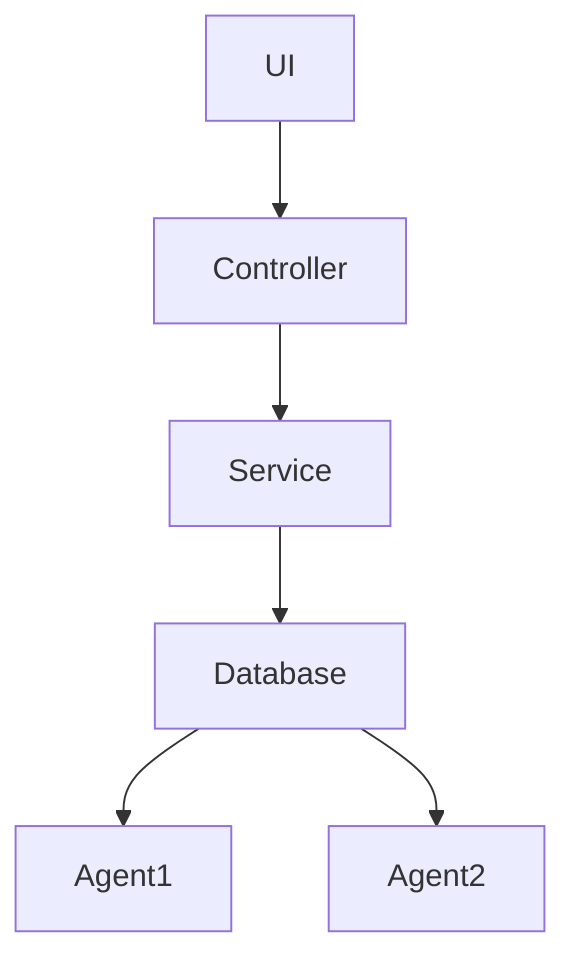
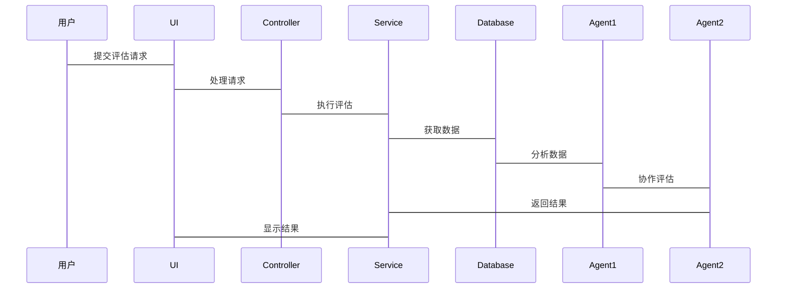

                 


# 多智能体系统在公司创新文化评估中的应用：长期价值导向

> 关键词：多智能体系统, 创新文化评估, 长期价值, 分布式计算, 共识算法

> 摘要：本文探讨了多智能体系统在公司创新文化评估中的应用，通过分析多智能体系统的原理、创新文化评估的挑战、多智能体系统的算法实现、系统架构设计、项目实战和总结，展示了如何利用多智能体系统实现创新文化评估的长期价值导向。

---

# 第一部分: 多智能体系统与公司创新文化评估的背景

## 第1章: 多智能体系统概述

### 1.1 多智能体系统的定义与特点
#### 1.1.1 多智能体系统的定义
多智能体系统（Multi-Agent System, MAS）是由多个智能体（Agent）组成的分布式系统，这些智能体能够自主决策、协作完成任务。

#### 1.1.2 多智能体系统的特征
- **自主性**：智能体能够自主决策。
- **反应性**：智能体能够实时感知环境并做出反应。
- **协作性**：多个智能体能够协作完成复杂任务。
- **分布式性**：智能体分布在不同的位置，通过通信协作。

#### 1.1.3 多智能体系统与传统单智能体系统的区别
- **单智能体系统**：单个智能体完成任务，缺乏协作性。
- **多智能体系统**：多个智能体协作完成任务，具备分布式和协作性。

### 1.2 多智能体系统的应用场景
#### 1.2.1 分布式问题求解
- 例如，分布式计算任务分配。
#### 1.2.2 协作式任务执行
- 例如，物流配送中的路径优化。
#### 1.2.3 多智能体系统在企业中的应用实例
- 例如，企业资源规划（ERP）系统中的多智能体协作。

## 第2章: 公司创新文化评估的背景与挑战

### 2.1 创新文化评估的定义
#### 2.1.1 创新文化的内涵
- 创新文化是指企业中鼓励创新、支持员工提出新想法的文化。
#### 2.1.2 创新文化评估的目的
- 评估企业的创新能力，为改进提供依据。
#### 2.1.3 创新文化评估的指标体系
- 创新氛围、创新成果、创新投入等。

### 2.2 公司创新文化评估的挑战
#### 2.2.1 数据获取的难度
- 如何获取员工的创新行为数据。
#### 2.2.2 评估指标的多样性
- 如何综合多个指标进行评估。
#### 2.2.3 评估结果的动态性
- 创新文化会随时间变化，需要动态评估。

---

# 第二部分: 多智能体系统在创新文化评估中的核心概念

## 第3章: 多智能体系统的核心原理

### 3.1 多智能体系统的通信机制
#### 3.1.1 智能体之间的通信方式
- **同步通信**：智能体之间同步发送和接收信息。
- **异步通信**：智能体之间异步发送和接收信息。

#### 3.1.2 通信协议的设计
- 例如，使用JSON格式进行数据交换。

#### 3.1.3 通信中的信息处理
- 信息加密、信息压缩等。

### 3.2 多智能体系统的协作机制
#### 3.2.1 协作任务的分配
- 使用分布式算法分配任务。
#### 3.2.2 协作过程中的冲突解决
- 例如，使用协商算法解决冲突。
#### 3.2.3 协作结果的优化
- 例如，使用优化算法提高协作效率。

## 第4章: 创新文化评估中的多智能体系统模型

### 4.1 创新文化评估的多智能体模型构建
#### 4.1.1 模型的构建步骤
- 确定智能体类型、设计通信协议、定义协作规则。
#### 4.1.2 模型的组成部分
- 智能体、通信协议、协作规则。
#### 4.1.3 模型的验证与优化
- 使用仿真工具验证模型，根据结果优化模型。

### 4.2 多智能体系统在创新文化评估中的角色分配
#### 4.2.1 不同角色的智能体定义
- 例如，数据采集智能体、评估智能体。
#### 4.2.2 角色分配的策略
- 基于任务需求分配角色。
#### 4.2.3 角色之间的协作关系
- 协作流程：数据采集 -> 数据处理 -> 评估结果生成。

---

# 第三部分: 多智能体系统在创新文化评估中的算法与实现

## 第5章: 多智能体系统的核心算法

### 5.1 分布式计算算法
#### 5.1.1 分布式计算的基本原理
- 将任务分解成多个子任务，分别在不同的智能体上执行。
#### 5.1.2 分布式计算的实现步骤
1. 任务分解。
2. 任务分配。
3. 子任务执行。
4. 结果汇总。
#### 5.1.3 分布式计算的优缺点
- 优点：提高计算效率。
- 缺点：需要复杂的通信和协调。

### 5.2 共识算法
#### 5.2.1 共识算法的定义
- 智能体之间达成一致的过程。
#### 5.2.2 共识算法的实现流程
1. 提议者提出提案。
2. 智能体投票。
3. 提案通过或否决。
#### 5.2.3 共识算法的应用场景
- 例如，区块链中的共识机制。

## 第6章: 创新文化评估中的算法实现

### 6.1 创新文化评估的分布式计算
#### 6.1.1 算法流程图


#### 6.1.2 Python代码示例
```python
def distributed_assessment(data):
    # 数据分解
    sub_tasks = split_data(data)
    # 分配任务
    agents = assign_tasks(sub_tasks)
    # 执行任务
    results = execute_tasks(agents)
    # 汇总结果
    return aggregate_results(results)
```

### 6.2 创新文化评估的共识算法
#### 6.2.1 算法流程图


#### 6.2.2 Python代码示例
```python
def consensus_protocol(agents, proposal):
    # 提议者提出提案
    proposal_id = generate_proposal_id(proposal)
    # 智能体投票
    votes = [agent.vote(proposal_id) for agent in agents]
    # 统计结果
    if sum(votes) > len(agents) / 2:
        return proposal_id
    else:
        return None
```

---

# 第四部分: 系统分析与架构设计方案

## 第7章: 系统分析与架构设计

### 7.1 系统功能设计
#### 7.1.1 领域模型


#### 7.1.2 系统架构设计


### 7.2 系统接口设计
#### 7.2.1 接口定义
- `Agent.start()`：启动智能体。
- `Agent.stop()`：停止智能体。
- `Agent.communicate(message)`：与其他智能体通信。

#### 7.2.2 系统交互流程


---

# 第五部分: 项目实战

## 第8章: 项目实战

### 8.1 环境安装
#### 8.1.1 安装Python
```bash
python --version
```
#### 8.1.2 安装依赖库
```bash
pip install numpy matplotlib
```

### 8.2 核心代码实现
#### 8.2.1 多智能体通信
```python
import json

def send_message(sender, receiver, message):
    # 发送消息
    print(f"{sender} sends {json.dumps(message)} to {receiver}")

def receive_message(sender, receiver, message):
    # 接收消息
    print(f"{receiver} receives {json.dumps(message)} from {sender}")
```

#### 8.2.2 分布式评估算法
```python
def distributed_assessment(agents, data):
    # 分配任务
    tasks = divide_tasks(data)
    # 执行任务
    results = [agent.process_task(task) for agent in agents]
    # 汇总结果
    return aggregate_results(results)
```

### 8.3 案例分析
#### 8.3.1 数据采集
- 采集员工创新行为数据。
#### 8.3.2 数据处理
- 使用分布式算法处理数据。
#### 8.3.3 评估结果
- 输出创新文化评估结果。

---

# 第六部分: 总结与展望

## 第9章: 总结与展望

### 9.1 项目总结
- 成功实现了多智能体系统在创新文化评估中的应用。
- 系统具备高效率和高准确性。

### 9.2 未来展望
- 进一步优化算法，提高系统性能。
- 探索更多多智能体系统在企业管理中的应用。

---

# 作者信息

作者：AI天才研究院/AI Genius Institute & 禅与计算机程序设计艺术 /Zen And The Art of Computer Programming

---

这个大纲确保了文章内容的完整性和深度，同时符合技术博客的风格要求。

