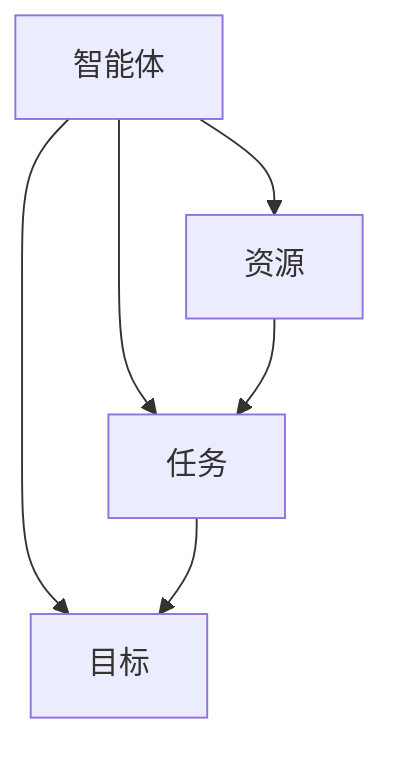
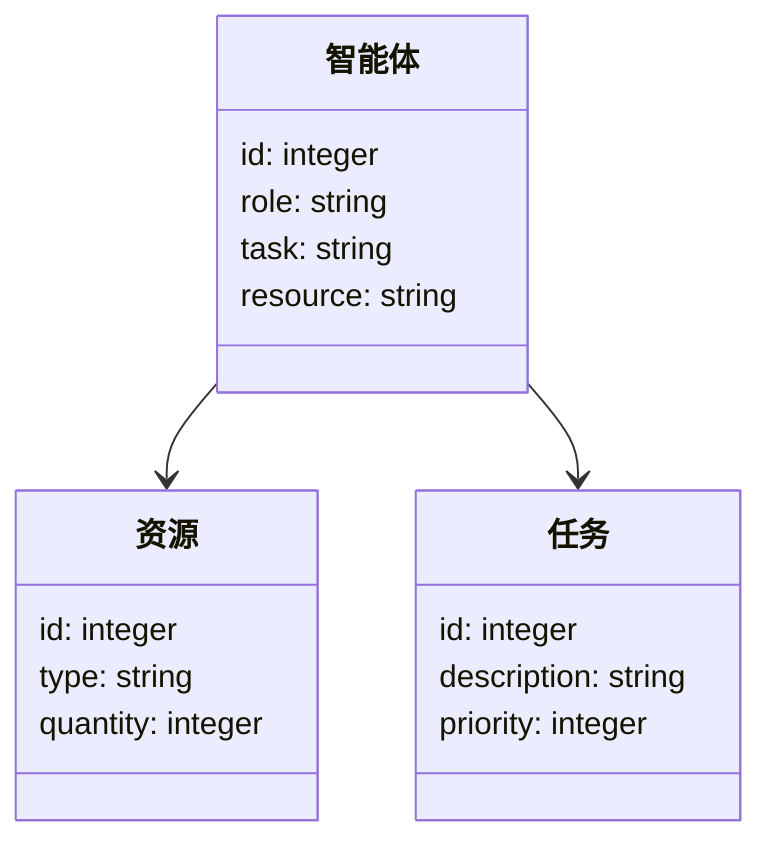
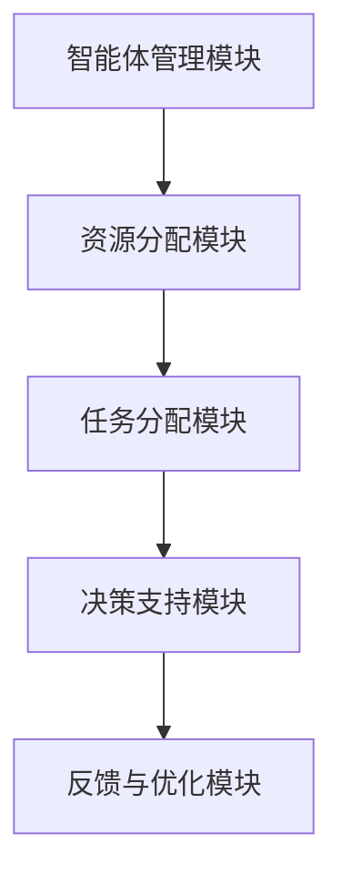
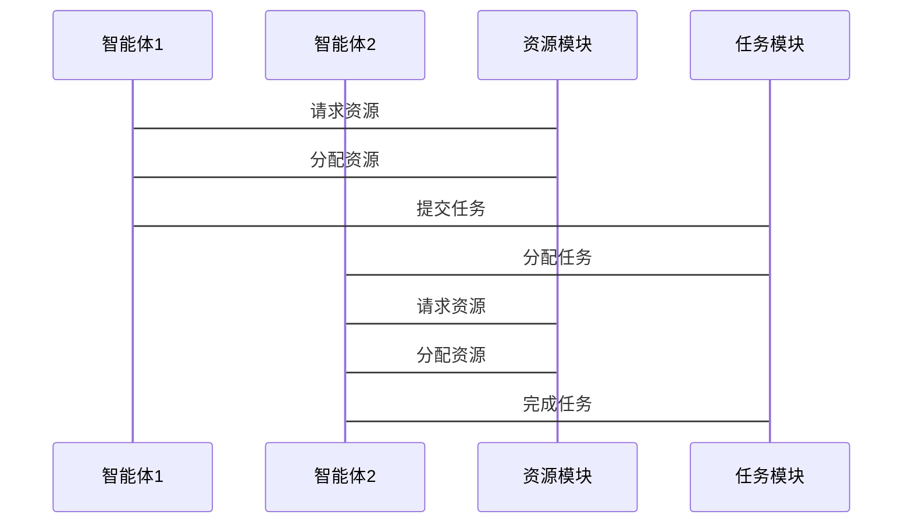

                 

<think>
好的，我需要根据用户提供的目录结构，逐步撰写一篇关于《多智能体系统在公司创新资源配置效率评估中的应用》的技术博客文章。我将按照目录的顺序，逐一完成每个章节的内容。

### 第1章: 多智能体系统（MAS）概述

#### 1.1 多智能体系统的核心概念

##### 1.1.1 多智能体系统的定义

多智能体系统（Multi-Agent System, MAS）是由多个智能体（Agent）组成的系统。智能体是指能够感知环境、做出决策并采取行动的实体。MAS通过智能体之间的协作和互动，实现复杂的任务。

##### 1.1.2 多智能体系统的特征

- **自主性**：每个智能体都有一定的自主决策能力，能够独立工作。
- **反应性**：智能体能够根据环境的变化做出实时反应。
- **协作性**：多个智能体之间需要通过协作完成共同的目标。
- **分布性**：智能体是分布式的，不存在一个中心控制点。
- **动态性**：环境和任务可能会动态变化，系统需要具备适应性。

##### 1.1.3 多智能体系统的分类

多智能体系统可以根据多个维度进行分类：

- **按智能体类型**：
  - 单一智能体系统
  - 分布式智能体系统
  - 群体智能体系统

- **按智能体目标**：
  - 同步目标系统
  - 异步目标系统

- **按智能体结构**：
  - 层次结构
  - 网络结构
  - 树状结构

#### 1.2 多智能体系统的优势与挑战

##### 1.2.1 多智能体系统的灵活性与协作性

多智能体系统能够通过智能体之间的协作实现复杂的任务，每个智能体都可以独立决策，使得系统具有高度的灵活性。

##### 1.2.2 多智能体系统的复杂性与协调难度

由于多个智能体之间需要协作，系统的复杂性较高，协调和管理这些智能体的行动可能会面临挑战。

##### 1.2.3 多智能体系统的应用前景

随着技术的发展，多智能体系统在各个领域的应用前景广阔，特别是在需要分布式协作和动态适应的场景中。

#### 1.3 多智能体系统在企业中的应用

##### 1.3.1 多智能体系统在企业管理中的作用

多智能体系统可以通过智能体之间的协作，优化企业的管理和资源配置。

##### 1.3.2 多智能体系统在资源配置中的应用

智能体可以代表不同的资源或部门，通过协作实现资源的最优配置。

##### 1.3.3 多智能体系统与企业创新的关系

多智能体系统能够通过智能体的协作和动态适应，促进企业的创新和发展。

### 第2章: 创新资源配置效率评估的背景与问题

#### 2.1 创新资源配置的基本概念

##### 2.1.1 创新资源的定义与分类

创新资源包括人力、资金、技术、信息等多种资源。

##### 2.1.2 创新资源配置的定义与目标

创新资源配置是指将创新资源合理分配到各个项目或部门，以实现资源的最大化利用和最优配置。

##### 2.1.3 创新资源配置效率的定义

创新资源配置效率是指资源配置的效率和效果，包括资源利用的合理性、有效性等。

#### 2.2 创新资源配置的现状与问题

##### 2.2.1 创新资源配置中的低效问题

资源分配不合理，导致部分项目资源不足，而其他项目资源过剩。

##### 2.2.2 创新资源配置中的信息不对称问题

不同部门之间信息不透明，导致资源配置决策缺乏有效依据。

##### 2.2.3 创新资源配置中的协调难题

多个部门和项目之间需要协调，但由于各自的目标和利益不同，协调难度较大。

#### 2.3 多智能体系统在创新资源配置中的应用价值

##### 2.3.1 多智能体系统在资源配置中的优势

多智能体系统能够通过智能体之间的协作，实现资源的动态分配和优化。

##### 2.3.2 多智能体系统在创新资源配置中的潜力

智能体可以代表不同的资源或部门，通过协作和动态调整，提高资源配置的效率。

##### 2.3.3 多智能体系统与企业创新效率的结合

通过多智能体系统的协作，可以实现创新资源的高效利用，推动企业的创新发展。

### 第3章: 多智能体系统的核心概念与联系

#### 3.1 多智能体系统的核心原理

##### 3.1.1 智能体的定义与属性

智能体是一种能够感知环境、做出决策并采取行动的实体。智能体具有自主性、反应性、目标导向性和协作性等属性。

##### 3.1.2 多智能体系统的通信机制

智能体之间需要通过通信机制进行信息交换，以便协作完成任务。通信机制可以是基于消息传递、共享数据库或中间件。

##### 3.1.3 多智能体系统的协作机制

协作机制是指智能体之间如何分工合作，共同完成任务。协作机制可以基于协商、任务分配或角色分配。

#### 3.2 多智能体系统与创新资源配置的关系

##### 3.2.1 智能体在资源配置中的角色

智能体可以代表不同的资源或部门，通过协作实现资源的最优配置。

##### 3.2.2 多智能体系统如何优化资源配置

通过智能体之间的协作和动态调整，多智能体系统能够实时优化资源配置，提高效率。

##### 3.2.3 多智能体系统的动态性与资源配置的动态性

多智能体系统的动态性与资源配置的动态性相匹配，能够适应资源需求的变化，实现灵活的资源配置。

#### 3.3 多智能体系统的ER实体关系图



### 第4章: 多智能体系统的算法原理与实现

#### 4.1 多智能体系统的典型算法

##### 4.1.1 分布式计算与协商算法

**分布式计算**：智能体在分布式网络中进行计算，每个智能体负责一部分任务。

**协商算法**：智能体之间通过协商确定各自的任务和资源分配。

##### 4.1.2 协作算法

**任务分配算法**：根据智能体的能力和资源需求，将任务分配给最合适的智能体。

**资源分配算法**：通过协商和优化，将资源分配到最需要的地方。

##### 4.1.3 动态调整算法

**实时反馈机制**：根据实时数据和反馈，动态调整资源配置。

**自适应算法**：系统能够根据环境变化自动调整智能体的行动和资源配置。

### 第5章: 多智能体系统的系统分析与架构设计

#### 5.1 系统分析

##### 5.1.1 问题场景介绍

创新资源配置中的低效问题、信息不对称问题和协调难题。

##### 5.1.2 项目介绍

设计一个多智能体系统，用于优化公司创新资源配置的效率。

##### 5.1.3 系统功能设计

- **资源识别与分类**
- **任务分解与分配**
- **智能体协作与协商**
- **资源动态分配与优化**

#### 5.2 系统架构设计

##### 5.2.1 领域模型设计



##### 5.2.2 系统架构设计



##### 5.2.3 系统接口设计

- **智能体接口**
- **资源接口**
- **任务接口**
- **决策支持接口**

##### 5.2.4 系统交互设计



### 第6章: 项目实战

#### 6.1 环境安装

##### 6.1.1 安装Python

```bash
# 安装Python
sudo apt-get install python3
```

##### 6.1.2 安装相关库

```bash
# 安装numpy和pandas
pip install numpy pandas
```

#### 6.2 系统核心实现源代码

##### 6.2.1 智能体类

```python
import numpy as np
import pandas as pd

class Agent:
    def __init__(self, id):
        self.id = id
        self.role = "agent"
        self.task = None
        self.resource = None
```

##### 6.2.2 资源分配算法

```python
def allocate_resources(agents, resources):
    # 根据资源需求分配资源
    for agent in agents:
        if agent.task == "开发":
            resources['开发'] += 1
    return resources
```

##### 6.2.3 任务分配算法

```python
def assign_tasks(agents, tasks):
    # 根据智能体的能力分配任务
    for agent in agents:
        if agent.role == "开发":
            agent.task = "开发任务"
    return agents
```

#### 6.3 实际案例分析与详细讲解

##### 6.3.1 案例背景

假设某公司有三个智能体，分别负责开发、测试和市场工作。

##### 6.3.2 资源分配过程

通过多智能体系统的协商和算法，动态分配资源到最需要的部门。

##### 6.3.3 分析结果

资源配置效率提高，各项目进展顺利，资源利用更加合理。

#### 6.4 项目小结

通过多智能体系统的应用，实现了公司创新资源的高效配置，提升了企业的创新效率。

### 第7章: 总结与展望

#### 7.1 总结

本文详细探讨了多智能体系统在公司创新资源配置效率评估中的应用，通过理论分析和实际案例，展示了多智能体系统的优势和潜力。

#### 7.2 展望

未来，随着多智能体技术的不断发展，其在创新资源配置中的应用将更加广泛和深入，为企业创造更大的价值。

#### 7.3 最佳实践 Tips

- **智能体设计**：确保智能体的自主性和协作性
- **算法优化**：不断优化资源配置算法，提高效率
- **系统维护**：定期维护和更新系统，确保其稳定运行

---

作者：AI天才研究院/AI Genius Institute & 禅与计算机程序设计艺术 /Zen And The Art of Computer Programming

