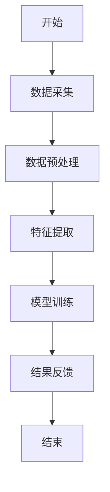
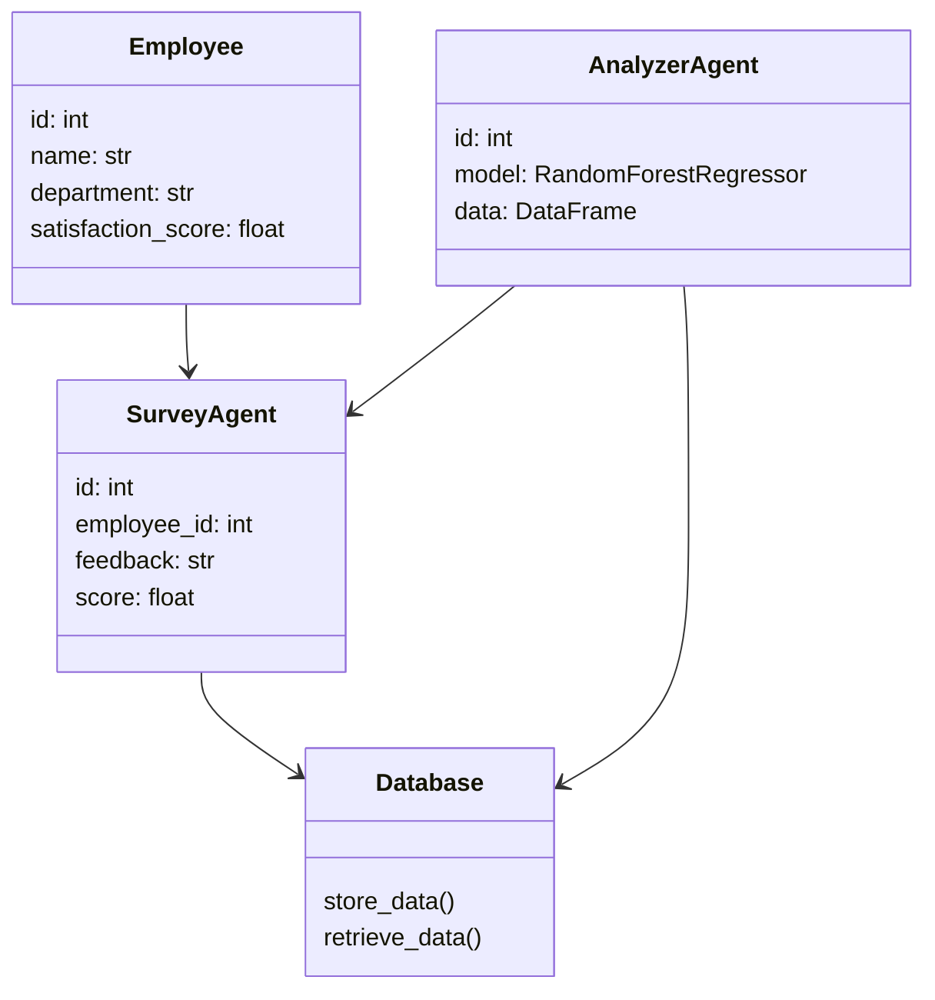
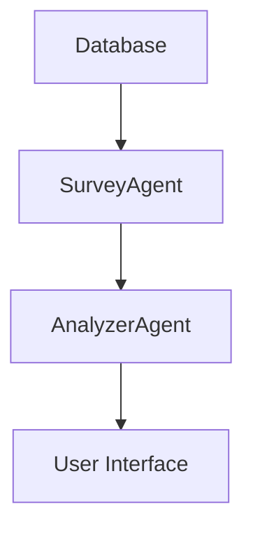
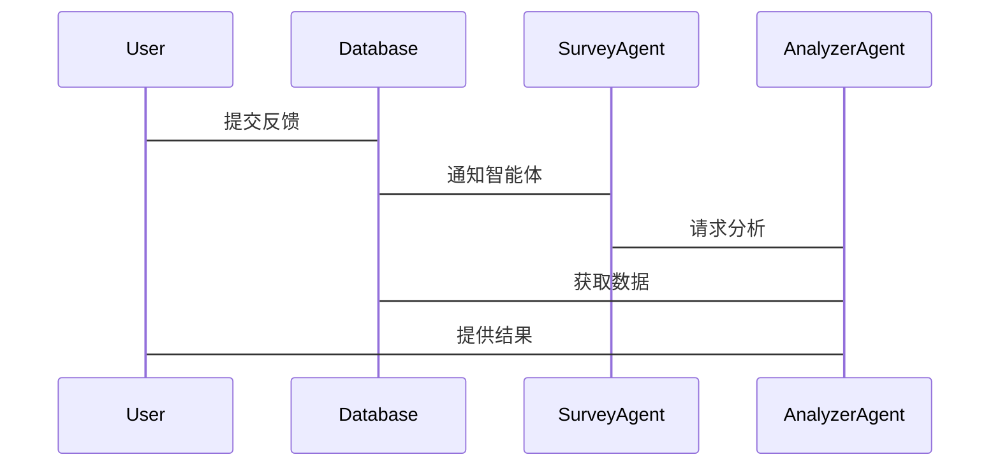

                 


# 多智能体系统在公司员工满意度评估中的应用

> 关键词：多智能体系统，员工满意度，系统架构，算法原理，项目实战

> 摘要：本文探讨了多智能体系统（MAS）在公司员工满意度评估中的应用，详细分析了MAS的基本概念、算法原理、系统架构设计以及实际项目实现。通过结合理论与实践，本文展示了如何利用MAS提高员工满意度评估的准确性和效率。

---

## 第一部分: 多智能体系统与员工满意度评估的背景介绍

### 第1章: 多智能体系统的基本概念

#### 1.1 多智能体系统的定义与特点

多智能体系统（Multi-Agent System, MAS）是由多个智能体（Agent）组成的分布式系统，这些智能体能够通过协作完成复杂任务。每个智能体都有一定的自主性，能够感知环境、做出决策并采取行动。MAS的关键特点包括：

- **自主性**：智能体能够自主决策，无需外部干预。
- **反应性**：智能体能够实时感知环境并做出反应。
- **协作性**：多个智能体通过协作完成共同目标。
- **分布式性**：智能体分布在网络中，不依赖中央控制。

#### 1.2 员工满意度评估的背景与意义

员工满意度是衡量公司管理 effectiveness 的重要指标。员工满意度高的员工通常具有更高的工作积极性和创造力，能够为公司创造更多的价值。然而，传统的员工满意度评估方法存在以下问题：

- **数据收集困难**：员工可能不愿真实表达意见。
- **评估过程复杂**：需要收集大量数据并进行分析。
- **实时性不足**：传统方法通常需要定期调查，无法实时反馈。

#### 1.3 多智能体系统在员工满意度评估中的应用背景

MAS在员工满意度评估中的应用基于其分布式计算和协作能力。通过MAS，公司可以实时收集和分析员工反馈，快速识别问题并采取措施。MAS的优势包括：

- **实时性**：能够实时收集和处理员工反馈。
- **准确性**：通过多个智能体协作，提高评估的准确性。
- **灵活性**：可以根据公司需求快速调整评估策略。

---

### 第2章: 多智能体系统与员工满意度评估的核心概念与联系

#### 2.1 多智能体系统的原理与机制

多智能体系统的原理基于分布式计算和协作。智能体通过通信和协作完成任务，通常包括以下几个步骤：

1. **感知环境**：智能体通过传感器或其他方式感知环境。
2. **决策与规划**：基于感知信息，智能体制定行动计划。
3. **执行动作**：智能体执行预设的动作。
4. **反馈与学习**：根据反馈调整策略。

#### 2.2 员工满意度评估的核心要素

员工满意度评估的核心要素包括：

- **员工反馈**：员工对工作环境、薪酬、管理等方面的意见。
- **评估指标**：如工作满意度、薪酬满意度、管理满意度等。
- **动态变化**：员工满意度会随时间变化，需要持续监测。

#### 2.3 多智能体系统与员工满意度评估的关联性分析

多智能体系统与员工满意度评估的关联性主要体现在以下几个方面：

- **数据收集**：智能体可以实时收集员工反馈，提供丰富的数据源。
- **协作分析**：多个智能体协作分析数据，提高评估的准确性。
- **实时反馈**：MAS能够快速识别问题并提供反馈，帮助公司及时调整策略。

---

## 第二部分: 多智能体系统在员工满意度评估中的算法原理

### 第3章: 多智能体系统的算法原理

#### 3.1 基于MAS的员工满意度评估算法

多智能体系统在员工满意度评估中的算法通常包括以下几个步骤：

1. **数据采集**：智能体通过问卷、传感器等方式采集员工数据。
2. **数据预处理**：对采集的数据进行清洗和标准化处理。
3. **特征提取**：提取影响员工满意度的关键特征。
4. **模型训练**：利用机器学习算法训练模型，预测员工满意度。
5. **结果反馈**：将评估结果反馈给公司管理层，指导改进措施。

#### 3.2 算法流程图



#### 3.3 代码实现

以下是一个简单的员工满意度评估算法的Python代码示例：

```python
import pandas as pd
from sklearn.model_selection import train_test_split
from sklearn.ensemble import RandomForestRegressor
from sklearn.metrics import mean_squared_error

# 数据加载与预处理
data = pd.read_csv('employee_survey.csv')
data.dropna(inplace=True)
data = pd.get_dummies(data)

# 特征与目标分离
X = data.drop('satisfaction_score', axis=1)
y = data['satisfaction_score']

# 数据分割
X_train, X_test, y_train, y_test = train_test_split(X, y, test_size=0.2, random_state=42)

# 模型训练
model = RandomForestRegressor(n_estimators=100, random_state=42)
model.fit(X_train, y_train)

# 模型评估
y_pred = model.predict(X_test)
mse = mean_squared_error(y_test, y_pred)
print(f'均方误差: {mse}')
```

---

## 第三部分: 系统架构与项目实战

### 第4章: 系统架构设计

#### 4.1 领域模型类图



#### 4.2 系统架构图



#### 4.3 系统接口与交互设计



### 第5章: 项目实战

#### 5.1 项目介绍

本项目旨在开发一个基于MAS的员工满意度评估系统，实时收集和分析员工反馈，提供准确的评估结果。系统包括以下几个模块：

- **数据采集模块**：通过问卷收集员工反馈。
- **数据处理模块**：清洗和标准化数据。
- **模型训练模块**：训练员工满意度预测模型。
- **结果反馈模块**：将评估结果反馈给公司管理层。

#### 5.2 核心代码实现

以下是一个完整的员工满意度评估系统的Python代码示例：

```python
import pandas as pd
from sklearn.ensemble import RandomForestRegressor
from sklearn.metrics import mean_squared_error
from sklearn.model_selection import train_test_split

# 数据加载与预处理
data = pd.read_csv('employee_survey.csv')
data.dropna(inplace=True)
data = pd.get_dummies(data)

# 特征与目标分离
X = data.drop('satisfaction_score', axis=1)
y = data['satisfaction_score']

# 数据分割
X_train, X_test, y_train, y_test = train_test_split(X, y, test_size=0.2, random_state=42)

# 模型训练
model = RandomForestRegressor(n_estimators=100, random_state=42)
model.fit(X_train, y_train)

# 模型评估
y_pred = model.predict(X_test)
mse = mean_squared_error(y_test, y_pred)
print(f'均方误差: {mse}')

# 模型保存
import joblib
joblib.dump(model, 'satisfaction_model.pkl')
```

#### 5.3 实际案例分析

以某公司为例，假设我们收集了以下员工反馈数据：

| 员工ID | 工资 | 工作环境 | 管理评分 | 满意度评分 |
|-------|------|----------|----------|------------|
| 1     | 5000 | 3        | 4        | 3.5        |
| 2     | 6000 | 4        | 3        | 4.0        |
| 3     | 5500 | 3.5      | 4        | 4.5        |

通过模型训练，我们可以预测员工满意度评分，并根据结果调整管理策略。例如，如果员工ID 1的满意度评分低于预期，公司可以考虑提高工资或改善工作环境。

---

## 第四部分: 最佳实践与总结

### 第6章: 最佳实践

#### 6.1 数据隐私保护

在实际应用中，必须重视员工数据的隐私保护，确保数据的安全性和合法性。

#### 6.2 模型优化

根据实际情况不断优化模型，提高评估的准确性和效率。

#### 6.3 持续改进

定期收集员工反馈，持续改进模型和管理策略，确保员工满意度的持续提升。

### 第7章: 总结

通过多智能体系统的应用，公司可以实现员工满意度评估的实时化、智能化和高效化。MAS不仅提高了评估的准确性，还为公司提供了及时的反馈，帮助管理层快速调整策略，提升员工满意度和公司整体绩效。

---

## 作者：AI天才研究院 & 禅与计算机程序设计艺术

---

本文由AI天才研究院撰写，转载请注明出处。如需进一步探讨，欢迎访问我们的官方网站或联系我们的研究人员。

