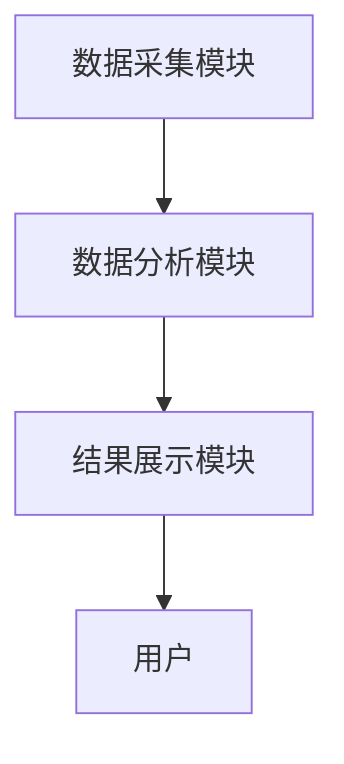
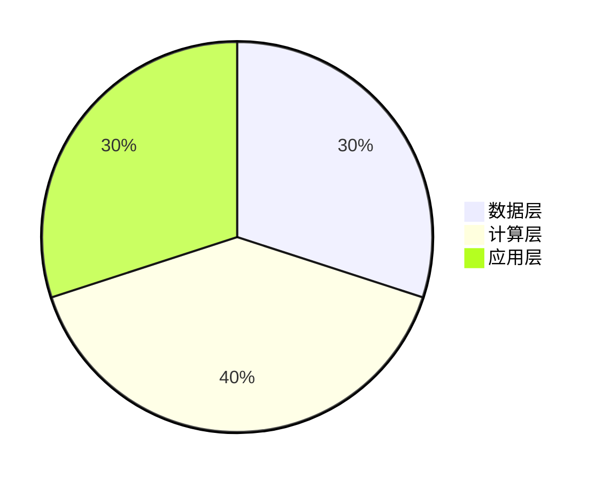
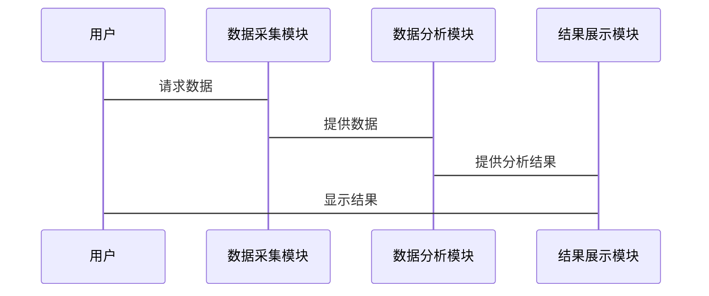

                 


# 多智能体系统在公司品牌忠诚度分析中的应用

> 关键词：多智能体系统，品牌忠诚度分析，分布式计算，协同过滤，实时数据分析

> 摘要：本文探讨了多智能体系统在公司品牌忠诚度分析中的应用，详细介绍了多智能体系统的原理、算法及其在品牌忠诚度分析中的具体应用。通过实际案例分析和系统设计，展示了多智能体系统在提高品牌忠诚度分析效率和准确性方面的优势。

---

## 第1章：多智能体系统概述

### 1.1 多智能体系统的定义与特点

多智能体系统（Multi-Agent System, MAS）是由多个智能体（Agent）组成的分布式系统，这些智能体能够通过交互和协作完成特定任务。以下是多智能体系统的几个核心特点：

- **分布式性**：多个智能体独立运行，能够自主决策。
- **协作性**：智能体之间通过通信和协作完成复杂的任务。
- **响应性**：能够实时感知环境变化并做出反应。
- **社会性**：智能体之间存在复杂的交互和协作关系。

### 1.2 品牌忠诚度分析的背景与重要性

品牌忠诚度是衡量客户对品牌长期支持程度的重要指标。高品牌忠诚度意味着客户更可能持续选择该品牌，为企业带来长期收益。然而，品牌忠诚度分析面临以下挑战：

- 数据复杂性：涉及多源异构数据。
- 实时性要求高：需要快速响应市场变化。
- 模型可解释性：需要清晰理解分析结果背后的原因。

---

## 第2章：多智能体系统在品牌忠诚度分析中的应用背景

### 2.1 当前品牌忠诚度分析的挑战

#### 2.1.1 数据多样性与复杂性

品牌忠诚度分析涉及多种数据类型，包括：

- **结构化数据**：如销售数据、客户信息。
- **半结构化数据**：如客户评论、社交媒体数据。
- **非结构化数据**：如图像、视频、音频。

#### 2.1.2 分析实时性要求高

品牌忠诚度分析需要实时监控市场动态，及时调整策略。

#### 2.1.3 模型可解释性需求

企业需要理解模型的决策过程，以便优化业务流程。

### 2.2 多智能体系统的优势

#### 2.2.1 分布式计算能力

多智能体系统能够高效处理多源数据，提升分析效率。

#### 2.2.2 实时协作能力

智能体之间实时协作，确保快速响应市场变化。

#### 2.2.3 系统容错性与鲁棒性

多智能体系统能够容忍部分智能体故障，保证系统整体稳定性。

---

## 第3章：多智能体系统的通信与协作机制

### 3.1 智能体间通信协议

#### 3.1.1 通信模型

通信模型描述了智能体之间如何交换信息。常见的通信模型包括：

- **发布-订阅模型**：智能体发布事件，其他智能体订阅并接收事件。
- **请求-响应模型**：智能体主动请求信息，提供者返回响应。

#### 3.1.2 通信协议设计

通信协议设计需要考虑以下方面：

- 数据格式：如JSON、XML。
- 传输方式：如HTTP、WebSocket。
- 安全性：如加密传输、认证机制。

#### 3.1.3 通信安全与隐私保护

通信安全是多智能体系统的重要组成部分，包括：

- 数据加密：防止数据被窃取。
- 身份认证：确保通信双方身份合法。
- 数据完整性：确保数据在传输过程中未被篡改。

### 3.2 智能体协作算法

#### 3.2.1 基于规则的协作算法

基于规则的协作算法通过预定义的规则实现智能体协作。例如：

- **任务分配规则**：智能体根据自身能力和任务需求分配任务。
- **冲突解决规则**：智能体在发生冲突时按照预定义规则解决问题。

#### 3.2.2 基于学习的协作算法

基于学习的协作算法通过机器学习方法实现智能体协作。例如：

- **强化学习**：智能体通过与环境交互，学习最优协作策略。
- **联邦学习**：多个智能体在不共享数据的情况下协同训练模型。

#### 3.2.3 协作算法的评价指标

协作算法的评价指标包括：

- **效率**：完成任务所需时间。
- **准确性**：任务完成的正确性。
- **可扩展性**：系统扩展时的表现。

---

## 第4章：多智能体系统的数据处理与分析

### 4.1 数据预处理

#### 4.1.1 数据清洗

数据清洗是去除噪声数据，确保数据质量。例如：

- 去除重复数据。
- 填充缺失值。
- 删除异常值。

#### 4.1.2 数据标准化

数据标准化是将数据转换为统一尺度。例如：

- **归一化**：将数据缩放到[0,1]范围。
- **标准化**：将数据转换为均值为0，标准差为1的正态分布。

#### 4.1.3 数据特征提取

数据特征提取是提取数据中的有用特征。例如：

- **文本特征提取**：使用TF-IDF提取关键词。
- **图像特征提取**：使用CNN提取图像特征。

### 4.2 数据分析与建模

#### 4.2.1 统计分析方法

统计分析方法用于分析数据分布。例如：

- **均值、中位数、标准差**：描述数据分布。
- **相关性分析**：分析变量之间的相关性。

#### 4.2.2 机器学习模型

机器学习模型用于预测品牌忠诚度。例如：

- **线性回归**：预测客户忠诚度得分。
- **决策树**：分类客户忠诚度等级。

#### 4.2.3 深度学习模型

深度学习模型用于复杂模式识别。例如：

- **神经网络**：学习客户行为模式。
- **循环神经网络**：分析时间序列数据。

---

## 第5章：基于多智能体系统的品牌忠诚度分析框架

### 5.1 系统架构设计

#### 5.1.1 分层架构

分层架构将系统划分为多个层次，包括：

- **数据层**：存储原始数据。
- **计算层**：执行数据处理和分析。
- **应用层**：提供用户接口和业务逻辑。

#### 5.1.2 模块化设计

模块化设计将系统划分为多个功能模块，包括：

- **数据采集模块**：采集多源数据。
- **数据分析模块**：执行数据处理和分析。
- **结果展示模块**：展示分析结果。

#### 5.1.3 系统扩展性

系统扩展性是指系统在增加新功能或扩展数据量时的表现。例如：

- **模块化设计**：易于添加新功能。
- **分布式架构**：支持横向扩展。

### 5.2 功能模块实现

#### 5.2.1 数据采集模块

数据采集模块负责从多种数据源采集数据。例如：

- **数据库**：从MySQL、MongoDB中采集数据。
- **API接口**：通过API获取实时数据。
- **文件导入**：从CSV、Excel文件中导入数据。

#### 5.2.2 数据分析模块

数据分析模块负责对数据进行处理和分析。例如：

- **数据清洗**：去除噪声数据。
- **数据转换**：将数据转换为统一格式。
- **数据分析**：使用机器学习模型进行预测。

#### 5.2.3 结果展示模块

结果展示模块负责将分析结果以用户友好的形式展示。例如：

- **可视化界面**：使用D3.js、Plotly进行数据可视化。
- **报告生成**：生成分析报告。
- **实时监控**：展示实时品牌忠诚度变化。

---

## 第6章：多智能体系统在品牌忠诚度预测中的算法实现

### 6.1 预测模型构建

#### 6.1.1 基于协同过滤的推荐算法

协同过滤是一种基于用户行为的推荐算法。例如：

- **基于用户的协同过滤**：找到与目标用户相似的用户，推荐他们喜欢的商品。
- **基于物品的协同过滤**：找到与目标商品相似的商品，推荐给用户。

#### 6.1.2 基于聚类分析的客户分群

聚类分析是一种无监督学习方法，用于将客户分成不同的群体。例如：

- **K均值聚类**：将客户分成K个群体。
- **层次聚类**：将客户分成层次结构的群体。

#### 6.1.3 基于逻辑回归的客户流失预测

逻辑回归是一种分类算法，用于预测客户流失概率。例如：

- **数据预处理**：将客户数据标准化。
- **模型训练**：使用逻辑回归算法训练模型。
- **模型评估**：使用准确率、召回率、F1分数评估模型性能。

### 6.2 算法优化与调优

#### 6.2.1 参数优化方法

参数优化方法用于提高模型性能。例如：

- **网格搜索**：尝试不同的参数组合，找到最优参数。
- **随机搜索**：随机选择参数组合，找到最优参数。

#### 6.2.2 模型评估指标

模型评估指标用于衡量模型性能。例如：

- **准确率**：正确预测的比例。
- **召回率**：找到的正样本的比例。
- **F1分数**：准确率和召回率的调和平均数。

#### 6.2.3 模型部署与维护

模型部署与维护包括将模型部署到生产环境，并进行持续监控和维护。例如：

- **模型部署**：将模型部署到云服务器。
- **模型监控**：监控模型性能，及时发现异常。
- **模型更新**：定期更新模型，保证模型性能。

---

## 第7章：系统架构与接口设计

### 7.1 系统整体架构

系统整体架构是一个分层架构，包括数据层、计算层和应用层。例如：

- **数据层**：存储原始数据。
- **计算层**：执行数据处理和分析。
- **应用层**：提供用户接口和业务逻辑。

### 7.2 模块交互流程图

模块交互流程图展示了各个模块之间的交互流程。例如：



### 7.3 系统架构图

系统架构图展示了系统的整体架构。例如：



### 7.4 系统接口设计

系统接口设计包括数据采集模块、数据分析模块和结果展示模块的接口。例如：

- **数据采集模块接口**：提供数据采集功能。
- **数据分析模块接口**：提供数据分析功能。
- **结果展示模块接口**：提供结果展示功能。

### 7.5 系统交互序列图

系统交互序列图展示了系统各部分之间的交互流程。例如：



---

## 第8章：项目实战

### 8.1 环境搭建

项目实战需要先搭建开发环境。例如：

- **安装Python**：安装Python 3.8或更高版本。
- **安装依赖库**：安装NumPy、Pandas、Scikit-learn、Flask等库。
- **安装开发工具**：安装Jupyter Notebook、VS Code等开发工具。

### 8.2 核心代码实现

核心代码实现包括数据采集、数据分析和结果展示模块的实现。例如：

```python
# 数据采集模块
import requests
import json

def fetch_data(url):
    response = requests.get(url)
    data = json.loads(response.text)
    return data

# 数据分析模块
from sklearn.cluster import KMeans

def analyze_data(data):
    # 数据预处理
    processed_data = data.preprocessing()
    # 模型训练
    model = KMeans(n_clusters=3)
    model.fit(processed_data)
    # 模型预测
    predictions = model.predict(processed_data)
    return predictions

# 结果展示模块
from flask import Flask

app = Flask(__name__)

@app.route('/')
def display_results():
    data = fetch_data('http://example.com/data')
    predictions = analyze_data(data)
    return f"预测结果：{predictions}"

if __name__ == '__main__':
    app.run()
```

### 8.3 案例分析与详细解读

案例分析通过具体案例展示多智能体系统在品牌忠诚度分析中的应用。例如：

- **案例背景**：某公司希望分析客户忠诚度，预测客户流失。
- **数据来源**：客户购买记录、客户反馈、社交媒体数据。
- **分析过程**：使用协同过滤算法推荐忠诚客户，使用聚类分析将客户分成不同群体。
- **结果展示**：展示客户忠诚度分析结果，预测客户流失概率。

### 8.4 项目总结

项目总结包括项目实施过程中的经验和教训。例如：

- **成功经验**：多智能体系统提高了品牌忠诚度分析效率。
- **教训**：需要更多的数据预处理工作，确保数据质量。

---

## 第9章：总结与展望

### 9.1 总结

本文详细介绍了多智能体系统在公司品牌忠诚度分析中的应用，包括多智能体系统的原理、算法及其在品牌忠诚度分析中的具体应用。通过实际案例分析和系统设计，展示了多智能体系统在提高品牌忠诚度分析效率和准确性方面的优势。

### 9.2 最佳实践 Tips

- **数据预处理**：确保数据质量，提高分析准确性。
- **算法选择**：根据具体需求选择合适的算法。
- **系统设计**：采用模块化设计，提高系统可扩展性。

### 9.3 注意事项

- **数据隐私**：确保数据隐私和安全。
- **系统稳定性**：保证系统稳定运行，避免故障。
- **模型维护**：定期更新模型，保证模型性能。

### 9.4 拓展阅读

- **推荐书籍**：《多智能体系统：原理与应用》。
- **在线资源**：多智能体系统相关论文和研究报告。

---

## 作者

作者：AI天才研究院/AI Genius Institute & 禅与计算机程序设计艺术 /Zen And The Art of Computer Programming

---

通过本文的详细讲解，读者可以全面了解多智能体系统在品牌忠诚度分析中的应用，并能够将这些知识应用到实际项目中。

