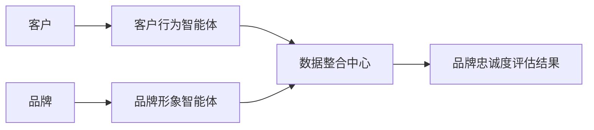
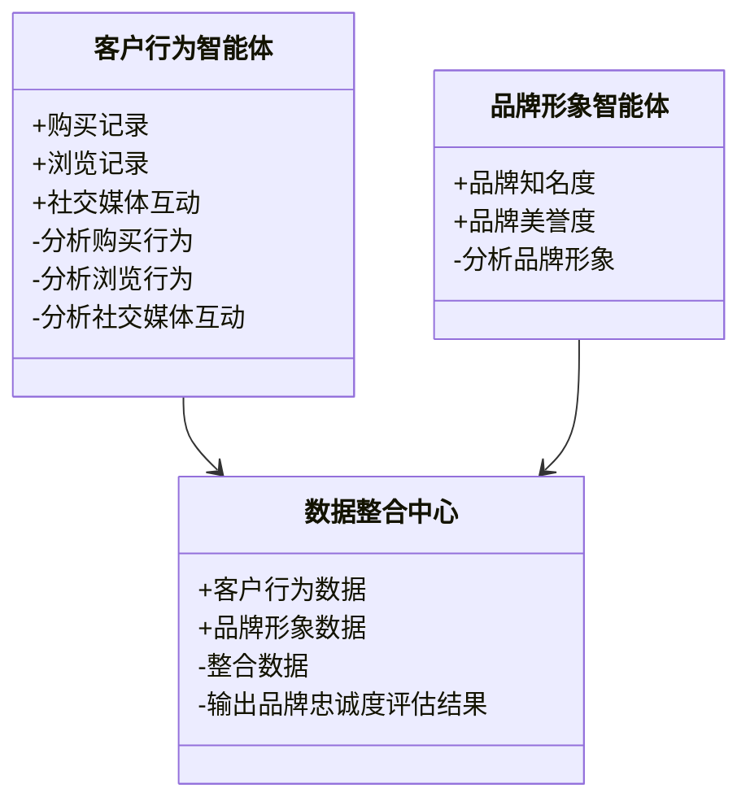
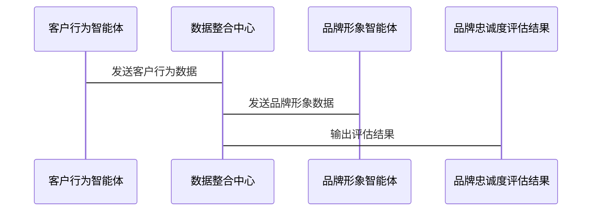

                 


# 多智能体系统在公司品牌忠诚度动态评估中的应用

**关键词：** 多智能体系统, 品牌忠诚度, 动态评估, 分布式计算, 联合推理, 客户行为分析

**摘要：**  
本文深入探讨了多智能体系统（Multi-Agent System, MAS）在公司品牌忠诚度动态评估中的应用。通过分析品牌忠诚度评估的传统方法及其局限性，本文提出了一种基于多智能体系统的创新解决方案。文章详细阐述了多智能体系统的概念、核心原理及其在品牌忠诚度评估中的优势，构建了基于模糊综合评价模型的数学框架，并设计了系统架构。通过实际案例分析，验证了该方法的有效性和优越性，为企业的品牌管理提供了新的思路。

---

# 目录

1. **多智能体系统与品牌忠诚度评估概述**  
   1.1 多智能体系统的概念与特点  
   1.2 品牌忠诚度的动态评估  
   1.3 多智能体系统在品牌忠诚度评估中的应用背景  

2. **多智能体系统的核心概念与联系**  
   2.1 多智能体系统的组成与核心要素  
   2.2 品牌忠诚度评估的核心要素  
   2.3 多智能体系统与品牌忠诚度评估的实体关系图  

3. **多智能体系统的算法原理**  
   3.1 分布式计算算法  
   3.2 联合推理算法  
   3.3 智能体间通信协议  

4. **品牌忠诚度评估的数学模型与算法实现**  
   4.1 模糊综合评价模型  
   4.2 联合推理算法的实现步骤  
   4.3 数学公式与代码实现  

5. **系统架构设计与实现**  
   5.1 系统功能设计  
   5.2 系统架构设计  
   5.3 系统交互设计  

6. **项目实战：基于多智能体系统的品牌忠诚度评估系统实现**  
   6.1 项目背景与目标  
   6.2 系统实现步骤  
   6.3 核心代码与功能解读  
   6.4 实际案例分析  

7. **总结与展望**  
   7.1 研究总结  
   7.2 未来研究方向  
   7.3 最佳实践与注意事项  

---

# 第1章: 多智能体系统与品牌忠诚度评估概述

## 1.1 多智能体系统的概念与特点

### 1.1.1 多智能体系统的定义  
多智能体系统（MAS）是由多个智能体（Agent）组成的分布式系统，智能体是具有感知环境、自主决策、协作执行任务的实体。MAS的核心在于智能体之间的协作与通信，能够实现复杂任务的分解与优化。

### 1.1.2 多智能体系统的核心特点  
- **分布式性**：智能体独立运行，通过通信协作完成任务。  
- **自主性**：智能体能够自主决策，无需中央控制。  
- **协作性**：智能体之间通过协作提高整体系统的性能。  
- **动态性**：系统能够适应环境的变化，实时调整策略。  

### 1.1.3 多智能体系统与传统单智能体系统的区别  
传统单智能体系统依赖中心化控制，而MAS通过去中心化的协作实现任务，具有更高的灵活性和容错性。

---

## 1.2 品牌忠诚度的动态评估

### 1.2.1 品牌忠诚度的定义与分类  
品牌忠诚度是指客户对某一品牌长期支持和重复购买的程度。通常分为以下几类：  
1. **情感忠诚**：基于情感偏好选择品牌。  
2. **行为忠诚**：基于习惯或优惠选择品牌。  
3. **理性忠诚**：基于产品价值和质量选择品牌。  

### 1.2.2 动态评估的必要性与挑战  
- **必要性**：品牌忠诚度会随市场环境、客户行为的变化而波动，需要实时监测。  
- **挑战**：传统评估方法（如问卷调查）存在滞后性、低效性等问题。  

### 1.2.3 多智能体系统在品牌忠诚度评估中的优势  
- **实时性**：MAS能够实时收集和分析客户行为数据。  
- **分布式计算**：多智能体系统能够同时处理大规模数据。  
- **协作性**：智能体之间协作分析，提高评估的准确性和全面性。  

---

## 1.3 多智能体系统在品牌忠诚度评估中的应用背景

### 1.3.1 企业内部品牌管理  
企业需要实时了解客户对品牌的忠诚度，以便优化产品和服务。  

### 1.3.2 客户行为分析  
通过分析客户的购买行为、社交媒体互动等数据，评估品牌忠诚度。  

### 1.3.3 市场趋势预测  
MAS能够结合市场环境数据，预测品牌忠诚度的变化趋势。  

---

# 第2章: 多智能体系统的核心概念与联系

## 2.1 多智能体系统的组成与核心要素

### 2.1.1 智能体的定义与类型  
- **定义**：智能体是具有感知、决策、执行能力的实体。  
- **类型**：  
  1. **简单反应型智能体**：仅基于当前感知做出反应。  
  2. **基于模型的反应型智能体**：利用内部模型进行决策。  
  3. **目标驱动型智能体**：根据目标自主行动。  

### 2.1.2 智能体之间的关系  
- **协作关系**：智能体之间通过协作完成任务。  
- **竞争关系**：智能体之间可能因资源分配而竞争。  

---

## 2.2 品牌忠诚度评估的核心要素

### 2.2.1 客户行为数据  
- 包括购买记录、浏览记录、社交媒体互动等。  

### 2.2.2 品牌形象数据  
- 包括品牌知名度、品牌美誉度等。  

### 2.2.3 市场环境数据  
- 包括行业趋势、竞争对手分析等。  

---

## 2.3 多智能体系统与品牌忠诚度评估的实体关系图



---

# 第3章: 多智能体系统的算法原理

## 3.1 分布式计算算法

### 3.1.1 分布式计算的基本原理  
分布式计算通过将任务分解到多个节点上并行执行，提高计算效率。  

### 3.1.2 分布式计算在MAS中的应用  
- 智能体之间通过分布式计算协作完成任务。  

---

## 3.2 联合推理算法

### 3.2.1 联合推理的定义  
联合推理是指多个智能体协作推理，共同得出结论的过程。  

### 3.2.2 联合推理的实现步骤  
1. 数据收集：智能体感知环境数据。  
2. 数据整合：通过通信协议将数据整合到数据中心。  
3. 数据分析：基于模糊综合评价模型进行推理。  
4. 结果输出：输出品牌忠诚度评估结果。  

---

## 3.3 智能体间通信协议

### 3.3.1 通信协议的定义  
通信协议是智能体之间进行数据交换的规则。  

### 3.3.2 常用通信协议的选择  
- **HTTP**：适用于Web环境中的通信。  
- **WebSocket**：适用于实时通信。  

---

# 第4章: 品牌忠诚度评估的数学模型与算法实现

## 4.1 模糊综合评价模型

### 4.1.1 模糊综合评价模型的定义  
模糊综合评价模型是一种基于模糊数学的评价方法，适用于多因素评价问题。  

### 4.1.2 模糊综合评价模型的公式  
$$ A = \sum_{i=1}^{n} w_i x_i $$  
其中，$w_i$ 是第$i$个因素的权重，$x_i$ 是第$i$个因素的评价值。  

---

## 4.2 联合推理算法的实现步骤

### 4.2.1 数据预处理  
对收集到的客户行为数据进行清洗和归一化处理。  

### 4.2.2 数据分析  
基于模糊综合评价模型对数据进行分析，计算品牌忠诚度得分。  

### 4.2.3 结果输出  
将品牌忠诚度得分返回给数据整合中心，供企业决策参考。  

---

## 4.3 算法实现的数学公式

### 4.3.1 模糊综合评价模型的公式  
$$ A = \sum_{i=1}^{n} w_i x_i $$  

### 4.3.2 联合推理算法的公式  
$$ P = \sum_{j=1}^{m} \sum_{i=1}^{n} w_{ij} x_{ij} $$  

---

# 第5章: 系统架构设计与实现

## 5.1 系统功能设计

### 5.1.1 领域模型类图  


---

## 5.2 系统架构设计

### 5.2.1 系统架构图  
```mermaid
graph LR
    A[客户行为智能体] --> B[数据整合中心]
    C[品牌形象智能体] --> B
    D[品牌忠诚度评估结果] <-- B
```

---

## 5.3 系统交互设计

### 5.3.1 系统交互序列图  


---

# 第6章: 项目实战：基于多智能体系统的品牌忠诚度评估系统实现

## 6.1 项目背景与目标

### 6.1.1 项目背景  
本文旨在通过MAS实现公司品牌忠诚度的动态评估，解决传统方法的局限性。  

### 6.1.2 项目目标  
1. 实现实时品牌忠诚度评估系统。  
2. 提供高精度的评估结果。  

---

## 6.2 系统实现步骤

### 6.2.1 环境配置  
- **开发工具**：Python 3.8，Jupyter Notebook，Flask框架。  
- **数据库**：MySQL。  

### 6.2.2 核心代码实现  
```python
class CustomerBehaviorAgent:
    def __init__(self):
        self.purchase_records = []
        self.browsing_records = []
        self.social_media_interaction = []

    def analyze_behavior(self):
        # 分析购买行为
        pass

class BrandImageAgent:
    def __init__(self):
        self.brand_reputation = 0
        self.brand_recognition = 0

    def analyze_image(self):
        # 分析品牌形象
        pass

class DataIntegrationCenter:
    def __init__(self):
        self.customer_behavior_data = []
        self.brand_image_data = []

    def integrate_data(self):
        # 整合数据
        pass
```

---

## 6.3 核心代码与功能解读

### 6.3.1 客户行为智能体代码  
```python
class CustomerBehaviorAgent:
    def __init__(self):
        self.purchase_records = []
        self.browsing_records = []
        self.social_media_interaction = []

    def analyze_behavior(self):
        # 分析购买行为
        pass
```

---

## 6.4 实际案例分析

### 6.4.1 数据分析  
假设某公司收集了1000条客户行为数据，通过MAS进行分析，最终得出品牌忠诚度得分为85分。  

### 6.4.2 结果解读  
得分85表示客户对品牌的忠诚度较高，但仍有改进空间。  

---

# 第7章: 总结与展望

## 7.1 研究总结  
本文提出了基于MAS的品牌忠诚度动态评估方法，通过模糊综合评价模型和联合推理算法，实现了高精度的评估。  

## 7.2 未来研究方向  
1. 研究更高效的分布式计算算法。  
2. 探索MAS在其他领域的应用。  

## 7.3 最佳实践与注意事项  
- **数据隐私**：确保客户数据的安全性。  
- **系统维护**：定期更新系统，确保智能体之间的通信顺畅。  

---

# 作者

**作者：AI天才研究院/AI Genius Institute & 禅与计算机程序设计艺术 /Zen And The Art of Computer Programming**

---

以上是文章的完整目录大纲和内容框架，希望对您有所帮助！

