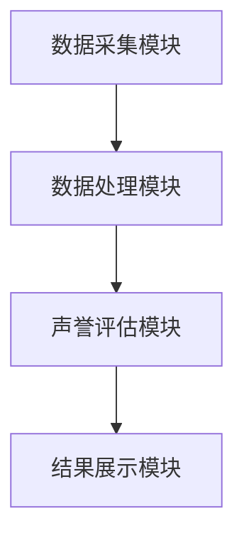
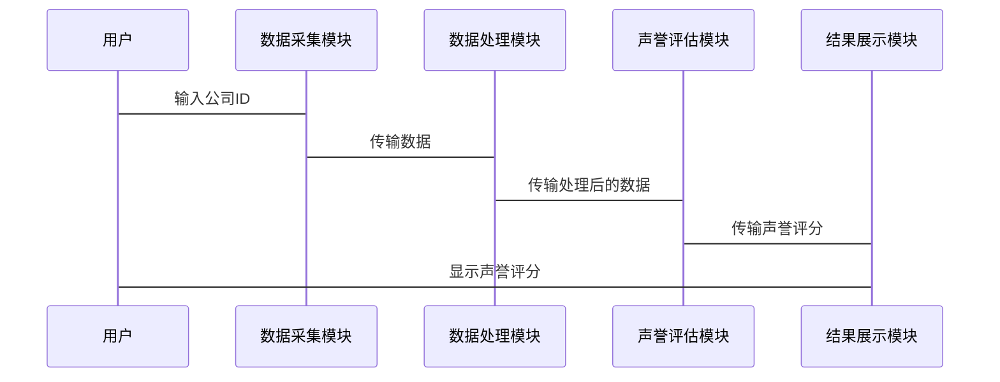

                 


# 多智能体系统在公司声誉动态评估中的应用

> 关键词：多智能体系统, 公司声誉, 动态评估, 智能体协作, 声誉模型, 系统架构

> 摘要：本文探讨了多智能体系统在公司声誉动态评估中的应用。通过分析多智能体系统的核心概念、通信机制、协作机制和决策机制，结合声誉评估的数学模型和动态变化的特征，构建了一个基于多智能体系统的公司声誉动态评估模型。文章详细讲解了系统的功能设计、架构设计、接口设计以及实现案例，展示了多智能体系统在公司声誉评估中的优势和实际应用价值。

---

## 第一部分: 多智能体系统与公司声誉动态评估概述

### 第1章: 多智能体系统概述

#### 1.1 多智能体系统的基本概念

##### 1.1.1 智能体的定义与特征
- **智能体**（Agent）：智能体是指能够感知环境、做出决策并采取行动的实体。
- **特征**：
  - **自主性**：能够自主决策。
  - **反应性**：能够根据环境变化做出反应。
  - **协作性**：能够与其他智能体协作完成任务。
  - **学习能力**：能够通过经验改进自身行为。

##### 1.1.2 多智能体系统的定义
多智能体系统（Multi-Agent System, MAS）是由多个智能体组成的系统，这些智能体通过协作完成单个智能体无法完成的任务。

##### 1.1.3 多智能体系统的核心要素
- **智能体**：系统的构成单元。
- **环境**：智能体所处的外部环境。
- **通信机制**：智能体之间的信息交换方式。
- **协作机制**：智能体之间协作完成任务的方式。

#### 1.2 多智能体系统的分类与特点

##### 1.2.1 基于任务的多智能体系统
- **特点**：智能体之间协作完成特定任务。
- **应用**：任务分配、资源调度。

##### 1.2.2 基于行为的多智能体系统
- **特点**：智能体根据行为规则进行决策。
- **应用**：交通控制、机器人协作。

##### 1.2.3 基于模型的多智能体系统
- **特点**：智能体基于模型进行决策和推理。
- **应用**：复杂系统的模拟与控制。

#### 1.3 多智能体系统的应用领域

##### 1.3.1 经济与金融领域
- **应用**：股票交易、风险管理。

##### 1.3.2 工业与制造领域
- **应用**：生产调度、供应链管理。

##### 1.3.3 信息与通信技术领域
- **应用**：网络管理、数据挖掘。

### 第2章: 公司声誉动态评估的背景与挑战

#### 2.1 公司声誉的定义与影响

##### 2.1.1 公司声誉的定义
- **公司声誉**：公众对公司的整体评价，包括品牌形象、社会责任、财务表现等方面。

##### 2.1.2 公司声誉的影响因素
- **品牌价值**：公司品牌在市场中的价值。
- **社会责任**：公司在社会责任方面的表现。
- **财务表现**：公司的财务状况和业绩。

##### 2.1.3 公司声誉的动态特性
- **动态变化**：公司声誉会随着市场环境、公司行为等因素的变化而波动。

#### 2.2 传统公司声誉评估方法的局限性

##### 2.2.1 主观性问题
- **问题**：传统评估方法依赖专家主观判断，缺乏客观性。

##### 2.2.2 数据采集与处理的难度
- **问题**：传统方法难以处理大量分散的数据。

##### 2.2.3 动态变化的难以捕捉
- **问题**：传统方法难以实时捕捉声誉的动态变化。

#### 2.3 多智能体系统在声誉评估中的优势

##### 2.3.1 分布式计算能力
- **优势**：多智能体系统能够分布式处理信息，提高计算效率。

##### 2.3.2 多维度信息处理能力
- **优势**：多智能体系统能够处理来自不同来源的多维度信息。

##### 2.3.3 动态适应性
- **优势**：多智能体系统能够快速适应环境变化，实时更新声誉评估结果。

---

## 第二部分: 多智能体系统在公司声誉评估中的核心概念

### 第3章: 多智能体系统的核心原理

#### 3.1 多智能体系统的通信机制

##### 3.1.1 智能体间通信的协议
- **协议**：智能体之间的通信需要遵循特定的协议，例如基于消息的通信协议。

##### 3.1.2 信息交换的格式
- **格式**：信息交换可以采用结构化数据格式，例如JSON、XML等。

##### 3.1.3 通信的实时性与可靠性
- **实时性**：智能体之间的通信需要实时进行，以保证信息的及时性。
- **可靠性**：通信机制需要保证信息的准确传输，避免信息丢失或错误。

#### 3.2 多智能体系统的协作机制

##### 3.2.1 协作任务分配
- **任务分配**：智能体之间需要协作完成特定任务，例如任务分解、资源分配。

##### 3.2.2 协作过程中的冲突解决
- **冲突解决**：在协作过程中，可能会出现资源冲突或任务优先级冲突，需要制定冲突解决机制。

##### 3.2.3 协作结果的评估
- **评估方法**：需要对协作结果进行评估，例如基于任务完成度的评估。

#### 3.3 多智能体系统的决策机制

##### 3.3.1 基于规则的决策
- **规则**：智能体根据预定义的规则进行决策，例如基于条件的判断。

##### 3.3.2 基于模型的决策
- **模型**：智能体基于数学模型或知识库进行决策，例如基于概率模型的决策。

##### 3.3.3 基于学习的决策
- **学习**：智能体通过机器学习算法进行决策，例如基于神经网络的决策。

### 第4章: 公司声誉评估的核心模型

#### 4.1 声誉评估的指标体系

##### 4.1.1 财务表现指标
- **指标**：净利润率、资产负债率、ROE（净资产收益率）等。

##### 4.1.2 品牌价值指标
- **指标**：品牌知名度、品牌忠诚度、品牌认知度等。

##### 4.1.3 社会责任指标
- **指标**：环境保护投入、员工福利、社区贡献等。

#### 4.2 基于多智能体的声誉评估模型

##### 4.2.1 模型的构建过程
- **构建过程**：
  1. **数据采集**：收集与公司声誉相关的数据。
  2. **数据处理**：对数据进行清洗、预处理。
  3. **模型训练**：基于多智能体系统，训练声誉评估模型。
  4. **模型验证**：验证模型的准确性和稳定性。

##### 4.2.2 模型的输入与输出
- **输入**：公司相关的财务数据、市场反馈、社会责任数据等。
- **输出**：公司的声誉评分、声誉变化趋势等。

##### 4.2.3 模型的验证与优化
- **验证方法**：通过历史数据验证模型的预测能力。
- **优化方法**：通过参数调整、算法优化等方式提高模型的预测精度。

#### 4.3 声誉动态变化的数学模型

##### 4.3.1 动态评估的数学表达式
- **数学表达式**：
  声誉评分（R）可以表示为：
  $$ R = f(F, B, S) $$
  其中，F表示财务表现，B表示品牌价值，S表示社会责任。

##### 4.3.2 基于时间序列的声誉变化模型
- **模型**：
  使用时间序列分析方法，预测公司声誉的未来变化趋势。

---

## 第三部分: 系统分析与架构设计

### 第5章: 系统分析与架构设计

#### 5.1 系统功能设计

##### 5.1.1 功能模块划分
- **数据采集模块**：负责采集公司相关的数据。
- **数据处理模块**：负责对数据进行清洗和预处理。
- **声誉评估模块**：基于多智能体系统，评估公司声誉。
- **结果展示模块**：展示声誉评估结果。

##### 5.1.2 功能流程设计
- **流程**：
  1. 数据采集模块采集数据。
  2. 数据处理模块处理数据。
  3. 声誉评估模块评估声誉。
  4. 结果展示模块展示结果。

#### 5.2 系统架构设计

##### 5.2.1 系统架构图


##### 5.2.2 系统接口设计
- **接口1**：数据采集模块与数据处理模块之间的接口。
- **接口2**：数据处理模块与声誉评估模块之间的接口。
- **接口3**：声誉评估模块与结果展示模块之间的接口。

#### 5.3 系统交互设计

##### 5.3.1 系统交互流程
- **流程**：
  1. 用户输入公司ID。
  2. 数据采集模块采集公司数据。
  3. 数据处理模块处理数据。
  4. 声誉评估模块评估声誉。
  5. 结果展示模块展示结果。

##### 5.3.2 交互流程图


---

## 第四部分: 项目实战

### 第6章: 项目实战

#### 6.1 环境搭建

##### 6.1.1 环境要求
- **编程语言**：Python 3.8+
- **框架**：Flask或Django（用于Web界面）
- **工具**：Jupyter Notebook（用于数据处理和建模）

##### 6.1.2 安装依赖
- **安装Python库**：
  ```bash
  pip install numpy pandas scikit-learn flask
  ```

#### 6.2 核心算法实现

##### 6.2.1 声誉评估算法

###### 6.2.1.1 算法原理
- **算法原理**：
  使用机器学习算法，如支持向量机（SVM）或随机森林（Random Forest），对公司的声誉进行评估。

###### 6.2.1.2 算法实现
```python
from sklearn.ensemble import RandomForestRegressor
import pandas as pd
import numpy as np

# 数据加载
data = pd.read_csv('company_reputation.csv')

# 特征选择
features = ['revenue', 'profit', 'employees', 'social Responsibility']
target = 'reputation_score'

# 训练集和测试集划分
from sklearn.model_selection import train_test_split
X_train, X_test, y_train, y_test = train_test_split(data[features], data[target], test_size=0.2, random_state=42)

# 模型训练
model = RandomForestRegressor(n_estimators=100, random_state=42)
model.fit(X_train, y_train)

# 模型预测
y_pred = model.predict(X_test)

# 模型评估
from sklearn.metrics import mean_squared_error
mse = mean_squared_error(y_test, y_pred)
print(f'Mean Squared Error: {mse}')
```

##### 6.2.2 声誉动态变化预测

###### 6.2.2.1 预测模型
- **模型**：使用ARIMA模型预测声誉的动态变化。

###### 6.2.2.2 模型实现
```python
from statsmodels.tsa.arima_model import ARIMA
import pandas as pd

# 数据加载
data = pd.read_csv('reputation_time_series.csv')

# 模型训练
model = ARIMA(data['reputation_score'], order=(5, 1, 0))
model_fit = model.fit()

# 预测未来声誉
future_steps = 5
forecast = model_fit.forecast(steps=future_steps)
print(forecast)
```

#### 6.3 案例分析

##### 6.3.1 案例背景
- **公司**：某科技公司
- **数据**：财务数据、市场反馈、社会责任数据等。

##### 6.3.2 数据处理与分析
```python
import pandas as pd
import matplotlib.pyplot as plt

# 数据加载
data = pd.read_csv('company_data.csv')

# 数据清洗
data.dropna(inplace=True)

# 数据可视化
plt.figure(figsize=(10, 6))
plt.plot(data['date'], data['reputation_score'])
plt.title('Company Reputation Over Time')
plt.xlabel('Date')
plt.ylabel('Reputation Score')
plt.show()
```

##### 6.3.3 模型应用与结果展示
- **结果展示**：通过图表展示公司声誉的变化趋势。

---

## 第五部分: 总结与展望

### 第7章: 总结与展望

#### 7.1 总结

##### 7.1.1 核心内容回顾
- **多智能体系统**：分布式计算、协作机制、动态适应性。
- **公司声誉评估**：动态变化、多维度数据、实时性要求。

##### 7.1.2 系统优势
- **优势**：
  - 高效性：多智能体系统能够高效处理大规模数据。
  - 实时性：能够实时更新公司声誉评分。
  - 准确性：基于机器学习的声誉评估模型具有较高的预测精度。

#### 7.2 展望

##### 7.2.1 研究不足
- **不足**：
  - 当前模型的预测精度还有提升空间。
  - 系统的实时性有待进一步优化。

##### 7.2.2 未来方向
- **未来方向**：
  - 研究更高效的多智能体协作算法。
  - 探索更先进的机器学习算法，如深度学习。
  - 结合区块链技术，提高系统的安全性和可信度。

#### 7.3 最佳实践 Tips

##### 7.3.1 实践技巧
- **数据采集**：确保数据的全面性和准确性。
- **模型优化**：定期更新模型参数，提高预测精度。
- **系统维护**：定期检查系统运行状态，及时修复问题。

##### 7.3.2 注意事项
- **数据隐私**：注意保护公司数据隐私，遵守相关法律法规。
- **系统稳定性**：确保系统的稳定运行，避免因系统故障导致声誉评估结果错误。

##### 7.3.3 拓展阅读
- **推荐书籍**：
  - 《Multi-Agent Systems: Algorithmic, Game-Theoretic, and Logical Foundations》
  - 《Reputation Management in Multi-Agent Systems》

---

## 作者：AI天才研究院/AI Genius Institute & 禅与计算机程序设计艺术 /Zen And The Art of Computer Programming

