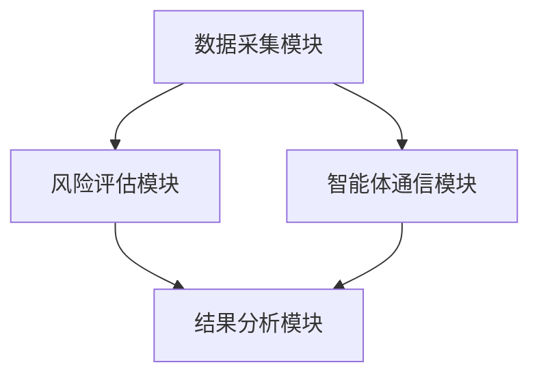

                 


# 多智能体系统在公司声誉风险评估中的应用

> 关键词：多智能体系统, 声誉风险评估, 分布式计算, 协作学习, 智能体通信, 系统架构设计

> 摘要：本文深入探讨了多智能体系统（Multi-Agent System, MAS）在公司声誉风险评估中的应用。通过分析MAS的核心原理、声誉风险评估的数学模型，以及实际应用场景，本文详细阐述了如何利用MAS的优势来提升声誉风险评估的效率和准确性。文章从背景介绍、核心概念、算法原理、系统架构设计、项目实战等多个维度展开，为读者提供了一套完整的解决方案。

---

# 第1章 多智能体系统与公司声誉风险评估概述

## 1.1 多智能体系统的基本概念

### 1.1.1 多智能体系统的定义
多智能体系统（Multi-Agent System, MAS）是由多个智能体（Agent）组成的分布式系统，这些智能体能够通过自主决策和协作完成复杂任务。MAS的特点包括分布式性、自主性、反应性和协作性。

### 1.1.2 多智能体系统的特征
- **分布式性**：智能体分布在不同的节点上，通过通信和协作完成任务。
- **自主性**：每个智能体都有一定的决策能力和行动能力。
- **反应性**：智能体能够感知环境并做出实时反应。
- **协作性**：智能体之间可以通过通信和协作完成共同目标。

### 1.1.3 多智能体系统的应用场景
MAS广泛应用于分布式计算、机器人协作、游戏AI、金融交易等领域。在声誉风险评估中，MAS的优势在于能够同时处理多个影响声誉的因素，并通过协作优化评估结果。

## 1.2 公司声誉风险评估的定义与重要性

### 1.2.1 公司声誉的定义
公司声誉是指公司在市场、客户、投资者等利益相关者心中的形象和信任度。声誉是公司的重要资产，直接影响公司的市场价值和业务发展。

### 1.2.2 声誉风险的定义
声誉风险是指由于公司行为或外部事件导致声誉下降，进而对公司价值和业务造成负面影响的可能性。

### 1.2.3 声誉风险评估的重要性
声誉风险评估是公司风险管理的重要组成部分。通过评估声誉风险，公司可以识别潜在风险，制定应对策略，从而降低声誉损失的可能性。

## 1.3 多智能体系统在声誉风险评估中的应用价值

### 1.3.1 多智能体系统的优势
- **分布式计算能力**：MAS能够同时处理多个影响声誉的因素，如媒体报道、社交媒体评论、客户反馈等。
- **协作性**：智能体之间可以通过协作优化评估结果，提高评估的准确性和全面性。
- **实时性**：MAS能够实时感知和处理声誉相关数据，及时发现潜在风险。

### 1.3.2 声誉风险评估的复杂性
声誉风险评估涉及多个因素，如媒体报道、社交媒体评论、客户反馈等，这些因素之间可能存在复杂的关系，需要综合分析。

### 1.3.3 多智能体系统在声誉风险评估中的独特性
MAS的独特性在于其分布式计算和协作能力，能够同时处理多个影响声誉的因素，并通过智能体之间的协作优化评估结果。

## 1.4 本章小结

---

# 第2章 多智能体系统的核心原理与声誉风险评估的结合

## 2.1 多智能体系统的核心原理

### 2.1.1 多智能体系统的组成与结构
MAS由多个智能体组成，这些智能体通过通信和协作完成任务。智能体之间可以通过共享信息或直接通信进行协作。

### 2.1.2 智能体的通信与协作机制
- **直接通信**：智能体之间通过消息传递进行通信。
- **间接通信**：智能体通过共享数据库或消息广播进行通信。

### 2.1.3 多智能体系统的协调与决策机制
MAS的协调与决策机制包括分布式决策、协作学习和动态适应。分布式决策通过智能体的自主决策完成，协作学习通过智能体之间的协作优化决策，动态适应通过智能体的实时感知和调整适应环境变化。

## 2.2 多智能体系统的算法基础

### 2.2.1 分布式计算的基本算法
分布式计算算法包括分布式任务分配、分布式搜索和分布式排序等。这些算法能够帮助智能体在分布式环境中高效完成任务。

### 2.2.2 协作学习的基本原理
协作学习是一种通过智能体之间的协作来提高学习效果的方法。协作学习可以通过信息共享、经验交流和知识整合来优化学习结果。

### 2.2.3 多智能体系统的优化算法
优化算法包括遗传算法、模拟退火和蚁群算法等。这些算法可以帮助智能体在分布式环境中优化决策和行动。

## 2.3 声誉风险评估的数学模型

### 2.3.1 基于概率论的声誉风险模型
基于概率论的声誉风险模型通过概率分布来描述声誉风险的可能性和影响程度。例如，可以使用贝叶斯网络来建模声誉风险的影响因素。

### 2.3.2 基于模糊逻辑的声誉风险模型
模糊逻辑模型能够处理声誉风险评估中的模糊性和不确定性。例如，可以通过模糊逻辑对媒体报道的情感进行分类，并计算其对声誉的影响程度。

### 2.3.3 基于神经网络的声誉风险模型
神经网络模型能够通过学习历史数据来预测声誉风险。例如，可以使用循环神经网络（RNN）或长短期记忆网络（LSTM）来分析时间序列数据，预测未来声誉风险的变化趋势。

## 2.4 本章小结

---

# 第3章 系统分析与架构设计

## 3.1 问题场景介绍

### 3.1.1 声誉风险评估的复杂性
声誉风险评估涉及多个因素，如媒体报道、社交媒体评论、客户反馈等，这些因素之间可能存在复杂的关系，需要综合分析。

### 3.1.2 传统声誉风险评估的局限性
传统声誉风险评估方法通常依赖于人工分析，效率低且容易出错。此外，传统方法难以处理大规模数据和复杂关系。

### 3.1.3 MAS在声誉风险评估中的优势
MAS可以通过分布式计算和协作学习高效处理大规模数据和复杂关系，提高声誉风险评估的准确性和效率。

## 3.2 系统功能设计

### 3.2.1 系统功能模块
声誉风险评估系统包括数据采集模块、风险评估模块和结果分析模块。

### 3.2.2 系统功能流程
1. 数据采集模块通过爬虫技术采集媒体和社交媒体数据。
2. 风险评估模块通过MAS算法对数据进行分析和评估。
3. 结果分析模块生成评估报告，并提出应对策略。

## 3.3 系统架构设计

### 3.3.1 系统架构图


### 3.3.2 系统接口设计
- 数据采集模块接口：提供数据采集和预处理功能。
- 风险评估模块接口：提供声誉风险评估功能。
- 结果分析模块接口：提供评估报告生成和应对策略制定功能。

## 3.4 本章小结

---

# 第4章 项目实战与案例分析

## 4.1 环境安装与配置

### 4.1.1 Python环境安装
安装Python 3.8及以上版本，并安装必要的库，如`numpy`, `pandas`, `scikit-learn`, `networkx`, `matplotlib`。

### 4.1.2 MAS框架安装
安装多智能体系统框架，如`aiogram`或`ros`.

## 4.2 系统核心代码实现

### 4.2.1 数据采集模块
```python
import requests
from bs4 import BeautifulSoup

def collect_data(url):
    response = requests.get(url)
    soup = BeautifulSoup(response.text, 'html.parser')
    data = []
    for item in soup.find_all('div', class_='news-item'):
        title = item.find('h2').text
        content = item.find('p').text
        data.append({'title': title, 'content': content})
    return data
```

### 4.2.2 风险评估模块
```python
from sklearn.naive_bayes import MultinomialNB
from sklearn.feature_extraction.text import TfidfVectorizer

def train_model(data):
    vectorizer = TfidfVectorizer()
    X = vectorizer.fit_transform([item['content'] for item in data])
    y = [item['label'] for item in data]
    model = MultinomialNB()
    model.fit(X, y)
    return model, vectorizer

def predict_risk(model, vectorizer, text):
    X = vectorizer.transform([text])
    prediction = model.predict(X)
    return prediction[0]
```

### 4.2.3 结果分析模块
```python
import matplotlib.pyplot as plt
import networkx as nx

def visualize_results(network):
    G = nx.from_dict_of_lists(network)
    nx.draw(G, with_labels=True, node_color='red', edge_color='blue')
    plt.show()
```

## 4.3 案例分析

### 4.3.1 数据采集
假设我们从社交媒体和新闻网站采集了某公司的声誉相关数据。

### 4.3.2 模型训练与预测
使用上述代码对数据进行预处理和建模，训练一个声誉风险评估模型。

### 4.3.3 结果分析
通过可视化工具分析模型的预测结果，并根据分析结果提出应对策略。

## 4.4 本章小结

---

# 第5章 最佳实践与小结

## 5.1 小结
通过本文的介绍，我们可以看到多智能体系统在公司声誉风险评估中的巨大潜力。MAS的分布式计算和协作能力能够高效处理复杂的数据和关系，提高声誉风险评估的准确性和效率。

## 5.2 注意事项
- 在实际应用中，需要注意数据隐私和安全问题。
- 模型的训练和优化需要大量的数据和计算资源。
- 智能体之间的通信和协作需要高效的算法和协议支持。

## 5.3 拓展阅读
- 推荐阅读相关领域的书籍和论文，深入了解多智能体系统和声誉风险评估的理论和应用。

---

# 作者：AI天才研究院/AI Genius Institute & 禅与计算机程序设计艺术 /Zen And The Art of Computer Programming

---

通过本文的系统介绍和实践分析，我们展示了多智能体系统在公司声誉风险评估中的应用价值和实现方法。希望本文能够为相关领域的研究和实践提供有价值的参考。

