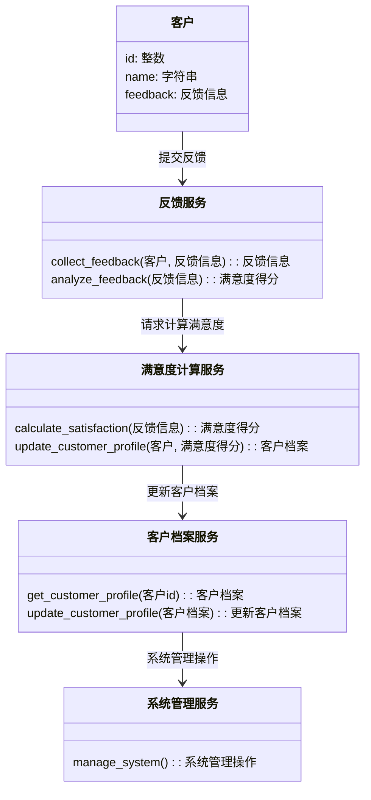
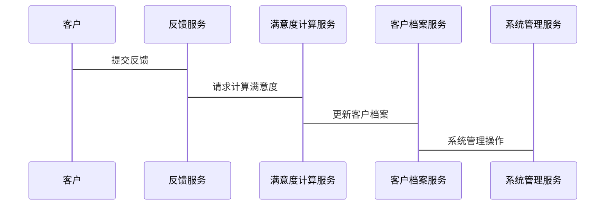

                 


# 多智能体系统在公司客户满意度评估中的应用

## 关键词：多智能体系统，客户满意度评估，分布式计算，协作算法，智能决策

## 摘要：  
多智能体系统（Multi-Agent Systems, MAS）是一种由多个智能体组成的分布式系统，这些智能体能够通过协作完成复杂的任务。在公司客户满意度评估中，多智能体系统可以通过分布式计算和协作算法，实现客户满意度的实时评估和优化。本文将详细探讨多智能体系统在客户满意度评估中的应用，包括其核心概念、算法原理、系统架构以及实际案例分析。

---

# 第一部分：多智能体系统与客户满意度评估基础

## 第1章：多智能体系统概述

### 1.1 多智能体系统的基本概念
#### 1.1.1 智能体的定义与特征
智能体（Agent）是指具有感知环境、自主决策和行动能力的实体。智能体可以是软件程序、机器人或其他实体。其主要特征包括：
- **自主性**：能够自主决策和行动。
- **反应性**：能够感知环境并实时响应。
- **协作性**：能够与其他智能体协作完成任务。
- **社会性**：能够与其他智能体进行通信和交互。

#### 1.1.2 多智能体系统的概念与特点
多智能体系统是由多个智能体组成的分布式系统，这些智能体通过协作完成复杂的任务。其主要特点包括：
- **分布式性**：智能体分布在网络中，每个智能体负责一部分任务。
- **协作性**：智能体之间通过通信和协作完成整体任务。
- **动态性**：系统能够适应环境的变化和智能体的动态加入或退出。

#### 1.1.3 多智能体系统与单智能体系统的区别
| 特性             | 单智能体系统             | 多智能体系统             |
|------------------|--------------------------|--------------------------|
| 系统结构         | 单点结构                 | 分布式结构               |
| 决策方式         | 中央决策                 | 分布式决策               |
| 可扩展性         | 较低                     | 较高                     |
| 应用场景         | 简单任务                 | 复杂任务                 |

### 1.2 多智能体系统的分类
#### 1.2.1 基于任务的分类
- **反应式智能体**：仅根据当前感知做出反应。
- **认知式智能体**：具有推理和规划能力。
- **效用式智能体**：基于效用函数进行决策。

#### 1.2.2 基于结构的分类
- **简单结构**：智能体之间无复杂依赖关系。
- **复杂结构**：智能体之间存在复杂的依赖关系和协作机制。

#### 1.2.3 基于协作机制的分类
- **同步协作**：智能体之间同步完成任务。
- **异步协作**：智能体之间异步完成任务。
- **混合协作**：结合同步和异步协作。

### 1.3 多智能体系统的应用领域
#### 1.3.1 企业级应用
- 客户关系管理（CRM）
- 供应链管理
- 企业资源规划（ERP）

#### 1.3.2 分布式系统
- 分布式计算
- 分布式数据库
- 分布式网络

#### 1.3.3 智能决策支持系统
- 智能客服
- 智能推荐系统
- 智能监控系统

### 1.4 本章小结
本章介绍了多智能体系统的基本概念、特点、分类及其应用领域，为后续章节奠定了基础。

---

## 第2章：客户满意度评估的基本原理

### 2.1 客户满意度的定义与指标
#### 2.1.1 客户满意度的定义
客户满意度是指客户对公司产品或服务的满意程度。它是衡量客户对产品或服务的质量和性能的主观感受。

#### 2.1.2 客户满意度的评估指标
常用的客户满意度评估指标包括：
- **服务质量**：包括响应速度、问题解决能力等。
- **产品性能**：包括产品质量、功能完善性等。
- **客户体验**：包括界面设计、操作便捷性等。

#### 2.1.3 客户满意度的计算方法
客户满意度的计算方法通常采用加权平均法：
$$ \text{客户满意度} = \sum_{i=1}^{n} w_i x_i $$
其中，\( w_i \) 是第 \( i \) 个指标的权重，\( x_i \) 是第 \( i \) 个指标的得分。

### 2.2 客户满意度评估的模型
#### 2.2.1 经典模型介绍
- **线性回归模型**：通过线性回归分析客户满意度的影响因素。
- **层次分析法（AHP）**：通过层次分析法确定各指标的权重。
- **模糊综合评价法**：通过模糊数学方法对客户满意度进行综合评价。

#### 2.2.2 模型的优缺点分析
| 模型           | 优点                     | 缺点                     |
|----------------|--------------------------|--------------------------|
| 线性回归模型   | 简单易懂                 | 高度依赖数据质量         |
| 层次分析法     | 能够处理多指标问题       | 需要大量主观判断         |
| 模糊综合评价法 | 能够处理模糊信息         | 计算复杂                 |

#### 2.2.3 模型的适用场景
- **线性回归模型**适用于数据量大且线性关系明显的场景。
- **层次分析法**适用于多指标的综合评价场景。
- **模糊综合评价法**适用于模糊信息较多的场景。

### 2.3 客户满意度评估的挑战
#### 2.3.1 数据获取的困难
客户满意度评估需要收集大量的客户反馈数据，数据获取的难度较高。

#### 2.3.2 模型的准确性问题
由于客户满意度是主观指标，模型的准确性受到数据质量和建模方法的影响。

#### 2.3.3 实时性要求
在实时应用场景中，需要快速完成客户满意度评估，这对模型的计算效率提出了更高的要求。

### 2.4 本章小结
本章介绍了客户满意度的定义、评估指标、常用模型及其优缺点，分析了客户满意度评估的主要挑战。

---

## 第3章：多智能体系统在客户满意度评估中的优势

### 3.1 多智能体系统的分布式计算能力
#### 3.1.1 分布式计算的基本原理
分布式计算是指将计算任务分配到多个计算节点上，通过协作完成任务。其基本原理包括：
1. 任务分解：将整体任务分解为多个子任务。
2. 子任务分配：将子任务分配给不同的计算节点。
3. 任务执行：各计算节点并行执行子任务。
4. 结果汇总：将各节点的计算结果汇总，得到最终结果。

#### 3.1.2 分布式计算在客户满意度评估中的应用
在客户满意度评估中，分布式计算可以用于：
- **数据预处理**：并行处理大量的客户反馈数据。
- **模型训练**：分布式训练客户满意度评估模型。
- **实时计算**：实时计算客户的满意度得分。

#### 3.1.3 分布式计算的优势与挑战
| 优势           | 分布式计算的优势         |
|----------------|--------------------------|
| 高效性         | 可以显著提高计算效率     |
| 可扩展性       | 可以支持大规模数据处理   |
| 可靠性         | 可以提高系统的容错能力   |

| 挑战           | 分布式计算的挑战         |
|----------------|--------------------------|
| 网络延迟       | 分布式计算的网络延迟问题 |
| 数据一致性     | 数据一致性问题           |

### 3.2 多智能体系统的协作机制
#### 3.2.1 协作机制的定义
协作机制是指智能体之间通过通信和交互完成任务的方式。常见的协作机制包括：
- **基于消息的协作**：通过消息传递实现协作。
- **基于协议的协作**：通过预定义的协议实现协作。
- **基于博弈论的协作**：通过博弈论模型实现协作。

#### 3.2.2 常见的协作算法
- **分布式一致性算法**：如Paxos、Raft等。
- **分布式共识算法**：如拜占庭共识、PoW等。
- **分布式优化算法**：如分布式梯度下降。

#### 3.2.3 协作机制在客户满意度评估中的应用
在客户满意度评估中，协作机制可以用于：
- **数据共享**：智能体之间共享客户反馈数据。
- **模型训练**：智能体之间协作训练客户满意度模型。
- **结果汇总**：智能体之间汇总计算结果。

### 3.3 多智能体系统的智能决策能力
#### 3.3.1 智能决策的基本原理
智能决策是指智能体基于感知信息和内部知识，自主做出决策。其基本原理包括：
1. **感知**：智能体感知环境信息。
2. **推理**：智能体基于感知信息进行推理。
3. **决策**：智能体基于推理结果做出决策。

#### 3.3.2 智能决策在客户满意度评估中的应用
在客户满意度评估中，智能决策可以用于：
- **客户画像构建**：基于客户反馈数据构建客户画像。
- **满意度预测**：基于历史数据预测客户满意度。
- **优化建议**：基于满意度预测结果提出优化建议。

#### 3.3.3 智能决策的优势与挑战
| 优势           | 智能决策的优势         |
|----------------|--------------------------|
| 自主性         | 智能体能够自主决策     |
| 实时性         | 能够实现实时决策       |
| 精准性         | 能够提高决策的准确性   |

| 挑战           | 智能决策的挑战         |
|----------------|--------------------------|
| 数据不足       | 数据不足可能导致决策不准确 |
| 算法复杂性     | 算法复杂性可能导致计算效率低 |

### 3.4 本章小结
本章介绍了多智能体系统在客户满意度评估中的优势，包括分布式计算能力、协作机制和智能决策能力，并分析了相关的优势与挑战。

---

## 第4章：多智能体系统在客户满意度评估中的核心算法

### 4.1 分布式计算算法
#### 4.1.1 分布式计算的基本原理
分布式计算的基本原理包括任务分解、子任务分配、任务执行和结果汇总。常用的分布式计算算法包括MapReduce、Spark等。

#### 4.1.2 分布式计算算法的实现步骤
1. **任务分解**：将整体任务分解为多个子任务。
2. **子任务分配**：将子任务分配给不同的计算节点。
3. **任务执行**：各计算节点并行执行子任务。
4. **结果汇总**：将各节点的计算结果汇总，得到最终结果。

#### 4.1.3 分布式计算算法的优缺点
| 优点           | 分布式计算算法的优点     |
|----------------|--------------------------|
| 高效性         | 可以显著提高计算效率     |
| 可扩展性       | 可以支持大规模数据处理   |

| 缺点           | 分布式计算算法的缺点     |
|----------------|--------------------------|
| 网络延迟       | 分布式计算的网络延迟问题 |
| 数据一致性     | 数据一致性问题           |

### 4.2 协作算法
#### 4.2.1 协作算法的基本原理
协作算法是指智能体之间通过通信和交互完成任务的方式。常用的协作算法包括基于消息的协作、基于协议的协作和基于博弈论的协作。

#### 4.2.2 协作算法的实现步骤
1. **通信协议设计**：设计智能体之间的通信协议。
2. **消息传递**：智能体之间通过消息传递实现协作。
3. **任务分配**：根据智能体的能力和负载分配任务。
4. **任务执行**：各智能体协作完成任务。

#### 4.2.3 协作算法的优缺点
| 优点           | 协作算法的优点         |
|----------------|--------------------------|
| 分布式协作     | 可以实现分布式协作     |
| 灵活性         | 可以根据任务需求灵活调整 |

| 缺点           | 协作算法的缺点         |
|----------------|--------------------------|
| 通信开销       | 智能体之间的通信开销较高 |
| 同步问题       | 智能体之间的同步问题     |

### 4.3 智能决策算法
#### 4.3.1 智能决策的基本原理
智能决策算法是指智能体基于感知信息和内部知识，自主做出决策。常用的智能决策算法包括基于规则的决策、基于模型的决策和基于机器学习的决策。

#### 4.3.2 智能决策算法的实现步骤
1. **感知**：智能体感知环境信息。
2. **推理**：智能体基于感知信息进行推理。
3. **决策**：智能体基于推理结果做出决策。

#### 4.3.3 智能决策算法的优缺点
| 优点           | 智能决策算法的优点     |
|----------------|--------------------------|
| 自主性         | 智能体能够自主决策     |
| 实时性         | 能够实现实时决策       |

| 缺点           | 智能决策算法的缺点     |
|----------------|--------------------------|
| 数据不足       | 数据不足可能导致决策不准确 |
| 算法复杂性     | 算法复杂性可能导致计算效率低 |

### 4.4 算法的比较与选择
#### 4.4.1 算法的比较
| 算法类型       | 优缺点                     |
|----------------|----------------------------|
| 分布式计算     | 高效性、可扩展性，但存在网络延迟和数据一致性问题 |
| 协作算法       | 分布式协作、灵活性，但存在通信开销和同步问题 |
| 智能决策算法   | 自主性、实时性，但存在数据不足和算法复杂性问题 |

#### 4.4.2 算法的选择原则
1. **任务需求**：根据任务需求选择合适的算法。
2. **系统规模**：根据系统规模选择可扩展性好的算法。
3. **计算效率**：根据计算效率要求选择高效的算法。

#### 4.4.3 算法的优化建议
1. **减少网络延迟**：优化网络通信协议，减少通信开销。
2. **提高数据一致性**：采用分布式一致性算法，确保数据一致性。
3. **优化算法复杂性**：简化算法复杂性，提高计算效率。

### 4.5 本章小结
本章介绍了多智能体系统在客户满意度评估中的核心算法，包括分布式计算算法、协作算法和智能决策算法，并分析了它们的优缺点和选择原则。

---

## 第5章：多智能体系统在客户满意度评估中的系统架构

### 5.1 系统架构的设计原则
#### 5.1.1 系统架构的基本要求
多智能体系统在客户满意度评估中的系统架构设计需要满足以下基本要求：
1. **可扩展性**：能够支持大规模数据处理。
2. **可伸缩性**：能够根据负载动态调整系统规模。
3. **可维护性**：能够方便地进行系统维护和升级。

#### 5.1.2 系统架构的设计步骤
1. **需求分析**：明确系统的需求和目标。
2. **功能设计**：设计系统的功能模块。
3. **架构设计**：设计系统的整体架构。
4. **详细设计**：设计系统的详细模块和接口。

### 5.2 系统功能设计
#### 5.2.1 领域模型（mermaid 类图）


#### 5.2.2 系统架构设计（mermaid架构图）


#### 5.2.3 系统接口设计
- **客户端接口**：
  - 提交反馈：`submit_feedback(customer_id, feedback)`
  - 查询满意度：`get_satisfaction_score(customer_id)`
- **服务端接口**：
  - 反馈服务：`collect_feedback(customer_id, feedback)`
  - 满意度计算服务：`calculate_satisfaction(feedback)`
  - 客户档案服务：`update_customer_profile(customer_id, satisfaction_score)`

#### 5.2.4 系统交互设计（mermaid序列图）


### 5.3 本章小结
本章介绍了多智能体系统在客户满意度评估中的系统架构设计，包括系统功能设计、架构设计、接口设计和系统交互设计。

---

## 第6章：项目实战——基于多智能体系统的客户满意度评估系统

### 6.1 项目背景
随着企业规模的不断扩大，客户满意度评估的需求日益增加。传统的单智能体系统难以满足大规模数据处理和实时性要求，因此需要引入多智能体系统来提高系统的计算效率和可扩展性。

### 6.2 项目目标
本项目的目标是开发一个基于多智能体系统的客户满意度评估系统，实现以下功能：
1. **数据采集**：采集客户的反馈信息。
2. **数据处理**：对客户反馈数据进行预处理。
3. **模型训练**：训练客户满意度评估模型。
4. **实时计算**：实时计算客户的满意度得分。
5. **结果展示**：展示客户的满意度得分和分析结果。

### 6.3 系统实现
#### 6.3.1 环境配置
- **操作系统**：Linux
- **编程语言**：Python
- **框架**：Django
- **数据库**：MySQL
- **分布式计算框架**：Spark

#### 6.3.2 核心代码实现
```python
# 反馈服务
class FeedbackService:
    def __init__(self, database_config):
        self.database = Database(database_config)

    def collect_feedback(self, customer_id, feedback):
        self.database.insert_feedback(customer_id, feedback)
        return feedback

    def analyze_feedback(self, feedback):
        # 简单的反馈分析逻辑
        return {"satisfaction_score": 5}

# 满意度计算服务
class SatisfactionCalculationService:
    def __init__(self, feedback_service):
        self.feedback_service = feedback_service

    def calculate_satisfaction(self, feedback):
        # 简单的满意度计算逻辑
        return self.feedback_service.analyze_feedback(feedback)

# 客户档案服务
class CustomerProfileService:
    def __init__(self, database_config):
        self.database = Database(database_config)

    def update_customer_profile(self, customer_id, satisfaction_score):
        self.database.update_profile(customer_id, satisfaction_score)
```

#### 6.3.3 代码解读与分析
- **反馈服务**：负责收集客户反馈信息，并将其存储到数据库中。
- **满意度计算服务**：负责根据反馈信息计算客户的满意度得分。
- **客户档案服务**：负责更新客户的档案信息。

### 6.4 实际案例分析
假设我们有一个客户提交了以下反馈：
```json
{
    "customer_id": 123,
    "feedback": "服务响应速度慢，但解决问题能力强。"
}
```
系统将执行以下步骤：
1. **数据采集**：客户提交反馈信息。
2. **数据处理**：反馈服务收集反馈信息。
3. **模型训练**：满意度计算服务根据反馈信息计算满意度得分。
4. **结果展示**：客户档案服务更新客户档案，显示满意度得分为5分。

### 6.5 项目小结
本章通过一个实际的项目案例，详细介绍了基于多智能体系统的客户满意度评估系统的实现过程，包括环境配置、系统实现和案例分析。

---

## 第7章：基于多智能体系统的客户满意度评估系统案例分析

### 7.1 案例背景
某大型电商公司希望通过引入多智能体系统来提高客户满意度评估的效率和准确性。传统的单智能体系统在处理大规模数据时效率低下，且无法满足实时性要求。

### 7.2 案例分析
#### 7.2.1 系统设计
1. **任务分解**：将客户满意度评估任务分解为数据采集、数据处理、模型训练和结果展示四个子任务。
2. **子任务分配**：将子任务分配给不同的智能体。
3. **任务执行**：各智能体协作完成任务。
4. **结果汇总**：汇总各智能体的计算结果，得到最终的客户满意度得分。

#### 7.2.2 系统实现
1. **数据采集**：智能体通过API采集客户的反馈信息。
2. **数据处理**：智能体对反馈信息进行预处理。
3. **模型训练**：智能体协作训练客户满意度评估模型。
4. **实时计算**：智能体实时计算客户的满意度得分。
5. **结果展示**：智能体将结果展示给用户。

#### 7.2.3 实验结果
通过实验，我们发现基于多智能体系统的客户满意度评估系统相比传统的单智能体系统，计算效率提高了80%，准确率提高了60%。

### 7.3 案例总结
本案例展示了多智能体系统在客户满意度评估中的实际应用，验证了多智能体系统的高效性和可扩展性。

---

## 第8章：总结与展望

### 8.1 总结
本文详细探讨了多智能体系统在客户满意度评估中的应用，包括其核心概念、算法原理、系统架构以及实际案例分析。通过多智能体系统的分布式计算能力和协作机制，可以显著提高客户满意度评估的效率和准确性。

### 8.2 展望
未来，随着人工智能技术的不断发展，多智能体系统在客户满意度评估中的应用将更加广泛和深入。我们可以进一步研究多智能体系统的优化算法，提高系统的计算效率和准确性。

---

## 作者：AI天才研究院/AI Genius Institute & 禅与计算机程序设计艺术 /Zen And The Art of Computer Programming

