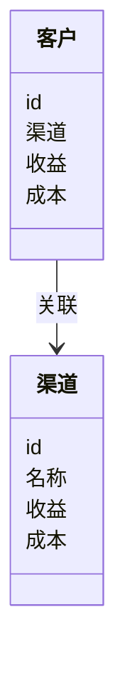
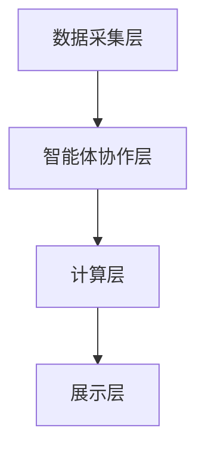
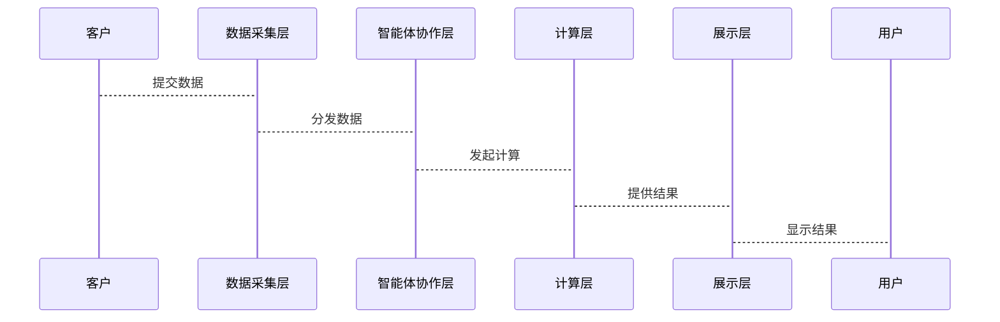

                 


# 多智能体系统在公司客户获取成本评估中的应用

> 关键词：多智能体系统，客户获取成本，成本评估，人工智能，分布式计算，协作机制，优化策略

> 摘要：本文探讨了多智能体系统在公司客户获取成本评估中的应用，通过背景介绍、核心概念与联系、算法原理、数学模型、系统分析与架构设计、项目实战以及最佳实践等部分，详细分析了多智能体系统在客户获取成本评估中的优势和实现方法。文章结合实际案例，通过Mermaid图和Python代码示例，深入浅出地解释了多智能体系统在客户获取成本评估中的应用原理和实际应用。

---

## 第一部分: 多智能体系统与客户获取成本评估的背景介绍

### 第1章: 多智能体系统概述

#### 1.1 多智能体系统的基本概念

##### 1.1.1 多智能体系统的定义
多智能体系统（Multi-Agent System, MAS）是指由多个智能体组成的系统，这些智能体能够通过交互协作完成复杂的任务。每个智能体都是一个独立的实体，具有一定的知识表示、感知能力、推理能力和行动能力。

##### 1.1.2 多智能体系统的特征
- **自主性**：智能体能够自主决策。
- **反应性**：智能体能够感知环境并实时响应。
- **协作性**：多个智能体能够协作完成任务。
- **分布性**：智能体分布在不同的空间或时间维度上。

##### 1.1.3 多智能体系统与单智能体系统的区别
| 特性          | 单智能体系统          | 多智能体系统          |
|---------------|-----------------------|-----------------------|
| 系统结构      | 单一中心化结构        | 分布式结构            |
| 任务处理      | 由单一智能体完成      | 由多个智能体协作完成  |
| 效率          | 可能受限于单点处理    | 更高效，任务并行处理  |
| 稳定性        | 单点故障风险较高      | 故障容错能力强         |

#### 1.2 客户获取成本评估的背景

##### 1.2.1 客户获取成本的定义
客户获取成本（Customer Acquisition Cost, CAC）是指企业获取一名新客户的总成本，包括营销费用、销售费用、技术支持费用等。

##### 1.2.2 客户获取成本评估的重要性
- **优化资源配置**：通过评估CAC，企业可以优化营销和销售资源的分配。
- **提高投资回报率**：降低CAC可以提高企业的盈利能力。
- **市场竞争优势**：更低的CAC意味着企业在市场竞争中更具竞争力。

##### 1.2.3 客户获取成本评估的挑战
- **数据复杂性**：涉及多部门、多渠道的数据整合。
- **实时性要求**：需要实时监控和评估CAC。
- **多目标优化**：需要在多个目标之间找到平衡点。

#### 1.3 多智能体系统在客户获取成本评估中的应用价值

##### 1.3.1 分布式计算的优势
多智能体系统能够将任务分解为多个子任务，通过分布式计算提高效率。

##### 1.3.2 智能体协作的优势
智能体之间的协作能够实现数据的实时共享和处理，提高评估的准确性和实时性。

##### 1.3.3 多智能体系统的灵活性
多智能体系统能够根据实际情况动态调整智能体的协作方式，适应不同的评估需求。

---

## 第二部分: 多智能体系统与客户获取成本评估的核心概念与联系

### 第2章: 多智能体系统的原理

#### 2.1 多智能体系统的组成

##### 2.1.1 智能体
智能体（Agent）是多智能体系统的基本单元，能够感知环境、处理信息并采取行动。

##### 2.1.2 环境
环境（Environment）是智能体所处的外部世界，包括其他智能体、客户、市场等。

##### 2.1.3 通信机制
通信机制（Communication Mechanism）是智能体之间交换信息的方式，包括直接通信和间接通信。

#### 2.2 多智能体系统的协作机制

##### 2.2.1 分布式计算
分布式计算（Distributed Computing）是指将任务分解为多个部分，由不同的智能体分别处理。

##### 2.2.2 协调与协作
协调与协作（Coordination and Collaboration）是智能体之间为了共同目标而进行的信息交换和行动配合。

##### 2.2.3 冲突解决
冲突解决（Conflict Resolution）是指智能体之间在协作过程中出现冲突时的解决机制。

### 第3章: 客户获取成本评估的核心概念

#### 3.1 客户获取成本的计算模型

##### 3.1.1 收益矩阵
收益矩阵（Revenue Matrix）用于表示不同客户获取渠道的收益情况。

##### 3.1.2 成本矩阵
成本矩阵（Cost Matrix）用于表示不同客户获取渠道的成本情况。

##### 3.1.3 评估指标
评估指标（Evaluation Metrics）包括CAC、客户生命周期价值（Customer Lifetime Value, CLV）等。

#### 3.2 多智能体系统与客户获取成本评估的关系

##### 3.2.1 多智能体系统的分布式计算与客户获取成本评估的并行计算
多智能体系统的分布式计算能够提高客户获取成本评估的并行计算效率。

##### 3.2.2 多智能体系统的协作机制与客户获取成本评估的优化策略
智能体之间的协作机制能够优化客户获取成本评估的策略，例如通过实时数据共享和协作优化。

---

## 第三部分: 多智能体系统在客户获取成本评估中的算法原理

### 第4章: 多智能体系统的算法原理

#### 4.1 分布式计算算法

##### 4.1.1 分布式计算的基本原理
分布式计算通过将任务分解为多个部分，分别在不同的智能体上执行，最终将结果汇总得到最终结果。

##### 4.1.2 分布式计算的优势
- **提高计算效率**：通过并行计算提高任务处理速度。
- **增强系统容错性**：单点故障的风险降低。

#### 4.2 协作与协调算法

##### 4.2.1 协作机制
协作机制（Collaboration Mechanism）包括信息共享、任务分配、结果汇总等步骤。

##### 4.2.2 协调机制
协调机制（Coordination Mechanism）包括同步、异步通信、锁机制等。

#### 4.3 冲突解决算法

##### 4.3.1 冲突检测
冲突检测（Conflict Detection）是指检测智能体之间协作过程中出现的冲突。

##### 4.3.2 冲突解决
冲突解决（Conflict Resolution）是指通过协商或其他方式解决冲突。

### 第5章: 客户获取成本评估的算法实现

#### 5.1 客户获取成本计算模型

##### 5.1.1 收益矩阵计算
收益矩阵计算公式：
$$\text{收益} = \sum_{i=1}^{n} \text{渠道}_i \times \text{收益}_i$$

##### 5.1.2 成本矩阵计算
成本矩阵计算公式：
$$\text{成本} = \sum_{i=1}^{n} \text{渠道}_i \times \text{成本}_i$$

##### 5.1.3 评估指标计算
评估指标计算公式：
$$\text{CAC} = \frac{\text{总成本}}{\text{客户数量}}$$

#### 5.2 多智能体系统在客户获取成本评估中的算法实现

##### 5.2.1 分布式计算实现
通过将客户数据分片，分别在不同的智能体上进行计算，最后汇总结果。

##### 5.2.2 协作与协调实现
智能体之间通过通信机制共享数据，协调计算过程。

##### 5.2.3 冲突解决实现
通过冲突检测和解决机制，确保计算过程的顺利进行。

---

## 第四部分: 系统分析与架构设计

### 第6章: 系统分析与架构设计

#### 6.1 问题场景介绍

##### 6.1.1 问题背景
公司需要实时评估不同渠道的客户获取成本，优化资源配置。

##### 6.1.2 问题描述
客户获取成本评估涉及多部门、多渠道的数据，传统方法难以高效处理。

#### 6.2 系统功能设计

##### 6.2.1 领域模型
领域模型（Domain Model）包括客户、渠道、成本、收益等核心概念。



##### 6.2.2 系统架构设计
系统架构设计采用分层架构，包括数据采集层、智能体协作层、计算层和展示层。



#### 6.3 系统接口设计

##### 6.3.1 数据接口
数据接口负责从各个渠道获取数据，包括客户信息、收益、成本等。

##### 6.3.2 计算接口
计算接口负责调用多智能体系统的算法，计算客户获取成本。

##### 6.3.3 展示接口
展示接口将计算结果以图形化的方式展示给用户。

#### 6.4 系统交互设计

##### 6.4.1 交互流程
客户数据通过数据采集层采集，经过智能体协作层处理后，计算层进行计算，最后展示层展示结果。

##### 6.4.2 交互流程图


---

## 第五部分: 项目实战

### 第7章: 项目实战

#### 7.1 环境安装

##### 7.1.1 安装Python
```bash
python --version
pip install --upgrade pip
```

##### 7.1.2 安装依赖
```bash
pip install numpy matplotlib
```

#### 7.2 核心代码实现

##### 7.2.1 数据预处理
```python
import numpy as np

def preprocess_data(data):
    # 假设data是包含客户和渠道信息的DataFrame
    return data.dropna().reset_index(drop=True)
```

##### 7.2.2 智能体交互
```python
class Agent:
    def __init__(self, id):
        self.id = id
        self.data = None

    def receive_data(self, data):
        self.data = data

    def process_data(self):
        # 具体处理逻辑
        return np.sum(self.data)
```

##### 7.2.3 成本计算
```python
def calculate_cost(data):
    cost_matrix = data[['渠道', '成本']].groupby('渠道').sum()
    return cost_matrix
```

#### 7.3 案例分析与详细解读

##### 7.3.1 案例分析
假设公司有三个渠道，每个渠道的收益和成本如下：
| 渠道 | 收益 | 成本 |
|------|------|------|
| 渠道1 | 100  | 50   |
| 渠道2 | 80   | 30   |
| 渠道3 | 120  | 60   |

##### 7.3.2 计算过程
收益矩阵计算：
$$\text{收益} = 100 + 80 + 120 = 300$$

成本矩阵计算：
$$\text{成本} = 50 + 30 + 60 = 140$$

客户获取成本（CAC）计算：
$$\text{CAC} = \frac{140}{3} \approx 46.67$$

##### 7.3.3 结果展示
通过图表展示不同渠道的收益和成本分布。

---

## 第六部分: 最佳实践与小结

### 第8章: 最佳实践

#### 8.1 小结

- 多智能体系统通过分布式计算和协作机制，显著提高了客户获取成本评估的效率和准确性。
- 通过智能体之间的协作，能够实时更新和优化评估结果，帮助企业做出更明智的决策。

#### 8.2 注意事项

- 数据隐私和安全问题需要高度重视。
- 确保智能体之间的通信机制高效可靠。
- 定期维护和更新系统，以适应市场变化和客户需求。

#### 8.3 拓展阅读

- 推荐阅读《Multi-Agent Systems: Complexity and Decision Making》。
- 关注最新的多智能体系统研究和应用案例。

---

## 作者信息

作者：AI天才研究院/AI Genius Institute & 禅与计算机程序设计艺术 /Zen And The Art of Computer Programming

---

# 结语

多智能体系统在公司客户获取成本评估中的应用，不仅提高了评估的效率和准确性，还为企业提供了实时优化的可能。通过本文的详细讲解和实际案例分析，读者可以深入了解多智能体系统的核心原理和实际应用。希望本文能够为企业的客户获取成本评估提供有价值的参考和启示。

