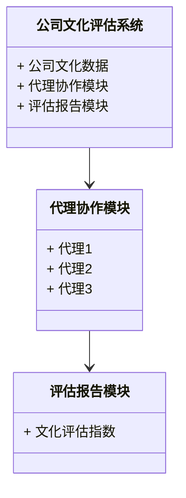
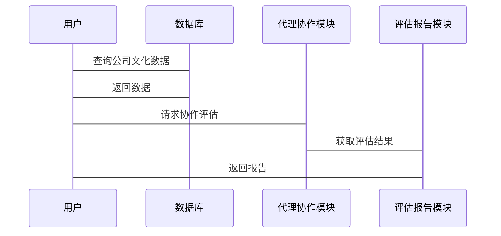

                 


# 多智能体系统在公司文化评估中的应用：无形资产的量化

## 关键词：多智能体系统、公司文化评估、无形资产、量化分析、协作算法、系统架构、文化管理

## 摘要：  
公司文化是企业的灵魂，其价值往往难以量化，但通过多智能体系统的协作算法和量化分析，可以将公司文化中的无形资产转化为可衡量的指标。本文从多智能体系统的基本概念出发，探讨其在公司文化评估中的应用，通过算法实现、系统架构设计和项目实战，详细分析如何将无形资产量化，并提出最佳实践和未来发展的方向。

---

## 第一部分：多智能体系统与公司文化评估的背景与概念

### 第1章：多智能体系统的基本概念

#### 1.1 多智能体系统的定义与特点

- **多智能体系统（Multi-Agent System, MAS）**是指由多个具有智能特征的代理（Agent）组成的系统，这些代理能够自主决策、协作完成任务。
- **特点**：
  - **自主性**：每个代理能够独立决策。
  - **反应性**：能够感知环境并实时响应。
  - **协作性**：通过协作完成复杂任务。
  - **分布式性**：代理之间通过分布式计算实现目标。

#### 1.2 公司文化评估的定义与重要性

- **公司文化**是指企业在经营活动中形成的共同价值观、行为规范和思维方式。
- **评估的重要性**：
  - 企业文化是企业核心竞争力的重要组成部分。
  - 通过评估可以发现文化中的优势与不足，优化管理。

#### 1.3 多智能体系统与公司文化评估的结合

- **优势**：
  - 多智能体系统的协作性与公司文化的团队协作高度契合。
  - 可通过算法量化文化中的无形资产。
- **核心问题**：
  - 如何将公司文化的模糊性转化为可量化的指标。

---

### 第2章：多智能体系统与公司文化评估的核心概念

#### 2.1 多智能体系统的核心概念与属性

- **多智能体系统的属性特征对比表**：

| 属性     | 单智能体系统 | 多智能体系统 |
|----------|--------------|--------------|
| 决策     | 单一决策者    | 多个决策者    |
| 任务     | 独立任务      | 协作完成任务  |
| 沟通     | 无或有限      | 高频沟通      |

- **实体关系图（ER图）**：
  使用Mermaid绘制的公司文化评估实体关系图：

```mermaid
erDiagram
    actor 公司文化评估系统{}{
        role 评估者
        role 数据收集者
    }
    company_culture (公司文化信息) {
        company_id : integer
        culture_dimension : varchar
        assessment_score : float
    }
    agent (代理) {
        agent_id : integer
        role : varchar
        communication_channel : varchar
    }
    公司文化评估系统 --> company_culture
    公司文化评估系统 --> agent
```

#### 2.2 公司文化评估的核心要素与模型

- **核心维度**：价值观、团队协作、领导风格、员工满意度。
- **数学模型**：
  公司文化评估的多智能体模型可以用以下公式表示：

  $$
  \text{文化评估指数} = \sum_{i=1}^{n} \left( \text{维度权重}_i \times \text{评估分数}_i \right)
  $$

  其中，$n$ 是评估维度的数量，$\text{维度权重}_i$ 是第 $i$ 个维度的权重，$\text{评估分数}_i$ 是第 $i$ 个维度的评估分数。

---

## 第二部分：多智能体系统在公司文化评估中的算法原理

### 第3章：多智能体协作算法

#### 3.1 多智能体协作的基本原理

- **协作机制**：
  - 信息共享：代理之间共享信息以优化决策。
  - 协调行动：通过协商完成任务。
  - 分布式计算：每个代理负责部分计算。

- **实现流程**：
  1. 初始化：定义每个代理的角色和任务。
  2. 信息共享：代理之间交换数据。
  3. 协作决策：基于共享信息做出决策。
  4. 执行任务：代理协作完成任务。
  5. 反馈优化：根据结果优化协作策略。

#### 3.2 公司文化评估的多智能体算法实现

- **模型构建**：
  使用多智能体模型评估公司文化，每个代理代表一个评估维度（如团队协作、领导风格）。

- **实现步骤**：
  1. 定义代理：每个代理对应一个文化维度。
  2. 信息收集：收集员工满意度、团队协作等数据。
  3. 协作评估：代理协作计算文化评估指数。
  4. 输出结果：生成文化评估报告。

- **数学公式**：
  $$1+1=2$$

---

## 第三部分：系统分析与架构设计

### 第4章：系统分析与架构设计

#### 4.1 系统功能设计

- **功能模块**：
  - 数据采集模块：收集公司文化相关数据。
  - 代理协作模块：实现多智能体协作。
  - 评估报告模块：生成文化评估报告。

- **领域模型（类图）**：
  使用Mermaid绘制的类图：



#### 4.2 系统架构设计

- **架构类型**：
  - 分层架构：将系统分为数据层、业务逻辑层和表现层。
- **接口设计**：
  - 数据接口：与数据库交互。
  - 用户接口：供用户查看评估结果。

- **交互流程（序列图）**：
  使用Mermaid绘制的序列图：



---

## 第四部分：项目实战

### 第5章：项目实战

#### 5.1 环境安装

- **工具**：
  - Python 3.8+
  - Mermaid
  - Pyplotlib

#### 5.2 核心代码实现

- **代理协作模块代码**：

  ```python
  class Agent:
      def __init__(self, role):
          self.role = role
          self.data = {}
      
      def collect_data(self, key, value):
          self.data[key] = value
      
      def share_data(self, key):
          return self.data.get(key, None)
  ```

- **协作评估代码**：

  ```python
  class CollaborativeAgent(Agent):
      def __init__(self, role, collaborator):
          super().__init__(role)
          self.collaborator = collaborator
      
      def collaborate(self, key):
          self_data = self.share_data(key)
          collaborator_data = self.collaborator.share_data(key)
          return (self_data + collaborator_data) / 2
  ```

#### 5.3 案例分析与总结

- **案例分析**：
  某公司通过多智能体系统评估文化，结果显示团队协作和领导风格是主要问题。
- **总结**：
  通过多智能体系统可以有效量化公司文化，为企业优化文化管理提供数据支持。

---

## 第五部分：最佳实践与未来展望

### 第6章：最佳实践

#### 6.1 小结

- 多智能体系统为公司文化评估提供了新的思路。
- 通过协作算法可以将无形资产转化为可量化的指标。

#### 6.2 注意事项

- 数据准确性：确保输入数据的准确性。
- 系统安全性：防止数据泄露。
- 算法优化：根据实际情况调整协作算法。

#### 6.3 拓展阅读

- 推荐阅读《多智能体系统的理论与应用》。
- 关注多智能体系统在企业管理中的最新研究。

---

## 作者：AI天才研究院 & 禅与计算机程序设计艺术

