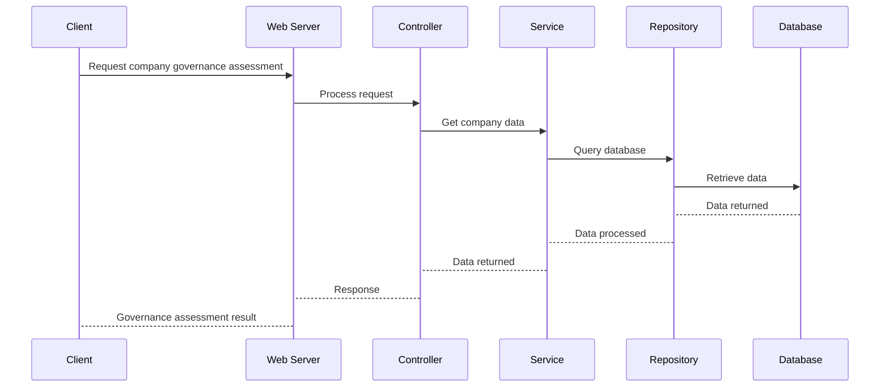

                 


# 多智能体系统在公司治理评估中的应用

> 关键词：多智能体系统，公司治理评估，分布式计算，协作机制，数学模型

> 摘要：本文探讨了多智能体系统在公司治理评估中的应用，详细介绍了多智能体系统的定义、特点，以及其在公司治理评估中的优势。通过构建数学模型和算法实现，结合实际案例分析，展示了多智能体系统在公司治理评估中的潜力和实际应用价值。本文还提供了系统架构设计和项目实战，帮助读者更好地理解和应用多智能体系统在公司治理评估中的应用。

---

## 第一章 多智能体系统概述

### 1.1 多智能体系统的定义与特点

#### 1.1.1 多智能体系统的定义
多智能体系统（Multi-Agent System，MAS）是由多个智能体（Agent）组成的系统，这些智能体能够通过协作完成复杂任务。智能体是具有感知、推理和行动能力的实体，可以是软件程序、机器人或其他智能设备。

#### 1.1.2 多智能体系统的五大特点
1. **分布式性**：智能体分布在不同的位置，独立运行。
2. **协作性**：智能体之间通过通信和协作完成任务。
3. **反应性**：智能体能够感知环境并实时响应。
4. **自主性**：智能体具有自主决策能力。
5. **动态性**：系统环境和任务需求动态变化。

#### 1.1.3 多智能体系统与传统单智能体系统的区别
| 特性 | 多智能体系统 | 单智能体系统 |
|------|--------------|---------------|
| 结构 | 分布式结构 | 集中式结构 |
| 智能体数量 | 多个 | 单个 |
| 协作性 | 高 | 无 |
| 灵活性 | 高 | 低 |

### 1.2 公司治理评估的基本概念

#### 1.2.1 公司治理的定义与核心要素
公司治理是通过制定和实施一系列制度、政策和措施，确保公司有效运作和股东利益最大化。核心要素包括：
- 股东权利
- 董事会结构
- 高管职责
- 透明度与披露

#### 1.2.2 公司治理评估的目的与意义
公司治理评估旨在衡量公司治理的健康状况，发现潜在问题并提出改进建议。其意义在于：
- 提高公司治理效率
- 降低企业风险
- 提升企业价值

#### 1.2.3 公司治理评估的主要指标与方法
- **指标**：
  - 股东权益回报率（ROE）
  - 净利润增长率
  - 董事会独立性
- **方法**：
  - 财务指标分析
  - 治理结构评估
  - 企业社会责任评估

---

## 第二章 多智能体系统在公司治理评估中的应用背景

### 2.1 当前公司治理评估的痛点与挑战

#### 2.1.1 传统公司治理评估的局限性
- 数据量大，难以处理
- 评估结果缺乏动态性
- 评估过程复杂，难以协作

#### 2.1.2 数据量大、复杂性高的问题
公司治理评估涉及大量数据，包括财务数据、市场数据、法律数据等，传统方法难以高效处理。

#### 2.1.3 评估结果的实时性与动态性需求
公司治理环境不断变化，评估结果需要实时更新，传统方法难以满足。

### 2.2 多智能体系统的优势与适用性

#### 2.2.1 分布式计算与协作优势
多智能体系统通过分布式计算，能够高效处理大量数据，并通过协作完成复杂任务。

#### 2.2.2 多智能体系统的可扩展性
多智能体系统可以根据需求灵活扩展，适用于大规模数据处理和复杂任务。

#### 2.2.3 多智能体系统在复杂场景中的应用潜力
多智能体系统能够处理公司治理评估中的复杂场景，例如多个利益相关者的协作与冲突解决。

---

## 第三章 多智能体系统的核心原理

### 3.1 多智能体系统的核心原理

#### 3.1.1 实体与智能体的定义
实体是系统中的基本单元，可以是公司、股东、董事会等。智能体是具有感知、推理和行动能力的实体。

#### 3.1.2 实体之间的关系与交互
- 股东与董事会之间的关系
- 董事会与高管之间的关系
- 公司与外部利益相关者的关系

#### 3.1.3 多智能体系统的层次结构
- **个体层**：智能体的独立行为
- **协作层**：智能体之间的协作与通信
- **系统层**：整体系统的运行与管理

### 3.2 多智能体系统的通信与协作机制

#### 3.2.1 智能体之间的通信协议
- 通信内容：数据传输和指令
- 通信方式：直接通信和间接通信
- 通信协议：基于消息队列或发布-订阅模型

#### 3.2.2 协作任务的分配与协调
- 任务分配：基于智能体的能力和资源分配
- 协调机制：通过协商和冲突解决实现任务协调

#### 3.2.3 冲突解决机制
- 冲突检测：通过监控系统状态发现冲突
- 冲突解决：基于优先级或协商机制

---

## 第四章 公司治理评估的数学模型与方法

### 4.1 公司治理评估的主要指标

#### 4.1.1 财务指标
- 股东权益回报率（ROE）
- 净利润增长率
- 资产负债率

#### 4.1.2 治理结构指标
- 董事会独立性
- 高管任期
- 股东权利保护

#### 4.1.3 企业社会责任指标
- 环境责任
- 社会责任
- 治理透明度

### 4.2 基于多智能体系统的评估模型

#### 4.2.1 模型的构建与设计
- 智能体表示：每个智能体代表一个利益相关者
- 交互规则：定义智能体之间的交互规则和通信协议
- 评估指标：结合财务、治理和责任指标

#### 4.2.2 模型的输入与输出
- 输入：公司数据、市场数据、法律法规
- 输出：公司治理评估结果

#### 4.2.3 模型的优化与改进
- 参数优化：通过机器学习优化模型参数
- 模型扩展：增加新的评估指标或智能体

---

## 第五章 多智能体系统的算法原理

### 5.1 多智能体系统的算法原理

#### 5.1.1 分布式计算与多智能体算法
- 分布式计算：任务分解和并行计算
- 多智能体算法：智能体协作完成任务

#### 5.1.2 协商算法
- 协商机制：智能体通过协商分配任务
- 冲突解决：基于优先级或协商达成一致

### 5.2 多智能体系统的实现

#### 5.2.1 Python实现多智能体协同决策算法
```python
import random

class Agent:
    def __init__(self, id):
        self.id = id
        self.task = None

    def assign_task(self, task):
        self.task = task
        print(f"Agent {self.id} assigned task: {task}")

    def execute_task(self):
        print(f"Agent {self.id} executing task: {self.task}")
        # 模拟执行任务
        random.uniform(0.1, 0.5)
        print(f"Agent {self.id} completed task: {self.task}")

def distribute_tasks(agents, tasks):
    for agent in agents:
        task = random.choice(tasks)
        agent.assign_task(task)
        tasks.remove(task)

def main():
    agents = [Agent(i) for i in range(1, 5)]
    tasks = ["Data Analysis", "Financial Planning", "Risk Assessment", "Strategy Formulation"]
    distribute_tasks(agents, tasks)
    for agent in agents:
        agent.execute_task()

if __name__ == "__main__":
    main()
```

#### 5.2.2 算法的数学模型
多智能体系统中任务分配的数学模型可以表示为：
$$
\text{Task}_i \rightarrow \text{Agent}_j \quad \text{其中} \quad i \in \{1, 2, \ldots, n\}, j \in \{1, 2, \ldots, m\}
$$
其中，$n$ 是任务数量，$m$ 是智能体数量。

---

## 第六章 公司治理评估的系统架构设计

### 6.1 系统功能设计

#### 6.1.1 领域模型（Mermaid 类图）
```mermaid
classDiagram
    class Company {
        id: int
        name: str
        governance_score: float
    }
    class Agent {
        id: int
        task: str
        status: str
    }
    class Task {
        id: int
        name: str
        priority: int
    }
    Company <--| Task
    Agent <--| Task
```

#### 6.1.2 系统架构设计（Mermaid 架构图）


#### 6.1.3 系统接口设计（Mermaid 序列图）


---

## 第七章 项目实战

### 7.1 项目环境搭建

#### 7.1.1 环境安装
```bash
pip install Flask
pip install requests
pip install numpy
```

#### 7.1.2 核心代码实现
```python
from flask import Flask
import requests

app = Flask(__name__)

@app.route('/governance_assessment', methods=['POST'])
def governance_assessment():
    data = requests.json
    # 调用多智能体算法进行评估
    result = multi_agent_system(data)
    return jsonify(result)

if __name__ == '__main__':
    app.run(debug=True)
```

### 7.2 项目小结

#### 7.2.1 收获与经验
- 多智能体系统的分布式计算和协作能力
- 系统架构设计的复杂性和实现难度
- 项目实战中的问题解决和优化经验

#### 7.2.2 注意事项
- 数据隐私和安全问题
- 系统扩展性和性能优化
- 算法的可解释性和透明度

---

## 第八章 最佳实践

### 8.1 小结

多智能体系统在公司治理评估中的应用具有广阔前景，通过分布式计算和协作机制，能够高效处理复杂任务，提升评估结果的准确性和实时性。

### 8.2 注意事项

- 数据隐私和安全
- 系统的可扩展性和性能优化
- 算法的可解释性和透明度

### 8.3 拓展阅读

- 《Multi-Agent Systems: Algorithmic, Complexity, and Game-Theoretic Foundations》
- 《企业治理与风险管理》

---

## 作者

作者：AI天才研究院 & 禅与计算机程序设计艺术

---

# 结束语

通过本文的详细讲解，读者可以全面了解多智能体系统在公司治理评估中的应用，从理论到实践，从算法到系统设计，为实际应用提供了宝贵的参考和指导。

