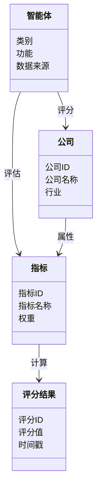
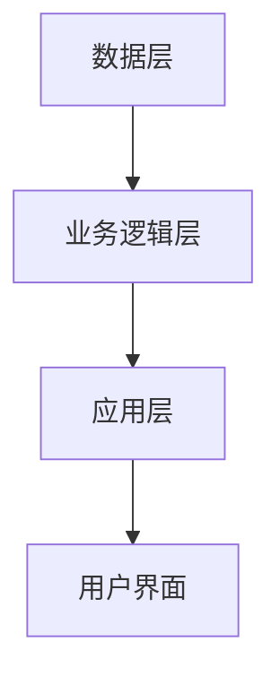
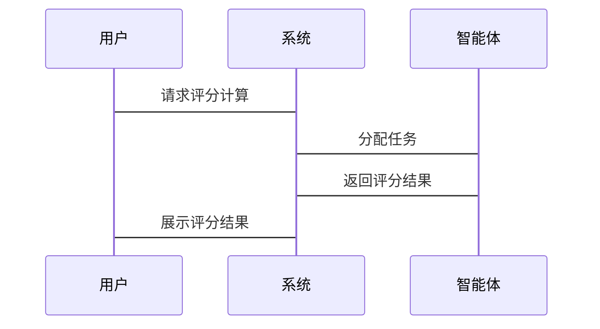

                 


# 多智能体系统在公司治理评分中的应用：量化管理质量

---

## 关键词：
多智能体系统, 公司治理评分, 量化管理质量, 协同算法, 系统架构, 项目实战

---

## 摘要：
本文探讨了多智能体系统（Multi-Agent Systems, MAS）在公司治理评分中的应用，提出了一种基于MAS的公司治理评分方法。通过分析MAS的核心概念、算法原理、系统架构以及实际项目实现，本文详细阐述了如何利用MAS技术量化公司管理质量，为企业提供高效的管理评分解决方案。文章内容涵盖背景介绍、核心概念与联系、算法原理、系统分析与架构设计、项目实战等多个方面，旨在为读者提供一个全面的技术视角，帮助他们理解并应用MAS技术解决公司治理评分问题。

---

## 第一部分: 多智能体系统与公司治理评分的背景介绍

### 第1章: 多智能体系统与公司治理评分概述

#### 1.1 多智能体系统的定义与特点
- **1.1.1 多智能体系统的定义**
  多智能体系统（Multi-Agent System, MAS）是由多个智能体（Agent）组成的分布式系统，这些智能体能够通过协作完成复杂的任务。每个智能体都有自己的目标、知识、推理能力，并能够与其他智能体或环境进行交互。
  
- **1.1.2 多智能体系统的核心特点**
  - 分布式：多个智能体独立运行，协同完成任务。
  - 协作性：智能体之间通过通信和协作实现目标。
  - 反应性：智能体能够感知环境并做出实时反应。
  - 自适应性：智能体能够根据环境变化调整策略。

- **1.1.3 多智能体系统与传统单智能体系统的区别**
  - 传统单智能体系统：集中式控制，单一决策中心。
  - 多智能体系统：分布式控制，多个智能体协作完成任务。

#### 1.2 公司治理评分的定义与重要性
- **1.2.1 公司治理评分的定义**
  公司治理评分是对企业治理结构、管理效率、透明度等方面进行量化评估的过程，旨在衡量企业的管理质量。

- **1.2.2 公司治理评分的重要性**
  - 为投资者提供决策依据。
  - 促进企业优化管理结构。
  - 为监管部门提供评估企业合规性的工具。

- **1.2.3 公司治理评分的常见指标**
  - 治理结构：董事会构成、独立董事比例。
  - 透明度：信息披露的及时性、完整性。
  - 管理效率：决策效率、执行效率。

#### 1.3 多智能体系统在公司治理评分中的应用背景
- **1.3.1 公司治理评分的传统方法及其局限性**
  - 传统方法依赖人工评估，效率低、主观性强。
  - 数据来源单一，难以全面反映企业治理状况。

- **1.3.2 多智能体系统在公司治理评分中的优势**
  - 多智能体系统能够整合多源异构数据，提高评估的全面性和准确性。
  - 智能体之间的协作能够实现动态调整，适应企业治理的复杂性。

- **1.3.3 多智能体系统在公司治理评分中的应用场景**
  - 数据采集与处理：智能体负责从不同来源收集企业治理数据。
  - 数据分析与评估：多个智能体协作完成数据的分析和评分计算。
  - 结果展示与反馈：智能体将评分结果反馈给用户，并提供优化建议。

---

## 第二部分: 核心概念与联系

### 第2章: 多智能体系统与公司治理评分的核心概念与联系

#### 2.1 多智能体系统的原理
- **2.1.1 多智能体系统的原理概述**
  多智能体系统通过智能体之间的通信和协作，实现复杂任务的分解与协同。每个智能体负责特定的任务，并通过共享信息和协调行动，完成整体目标。

#### 2.2 公司治理评分的指标体系
- **2.2.1 公司治理评分的指标体系构建**
  公司治理评分的指标体系通常包括以下几个方面：
  - 治理结构：董事会构成、股东权利等。
  - 透明度：信息披露的及时性、完整性。
  - 管理效率：决策效率、执行效率。
  - 社会责任：企业对社会、环境的影响。

- **2.2.2 指标权重的确定**
  指标的权重通常基于其重要性进行分配，可以通过专家评估或数据驱动的方法确定。

#### 2.3 多智能体系统与公司治理评分的联系
- **2.3.1 多智能体系统的协同性与公司治理评分的协作性**
  多智能体系统的协同性与公司治理评分的协作性相辅相成。智能体之间的协作能够提高评分的准确性和效率。

- **2.3.2 多智能体系统的适应性与公司治理评分的动态性**
  多智能体系统的适应性使其能够应对公司治理评分中的动态变化，如企业战略调整、市场环境变化等。

- **2.3.3 多智能体系统的分布式特性与公司治理评分的多维度性**
  多智能体系统的分布式特性使其能够同时处理公司治理评分的多个维度，如治理结构、透明度、社会责任等。

#### 2.4 多智能体系统与公司治理评分的核心要素对比

| **核心要素**       | **多智能体系统**       | **公司治理评分**       |
|--------------------|-----------------------|-----------------------|
| **目标**           | 完成复杂任务           | 量化企业治理质量       |
| **结构**           | 分布式、协作性         | 多维度、多指标         |
| **数据来源**       | 多源异构数据           | 企业内部数据、外部数据   |
| **决策方式**       | 分布式决策             | 综合评估、量化评分       |
| **优势**           | 高效协作、灵活适应     | 全面评估、动态调整       |

#### 2.5 多智能体系统与公司治理评分的ER实体关系图
```mermaid
er
    %% 公司治理评分系统ER图
    title 公司治理评分系统ER图
    rectangle 智能体 {
        类别
        功能
        数据来源
    }
    rectangle 公司 {
        公司ID
        公司名称
        行业
    }
    rectangle 指标 {
        指标ID
        指标名称
        权重
    }
    rectangle 评分结果 {
        评分ID
        评分值
        时间戳
    }
    智能体 --> 指标: 评估
    智能体 --> 公司: 评分
    公司 --> 指标: 属性
    指标 --> 评分结果: 计算
```

---

## 第三部分: 算法原理

### 第3章: 多智能体系统在公司治理评分中的算法原理

#### 3.1 协同算法的设计与实现
- **3.1.1 协同算法的概述**
  协同算法是多智能体系统的核心，通过智能体之间的协作完成数据处理、评估和评分计算。

- **3.1.2 协同算法的流程**
  1. 数据预处理：智能体从不同数据源收集企业治理数据。
  2. 数据分析：智能体对数据进行清洗、转换和特征提取。
  3. 模型训练：基于机器学习算法训练评分模型。
  4. 评分计算：智能体协作完成评分计算并输出结果。

- **3.1.3 协同算法的实现步骤**
  ```mermaid
  graph TD
      A[智能体1] --> B[数据预处理]
      B --> C[数据分析]
      C --> D[模型训练]
      D --> E[评分计算]
      E --> F[结果输出]
  ```

#### 3.2 基于强化学习的评分优化
- **3.2.1 强化学习的基本原理**
  强化学习是一种通过智能体与环境交互来学习策略的方法，适用于动态环境下的评分优化。

- **3.2.2 强化学习在评分优化中的应用**
  智能体通过与企业治理环境的交互，不断优化评分策略，提高评分的准确性和效率。

#### 3.3 多智能体协同算法的数学模型与公式
- **3.3.1 评分模型的建立**
  公司治理评分可以通过加权平均模型计算：
  $$score = \sum_{i=1}^{n} w_i x_i$$
  其中，$w_i$ 是指标 $i$ 的权重，$x_i$ 是指标 $i$ 的得分。

- **3.3.2 权重的确定方法**
  权重可以通过专家评估或数据驱动的方法确定，例如使用主成分分析（PCA）提取特征权重。

#### 3.4 算法实现的Python代码示例
```python
import numpy as np
from sklearn.decomposition import PCA

# 示例数据：公司治理指标
data = np.array([[80, 70, 90], [75, 85, 85], [90, 65, 80]])

# 使用PCA提取特征权重
pca = PCA(n_components=1)
principal_components = pca.fit_transform(data)

# 计算权重
weights = pca.explained_variance_ratio_

# 计算评分
scores = np.dot(data, weights)
```

---

## 第四部分: 系统分析与架构设计

### 第4章: 多智能体系统在公司治理评分中的系统分析与架构设计

#### 4.1 问题场景介绍
- **4.1.1 问题场景描述**
  公司治理评分需要整合多源数据，包括财务数据、管理数据、外部评级等，对企业的治理质量进行量化评估。

- **4.1.2 问题解决过程**
  智能体通过协作完成数据采集、分析和评分计算。

#### 4.2 项目介绍
- **4.2.1 项目目标**
  构建一个基于多智能体系统的公司治理评分系统，实现对企业治理质量的量化评估。

- **4.2.2 项目范围**
  项目涵盖数据采集、模型训练、评分计算和结果展示。

- **4.2.3 技术选型**
  - 数据采集：使用爬虫和API接口获取企业数据。
  - 数据处理：使用Python和Pandas进行数据清洗和转换。
  - 模型训练：使用机器学习算法训练评分模型。
  - 系统架构：采用微服务架构设计。

#### 4.3 系统功能设计
- **4.3.1 系统功能模块**
  - 数据采集模块：负责从不同数据源获取企业治理数据。
  - 数据处理模块：对数据进行清洗、转换和特征提取。
  - 模型训练模块：基于机器学习算法训练评分模型。
  - 评分计算模块：智能体协作完成评分计算。
  - 结果展示模块：展示评分结果并提供优化建议。

- **4.3.2 领域模型（Mermaid 类图）**


#### 4.4 系统架构设计
- **4.4.1 系统架构概述**
  系统采用分层架构设计，包括数据层、业务逻辑层和应用层。

- **4.4.2 系统架构图（Mermaid 架构图）**


#### 4.5 系统接口设计与交互流程
- **4.5.1 系统接口设计**
  - 数据采集接口：提供API接口获取企业数据。
  - 评分计算接口：提供REST API进行评分计算。

- **4.5.2 系统交互流程（Mermaid 序列图）**


---

## 第五部分: 项目实战

### 第5章: 项目实战：基于多智能体系统的公司治理评分系统实现

#### 5.1 环境安装与配置
- **5.1.1 环境需求**
  - Python 3.8+
  - Jupyter Notebook
  - NumPy、Pandas、Scikit-learn

- **5.1.2 安装依赖**
  ```bash
  pip install numpy pandas scikit-learn
  ```

#### 5.2 核心代码实现
- **5.2.1 数据预处理**
```python
import pandas as pd

# 示例数据：公司治理指标
data = {
    '公司ID': [1, 2, 3],
    '治理结构': [80, 70, 90],
    '透明度': [70, 85, 65],
    '社会责任': [90, 80, 85]
}
df = pd.DataFrame(data)
```

- **5.2.2 模型训练**
```python
from sklearn.decomposition import PCA

# 使用PCA提取特征权重
pca = PCA(n_components=1)
principal_components = pca.fit_transform(df[['治理结构', '透明度', '社会责任']])

# 计算权重
weights = pca.explained_variance_ratio_
```

- **5.2.3 评分计算**
```python
# 计算评分
scores = np.dot(df[['治理结构', '透明度', '社会责任']].values, weights)
```

#### 5.3 实际案例分析
- **5.3.1 案例背景**
  某公司治理结构得分为80，透明度得分为70，社会责任得分为90。

- **5.3.2 评分计算**
  假设权重为 [0.5, 0.3, 0.2]，则评分计算为：
  $$score = 80 \times 0.5 + 70 \times 0.3 + 90 \times 0.2 = 40 + 21 + 18 = 79$$

- **5.3.3 评分结果**
  该公司治理评分为79分，属于中等偏上水平。

#### 5.4 项目小结
- **5.4.1 项目实现总结**
  通过多智能体系统的协作，实现了公司治理评分的自动化和高效化。

- **5.4.2 项目成果**
  提供了一个可扩展的公司治理评分系统，能够处理大规模数据和复杂场景。

---

## 第六部分: 结论与展望

### 第6章: 结论与展望

#### 6.1 结论
本文探讨了多智能体系统在公司治理评分中的应用，提出了一种基于MAS的公司治理评分方法。通过分析MAS的核心概念、算法原理、系统架构以及实际项目实现，本文详细阐述了如何利用MAS技术量化公司管理质量，为企业提供高效的管理评分解决方案。

#### 6.2 展望
- **MAS技术的进一步发展**
  - 提高智能体的协作效率和适应性。
  - 探索MAS与其他技术（如区块链）的结合应用。

- **公司治理评分的未来方向**
  - 引入更多数据源，提高评分的准确性和全面性。
  - 开发动态评分模型，适应企业治理的快速变化。

#### 6.3 最佳实践与注意事项
- **数据质量的重要性**
  数据的准确性和完整性直接影响评分结果。

- **模型的可解释性**
  评分模型的可解释性有助于用户理解和信任评分结果。

- **系统的可扩展性**
  系统应具备良好的可扩展性，适应企业规模和复杂性的变化。

---

## 作者：AI天才研究院/AI Genius Institute & 禅与计算机程序设计艺术/Zen And The Art of Computer Programming

---

感谢您的阅读！希望本文对您理解多智能体系统在公司治理评分中的应用有所帮助。如果需要进一步探讨或有疑问，请随时联系作者。

