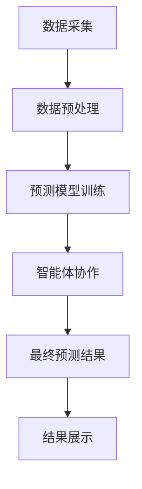
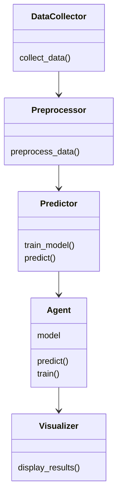

                 


# 多智能体系统在公司现金流质量分析中的应用

## 关键词：多智能体系统，现金流质量分析，机器学习，预测模型，企业财务管理

## 摘要：本文探讨了多智能体系统（Multi-Agent System, MAS）在公司现金流质量分析中的应用。通过结合MAS的分布式计算和协同决策能力，我们提出了一种创新的现金流预测与风险评估方法。文章从MAS的基本概念、现金流分析的必要性入手，详细讲解了MAS在现金流预测和风险评估中的核心算法，包括预测模型的构建、算法实现和系统架构设计。最后，通过具体案例分析，展示了MAS在实际企业财务管理中的应用价值和优势。

---

# 第一部分: 多智能体系统与现金流质量分析的背景与基础

## 第1章: 多智能体系统概述

### 1.1 多智能体系统的基本概念

#### 1.1.1 多智能体系统的定义与特点
多智能体系统（MAS）是由多个智能体（Agent）组成的分布式系统，每个智能体能够独立感知环境、做出决策并采取行动。MAS的核心特点包括：
- **分布式性**：多个智能体协同工作，而非单一中心控制。
- **自主性**：每个智能体都具有自主决策能力。
- **反应性**：智能体能够实时感知环境变化并做出响应。
- **协作性**：智能体之间通过通信和协作完成复杂任务。

#### 1.1.2 多智能体系统的组成与结构
MAS由以下主要部分组成：
1. **智能体（Agent）**：能够感知环境、做出决策并执行行动的基本单元。
2. **环境（Environment）**：智能体所处的外部世界，包括任务目标、约束条件和其他智能体。
3. **通信机制**：智能体之间交换信息和协调行动的渠道。
4. **协作协议**：定义智能体之间如何协作的规则和策略。

#### 1.1.3 多智能体系统的优势与挑战
- **优势**：
  - 高度灵活性：能够适应复杂多变的环境。
  - 分布式计算能力：适合大规模数据处理和复杂任务。
  - 协同决策：多个智能体的协作能够提高决策的准确性和效率。
- **挑战**：
  - 通信开销：智能体之间的通信可能带来额外的计算负担。
  - 协作复杂性：多个智能体的协同需要复杂的协议和协调机制。
  - 系统设计难度：MAS的设计和实现相对复杂。

### 1.2 现金流质量分析的基本概念

#### 1.2.1 现金流的定义与分类
现金流是指企业在一定时期内由于经营活动、投资活动和筹资活动而产生的现金流入和流出。现金流可以分为以下几类：
1. **经营活动现金流**：与企业日常运营直接相关的现金流。
2. **投资活动现金流**：与企业投资活动相关的现金流。
3. **筹资活动现金流**：与企业筹资活动相关的现金流。

#### 1.2.2 现金流质量分析的必要性
现金流质量分析是企业财务管理的重要组成部分，其主要目的是评估企业的财务健康状况和流动性。高质量的现金流意味着企业能够维持正常的运营，并且有足够的资金支持未来发展。

#### 1.2.3 现金流质量分析的方法与指标
常用的方法包括：
- **现金流比率分析**：如流动比率、速动比率等。
- **现金流结构分析**：分析不同来源的现金流占比。
- **现金流预测模型**：通过历史数据和趋势预测未来的现金流情况。

### 1.3 多智能体系统在现金流分析中的应用背景

#### 1.3.1 企业现金流管理的重要性
现金流管理是企业财务管理的核心内容之一，直接关系到企业的生存和发展。良好的现金流管理能够确保企业有足够的资金支持日常运营和未来发展，同时降低财务风险。

#### 1.3.2 多智能体系统在财务分析中的优势
- **分布式计算能力**：MAS能够同时处理大量的数据，提高计算效率。
- **协同决策能力**：多个智能体可以协同完成复杂的财务分析任务。
- **实时数据分析**：MAS能够实时感知市场变化和企业内部数据，快速做出响应。

#### 1.3.3 多智能体系统与现金流分析的结合
通过MAS，企业可以实现多维度、多角度的现金流分析，包括预测、风险评估和优化。MAS的应用能够提高现金流分析的准确性和效率，为企业决策提供更有力的支持。

---

# 第二部分: 多智能体系统在现金流质量分析中的核心算法与实现

## 第2章: 多智能体协同预测算法

### 2.1 多智能体协同预测算法的原理

#### 2.1.1 多智能体协同预测模型的构建
多智能体协同预测模型由多个智能体组成，每个智能体负责不同的预测任务。通过智能体之间的协作，模型能够综合考虑多个因素，提高预测的准确性。

#### 2.1.2 多智能体协同预测的实现步骤
1. **智能体初始化**：为每个智能体分配初始参数和任务。
2. **数据采集与预处理**：从企业财务数据中提取相关特征。
3. **预测模型训练**：每个智能体基于自身数据进行模型训练。
4. **智能体协作**：通过通信机制，智能体之间共享信息和预测结果。
5. **最终预测结果**：综合多个智能体的预测结果，得到最终的现金流预测值。

#### 2.1.3 多智能体协同预测算法的数学模型
$$ y_i = \sum_{j=1}^{n} w_{ij}x_j + b_i $$
其中，$y_i$ 是智能体 $i$ 的预测结果，$w_{ij}$ 是智能体 $i$ 的权重，$x_j$ 是输入特征，$b_i$ 是偏置项。

---

### 2.2 多智能体协同预测算法的实现

#### 2.2.1 算法实现步骤
1. **环境搭建**：安装必要的库和工具，如Python、TensorFlow、NumPy等。
2. **数据准备**：收集和整理企业财务数据，进行特征提取和数据清洗。
3. **智能体初始化**：定义智能体的数量和参数。
4. **模型训练**：每个智能体基于自身数据进行模型训练。
5. **智能体协作**：通过通信机制，智能体之间共享信息和预测结果。
6. **结果整合**：综合多个智能体的预测结果，得到最终的现金流预测值。

#### 2.2.2 算法实现的Python代码

```python
import numpy as np
import tensorflow as tf

# 定义智能体类
class Agent:
    def __init__(self, input_dim, output_dim):
        self.model = tf.keras.Sequential([
            tf.keras.layers.Dense(64, activation='relu', input_dim=input_dim),
            tf.keras.layers.Dense(output_dim, activation='linear')
        ])
        self.model.compile(optimizer='adam', loss='mse')

    def predict(self, inputs):
        return self.model.predict(inputs)

    def train(self, inputs, targets, epochs=100):
        self.model.fit(inputs, targets, epochs=epochs, verbose=0)

# 初始化多个智能体
num_agents = 5
agents = [Agent(input_dim=10, output_dim=1) for _ in range(num_agents)]

# 数据准备
X = np.random.randn(1000, 10)
y = np.random.randn(1000, 1)

# 智能体训练
for agent in agents:
    agent.train(X, y)

# 智能体协作预测
def collaborative_predict(agents, inputs):
    predictions = [agent.predict(inputs) for agent in agents]
    return np.mean(predictions, axis=0)

# 最终预测结果
final_prediction = collaborative_predict(agents, X)
print(final_prediction)
```

#### 2.2.3 算法实现的数学模型
$$ y = \frac{1}{n}\sum_{i=1}^{n} y_i $$
其中，$y$ 是最终预测结果，$y_i$ 是智能体 $i$ 的预测结果，$n$ 是智能体的数量。

---

## 第3章: 多智能体系统架构设计与实现

### 3.1 系统功能设计

#### 3.1.1 系统功能模块划分
1. **数据采集模块**：负责从企业财务系统中获取现金流数据。
2. **数据预处理模块**：对数据进行清洗、特征提取和标准化处理。
3. **预测模型模块**：构建和训练多智能体协同预测模型。
4. **结果展示模块**：将预测结果可视化，便于企业管理人员查看和分析。

#### 3.1.2 系统功能流程图


### 3.2 系统架构设计

#### 3.2.1 系统架构图


---

# 第三部分: 多智能体系统在现金流质量分析中的项目实战

## 第4章: 项目实战与案例分析

### 4.1 项目背景与目标

#### 4.1.1 项目背景
某大型企业希望利用多智能体系统提高现金流预测的准确性和效率，降低财务风险。

#### 4.1.2 项目目标
- 构建一个多智能体协同预测模型，用于预测公司未来三个月的现金流。
- 通过模型分析，识别潜在的现金流风险，并提出优化建议。

### 4.2 项目实施步骤

#### 4.2.1 数据准备
从企业财务系统中获取过去三年的现金流数据，包括经营活动、投资活动和筹资活动的现金流。

#### 4.2.2 数据预处理
对数据进行清洗、特征提取和标准化处理，确保数据适合模型训练。

#### 4.2.3 模型训练
使用多智能体协同预测算法对数据进行训练，构建预测模型。

#### 4.2.4 模型预测
通过模型预测未来三个月的现金流，并分析预测结果。

### 4.3 实验结果与分析

#### 4.3.1 预测结果展示
通过可视化工具展示预测结果，包括预测值和实际值的对比图。

#### 4.3.2 模型性能评估
使用均方误差（MSE）、平均绝对误差（MAE）等指标评估模型的性能。

#### 4.3.3 案例分析
通过具体案例分析，展示模型在实际应用中的效果和优势。

---

# 第四部分: 总结与展望

## 第5章: 总结与展望

### 5.1 总结
本文探讨了多智能体系统在公司现金流质量分析中的应用，提出了一种创新的现金流预测与风险评估方法。通过详细讲解MAS的基本概念、算法原理和系统架构设计，展示了MAS在企业财务管理中的巨大潜力。

### 5.2 展望
未来，随着人工智能技术的不断发展，MAS在现金流质量分析中的应用将更加广泛和深入。可以通过以下几个方面进一步研究：
- **智能体协作机制的优化**：探索更高效的智能体协作算法。
- **多模态数据的融合**：结合文本、图像等多种数据源，提高预测的准确性。
- **实时分析能力的提升**：通过边缘计算等技术，实现更高效的实时数据分析。

---

# 附录

## 附录A: 数据集说明
详细说明项目中使用的数据集，包括数据来源、格式和预处理步骤。

## 附录B: 工具包安装指南
列出项目所需的工具包和安装方法，如TensorFlow、NumPy等。

## 附录C: 参考文献
列出本文参考的文献和资料。

---

# 作者

作者：AI天才研究院/AI Genius Institute & 禅与计算机程序设计艺术/Zen And The Art of Computer Programming

---

以上是《多智能体系统在公司现金流质量分析中的应用》的技术博客文章的完整目录大纲和内容。本文通过详细讲解多智能体系统的基本概念、算法原理和系统架构设计，展示了MAS在企业现金流质量分析中的巨大潜力和应用价值。希望本文能够为相关领域的研究和实践提供有价值的参考和启发。

