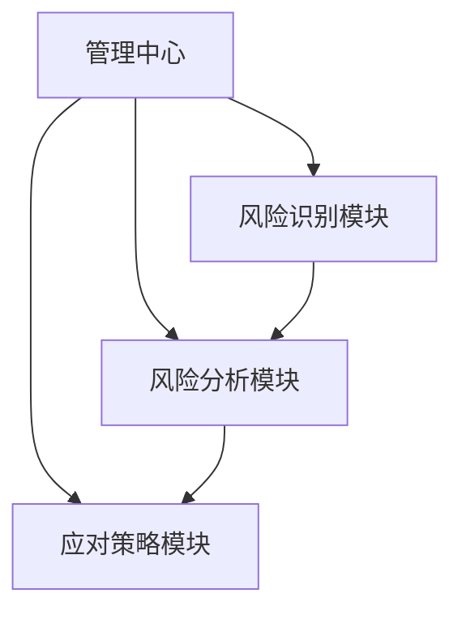
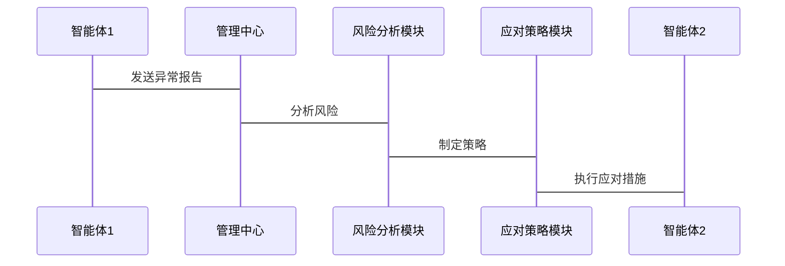

                 


# 多智能体系统在公司网络安全风险评估中的应用

> **关键词**：多智能体系统，网络安全，风险评估，系统架构，人工智能，分布式计算

> **摘要**：随着网络安全威胁的日益复杂化和多样化，传统的单点防御策略已难以应对现代网络安全挑战。多智能体系统（Multi-Agent System，MAS）作为一种分布式、协作式的智能系统，为网络安全风险评估提供了新的解决方案。本文将详细探讨多智能体系统在公司网络安全风险评估中的应用，包括其基本原理、系统架构、实际应用案例以及未来发展趋势。

---

## 第1章: 多智能体系统与网络安全风险评估概述

### 1.1 多智能体系统的基本概念

#### 1.1.1 多智能体系统的定义
多智能体系统（Multi-Agent System，MAS）是由多个相互作用的智能体组成的分布式系统。每个智能体都是一个具有感知、推理、决策和行动能力的独立实体。这些智能体通过通信和协作，共同完成复杂任务。

#### 1.1.2 多智能体系统的特征
- **分布式性**：智能体分布在不同的物理或逻辑位置，独立运行。
- **协作性**：智能体之间通过通信和协作完成共同目标。
- **自主性**：每个智能体都能自主决策，无需中央控制。
- **反应性**：智能体能实时感知环境变化并做出响应。

#### 1.1.3 多智能体系统与传统单智能体系统的区别
| 特性                | 多智能体系统（MAS）          | 单智能体系统（SAS）          |
|---------------------|-----------------------------|-----------------------------|
| 结构                | 分布式、协作式              | 集中式、单点控制            |
| 智能体数量          | 多个                        | 单个                        |
| 任务分配            | 智能体之间动态分配任务      | 中央系统统一分配任务        |
| 故障容错性          | 高，部分故障不影响整体任务  | 低，单点故障可能导致任务失败|

### 1.2 网络安全风险评估的定义与重要性

#### 1.2.1 网络安全风险的定义
网络安全风险是指由于人为或技术原因导致的信息系统安全漏洞，可能造成信息泄露、数据损坏或服务中断的可能性。

#### 1.2.2 网络安全风险评估的目的与意义
- **目的**：识别、分析和应对潜在的安全威胁，降低安全风险。
- **意义**：保护公司资产，确保业务连续性，符合法规要求。

#### 1.2.3 网络安全风险评估的常用方法
- **定性评估**：基于经验和主观判断进行风险分析。
- **定量评估**：通过数据和模型计算风险的概率和影响程度。
- **混合评估**：结合定性和定量方法。

### 1.3 多智能体系统在网络安全风险评估中的应用背景

#### 1.3.1 网络安全威胁的复杂性与多样性
现代网络安全威胁呈现出多样化的特征，包括病毒、勒索软件、DDoS攻击等。单点防御难以应对复杂的威胁。

#### 1.3.2 多智能体系统在网络安全中的优势
- **分布式感知**：多个智能体实时监控网络的不同部分，提供全面的威胁感知。
- **协作防御**：智能体之间协作，快速响应和应对威胁。
- **自主学习**：智能体能自主学习和适应新的威胁。

#### 1.3.3 当前网络安全风险评估的挑战
- **数据量大**：网络日志和流量数据庞大，难以处理。
- **威胁动态变化**：新的威胁不断出现，需要快速响应。
- **资源分配**：如何高效分配资源以应对多个威胁。

## 第2章: 多智能体系统的原理

### 2.1 多智能体系统的结构与通信机制

#### 2.1.1 智能体的结构与功能
- **感知层**：通过传感器或数据源获取环境信息。
- **推理层**：分析信息，做出决策。
- **行动层**：执行决策，影响环境。

#### 2.1.2 智能体之间的通信方式
- **直接通信**：智能体之间直接交换信息。
- **间接通信**：通过中介（如消息队列）进行通信。

#### 2.1.3 通信协议的选择与实现
- **HTTP/HTTPS**：适用于Web服务之间的通信。
- **WebSocket**：适用于实时通信。
- **AMQP**：适用于消息队列。

### 2.2 多智能体系统的建模与仿真

#### 2.2.1 多智能体系统建模的基本方法
- **面向对象方法**：将智能体视为对象，定义属性和方法。
- **行为建模**：描述智能体的行为逻辑。

#### 2.2.2 多智能体系统的仿真工具与平台
- **NetLogo**：广泛用于多智能体仿真。
- **Repast**：用于复杂系统建模。
- **Unity**：用于3D仿真。

#### 2.2.3 建模与仿真的实际案例
例如，使用NetLogo模拟多个智能体在网络安全中的行为，分析它们如何协作应对攻击。

### 2.3 多智能体系统的算法与实现

#### 2.3.1 分布式算法在多智能体系统中的应用
- **分布式一致性算法**：如Paxos、Raft，用于确保智能体之间数据一致性。
- **分布式搜索算法**：如Dijkstra，用于最短路径计算。

#### 2.3.2 协作与竞争算法的设计
- **协作算法**：智能体之间协作完成任务。
- **竞争算法**：智能体之间竞争资源。

#### 2.3.3 多智能体系统的实现框架
- **JADE**：基于Java的多智能体框架。
- **OpenAgent**：开源的多智能体框架。

## 第3章: 多智能体系统在网络安全风险评估中的应用

### 3.1 多智能体系统在风险识别中的应用

#### 3.1.1 基于多智能体系统的风险识别模型
- **模型结构**：智能体负责监控网络的不同部分，发现异常行为。
- **数据融合**：多个智能体的数据融合，提高识别精度。

#### 3.1.2 风险识别的实现步骤
1. 数据采集：从网络日志、流量中获取数据。
2. 数据分析：使用算法识别异常模式。
3. 异常报告：智能体将异常报告给管理中心。

#### 3.1.3 实际案例分析
例如，使用多智能体系统检测DDoS攻击。每个智能体负责监控网络流量，发现异常流量后，多个智能体协作，确定攻击源并发出警报。

### 3.2 多智能体系统在风险分析中的应用

#### 3.2.1 基于多智能体系统的风险分析框架
- **威胁分析**：分析威胁的可能性和影响程度。
- **漏洞评估**：评估系统漏洞的严重性。
- **风险评分**：综合威胁和漏洞，计算风险评分。

#### 3.2.2 风险分析的数学模型
使用概率论和统计学方法进行风险评估。例如，风险评分公式为：
$$
R = \sum_{i=1}^{n} (T_i \times V_i)
$$
其中，\( T_i \) 是威胁 \( i \) 的可能性，\( V_i \) 是漏洞 \( i \) 的严重性，\( R \) 是总风险评分。

#### 3.2.3 案例分析与结果解读
例如，分析一个公司网络的漏洞和威胁，使用多智能体系统计算风险评分，指导安全策略的制定。

### 3.3 多智能体系统在风险应对中的应用

#### 3.3.1 基于多智能体系统的风险应对策略
- **主动防御**：智能体实时监控并主动拦截威胁。
- **动态调整**：根据威胁变化，动态调整防御策略。

#### 3.3.2 应对策略的动态调整机制
- **反馈机制**：智能体根据应对效果调整策略。
- **自适应学习**：智能体学习新的威胁，优化应对策略。

#### 3.3.3 实际案例分析
例如，智能体检测到一个潜在的勒索软件攻击，立即启动应急响应，隔离受感染的设备，防止攻击扩散。

## 第4章: 系统架构与设计

### 4.1 系统功能模块划分

#### 4.1.1 风险识别模块
- 功能：实时监控网络流量，识别异常行为。
- 输入：网络日志、流量数据。
- 输出：异常报告。

#### 4.1.2 风险分析模块
- 功能：分析异常行为，评估风险。
- 输入：异常报告。
- 输出：风险评分、应对策略。

#### 4.1.3 应对策略模块
- 功能：制定和执行应对策略。
- 输入：风险评分。
- 输出：应急响应计划。

### 4.2 系统架构设计

#### 4.2.1 系统架构图（使用Mermaid）


#### 4.2.2 系统交互图（使用Mermaid）


### 4.3 系统接口设计

#### 4.3.1 接口定义
- **数据接口**：智能体之间通过API交换数据。
- **控制接口**：管理中心控制智能体的行为。

#### 4.3.2 接口实现
- 使用RESTful API进行数据通信。
- 使用WebSocket进行实时通信。

## 第5章: 项目实战

### 5.1 环境安装

#### 5.1.1 系统需求
- 操作系统：Linux/Windows
- 开发工具：JDK、Eclipse（适用于JADE框架）
- 数据库：MySQL
- 网络设备：路由器、交换机

#### 5.1.2 安装步骤
1. 安装JDK并配置环境变量。
2. 下载并安装JADE框架。
3. 配置数据库连接。
4. 配置网络接口。

### 5.2 系统核心实现源代码

#### 5.2.1 风险识别模块代码
```java
public class RiskIdentificationAgent extends Agent {
    @Override
    protected void setup() {
        addBehaviour(new RiskIdentificationBehaviour());
    }
}

class RiskIdentificationBehaviour extends Behaviour {
    public void action() {
        // 获取网络流量数据
        String[] trafficData = receiveTrafficData();
        // 分析数据，识别异常
        List<AnomalyReport> anomalies = analyzeTraffic(trafficData);
        // 发送异常报告
        sendAnomalyReports(anomalies);
    }
}
```

#### 5.2.2 风险分析模块代码
```java
public class RiskAnalysisAgent extends Agent {
    @Override
    protected void setup() {
        addBehaviour(new RiskAnalysisBehaviour());
    }
}

class RiskAnalysisBehaviour extends Behaviour {
    public void action() {
        // 收到异常报告
        List<AnomalyReport> anomalies = receiveReports();
        // 计算风险评分
        double riskScore = calculateRiskScore(anomalies);
        // 发送风险评分
        sendRiskScore(riskScore);
    }
}
```

### 5.3 案例分析与结果解读

#### 5.3.1 案例背景
某公司网络遭受DDoS攻击，多智能体系统用于检测和应对。

#### 5.3.2 实施步骤
1. 风险识别模块发现异常流量。
2. 风险分析模块计算风险评分，确定攻击严重性。
3. 应对策略模块启动应急响应，隔离攻击源。

#### 5.3.3 实施结果
成功检测并阻止DDoS攻击，保障了网络的稳定性。

## 第6章: 最佳实践与小结

### 6.1 最佳实践

#### 6.1.1 系统设计
- 确保智能体之间的通信可靠。
- 定期更新智能体的行为规则。

#### 6.1.2 系统维护
- 定期备份数据。
- 更新病毒库和安全规则。

#### 6.1.3 团队协作
- 保持开发、运维和安全团队的紧密合作。

### 6.2 小结

通过本文的详细讲解，我们了解了多智能体系统在网络安全风险评估中的应用。从基本原理到系统架构，再到实际案例，我们展示了如何利用多智能体系统提高网络安全防护能力。未来，随着人工智能和分布式技术的发展，多智能体系统将在网络安全领域发挥更大的作用。

---

**作者：AI天才研究院 & 禅与计算机程序设计艺术**

