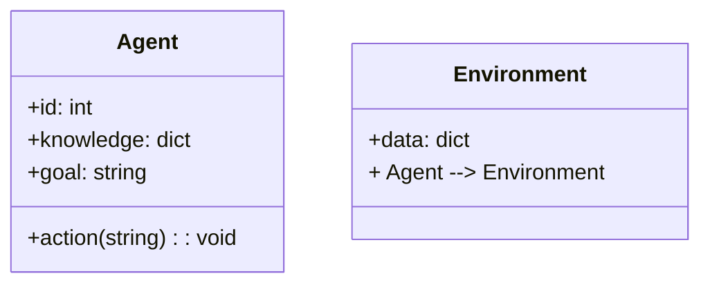
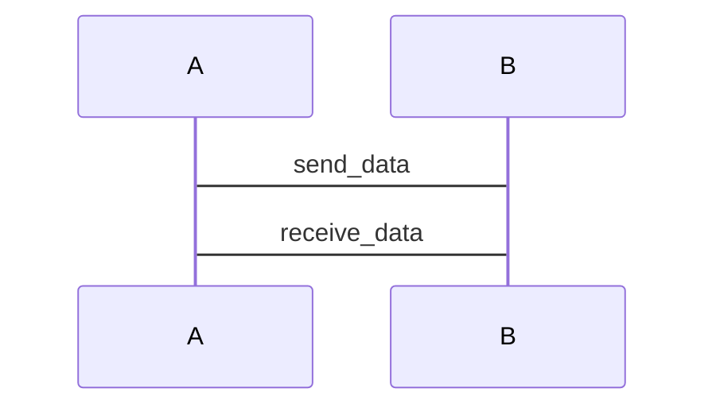

                 


# 多智能体系统在公司财务建模中的应用：提高预测准确性

> **关键词**：多智能体系统, 财务建模, 预测准确性, 人工智能, 系统架构, 数据分析

> **摘要**：本文探讨了多智能体系统在公司财务建模中的应用，通过分析其核心概念、算法原理和系统架构，展示了如何利用多智能体系统提高财务预测的准确性。文章结合实际案例，详细讲解了系统设计与实现过程，并提出了优化建议。

---

## 第一部分: 多智能体系统与财务建模基础

### 第1章: 多智能体系统与财务建模概述

#### 1.1 多智能体系统的定义与特点
##### 1.1.1 多智能体系统的定义
多智能体系统（Multi-Agent System, MAS）由多个智能体（Agent）组成，每个智能体能够感知环境、自主决策并与其他智能体协作完成任务。

##### 1.1.2 多智能体系统的核心特点
- **自主性**：每个智能体独立运作。
- **反应性**：实时感知环境变化。
- **协作性**：通过通信与协作完成共同目标。
- **分布式**：计算和决策分布在多个智能体之间。

##### 1.1.3 多智能体系统与传统单智能体模型的区别
| 特性         | 单智能体模型       | 多智能体模型       |
|--------------|--------------------|--------------------|
| 结构         | 集中式            | 分布式            |
| 决策方式     | 单点决策          | 分散决策          |
| 可扩展性     | 较低              | 较高              |

#### 1.2 财务建模的基本概念
##### 1.2.1 财务建模的定义
财务建模是通过数学模型模拟企业财务状况，用于预测和决策支持。

##### 1.2.2 财务建模的主要方法
- **时间序列分析**
- **回归分析**
- **决策树**
- **神经网络**

##### 1.2.3 财务建模在企业中的作用
- **预测未来收益**
- **优化资源配置**
- **风险评估**

#### 1.3 多智能体系统在财务建模中的应用背景
##### 1.3.1 传统财务建模的局限性
- **数据量有限**
- **计算效率低**
- **难以处理复杂交互**

##### 1.3.2 多智能体系统的优势
- **分布式计算**：提高处理效率
- **协同学习**：提升模型准确性
- **动态适应**：适应市场变化

##### 1.3.3 企业财务预测的挑战与机遇
- **挑战**：数据复杂性、模型实时性
- **机遇**：技术进步、数据驱动决策

#### 1.4 本章小结
本章介绍了多智能体系统的基本概念和特点，分析了传统财务建模的局限性，并探讨了多智能体系统在财务建模中的应用背景和优势。

---

## 第二部分: 多智能体系统的核心概念与联系

### 第2章: 多智能体系统的核心原理

#### 2.1 多智能体系统的组成与结构
##### 2.1.1 智能体的定义与属性
- **智能体**：能够感知环境、自主决策的实体
- **属性**：目标、知识、能力

##### 2.1.2 多智能体系统的层次结构
- **个体层**：单个智能体的行为
- **群体层**：多个智能体的协作
- **系统层**：整体系统的运行与管理

##### 2.1.3 智能体之间的通信与协作
- **通信机制**：通过消息传递
- **协作机制**：任务分配与协同决策

#### 2.2 财务建模中的多智能体系统架构
##### 2.2.1 数据流与信息传递
- **数据输入**：历史财务数据、市场数据
- **信息传递**：智能体间共享数据

##### 2.2.2 智能体的分工与协同
- **分工**：数据预处理、模型训练、预测
- **协同**：实时更新模型参数

##### 2.2.3 系统的动态性与适应性
- **动态调整**：根据市场变化更新模型
- **自适应性**：智能体自主学习和优化

### 第3章: 多智能体系统与财务建模的核心概念对比

#### 3.1 多智能体系统与传统财务建模的对比
##### 3.1.1 方法论对比
- **传统方法**：单一模型，集中计算
- **多智能体方法**：分布式模型，协同计算

##### 3.1.2 数据处理方式对比
- **传统方法**：集中处理，数据量有限
- **多智能体方法**：分布式处理，数据量大

##### 3.1.3 结果准确性对比
- **传统方法**：结果可能片面
- **多智能体方法**：结果更全面

#### 3.2 多智能体系统的优势分析
##### 3.2.1 高度并行性
- **优势**：多个智能体同时处理数据，提高计算效率

##### 3.2.2 自适应性
- **优势**：智能体能够实时调整模型参数，适应市场变化

##### 3.2.3 可扩展性
- **优势**：系统易于扩展，支持更多智能体和更大数据量

---

## 第三部分: 算法原理与系统设计

### 第4章: 算法原理讲解

#### 4.1 协同过滤算法
##### 4.1.1 算法原理
协同过滤是一种推荐系统常用算法，通过分析用户行为相似性，推荐相关内容。

##### 4.1.2 实现步骤
1. 数据预处理：去除缺失值
2. 计算相似度：使用余弦相似度
3. 生成推荐：基于相似度排序

##### 4.1.3 代码实现
```python
def collaborative_filtering(train_data, test_data):
    # 计算用户相似度
    user_similarity = calculate_similarity(train_data)
    # 生成推荐
    recommendations = []
    for user in test_data:
        similar_users = find_similar_users(user, user_similarity)
        recommendations.append(predict(user, similar_users))
    return recommendations
```

##### 4.1.4 应用场景
- **应用场景**：用户行为分析、推荐系统

#### 4.2 集成学习算法
##### 4.2.1 算法原理
集成学习通过组合多个弱学习器，提升整体性能。

##### 4.2.2 实现步骤
1. 生成基模型：如决策树、线性回归
2. 组合预测：投票法或加权法

##### 4.2.3 代码实现
```python
from sklearn.ensemble import VotingClassifier

# 基模型
model1 = DecisionTreeClassifier()
model2 = LogisticRegression()

# 集成模型
ensemble_model = VotingClassifier(estimators=[('dt', model1), ('lr', model2)])
ensemble_model.fit(X_train, y_train)
```

##### 4.2.4 应用场景
- **应用场景**：分类、回归问题

### 第5章: 系统分析与架构设计

#### 5.1 系统功能设计
##### 5.1.1 领域模型


##### 5.1.2 系统架构


#### 5.2 接口与交互设计
##### 5.2.1 接口设计
- **API**：提供REST接口，供智能体调用

##### 5.2.2 交互流程


---

## 第四部分: 项目实战与优化

### 第6章: 项目实战

#### 6.1 环境安装
- **工具**：Python、Jupyter Notebook
- **库**：NumPy、Pandas、Scikit-learn

#### 6.2 核心代码实现
##### 6.2.1 数据预处理
```python
import pandas as pd
data = pd.read_csv('financial_data.csv')
data = data.dropna()
```

##### 6.2.2 模型训练
```python
from sklearn.model_selection import train_test_split
X_train, X_test, y_train, y_test = train_test_split(data.drop('target', axis=1), data['target'])
```

##### 6.2.3 模型预测
```python
from sklearn.ensemble import RandomForestRegressor
model = RandomForestRegressor()
model.fit(X_train, y_train)
predictions = model.predict(X_test)
```

#### 6.3 实际案例分析
##### 6.3.1 案例背景
某公司财务数据，预测下一季度的收益。

##### 6.3.2 数据分析
使用多智能体系统，分别处理不同数据源，协同预测。

##### 6.3.3 结果解读
预测结果与实际值对比，评估模型准确性。

### 第7章: 最佳实践与优化

#### 7.1 小结
本文详细讲解了多智能体系统在财务建模中的应用，通过实际案例展示了系统设计与实现过程。

#### 7.2 注意事项
- **数据质量**：确保数据准确
- **模型调优**：定期优化模型参数
- **系统维护**：及时更新模型

#### 7.3 拓展阅读
- **推荐书籍**：《Multi-Agent Systems》
- **在线资源**：相关论文和博客

---

## 作者信息

作者：AI天才研究院/AI Genius Institute & 禅与计算机程序设计艺术 /Zen And The Art of Computer Programming

---

以上内容为文章的详细目录和部分章节内容，后续将根据此大纲继续完成各章节的详细编写，确保内容完整且符合逻辑。

