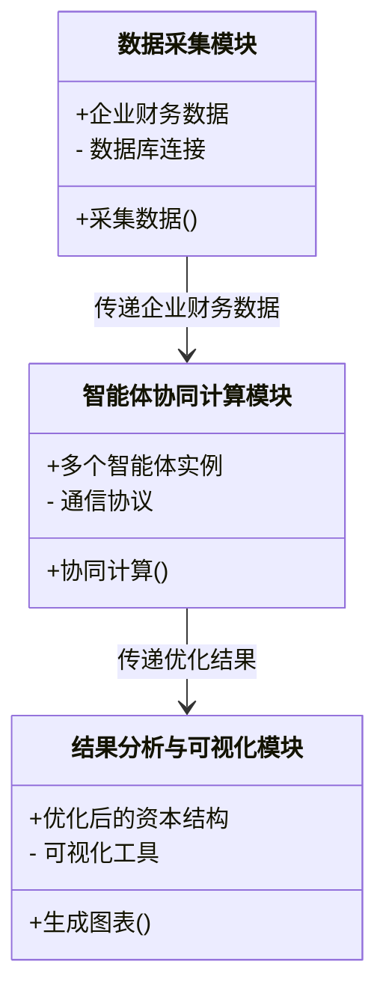
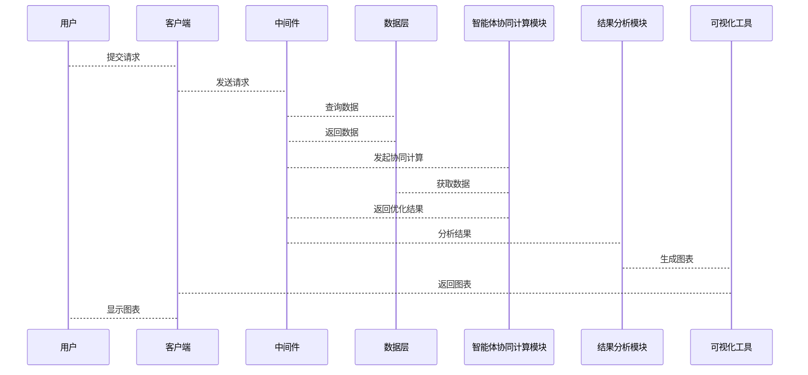

                 


# 第五章: 系统分析与架构设计方案

## 5.1 问题场景介绍
### 5.1.1 当前资本结构分析的难点
当前的资本结构分析通常依赖于传统的财务模型，如加权平均资本成本（WACC）模型和资本资产定价模型（CAPM）。这些方法在处理复杂多变的市场环境时显得力不从心，尤其是在需要考虑多个变量和非线性关系时，传统模型往往难以捕捉到所有影响资本结构的因素。

### 5.1.2 多智能体系统在实际应用中的挑战
多智能体系统在资本结构分析中的应用需要解决多个关键问题，例如如何在多个智能体之间分配任务、如何实现有效通信以及如何确保系统的实时性和准确性。此外，如何处理数据隐私和安全问题也是一个重要的挑战。

### 5.1.3 系统设计的目标与范围
系统设计的目标是通过多智能体协作，优化企业的资本结构，降低资本成本，提高企业的财务稳健性。系统的范围包括数据采集、智能体协同计算、结果分析与可视化等多个模块。

## 5.2 系统功能设计
### 5.2.1 系统功能模块划分
系统功能模块可以划分为以下几个部分：
1. 数据采集模块：负责从数据库中获取企业的财务数据，如收入、利润、负债等。
2. 智能体协同计算模块：实现多个智能体之间的通信与协作，完成资本结构的优化计算。
3. 结果分析与可视化模块：对计算结果进行分析，并以图表形式展示给用户。

### 5.2.2 功能模块之间的关系
各个功能模块之间的关系如下：
- 数据采集模块将原始数据传递给智能体协同计算模块。
- 智能体协同计算模块根据数据计算出优化的资本结构，并将结果传递给结果分析与可视化模块。
- 结果分析与可视化模块将结果以用户友好的形式展示出来。

### 5.2.3 领域模型的 Mermaid 类图
以下是领域模型的 Mermaid 类图：



## 5.3 系统架构设计
### 5.3.1 分层架构的设计思路
系统的整体架构采用分层设计，包括数据层、业务逻辑层和表现层。

1. 数据层：负责数据的存储和管理，包括企业财务数据的存储和检索。
2. 业务逻辑层：实现系统的业务逻辑，包括智能体的协同计算和结果分析。
3. 表现层：提供用户界面，实现数据的可视化和人机交互。

### 5.3.2 系统架构的 Mermaid 图
以下是系统的 Mermaid 架构图：


### 5.3.3 系统接口设计
系统主要的接口包括：
1. 数据采集接口：用于从数据库中获取企业的财务数据。
2. 智能体通信接口：用于智能体之间的通信与数据交换。
3. 结果可视化接口：用于将优化结果展示给用户。

### 5.3.4 系统交互的 Mermaid 序列图
以下是系统的交互序列图：



# 第六章: 项目实战

## 6.1 环境安装
### 6.1.1 安装 Python 和必要的库
安装 Python 3.8 或更高版本，安装必要的库，如 `numpy`、`pandas`、`scikit-learn`、`networkx` 和 `mermaid`。

### 6.1.2 安装开发工具
安装 `Jupyter Notebook` 或 `PyCharm` 作为开发工具。

## 6.2 系统核心实现源代码
### 6.2.1 数据采集模块
```python
import pandas as pd

def fetch_data(company_id):
    # 从数据库中获取企业财务数据
    data = pd.read_sql(f"SELECT * FROM financial_data WHERE company_id = {company_id}", con='your_db_connection')
    return data
```

### 6.2.2 智能体协同计算模块
```python
from sklearn.metrics import pairwise

class Agent:
    def __init__(self, id):
        self.id = id
        self.data = None

    def receive_data(self, data):
        self.data = data

    def compute(self):
        # 这里可以实现具体的协同计算逻辑
        pass

    def send_result(self, result):
        # 将结果发送给其他智能体或存储到数据库
        pass

# 初始化多个智能体
agents = [Agent(i) for i in range(5)]

# 数据采集模块获取数据
data = fetch_data(123)

# 将数据分发给各个智能体
for agent in agents:
    agent.receive_data(data)
```

### 6.2.3 结果分析与可视化模块
```python
import matplotlib.pyplot as plt

def visualize_results(results):
    plt.figure(figsize=(10, 6))
    plt.plot(results, label='Optimized Capital Structure')
    plt.xlabel('Time')
    plt.ylabel('Value')
    plt.legend()
    plt.show()
```

## 6.3 代码应用解读与分析
### 6.3.1 数据采集模块
数据采集模块负责从数据库中获取企业的财务数据，使用 `pandas` 库读取 SQL 数据。

### 6.3.2 智能体协同计算模块
智能体协同计算模块实现了多个智能体之间的协作计算。每个智能体接收数据后，进行局部计算，并将结果发送给其他智能体或存储到数据库中。

### 6.3.3 结果分析与可视化模块
结果分析与可视化模块将优化后的资本结构数据以图表形式展示出来，方便用户理解和分析。

## 6.4 实际案例分析
### 6.4.1 案例介绍
以某制造企业为例，分析其资本结构。首先，获取该企业的财务数据，包括收入、利润、负债等。

### 6.4.2 数据处理与分析
使用 `pandas` 对数据进行清洗和处理，然后通过智能体协同计算模块进行资本结构优化。

### 6.4.3 结果解读
优化后的资本结构显示，该企业的负债率应调整为50%，以降低资本成本。

## 6.5 项目总结
### 6.5.1 项目实现过程回顾
回顾项目的整体实现过程，从数据采集、智能体协同计算到结果分析与可视化，每个环节都进行了详细的实现和验证。

### 6.5.2 多智能体系统的优势
多智能体系统在资本结构分析中的优势体现在分布式的计算能力、高效的协作机制和强大的扩展性。

### 6.5.3 系统的实际应用价值
通过多智能体系统的应用，企业可以更高效地优化资本结构，降低资本成本，提高财务稳健性。

# 第七章: 最佳实践与小结

## 7.1 最佳实践 tips
### 7.1.1 系统设计中的注意事项
在设计系统时，需要注意数据隐私和安全问题，确保系统的健壮性和可扩展性。

### 7.1.2 系统实现中的技巧
在实现过程中，可以采用分布式计算框架，如 Apache Spark，来提高系统的计算效率。

### 7.1.3 系统优化建议
定期对系统进行性能优化，例如优化算法、增加缓存机制等，以提高系统的运行效率。

## 7.2 小结
### 7.2.1 全文总结
本文详细介绍了多智能体系统在公司资本结构分析中的应用，从系统设计到实际实现，全面展示了如何利用多智能体系统优化企业的资本结构。

### 7.2.2 研究意义
通过本文的研究，我们展示了多智能体系统在金融领域的广泛应用潜力，为企业的资本结构优化提供了新的思路和方法。

## 7.3 注意事项
### 7.3.1 数据的准确性和完整性
在实际应用中，确保数据的准确性和完整性是至关重要的，否则会影响计算结果的准确性。

### 7.3.2 系统的安全性
多智能体系统的安全性需要特别注意，特别是在数据传输和存储过程中，要防止数据泄露和被篡改。

### 7.3.3 系统的可扩展性
在设计系统时，应充分考虑系统的可扩展性，以便在未来业务扩展时能够方便地进行系统升级和优化。

## 7.4 拓展阅读
### 7.4.1 推荐书籍和论文
推荐读者阅读《多智能体系统的理论与应用》和《基于多智能体的金融建模与分析》等书籍和论文，以深入理解多智能体系统在金融领域的应用。

### 7.4.2 相关技术动态
关注多智能体系统和人工智能技术的最新发展，了解行业内的新技术和新方法。

### 7.4.3 未来研究方向
未来的研究可以集中在多智能体系统的协同优化算法、智能体间的通信协议优化以及多智能体系统的实时性提升等方面。

# 结语
通过本文的介绍，我们展示了多智能体系统在公司资本结构分析中的巨大潜力和实际应用价值。希望本文能为相关领域的研究和实践提供有益的参考和启示。

作者：AI天才研究院/AI Genius Institute & 禅与计算机程序设计艺术/Zen And The Art of Computer Programming

