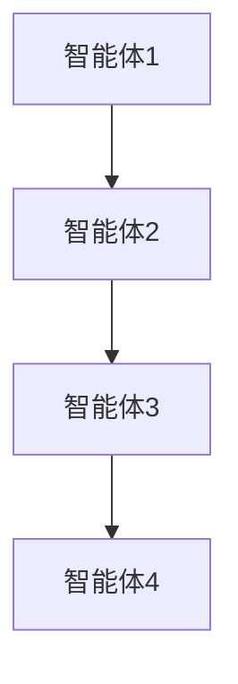
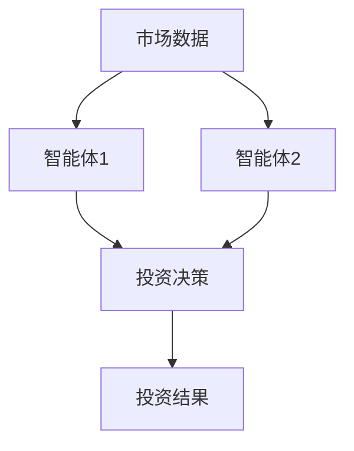
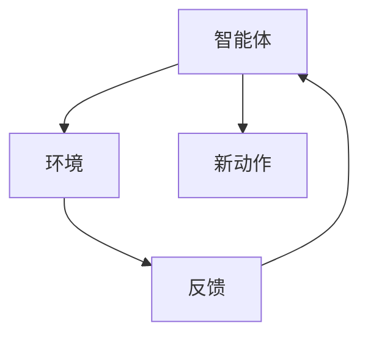
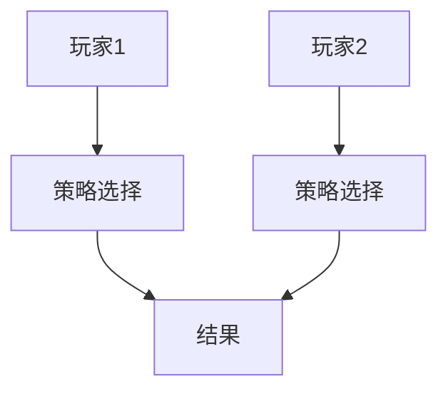
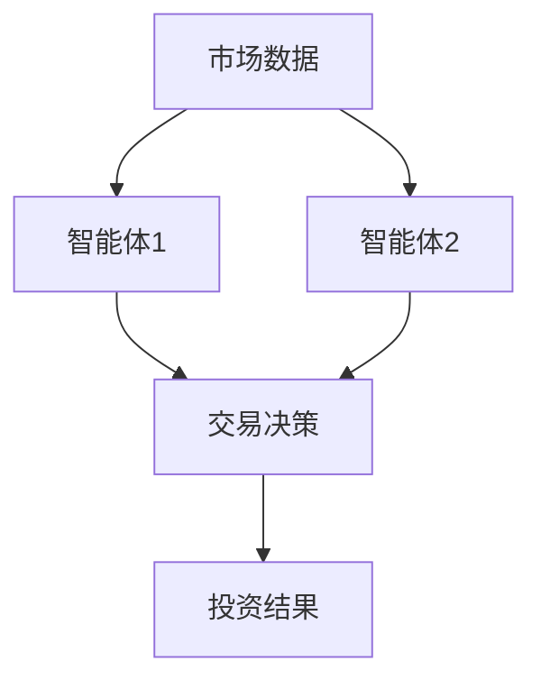
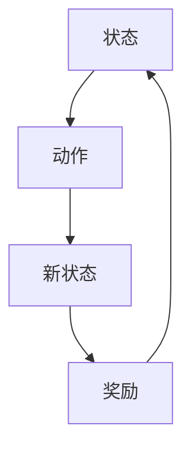
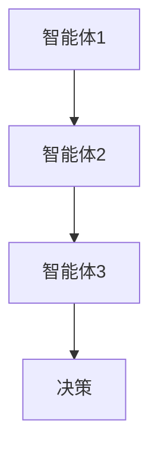
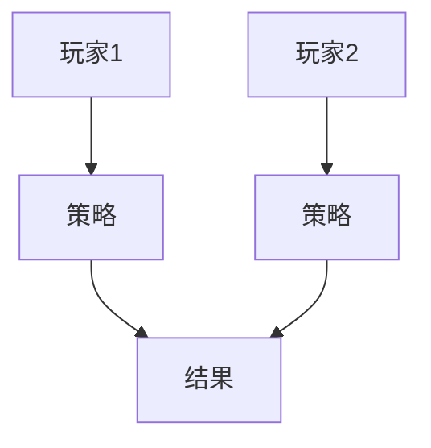
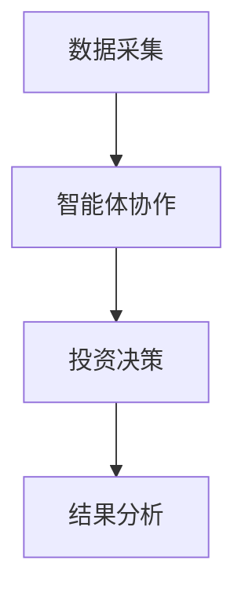

                 

# 多智能体系统在周期性行业投资中的应用

> **关键词**：多智能体系统、周期性行业投资、人工智能、分布式决策、协作投资  
> **摘要**：本文探讨了多智能体系统（MAS）在周期性行业投资中的应用。通过分析周期性行业的特点，结合MAS的核心理论与算法，展示了如何利用MAS进行投资决策优化。文章详细讲解了MAS的理论基础、系统架构设计、实际案例分析等内容，为投资者提供了新的思路。

---

## 第一章: 多智能体系统与周期性行业投资的背景与概念

### 1.1 多智能体系统的定义与特点
多智能体系统（Multi-Agent System, MAS）是由多个智能体组成的分布式系统，每个智能体具有一定的自主性、反应性和协作性。其特点包括：
- **自主性**：每个智能体独立决策。
- **反应性**：能够感知环境并实时调整行为。
- **协作性**：通过通信与协调完成共同目标。
- **分布式性**：智能体之间不存在集中控制。

**图1-1: 多智能体系统结构示意图**

### 1.2 周期性行业的特点与投资挑战
周期性行业受经济波动影响较大，如能源、材料和工业制造。其特点包括：
- **需求波动性**：需求随经济周期变化。
- **价格波动性**：市场价格波动剧烈。
- **周期性波动**：行业周期性明显。

投资挑战包括：
- **高风险**：周期性波动导致投资风险高。
- **复杂决策**：需要综合考虑多种因素。

### 1.3 多智能体系统在投资中的应用前景
MAS在投资中的优势：
- **分布式决策**：多个智能体协同优化投资组合。
- **实时反馈**：快速响应市场变化。
- **协作与竞争**：模拟市场参与者行为，提升决策精度。

**图1-2: 多智能体系统在投资中的应用**

---

## 第二章: 多智能体系统的理论基础

### 2.1 多智能体系统的理论基础
MAS的理论基础包括：
- **分布式计算**：系统由多个智能体组成，无集中控制。
- **协作机制**：通过通信和协商完成任务。
- **博弈论**：分析智能体之间的互动与竞争。

### 2.2 强化学习与分布式决策
强化学习（Reinforcement Learning）是MAS的重要组成部分。智能体通过与环境互动，学习最优策略。

**图2-1: 强化学习流程图**

### 2.3 博弈论与多智能体协作
博弈论用于分析智能体之间的互动。通过纳什均衡（Nash Equilibrium）找到最优策略。

**图2-2: 博弈论模型**

### 2.4 多智能体系统的数学模型
MAS的数学模型通常涉及状态、动作和奖励。公式表示为：
$$ R = \sum_{i=1}^{n} r_i $$
其中，$r_i$ 是第i个智能体的奖励。

---

## 第三章: 周期性行业的特点与投资策略

### 3.1 周期性行业的波动性分析
周期性行业的波动性主要受经济周期影响。例如，工业周期模型（Kuznets周期）描述了经济波动对投资的影响。

### 3.2 周期性行业的投资策略
常见的投资策略包括：
- **均值回归策略**：在波动中寻找均值回归点。
- **周期性套利策略**：利用价格波动进行套利。

### 3.3 多智能体系统在周期性投资中的优势
MAS可以实时分析市场数据，优化投资组合。例如，使用强化学习模型进行实时交易决策。

**图3-1: 多智能体系统投资流程**

---

## 第四章: 多智能体系统的算法实现

### 4.1 强化学习算法
强化学习是MAS的核心算法。常用算法包括Q-learning和Deep Q-Network（DQN）。

**图4-1: Q-learning流程图**

### 4.2 分布式决策算法
分布式决策算法包括分布式Q-learning和分布式多智能体强化学习（DMARL）。

**图4-2: 分布式决策流程图**

### 4.3 博弈论模型
博弈论模型用于分析智能体之间的互动。例如，纳什均衡模型用于预测市场均衡点。

**图4-3: 博弈论模型**

---

## 第五章: 系统架构设计

### 5.1 系统需求分析
系统需要实时处理市场数据，支持多智能体协作和决策。

### 5.2 功能设计
系统功能包括数据采集、智能体协作、投资决策和结果分析。

**图5-1: 系统功能模块**

### 5.3 架构选型
采用微服务架构，支持高可用性和扩展性。

### 5.4 接口设计
系统接口包括数据接口、智能体接口和用户接口。

### 5.5 安全性考虑
确保数据安全和系统稳定性。

---

## 第六章: 项目实战

### 6.1 环境搭建
需要安装Python、TensorFlow和OpenAI库。

### 6.2 数据采集与处理
从金融市场API获取数据，进行清洗和预处理。

### 6.3 特征工程
提取关键特征，如价格、成交量和市场情绪。

### 6.4 模型训练
使用强化学习模型进行训练，调整超参数。

### 6.5 模型部署
将模型部署到云平台，实时处理市场数据。

### 6.6 案例分析
以能源行业为例，展示模型在实际投资中的表现。

---

## 第七章: 案例分析与总结

### 7.1 案例分析
以能源行业为例，分析MAS在投资中的应用效果。

### 7.2 总结
MAS在周期性行业投资中具有显著优势，但需要克服数据依赖性和计算复杂性。

### 7.3 展望
未来，MAS将在投资领域发挥更大作用，特别是在实时决策和风险控制方面。

---

## 作者：AI天才研究院 & 禅与计算机程序设计艺术

---

通过本文的详细讲解，我们可以看到，多智能体系统在周期性行业投资中的应用潜力巨大。通过MAS，投资者可以更好地应对市场波动，优化投资策略，实现更高的收益。希望本文能为读者提供新的思路和启示。

