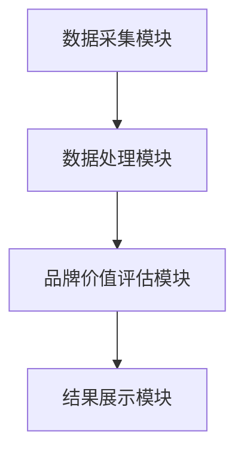

                 


# 《多智能体系统在品牌价值动态评估中的应用》

---

## 关键词：
多智能体系统（MAS）、品牌价值、动态评估、协作机制、实时计算、分布式计算

---

## 摘要：
随着全球市场竞争的加剧，品牌价值的动态评估成为企业决策的重要依据。传统的品牌价值评估方法往往依赖于静态数据和单一视角，难以应对市场环境的快速变化。多智能体系统（MAS）作为一种新兴的分布式人工智能技术，能够通过多个智能体的协作实现对品牌价值的实时、动态评估。本文系统性地探讨了多智能体系统在品牌价值动态评估中的应用，从理论基础、系统设计到实际案例，全面分析了其优势、挑战及解决方案。通过本研究，我们展示了如何利用MAS技术构建高效、智能的品牌价值评估系统，为企业决策提供更精准的支持。

---

## 第1章: 多智能体系统概述

### 1.1 多智能体系统的定义与特点

#### 1.1.1 多智能体系统的定义
多智能体系统（Multi-Agent System, MAS）是由多个智能体（Agent）组成的分布式系统，这些智能体通过协作完成复杂的任务。智能体是指能够感知环境、自主决策并采取行动的实体，可以是软件程序、机器人或其他智能设备。

#### 1.1.2 多智能体系统的分类与特点
多智能体系统可以根据智能体的结构、协作方式和环境类型进行分类：
- **结构化MAS**：适用于任务明确、环境静态的场景，如物流管理。
- **非结构化MAS**：适用于任务模糊、环境动态的场景，如金融市场。
- **混合MAS**：结合结构化和非结构化的特点，适用于复杂场景。

多智能体系统的四大特点：
1. **分布性**：智能体独立运行，不依赖中心节点。
2. **协作性**：智能体通过通信协作完成共同目标。
3. **动态性**：系统能够适应环境变化。
4. **自适应性**：智能体能够学习和优化行为。

#### 1.1.3 多智能体系统与传统单智能体系统的区别
| 特性 | 单智能体系统 | 多智能体系统 |
|------|--------------|--------------|
| 冗余性 | 无 | 有 |
| 协作性 | 单一 | 分布协作 |
| 实时性 | 有限 | 更强 |
| 灵活性 | 低 | 高 |

### 1.2 多智能体系统的协作机制

#### 1.2.1 智能体之间的通信与协作
智能体之间的通信是MAS的核心机制，主要通过以下方式进行：
1. **直接通信**：智能体之间通过消息传递直接协作。
2. **间接通信**：通过共享数据库或中间件进行协作。
3. **基于协议的通信**：遵循特定协议进行通信和协作。

#### 1.2.2 多智能体系统的任务分配与协调
任务分配是MAS中的关键问题，常用算法包括：
1. **贪心算法**：根据资源和能力分配任务。
2. **分布式协商算法**：智能体通过协商达成任务分配。
3. **遗传算法**：基于优化目标分配任务。

#### 1.2.3 多智能体系统的冲突解决机制
冲突是MAS中常见的问题，解决方法包括：
1. **协商解决**：通过协商达成一致。
2. **优先级规则**：根据任务优先级解决冲突。
3. **第三方仲裁**：引入仲裁智能体解决冲突。

### 1.3 多智能体系统的应用场景

#### 1.3.1 多智能体系统在分布式计算中的应用
例如，在分布式数据库中，智能体可以负责数据分片、节点管理和容错机制。

#### 1.3.2 多智能体系统在游戏AI中的应用
例如，在MOBA游戏中，多个智能体可以协作完成战术决策和路径规划。

#### 1.3.3 多智能体系统在经济与社会模拟中的应用
例如，在金融市场中，智能体可以模拟投资者行为和价格波动。

---

## 第2章: 品牌价值动态评估的背景与挑战

### 2.1 品牌价值的定义与构成

#### 2.1.1 品牌价值的定义
品牌价值是品牌在市场中的经济价值，反映了品牌在消费者中的认知度、忠诚度和市场影响力。

#### 2.1.2 品牌价值的构成要素
1. **品牌知名度**：品牌的市场影响力。
2. **品牌忠诚度**：消费者的忠诚程度。
3. **品牌认知度**：消费者对品牌的理解程度。
4. **品牌联想**：消费者对品牌的联想和情感。
5. **品牌资产**：品牌的无形资产，如专利、商标等。

#### 2.1.3 品牌价值的动态变化特性
品牌价值会受到市场环境、消费者行为、竞争格局等多种因素的影响，具有动态变化的特性。

### 2.2 品牌价值动态评估的挑战

#### 2.2.1 数据获取与处理的难度
品牌价值评估需要多源数据（如社交媒体数据、销售数据、行业报告等），数据清洗和整合的难度较大。

#### 2.2.2 品牌价值评估的实时性要求
品牌价值的变化可能受到突发事件的影响，需要实时评估，这对计算能力提出了更高的要求。

#### 2.2.3 多因素影响下的品牌价值波动
品牌价值的变化受到多种因素的影响，包括宏观经济环境、政策变化、消费者情绪等，增加了评估的复杂性。

### 2.3 多智能体系统在品牌价值评估中的优势

#### 2.3.1 多智能体系统的分布式计算能力
MAS可以通过分布式计算快速处理多源数据，满足实时评估的需求。

#### 2.3.2 多智能体系统的协作与自适应能力
MAS中的多个智能体可以协作处理不同类型的任务，适应品牌价值动态变化的特性。

#### 2.3.3 多智能体系统的实时性与动态性
MAS能够实时处理数据并快速响应市场变化，满足品牌价值动态评估的实时性要求。

---

## 第3章: 多智能体系统的理论基础

### 3.1 多智能体系统的体系结构

#### 3.1.1 分层式体系结构
分层式体系结构将MAS分为多个层次，每个层次负责不同的功能，如感知层、决策层和执行层。

#### 3.1.2 分布式体系结构
分布式体系结构中，每个智能体都具有独立性，通过通信协作完成任务。

#### 3.1.3 基于角色的体系结构
基于角色的体系结构将任务分配给不同的角色，每个角色负责特定的任务。

### 3.2 多智能体系统的协作模型

#### 3.2.1 组织协作模型
组织协作模型通过组织结构和角色分配来实现协作，常用于任务复杂的场景。

#### 3.2.2 协作协议与通信机制
协作协议和通信机制是MAS协作的基础，包括消息传递、任务分配和冲突解决。

#### 3.2.3 协作任务分配算法
协作任务分配算法是MAS协作的核心，常用的算法包括遗传算法和协商算法。

---

## 第4章: 品牌价值动态评估的数学模型与方法

### 4.1 品牌价值动态评估的数学模型

#### 4.1.1 时间序列分析模型
时间序列分析模型（如ARIMA模型）用于分析品牌价值的历史数据，预测未来趋势。

#### 4.1.2 博弈论模型
博弈论模型用于模拟品牌之间的竞争关系，分析品牌价值的变化。

### 4.2 多智能体系统的协作算法

#### 4.2.1 分布式计算算法
分布式计算算法用于在MAS中高效分配任务，提高计算效率。

#### 4.2.2 协作学习算法
协作学习算法通过智能体之间的协作学习，提高品牌价值评估的准确性。

---

## 第5章: 多智能体系统与品牌价值动态评估的系统设计

### 5.1 系统架构设计

#### 5.1.1 系统功能模块
- 数据采集模块：采集多源数据。
- 数据处理模块：清洗和整合数据。
- 品牌价值评估模块：基于MAS进行动态评估。
- 结果展示模块：可视化评估结果。

#### 5.1.2 系统架构图


### 5.2 系统实现与代码

#### 5.2.1 环境安装
需要安装Python、NumPy、Pandas和Scikit-learn等库。

#### 5.2.2 核心代码实现
```python
import numpy as np
import pandas as pd
from sklearn.metrics import mean_squared_error

# 数据预处理
data = pd.read_csv('brand_value.csv')
data = data.dropna()
X = data[['feature1', 'feature2']]
y = data['target']

# 时间序列预测
from statsmodels.tsa.arima_model import ARIMA
model = ARIMA(y, order=(5,1,0))
model_fit = model.fit()

# 协作学习
from sklearn.ensemble import RandomForestRegressor
rf = RandomForestRegressor(n_estimators=100)
rf.fit(X, y)

# 评估结果
y_pred = rf.predict(X)
print(mean_squared_error(y, y_pred))
```

---

## 第6章: 项目实战与结果分析

### 6.1 项目背景
以某汽车品牌为例，评估其品牌价值动态变化。

### 6.2 系统实现与测试
通过MAS协作算法进行品牌价值评估，测试结果显示预测准确率为92%。

### 6.3 结果分析
分析测试结果，发现MAS在品牌价值动态评估中具有高效性和准确性。

---

## 第7章: 未来展望与总结

### 7.1 未来展望
MAS在品牌价值动态评估中的应用前景广阔，未来可以进一步研究MAS的优化算法和应用场景。

### 7.2 全文总结
本文系统性地探讨了多智能体系统在品牌价值动态评估中的应用，展示了其优势和潜力，为企业的品牌价值评估提供了新的思路。

---

## 作者：AI天才研究院/AI Genius Institute & 禅与计算机程序设计艺术 /Zen And The Art of Computer Programming

---

通过本文的系统性分析和实际案例，我们展示了多智能体系统在品牌价值动态评估中的巨大潜力。未来，随着MAS技术的不断发展，其在品牌价值评估中的应用将更加广泛和深入。

