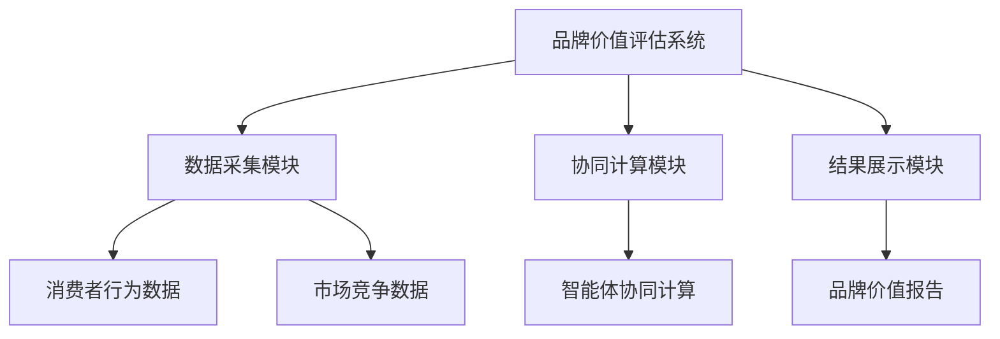
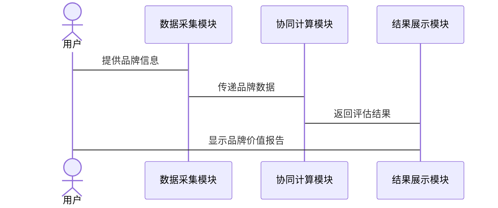

                 


# 多智能体系统在品牌价值评估中的应用：量化无形资产

## 关键词：多智能体系统，品牌价值评估，注意力机制，强化学习，协同智能，无形资产量化

## 摘要：  
在数字化时代，品牌价值的量化变得愈发复杂且重要。传统的品牌价值评估方法往往依赖于静态的指标和单一的视角，难以捕捉品牌在动态市场环境中的多维度价值。多智能体系统（Multi-Agent System, MAS）通过分布式智能和协同计算，为品牌价值评估提供了全新的思路。本文将深入探讨多智能体系统在品牌价值评估中的应用，结合具体算法和系统设计，分析其在量化品牌无形资产方面的优势与挑战。文章内容涵盖多智能体系统的基本概念、协同机制、算法原理、系统架构以及实际案例分析，旨在为品牌价值评估提供一种创新的解决方案。

---

# 第一部分: 多智能体系统与品牌价值评估基础

## 第1章: 多智能体系统概述

### 1.1 多智能体系统的基本概念

#### 1.1.1 多智能体系统的定义  
多智能体系统（Multi-Agent System, MAS）是由多个相互作用的智能体组成的分布式系统。这些智能体能够通过协同完成复杂任务，每个智能体都有一定的自主性、目标导向性和社会性。  

#### 1.1.2 多智能体系统的特征  
- **分布式性**：智能体分布在不同的空间或计算单元中，彼此独立但协同工作。  
- **自主性**：每个智能体都有自己的决策机制，能够在没有外部干预的情况下执行任务。  
- **反应性**：智能体能够感知环境并实时调整行为。  
- **社会性**：智能体之间通过通信和协作完成共同目标。  

#### 1.1.3 多智能体系统与单智能体系统的区别  
单智能体系统依赖中心化的决策机制，而多智能体系统通过去中心化的方式实现任务目标。多智能体系统能够更好地处理复杂、动态的环境，适合应用于品牌价值评估这种多维度、多主体的场景。

### 1.2 品牌价值评估的背景与意义

#### 1.2.1 品牌价值的定义与构成  
品牌价值是品牌在市场中的综合表现，包括品牌知名度、品牌忠诚度、品牌影响力等。品牌价值的构成涉及多个维度，如消费者的认知、市场的认可度以及品牌的经济贡献。  

#### 1.2.2 品牌价值评估的挑战  
传统的品牌价值评估方法通常依赖于财务数据和市场调研，难以全面捕捉品牌的动态价值。此外，品牌价值受到多种因素的影响，如消费者行为、市场竞争态势、政策法规等，使得评估过程复杂且难以量化。

#### 1.2.3 多智能体系统在品牌价值评估中的优势  
多智能体系统能够同时处理多个维度的信息，通过智能体之间的协同，可以更全面地评估品牌价值。例如，智能体可以分别负责收集消费者数据、分析市场竞争态势、评估品牌影响力，并将结果整合为最终的品牌价值评估。

### 1.3 多智能体系统在品牌价值评估中的应用背景

#### 1.3.1 数字化品牌管理的趋势  
随着数字化技术的普及，品牌管理越来越依赖数据驱动的方法。多智能体系统能够通过实时数据分析，为品牌管理提供动态支持。

#### 1.3.2 多智能体系统在品牌管理中的潜在价值  
多智能体系统可以通过分布式的智能处理，实现品牌价值的多维度评估，包括消费者行为分析、品牌影响力传播、竞争对手分析等。

#### 1.3.3 当前品牌价值评估技术的局限性  
传统的品牌价值评估方法通常基于静态数据，难以应对市场的快速变化。多智能体系统通过动态数据处理和协同计算，能够更好地适应市场环境的变化。

## 1.4 本章小结  
本章介绍了多智能体系统的基本概念、品牌价值评估的背景与意义，以及多智能体系统在品牌价值评估中的应用优势。通过这些内容，我们可以理解为什么多智能体系统是品牌价值评估的理想选择。

---

## 第2章: 多智能体系统的核心概念与联系

### 2.1 多智能体系统的实体关系分析

#### 2.1.1 实体关系模型  
在品牌价值评估中，多智能体系统需要考虑多个实体，包括品牌、消费者、竞争对手、市场数据等。

#### 2.1.2 ER图展示  
```mermaid
er
    actor 品牌
    actor 消费者
    actor 竞争对手
    actor 市场监管机构
    entity 品牌价值
    entity 消费者行为
    entity 竞争态势
    entity 市场数据
    relationship 品牌-品牌价值: 实现
    relationship 消费者-消费者行为: 实现
    relationship 竞争对手-竞争态势: 实现
    relationship 市场监管机构-市场数据: 实现
```

### 2.2 多智能体系统的协同机制

#### 2.2.1 协同目标的定义  
多智能体系统的协同目标是通过智能体的协作，实现对品牌价值的全面评估。

#### 2.2.2 协同规则的建立  
智能体之间的协同规则需要明确通信方式、任务分配、决策机制等。

#### 2.2.3 协同效果的评估  
通过评估智能体协同的效果，可以优化协同机制，提高品牌价值评估的准确性。

### 2.3 多智能体系统的通信协议

#### 2.3.1 通信模型  
智能体之间的通信可以通过消息传递、状态共享等方式实现。

#### 2.3.2 通信协议的选择  
选择合适的通信协议需要考虑系统的实时性、可靠性和安全性。

#### 2.3.3 通信过程的优化  
通过优化通信协议，可以提高多智能体系统的协同效率。

### 2.4 本章小结  
本章分析了多智能体系统的核心概念和实体关系，并探讨了协同机制和通信协议的设计。这些内容为后续的算法设计奠定了基础。

---

## 第3章: 多智能体系统在品牌价值评估中的算法原理

### 3.1 基于注意力机制的多智能体协同算法

#### 3.1.1 注意力机制的原理  
注意力机制是一种基于权重分配的机制，可以用于智能体之间的信息处理和决策。

#### 3.1.2 多智能体协同的算法流程  
1. 智能体分别收集品牌相关数据，如消费者行为、市场竞争态势等。  
2. 每个智能体根据自身数据生成初步评估结果。  
3. 智能体之间通过通信协议共享数据，并利用注意力机制进行信息融合。  
4. 综合所有智能体的评估结果，生成最终的品牌价值评估。

#### 3.1.3 算法的实现步骤  
1. 初始化智能体及其任务分配。  
2. 智能体分别执行数据收集和初步评估。  
3. 智能体之间进行通信，共享数据和评估结果。  
4. 利用注意力机制融合信息，生成最终的评估结果。  

#### 3.1.4 注意力机制的数学模型  
注意力机制的数学模型可以表示为：  
$$ \text{Attention}(Q, K, V) = \text{softmax}(\frac{QK^T}{\sqrt{d}})V $$  
其中，\( Q \) 是查询向量，\( K \) 是键向量，\( V \) 是值向量，\( d \) 是维度数。

#### 3.1.5 算法实现的代码示例  
```python
def attention(query, key, value):
    # 计算查询和键的点积
    scores = query @ key.transpose(-2, -1)
    # 归一化
    scores = scores / (scores.shape[-1] ** 0.5)
    # 计算注意力权重
    attention_weights = torch.softmax(scores, dim=-1)
    # 加权求和
    output = attention_weights @ value
    return output

# 示例数据
query = torch.randn(1, 10, 64)
key = torch.randn(1, 10, 64)
value = torch.randn(1, 10, 64)

output = attention(query, key, value)
print(output.shape)  # 输出形状：(1, 10, 64)
```

### 3.2 基于强化学习的多智能体协作优化

#### 3.2.1 强化学习的基本概念  
强化学习是一种通过智能体与环境交互来学习策略的方法。

#### 3.2.2 多智能体强化学习的挑战  
多智能体强化学习需要解决智能体之间的协作问题，如目标冲突、通信效率等。

#### 3.2.3 多智能体强化学习的算法流程  
1. 初始化智能体及其策略网络。  
2. 智能体与环境交互，收集奖励。  
3. 智能体通过策略梯度方法更新策略网络。  
4. 重复步骤2-3，直到达到收敛条件。

#### 3.2.4 基于强化学习的协同机制  
智能体之间的协同可以通过共享策略、策略梯度等方法实现。

#### 3.2.5 多智能体强化学习的数学模型  
策略梯度的数学模型可以表示为：  
$$ \nabla J = \mathbb{E}[\nabla \log \pi(a|s) Q(s,a)] $$  
其中，\( J \) 是目标函数，\( \pi(a|s) \) 是策略函数，\( Q(s,a) \) 是价值函数。

#### 3.2.6 算法实现的代码示例  
```python
import torch
import torch.nn as nn
import torch.optim as optim

class PolicyNetwork(nn.Module):
    def __init__(self, input_dim, output_dim):
        super(PolicyNetwork, self).__init__()
        self.fc1 = nn.Linear(input_dim, 128)
        self.fc2 = nn.Linear(128, output_dim)
        self.softmax = nn.Softmax(dim=1)
    
    def forward(self, x):
        x = torch.relu(self.fc1(x))
        x = self.softmax(self.fc2(x))
        return x

# 初始化网络和优化器
input_dim = 64
output_dim = 4
policy_net = PolicyNetwork(input_dim, output_dim)
optimizer = optim.Adam(policy_net.parameters(), lr=0.001)

# 示例数据
state = torch.randn(1, input_dim)
action_probs = policy_net(state)
action = torch.multinomial(action_probs, 1).item()

# 更新网络
optimizer.zero_grad()
loss = -torch.log(action_probs[0, action])
loss.backward()
optimizer.step()
```

### 3.3 本章小结  
本章详细介绍了多智能体系统在品牌价值评估中的算法原理，包括基于注意力机制和强化学习的协同算法。通过这些算法，可以实现品牌价值的多维度评估。

---

## 第4章: 多智能体系统在品牌价值评估中的系统设计与实现

### 4.1 系统应用场景分析

#### 4.1.1 品牌价值评估的场景  
品牌价值评估需要考虑消费者行为、市场竞争态势、品牌影响力等多个因素。

#### 4.1.2 系统的目标与范围  
系统的目标是通过多智能体协同，实现品牌价值的动态评估。系统的范围包括数据采集、协同计算、结果展示等。

### 4.2 系统功能设计

#### 4.2.1 数据采集模块  
数据采集模块负责收集品牌相关的数据，如消费者行为数据、市场竞争数据等。

#### 4.2.2 协同计算模块  
协同计算模块负责智能体之间的通信和协作，实现品牌价值的综合评估。

#### 4.2.3 结果展示模块  
结果展示模块将评估结果以可视化的方式呈现给用户。

### 4.3 系统架构设计

#### 4.3.1 系统架构图  


#### 4.3.2 系统组件交互  
系统组件之间的交互需要通过定义良好的接口实现。例如，数据采集模块将数据传递给协同计算模块，协同计算模块将结果传递给结果展示模块。

### 4.4 系统接口设计

#### 4.4.1 数据接口  
数据接口用于数据采集模块与协同计算模块之间的数据传递。

#### 4.4.2 通信接口  
通信接口用于智能体之间的通信和协作。

#### 4.4.3 用户接口  
用户接口用于用户与系统的交互，如输入参数、查看结果等。

### 4.5 系统交互流程图



### 4.6 本章小结  
本章分析了多智能体系统在品牌价值评估中的系统设计，包括功能设计、架构设计和接口设计。通过系统的实现，可以为品牌价值评估提供一种高效的方法。

---

## 第5章: 多智能体系统在品牌价值评估中的项目实战

### 5.1 项目背景与目标

#### 5.1.1 项目背景  
本项目旨在通过多智能体系统实现品牌价值的动态评估。

#### 5.1.2 项目目标  
1. 实现多智能体协同算法。  
2. 设计并实现品牌价值评估系统。  
3. 对系统进行测试和优化。

### 5.2 项目核心代码实现

#### 5.2.1 环境安装  
需要安装以下库：  
- Python 3.7+  
- PyTorch  
- Mermaid  

#### 5.2.2 多智能体协同算法实现  
```python
import torch
import torch.nn as nn
import torch.optim as optim

class MultiAgentSystem:
    def __init__(self, num_agents):
        self.num_agents = num_agents
        self.agents = [Agent(i) for i in range(num_agents)]

    def step(self):
        for agent in self.agents:
            agent.collect_data()
            agent.compute_attention()
        results = []
        for agent in self.agents:
            results.append(agent.attention_result)
        return results

class Agent:
    def __init__(self, idx):
        self.idx = idx
        self.data = None
        self.attention_result = 0

    def collect_data(self):
        # 模拟数据收集
        self.data = torch.randn(10, 64)

    def compute_attention(self):
        # 模拟注意力计算
        query = self.data[:, 0]
        key = self.data[:, 1]
        value = self.data[:, 2]
        scores = query @ key.transpose(-1, -2)
        attention_weights = torch.softmax(scores, dim=-1)
        self.attention_result = attention_weights @ value
```

#### 5.2.3 系统功能实现  
```python
def main():
    num_agents = 4
    mas = MultiAgentSystem(num_agents)
    mas.step()

if __name__ == "__main__":
    main()
```

### 5.3 实际案例分析

#### 5.3.1 案例背景  
假设我们有一个品牌，需要评估其品牌价值。

#### 5.3.2 数据收集  
智能体分别收集消费者行为数据、市场竞争数据等。

#### 5.3.3 协同计算  
智能体之间通过注意力机制协同计算，生成品牌价值评估结果。

#### 5.3.4 结果展示  
将评估结果以报告的形式展示给用户。

### 5.4 项目小结  
本章通过实际案例分析，展示了多智能体系统在品牌价值评估中的应用。通过项目实战，可以验证系统的可行性和有效性。

---

## 第6章: 多智能体系统在品牌价值评估中的最佳实践与未来展望

### 6.1 最佳实践

#### 6.1.1 数据质量的重要性  
高质量的数据是品牌价值评估的基础，需要确保数据的准确性和完整性。

#### 6.1.2 系统优化的建议  
可以通过优化算法、提高通信效率等方式，进一步提升系统的性能。

#### 6.1.3 模型调优的技巧  
可以尝试不同的算法参数组合，找到最优的配置。

### 6.2 小结  
本章总结了多智能体系统在品牌价值评估中的最佳实践，为读者提供了实用的建议。

### 6.3 未来展望

#### 6.3.1 技术发展趋势  
随着人工智能技术的不断发展，多智能体系统在品牌价值评估中的应用将更加广泛。

#### 6.3.2 研究方向  
未来的研究可以集中在多智能体系统的协同优化、算法的改进等方面。

#### 6.3.3 应用前景  
多智能体系统在品牌价值评估中的应用前景广阔，有望成为品牌管理的重要工具。

---

## 作者：AI天才研究院/AI Genius Institute & 禅与计算机程序设计艺术 /Zen And The Art of Computer Programming

