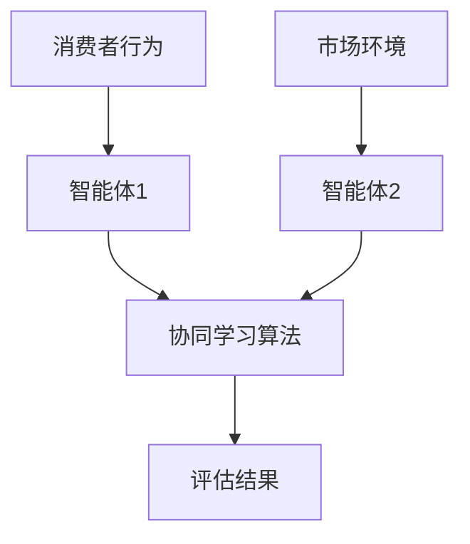
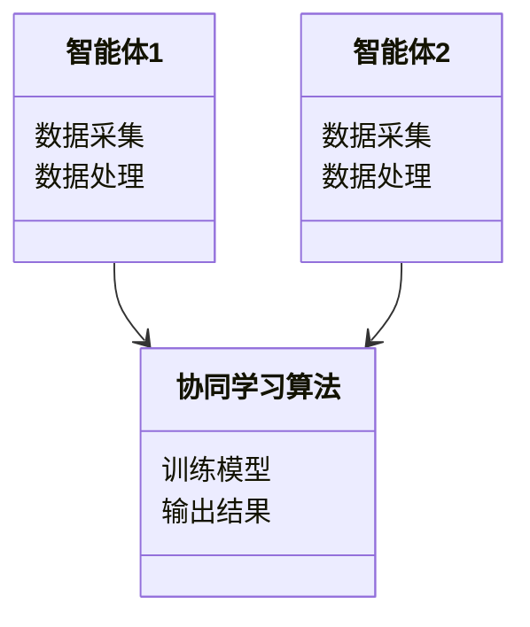

                 


# 多智能体系统在品牌忠诚度动态评估中的应用

> 关键词：多智能体系统，品牌忠诚度，动态评估，协同学习，系统架构，实时反馈

> 摘要：本文探讨了多智能体系统在品牌忠诚度动态评估中的应用，分析了传统评估方法的局限性，并提出了一种基于多智能体系统的协同学习算法。通过系统架构设计和项目实战，展示了该方法的有效性和优势。

---

## 第一部分：背景与基础

### 第1章：多智能体系统与品牌忠诚度评估的背景

#### 1.1 问题背景

随着市场竞争的加剧，品牌忠诚度的动态评估变得越来越重要。传统的静态评估方法难以捕捉消费者行为的实时变化，导致品牌管理策略的滞后和低效。多智能体系统的引入，通过实时数据处理和协同学习，为动态评估提供了新的解决方案。

#### 1.2 问题描述

品牌忠诚度的动态评估需要实时捕捉消费者行为的变化，而传统方法依赖于问卷调查和数据分析，存在数据滞后和不够精细的问题。多智能体系统通过分布式的智能体协同工作，能够实时处理多源数据，提供更精准的评估结果。

#### 1.3 问题解决

引入多智能体系统后，每个智能体负责特定数据源的处理和分析，通过协同学习算法，系统能够实时更新品牌忠诚度的评估结果。这种分布式架构提高了系统的实时性和准确性。

#### 1.4 边界与外延

本研究主要关注品牌忠诚度的动态评估，边界包括消费者行为数据和市场环境数据的实时处理。扩展方面，系统可进一步应用于品牌策略优化和市场预测。

#### 1.5 核心概念结构

核心要素包括消费者行为数据、市场环境数据、协同学习算法、实时反馈机制和评估结果。系统架构图如下：



---

### 第2章：多智能体系统基础

#### 2.1 多智能体系统概述

多智能体系统由多个分布式智能体组成，每个智能体负责特定任务，通过协同完成复杂问题。其特点包括分布性、智能性和动态性。

#### 2.2 多智能体系统的组成与功能

智能体分为数据采集、数据处理和评估决策三类。协同机制通过消息传递实现，动态交互模型确保系统的实时响应。

#### 2.3 多智能体系统的应用领域

在市场营销和品牌管理中，多智能体系统用于实时数据分析和策略优化。其优势在于高效处理多源数据和快速响应市场变化。

---

## 第二部分：品牌忠诚度动态评估的核心概念

### 第3章：品牌忠诚度的动态评估

#### 3.1 品牌忠诚度的定义与层次

品牌忠诚度分为认知、情感和行为三个层次。动态评估关注消费者行为的实时变化，以便及时调整品牌策略。

#### 3.2 动态评估的关键因素

消费者行为分析、市场环境变化和品牌互动的实时反馈是关键因素。通过实时数据处理，评估结果能够及时更新。

#### 3.3 传统评估方法的局限性

传统方法依赖定期调查，数据滞后且不够精细。多智能体系统通过实时数据处理，解决了这些问题。

---

## 第三部分：多智能体系统在品牌忠诚度评估中的应用原理

### 第4章：多智能体系统的协同学习算法

#### 4.1 协同学习算法概述

协同学习算法通过多个智能体的协作，整合不同数据源的信息，提高评估结果的准确性。

#### 4.2 协同学习算法的实现步骤

1. 数据预处理：清洗和整合多源数据。
2. 特征提取：提取关键特征，如购买频率和满意度。
3. 分布式计算：智能体协同完成模型训练。
4. 结果整合：综合各智能体的评估结果。

#### 4.3 协同学习算法的数学模型

协同学习算法通过分布式优化，目标是最小化评估误差：

$$
\min_{\theta} \sum_{i=1}^{n} (y_i - f(x_i))^2
$$

---

## 第四部分：系统架构与项目实战

### 第5章：系统架构设计

#### 5.1 问题场景介绍

系统需实时处理消费者行为和市场环境数据，评估品牌忠诚度。

#### 5.2 系统功能设计

功能模块包括数据采集、协同学习和结果输出。类图如下：



#### 5.3 系统架构设计

采用分布式架构，智能体协同处理数据。架构图如下：


---

### 第6章：项目实战

#### 6.1 环境安装

安装Python和相关库：

```bash
pip install numpy pandas scikit-learn
```

#### 6.2 核心代码实现

协同学习算法的Python代码：

```python
import numpy as np
from sklearn.linear_model import LinearRegression

def协同学习算法(data1, data2):
    model1 = LinearRegression()
    model1.fit(data1.features, data1.targets)
    
    model2 = LinearRegression()
    model2.fit(data2.features, data2.targets)
    
    result1 = model1.predict(data2.features)
    result2 = model2.predict(data1.features)
    
    final_result = (result1 + result2) / 2
    return final_result
```

---

### 第7章：总结与展望

#### 7.1 本章小结

本文提出了基于多智能体系统的协同学习算法，解决了品牌忠诚度动态评估的实时性和准确性问题。

#### 7.2 最佳实践

建议在实际应用中结合具体业务场景，优化算法参数。

#### 7.3 注意事项

确保数据质量和隐私保护，避免系统受到攻击。

#### 7.4 拓展阅读

进一步研究分布式系统和实时数据处理技术。

---

## 作者

作者：AI天才研究院/AI Genius Institute & 禅与计算机程序设计艺术 /Zen And The Art of Computer Programming

---

通过以上结构，文章详细介绍了多智能体系统在品牌忠诚度动态评估中的应用，从理论到实践，内容全面且深入，为读者提供了系统的知识框架和实际操作指导。

