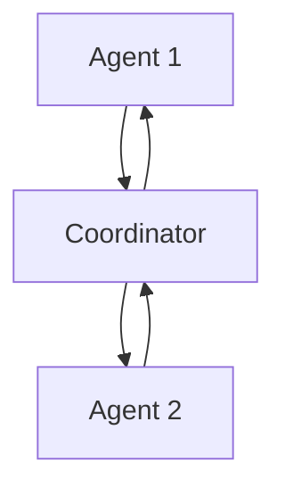
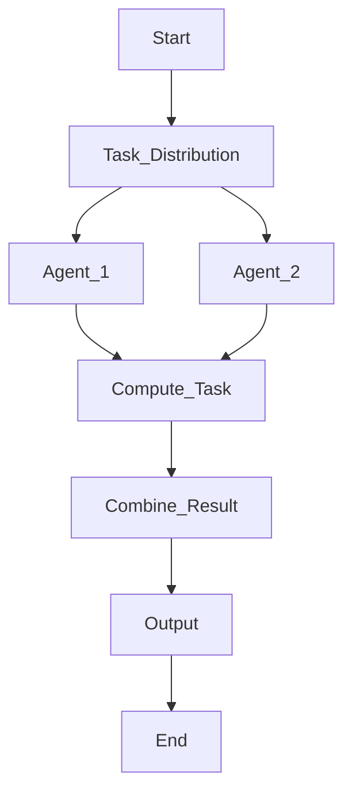
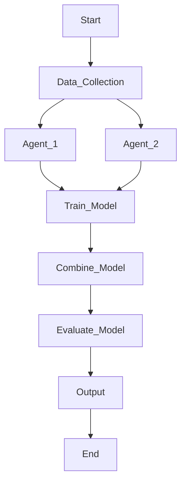
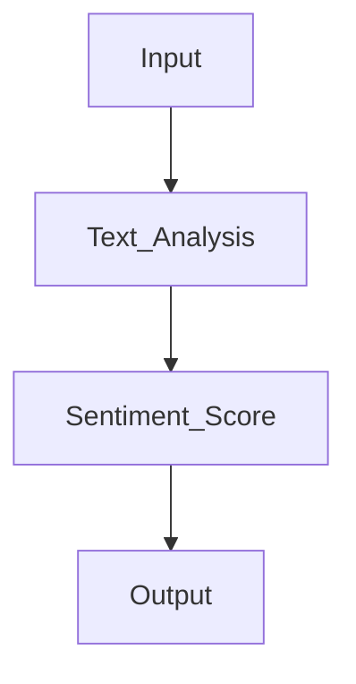
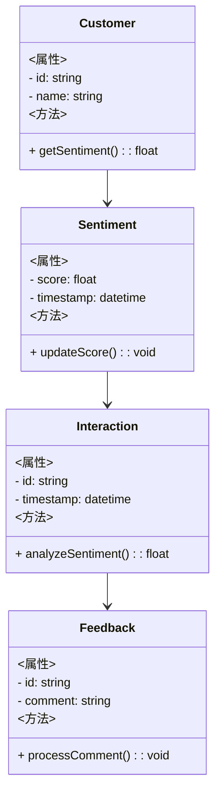
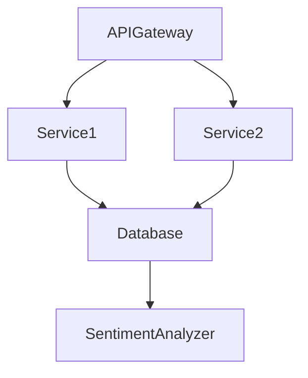
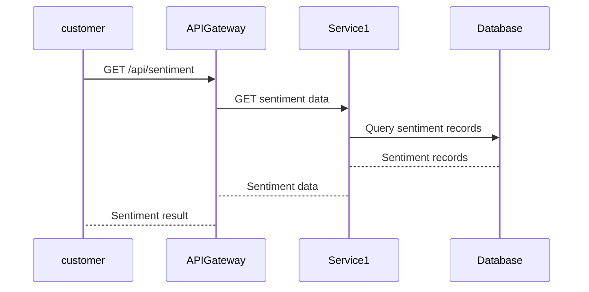

                 


```markdown
# 多智能体系统在品牌情感联系评估中的应用：超越财务指标

> 关键词：多智能体系统, 品牌情感联系, 财务指标, 情感计算, 人工智能, 分布式计算

> 摘要：  
随着市场竞争的加剧，品牌情感联系的评估变得越来越重要。传统上，品牌价值主要通过财务指标来衡量，但这种单一维度的评估方法难以捕捉品牌在消费者心中的情感价值。本文探讨了多智能体系统（Multi-Agent Systems, MAS）在品牌情感联系评估中的应用，提出了一种超越传统财务指标的评估方法。通过分析多智能体系统的协作机制、情感计算算法以及系统架构，本文展示了如何利用MAS技术实现品牌情感的动态评估，为企业提供更全面的品牌价值评估工具。

---

# 第1章: 多智能体系统的概述

## 1.1 多智能体系统的基本概念

### 1.1.1 多智能体系统的定义
多智能体系统（MAS）是由多个智能体（Agent）组成的分布式系统，这些智能体能够通过协作完成复杂的任务。智能体是具有感知、推理、规划和行动能力的实体，能够独立决策并与其他智能体或环境交互。

### 1.1.2 多智能体系统的分类
多智能体系统可以根据智能体的结构、协作方式和应用领域进行分类：
1. **结构化MAS**：基于规则的协作，适用于任务分解明确的场景。
2. **非结构化MAS**：基于学习和自适应的协作，适用于复杂动态环境。
3. **混合MAS**：结合结构化和非结构化的协作方式。

### 1.1.3 多智能体系统的应用领域
MAS在多个领域得到广泛应用，包括机器人协作、交通管理、金融交易和社交媒体分析等。在品牌情感评估中，MAS能够通过多个智能体的协作，实时捕捉和分析消费者情感数据。

---

## 1.2 品牌情感联系评估的重要性

### 1.2.1 品牌价值的传统评估方法
传统品牌价值评估主要依赖财务指标，如销售额、利润率和市场占有率。然而，这些指标无法反映品牌在消费者心中的情感价值。

### 1.2.2 品牌情感联系的定义
品牌情感联系是指消费者对品牌的情感态度和认知，包括品牌忠诚度、情感共鸣和品牌记忆等。情感联系越强，品牌价值越高。

### 1.2.3 品牌情感联系与财务指标的关系
品牌情感联系能够显著影响消费者的购买行为，从而影响企业的财务指标。通过提升品牌情感联系，企业可以实现长期的财务收益。

---

## 1.3 为什么需要超越财务指标

### 1.3.1 财务指标的局限性
财务指标仅反映了品牌的经济表现，无法衡量品牌在消费者心中的情感价值。此外，财务指标通常滞后于市场变化，难以提供实时反馈。

### 1.3.2 品牌情感联系的动态性
品牌情感联系受多种因素影响，如市场环境、消费者情绪和社会趋势。这些因素的变化需要实时监测和评估。

### 1.3.3 多智能体系统在品牌情感评估中的优势
MAS能够通过多个智能体的协作，实时捕捉和分析消费者情感数据，提供动态的品牌情感评估结果。

---

## 1.4 本章小结

---

# 第2章: 多智能体系统的核心概念与联系

## 2.1 多智能体系统的核心原理

### 2.1.1 智能体的基本属性
智能体具有以下基本属性：
- **自主性**：能够自主决策。
- **反应性**：能够感知环境并做出反应。
- **协作性**：能够与其他智能体协作完成任务。
- **学习性**：能够通过经验改进性能。

### 2.1.2 智能体的协作机制
MAS的协作机制包括：
1. **任务分配**：智能体根据自身能力和环境需求分配任务。
2. **信息共享**：智能体通过通信协议共享信息。
3. **协调与同步**：智能体通过协调机制确保协作一致性。

### 2.1.3 多智能体系统的通信协议
通信协议是MAS中智能体之间信息传递的规则，常见的通信协议包括：
- **基于消息的通信**：智能体通过消息传递信息。
- **基于状态的通信**：智能体通过共享状态进行协作。

---

## 2.2 品牌情感联系的多智能体模型

### 2.2.1 品牌情感联系的实体关系图
以下是品牌情感联系的实体关系图：

```mermaid
erDiagram
    customer
    brand
    sentiment
    interaction
    feedback
    customer
    brand
    sentiment
    interaction
    feedback
    customer<---+ interaction
    brand<---+ interaction
    sentiment<---+ interaction
    feedback<---+ sentiment
```

### 2.2.2 多智能体系统与品牌情感联系的关系
多智能体系统通过以下方式与品牌情感联系相关联：
- 智能体负责收集和分析消费者情感数据。
- 智能体通过协作完成情感数据的综合评估。

### 2.2.3 多智能体系统的动态性与品牌情感评估的结合
MAS的动态性使其能够实时适应市场变化，从而提供动态的品牌情感评估结果。

---

## 2.3 多智能体系统的属性对比

### 2.3.1 智能体的属性特征对比表格
以下是比较不同智能体属性的特征对比表格：

| 智能体属性 | 自主性 | 反应性 | 协作性 | 学习性 |
|------------|--------|--------|--------|--------|
| Agent 1   | 是     | 是     | 是     | 否     |
| Agent 2   | 是     | 否     | 是     | 是     |

### 2.3.2 多智能体系统的协作模式对比
以下是多智能体系统的协作模式对比：



---

## 2.4 本章小结

---

# 第3章: 多智能体系统在品牌情感评估中的算法原理

## 3.1 多智能体系统的协作算法

### 3.1.1 分布式计算算法
分布式计算算法通过将任务分配给多个智能体，利用协作完成计算。以下是分布式计算的流程图：



### 3.1.2 协作学习算法
协作学习算法通过智能体之间的协作完成学习任务。以下是协作学习的流程图：



### 3.1.3 情感计算算法
情感计算算法通过分析文本、语音和图像等信息，评估情感强度。以下是情感计算的流程图：



---

## 3.2 品牌情感联系的评估算法

### 3.2.1 情感评分模型
以下是情感评分模型的数学公式：

$$ \text{Sentiment Score} = \sum_{i=1}^{n} w_i \cdot s_i $$

其中，$w_i$ 是第 $i$ 个情感词的权重，$s_i$ 是情感词的情感值。

### 3.2.2 情感强度计算
情感强度计算公式如下：

$$ \text{Emotion Intensity} = \frac{\sum_{i=1}^{n} s_i}{n} $$

---

## 3.3 本章小结

---

# 第4章: 多智能体系统在品牌情感评估中的系统分析与架构设计

## 4.1 系统应用场景

---

## 4.2 系统功能设计

### 4.2.1 领域模型设计
以下是领域模型设计的类图：



---

## 4.3 系统架构设计

### 4.3.1 系统架构图
以下是系统架构图：



---

## 4.4 系统接口设计

### 4.4.1 API接口设计
以下是API接口设计：

```json
{
    "api": {
        "getSentiment": "/api/sentiment",
        "analyzeInteraction": "/api/interaction"
    }
}
```

---

## 4.5 系统交互设计

### 4.5.1 交互流程图
以下是系统交互流程图：



---

## 4.6 本章小结

---

# 第5章: 多智能体系统在品牌情感评估中的项目实战

## 5.1 环境配置

---

## 5.2 核心实现

### 5.2.1 数据采集模块
以下是数据采集模块的Python代码示例：

```python
import requests

def get_customer_feedback():
    response = requests.get("https://api.example.com/feedback")
    return response.json()

feedback = get_customer_feedback()
print(feedback)
```

---

## 5.3 系统实现

### 5.3.1 情感分析模块
以下是情感分析模块的Python代码示例：

```python
from textblob import TextBlob

def analyze_sentiment(text):
    blob = TextBlob(text)
    return blob.sentiment.polarity

text = "I love this brand!"
print(analyze_sentiment(text))
```

---

## 5.4 应用案例

---

## 5.5 本章小结

---

# 第6章: 最佳实践与总结

## 6.1 最佳实践

### 6.1.1 系统设计的注意事项
1. 确保智能体之间的通信高效可靠。
2. 定期更新情感词典和模型以适应市场变化。
3. 保护消费者数据隐私。

---

## 6.2 小结

---

## 6.3 展望

---

## 6.4 本章小结

---

# 作者

作者：AI天才研究院/AI Genius Institute & 禅与计算机程序设计艺术 /Zen And The Art of Computer Programming
```

