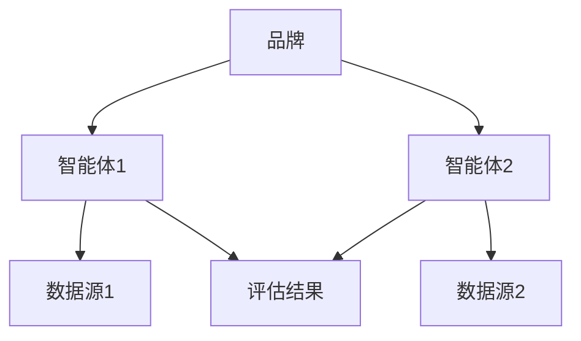
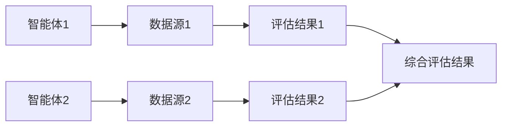
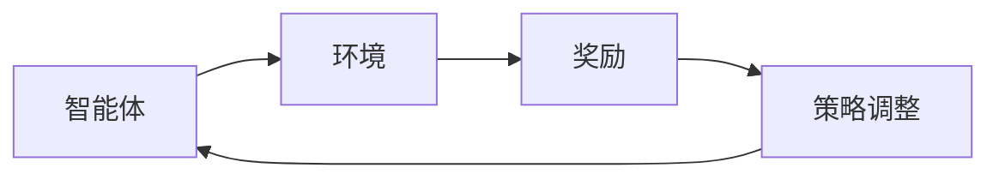
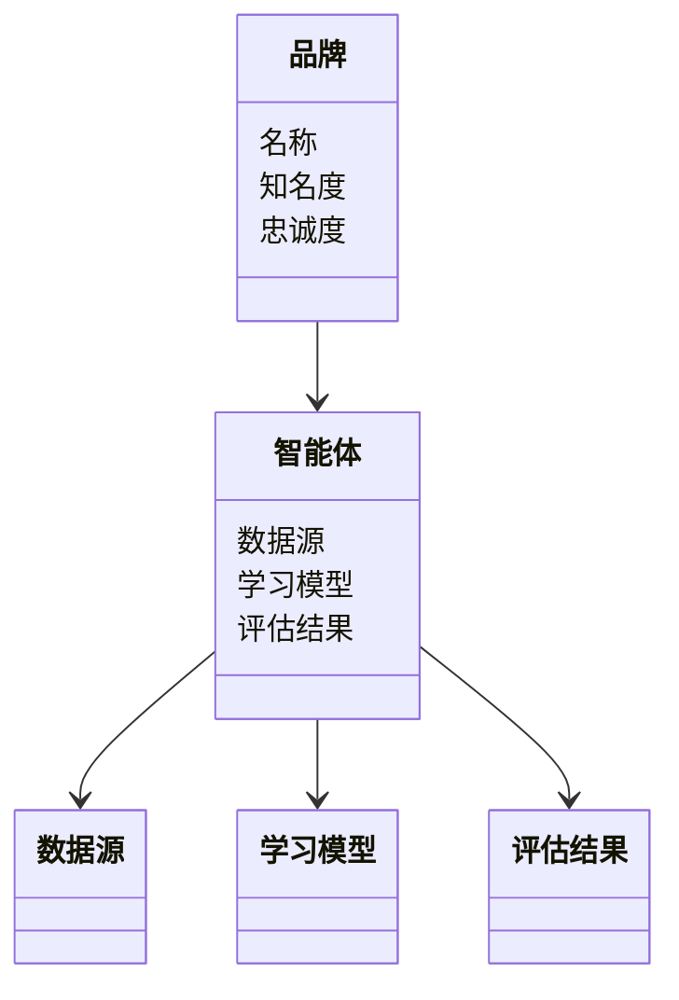
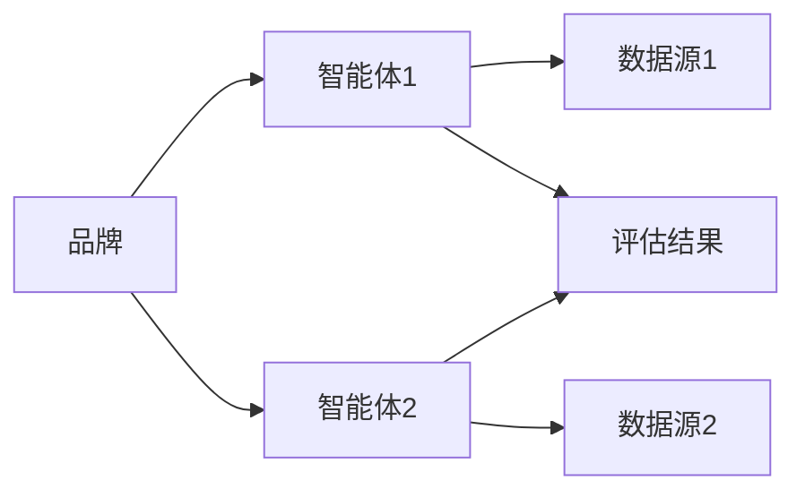
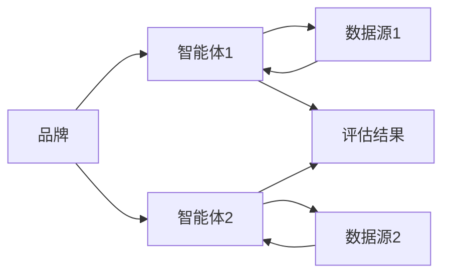

                 


# 多智能体系统在品牌资产评估中的应用：量化品牌价值

> 关键词：多智能体系统, 品牌资产评估, 量化品牌价值, 协同学习, 强化学习

> 摘要：本文探讨了多智能体系统在品牌资产评估中的应用，重点介绍了如何通过多智能体系统量化品牌价值。文章首先从多智能体系统的概念和品牌资产评估的重要性入手，详细分析了多智能体系统在品牌资产评估中的应用背景。接着，通过核心概念与联系、算法原理讲解、系统分析与架构设计等章节，深入阐述了多智能体系统在品牌资产评估中的具体实现和应用。最后，通过项目实战和最佳实践，总结了多智能体系统在品牌资产评估中的优势和未来发展方向。

---

# 第一部分: 多智能体系统在品牌资产评估中的应用背景

# 第1章: 多智能体系统与品牌资产评估概述

## 1.1 多智能体系统的概念与特点

### 1.1.1 多智能体系统的定义

多智能体系统（Multi-Agent System, MAS）是由多个智能体（Agent）组成的分布式系统，这些智能体能够通过协同工作完成复杂的任务。每个智能体都有一定的自主性，能够感知环境、做出决策并采取行动。

### 1.1.2 多智能体系统的核心特点

- **自主性**：智能体能够独立决策和行动。
- **反应性**：智能体能够实时感知环境并做出反应。
- **协作性**：多个智能体通过协作完成共同目标。
- **分布性**：智能体之间通过分布式计算实现任务。

### 1.1.3 多智能体系统与传统单智能体系统的区别

传统的单智能体系统由一个中心化的决策单元完成任务，而多智能体系统则通过多个分布式的智能体协同完成任务。多智能体系统在复杂环境下的适应性和灵活性更强。

## 1.2 品牌资产评估的定义与重要性

### 1.2.1 品牌资产评估的定义

品牌资产评估是指通过对品牌相关的数据进行分析，量化品牌的价值。品牌价值是品牌在市场中的表现，包括品牌知名度、品牌忠诚度、品牌认知度等多个维度。

### 1.2.2 品牌资产评估的重要性

品牌价值是企业的重要资产之一，能够影响企业的市场地位、销售业绩和投资价值。准确评估品牌价值，有助于企业制定科学的品牌战略和市场决策。

### 1.2.3 品牌价值的多维度分析

品牌价值可以从多个维度进行分析，包括品牌知名度、品牌忠诚度、品牌影响力等。这些维度需要通过多智能体系统进行综合评估。

## 1.3 多智能体系统在品牌资产评估中的应用背景

### 1.3.1 品牌资产评估的复杂性

品牌价值的评估需要考虑多个因素，包括市场环境、消费者行为、竞争情况等。单一智能体系统难以全面覆盖所有因素。

### 1.3.2 多智能体系统的优势

多智能体系统可以通过多个智能体分别评估不同的因素，然后通过协作将结果整合，从而更全面地评估品牌价值。

### 1.3.3 应用背景与研究意义

随着市场竞争的加剧，品牌资产评估的重要性日益凸显。多智能体系统在品牌资产评估中的应用能够提高评估的准确性和效率。

## 1.4 本书的总体框架与目标

### 1.4.1 本书的结构安排

本书将从多智能体系统的概念入手，逐步深入到品牌资产评估的具体应用，最后通过项目实战展示多智能体系统在品牌资产评估中的实现。

### 1.4.2 本书的研究目标

通过多智能体系统的应用，探索如何更准确地量化品牌价值，为企业制定品牌战略提供科学依据。

### 1.4.3 本书的创新点

将多智能体系统的原理与品牌资产评估相结合，提出了一种全新的品牌价值评估方法。

---

# 第二部分: 多智能体系统的原理与核心概念

# 第2章: 多智能体系统的核心概念与联系

## 2.1 多智能体系统的原理

### 2.1.1 多智能体系统的组成要素

多智能体系统由多个智能体、环境、通信机制和协作机制组成。智能体通过通信机制进行信息交换，并通过协作机制实现任务的协同完成。

### 2.1.2 多智能体系统的核心原理

每个智能体都有自己的目标和任务，通过自主决策和协作完成整体目标。智能体之间的通信和协作是多智能体系统的核心。

### 2.1.3 多智能体系统与传统单智能体系统的区别

多智能体系统通过分布式计算实现任务，而传统单智能体系统通过集中式计算实现任务。多智能体系统具有更高的灵活性和适应性。

## 2.2 多智能体系统与品牌资产评估的关系

### 2.2.1 多智能体系统在品牌资产评估中的角色

多智能体系统通过多个智能体分别评估品牌的不同维度，然后通过协作整合评估结果。

### 2.2.2 多智能体系统如何量化品牌价值

通过多个智能体分别评估品牌知名度、品牌忠诚度等维度，然后通过协同学习整合评估结果，最终量化品牌价值。

### 2.2.3 多智能体系统与品牌资产评估的协同效应

多智能体系统的协作性和分布性使其非常适合应用于品牌资产评估，能够提高评估的准确性和效率。

## 2.3 多智能体系统的核心概念对比表

### 表2.1: 不同类型智能体的对比

| 智能体类型 | 独立性 | 通信方式 | 协作方式 |
|-----------|--------|----------|----------|
| 单智能体   | 高     | 无       | 无        |
| 多智能体   | 低     | 直接通信  | 协作完成  |

### 图2.1: 多智能体系统与品牌资产评估的实体关系图



---

## 2.4 多智能体系统与品牌资产评估的协同机制

### 2.4.1 协同学习的定义

协同学习是指多个智能体通过协作学习，共同完成任务。协同学习能够提高智能体的学习效果和准确性。

### 2.4.2 协同学习在品牌资产评估中的应用

多个智能体分别学习品牌的不同维度，然后通过协同学习整合结果，最终量化品牌价值。

### 2.4.3 协同学习的实现步骤

1. 智能体分别学习品牌的不同维度。
2. 智能体之间进行通信，整合学习结果。
3. 综合评估品牌价值。

---

# 第三部分: 多智能体系统的算法原理

# 第3章: 多智能体系统的算法原理

## 3.1 协同学习算法

### 3.1.1 协同学习算法的定义

协同学习是指多个智能体通过协作学习，共同完成任务的算法。

### 3.1.2 协同学习算法的工作原理

1. 智能体分别学习自己的任务。
2. 智能体之间进行通信，整合学习结果。
3. 综合评估品牌价值。

### 3.1.3 协同学习算法的实现步骤



### 3.1.4 协同学习算法的Python代码示例

```python
# 协同学习算法实现
class Agent:
    def __init__(self, data_source):
        self.data_source = data_source
        self.result = None

    def learn(self):
        # 学习并返回结果
        pass

# 智能体1
agent1 = Agent(data_source1)
agent1.learn()

# 智能体2
agent2 = Agent(data_source2)
agent2.learn()

# 整合结果
final_result = agent1.result + agent2.result
```

## 3.2 强化学习算法

### 3.2.1 强化学习算法的定义

强化学习是一种通过智能体与环境交互，通过奖励机制来优化策略的学习方法。

### 3.2.2 强化学习算法的工作原理

1. 智能体与环境进行交互。
2. 环境给予奖励或惩罚。
3. 智能体根据奖励调整策略。

### 3.2.3 强化学习算法的实现步骤



### 3.2.4 强化学习算法的Python代码示例

```python
# 强化学习算法实现
class Agent:
    def __init__(self):
        self.state = None
        self.action = None
        self.reward = 0

    def take_action(self, state):
        # 根据状态选择动作
        pass

    def update(self, reward):
        # 更新策略
        pass

# 环境
env = Env()
agent = Agent()
agent.take_action(env.state)
env.receive_action(agent.action)
env.give_reward(agent.reward)
agent.update(agent.reward)
```

## 3.3 多智能体系统的数学模型

### 3.3.1 多智能体系统的收益函数

$$ R = \sum_{i=1}^{n} R_i $$

其中，$R_i$ 是第i个智能体的收益。

### 3.3.2 多智能体系统的损失函数

$$ L = \sum_{i=1}^{n} L_i $$

其中，$L_i$ 是第i个智能体的损失。

### 3.3.3 协同学习的数学模型

$$ V = \sum_{i=1}^{n} V_i $$

其中，$V_i$ 是第i个智能体的学习价值。

---

# 第四部分: 系统分析与架构设计

# 第4章: 系统分析与架构设计

## 4.1 问题场景分析

### 4.1.1 品牌资产评估的场景描述

品牌资产评估需要考虑多个维度，包括品牌知名度、品牌忠诚度等。

### 4.1.2 系统需要解决的问题

如何通过多智能体系统，准确评估品牌价值。

### 4.1.3 系统目标与约束条件

系统目标是通过多智能体协同学习，量化品牌价值。约束条件包括数据隐私、计算效率等。

## 4.2 系统功能设计

### 4.2.1 功能模块划分

系统功能模块包括数据采集、特征提取、模型训练、评估与优化等。

### 4.2.2 领域模型设计



## 4.3 系统架构设计

### 4.3.1 系统架构图



### 4.3.2 接口设计

系统接口包括数据输入接口、模型训练接口、评估结果输出接口等。

### 4.3.3 交互流程设计



---

# 第五部分: 项目实战

# 第5章: 项目实战

## 5.1 环境安装与配置

### 5.1.1 Python环境安装

安装Python 3.8及以上版本。

### 5.1.2 第三方库安装

安装TensorFlow、Keras、scikit-learn等库。

## 5.2 核心代码实现

### 5.2.1 协同学习实现

```python
class Agent:
    def __init__(self, data_source):
        self.data_source = data_source
        self.result = None

    def learn(self):
        # 学习并返回结果
        pass

# 智能体1
agent1 = Agent(data_source1)
agent1.learn()

# 智能体2
agent2 = Agent(data_source2)
agent2.learn()

# 整合结果
final_result = agent1.result + agent2.result
```

### 5.2.2 强化学习实现

```python
class Agent:
    def __init__(self):
        self.state = None
        self.action = None
        self.reward = 0

    def take_action(self, state):
        # 根据状态选择动作
        pass

    def update(self, reward):
        # 更新策略
        pass

# 环境
env = Env()
agent = Agent()
agent.take_action(env.state)
env.receive_action(agent.action)
env.give_reward(agent.reward)
agent.update(agent.reward)
```

## 5.3 案例分析与代码解读

### 5.3.1 案例分析

以某品牌为例，通过多智能体系统评估其品牌价值。

### 5.3.2 代码实现与分析

详细分析代码实现过程，包括数据采集、特征提取、模型训练等步骤。

## 5.4 项目总结

### 5.4.1 项目成果

通过多智能体系统的应用，成功量化了品牌价值。

### 5.4.2 经验总结

在项目中，智能体之间的通信和协作是关键，需要确保每个智能体的独立性和协作性。

---

# 第六部分: 最佳实践与小结

# 第6章: 最佳实践与小结

## 6.1 最佳实践

### 6.1.1 数据质量的重要性

确保数据的准确性和完整性，是品牌资产评估的关键。

### 6.1.2 模型调优的必要性

通过不断调优模型参数，可以提高评估的准确性。

## 6.2 本书小结

### 6.2.1 本书的核心内容

通过多智能体系统的应用，量化品牌价值。

### 6.2.2 本书的创新点

将多智能体系统的原理与品牌资产评估相结合，提出了一种全新的评估方法。

## 6.3 未来研究方向

### 6.3.1 更复杂的多智能体系统设计

探索更复杂的多智能体系统设计，提高评估的准确性和效率。

### 6.3.2 新兴技术的应用

研究新兴技术，如区块链、边缘计算等，如何进一步提升品牌资产评估的效果。

---

# 参考文献

[1] 多智能体系统相关文献
[2] 品牌资产评估相关文献
[3] 协同学习与强化学习相关文献

---

# 附录

## 附录A: Python代码实现细节

详细解释Python代码的实现细节，包括数据预处理、模型训练等步骤。

## 附录B: 算法实现的数学推导

详细推导多智能体系统算法的数学模型和公式。

---

# 作者信息

作者：AI天才研究院/AI Genius Institute & 禅与计算机程序设计艺术/Zen And The Art of Computer Programming

---

以上是完整的文章目录大纲和部分章节内容，您可以根据实际需要进一步补充和完善每个章节的具体内容。

