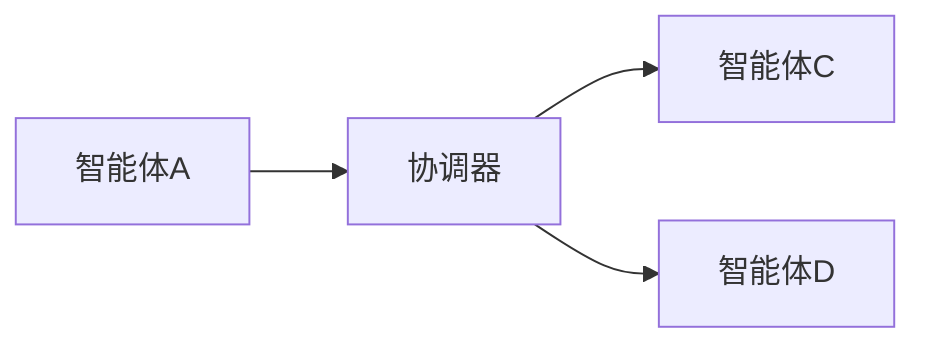
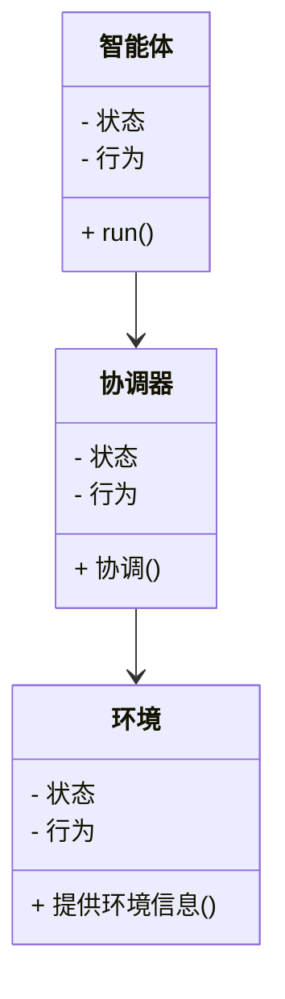
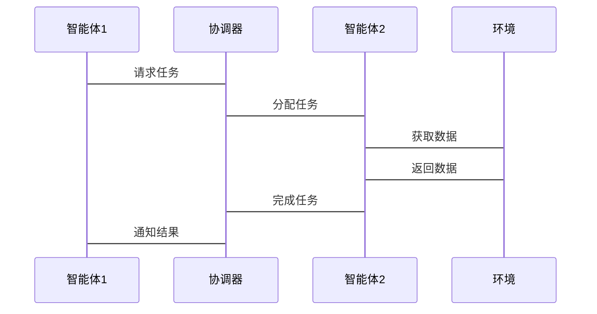

                 


# 多智能体系统在商业模式分析中的创新应用

## 关键词：多智能体系统（MAS）、商业模式分析、分布式计算、协作机制、自适应优化

## 摘要：  
随着人工智能技术的快速发展，多智能体系统（MAS）在商业领域的应用日益广泛。本文深入探讨了多智能体系统在商业模式分析中的创新应用，结合实际案例，详细分析了其在电子商务、金融和物流等领域的具体应用场景。通过对比传统商业模式分析方法与基于多智能体系统的分析方法，本文揭示了多智能体系统在提高商业模式优化效率、增强系统自适应能力和实现分布式协作中的独特优势。此外，本文还详细介绍了多智能体系统的算法原理、系统架构设计以及实际项目实现，为读者提供了一个全面了解多智能体系统在商业模式分析中创新应用的框架。

---

# 第1章: 多智能体系统概述

## 1.1 多智能体系统的定义与特点

### 1.1.1 多智能体系统的定义  
多智能体系统（Multi-Agent System，MAS）是由多个智能体（Agent）组成的分布式系统，这些智能体能够通过通信和协作完成复杂任务。智能体可以是软件程序，也可以是物理实体，它们具有自主性、反应性和协作性。

### 1.1.2 多智能体系统的核心特点

| 特性 | 描述 |
|------|------|
| 分布式 | 智能体分布在不同的节点，通过通信协作完成任务 |
| 自主性 | 每个智能体具有自主决策能力，无需中央控制 |
| 反应性 | 能够感知环境并实时调整行为 |
| 协作性 | 智能体之间通过通信和协作完成共同目标 |

### 1.1.3 多智能体系统与传统单智能体系统的区别

| 方面 | 单智能体系统 | 多智能体系统 |
|------|-------------|-------------|
| 结构 | 单点控制 | 分布式架构 |
| 智能 | 集中决策 | 分散决策 |
| 灵活性 | 较低 | 较高 |

---

## 1.2 多智能体系统的组成与结构

### 1.2.1 多智能体系统的组成要素

- **智能体**：系统的执行单元，具有感知和决策能力。
- **通信机制**：智能体之间的信息交互方式。
- **协作协议**：智能体之间协作的规则和策略。
- **环境**：智能体所处的外部世界，可以是物理环境或虚拟环境。

### 1.2.2 多智能体系统的通信机制


### 1.2.3 多智能体系统的协作与协调



---

## 1.3 多智能体系统的应用领域

### 1.3.1 多智能体系统在商业领域的应用

- **电子商务**：优化库存管理和客户推荐。
- **金融**：实时市场分析和风险管理。
- **物流**：路径优化和资源分配。

### 1.3.2 多智能体系统在金融领域的应用

- **实时市场分析**：多个智能体实时分析市场数据，提供投资建议。
- **风险管理**：智能体协作识别潜在风险。

### 1.3.3 多智能体系统在物流领域的应用

- **路径优化**：智能体协作计算最优配送路径。
- **资源分配**：智能体动态分配仓库资源。

---

## 1.4 本章小结

本章介绍了多智能体系统的基本概念、特点、组成与结构，以及其在商业、金融和物流等领域的应用。多智能体系统的分布式协作能力为商业模式分析提供了新的可能性。

---

# 第2章: 商业模式分析基础

## 2.1 商业模式的定义与特点

### 2.1.1 商业模式的定义

商业模式是企业如何创造价值、传递价值和获取价值的逻辑结构。它描述了企业如何通过产品或服务满足客户需求并实现盈利。

### 2.1.2 商业模式的核心要素

| 要素 | 描述 |
|------|------|
| 价值主张 | 提供什么样的价值 |
| 客户关系 | 如何与客户建立关系 |
| 渠道 | 如何将产品或服务传递给客户 |
| 成本结构 | 企业的主要成本来源 |
| 收入来源 | 企业的主要收入来源 |

### 2.1.3 商业模式的分类与特点

- **产品主导型**：依赖产品的独特性。
- **服务主导型**：依赖服务的优质性。
- **平台型**：依赖平台的生态系统。

---

## 2.2 商业模式分析的方法

### 2.2.1 传统商业模式分析方法

- **SWOT分析**：优势、劣势、机会、威胁分析。
- **波特五力模型**：分析行业竞争环境。

### 2.2.2 基于多智能体的商业模式分析方法

- **分布式分析**：多个智能体从不同角度分析商业模式。
- **动态优化**：智能体实时调整商业模式以适应变化。

### 2.2.3 数据驱动的商业模式分析方法

- **大数据分析**：利用数据挖掘技术发现商业模式中的优化点。
- **机器学习**：通过算法预测商业模式的未来趋势。

---

## 2.3 商业模式创新的必要性

### 2.3.1 传统商业模式的局限性

- **静态性**：难以适应快速变化的市场。
- **低效率**：资源浪费和协作不足。

### 2.3.2 数字化转型对商业模式创新的需求

- **数字化转型**：企业需要通过技术创新提升竞争力。
- **客户需求变化**：客户期望更高的定制化和个性化服务。

### 2.3.3 多智能体系统在商业模式创新中的作用

- **分布式协作**：智能体协作实现商业模式的优化。
- **自适应能力**：智能体能够实时调整以适应变化。

---

## 2.4 本章小结

本章介绍了商业模式的基本概念、分析方法以及创新的必要性。多智能体系统的引入为商业模式分析提供了新的思路和方法。

---

# 第3章: 多智能体系统与商业模式分析的结合

## 3.1 多智能体系统在商业模式分析中的优势

### 3.1.1 多智能体系统的分布式计算能力

- **并行处理**：多个智能体同时处理不同任务。
- **负载均衡**：智能体动态分配任务，提高效率。

### 3.1.2 多智能体系统的协作能力

- **协同优化**：智能体协作实现整体优化。
- **任务分配**：智能体根据自身能力动态分配任务。

### 3.1.3 多智能体系统的自适应能力

- **实时调整**：智能体能够实时感知环境变化并调整行为。
- **动态优化**：智能体协作实现商业模式的动态优化。

---

## 3.2 多智能体系统与商业模式分析的结合点

### 3.2.1 商业模式中的多智能体角色分配

- **客户智能体**：代表客户的需求和偏好。
- **供应商智能体**：代表供应商的供应能力和成本。
- **市场智能体**：分析市场趋势和竞争情况。

### 3.2.2 多智能体系统在商业模式优化中的应用

- **动态定价**：智能体协作优化产品价格。
- **资源分配**：智能体动态分配资源以实现最优配置。

### 3.2.3 多智能体系统在商业模式创新中的应用

- **产品创新**：智能体协作设计新产品。
- **服务创新**：智能体协作优化客户服务流程。

---

## 3.3 本章小结

本章探讨了多智能体系统在商业模式分析中的优势和结合点。多智能体系统的分布式协作能力和自适应能力为商业模式分析提供了新的解决方案。

---

# 第4章: 多智能体系统在商业模式分析中的创新应用案例

## 4.1 案例一: 多智能体系统在电子商务中的应用

### 4.1.1 案例背景

某电商平台希望通过多智能体系统优化其商业模式，提高客户满意度和运营效率。

### 4.1.2 多智能体系统在电子商务中的具体应用

- **客户行为分析**：智能体分析客户行为数据，推荐个性化产品。
- **库存管理**：智能体实时监控库存，动态调整补货策略。
- **订单处理**：智能体协作处理订单，优化配送路径。

### 4.1.3 应用效果与总结

- **客户满意度提升**：个性化推荐提高了客户购买意愿。
- **运营效率提高**：智能体协作优化了库存管理和订单处理。

---

## 4.2 案例二: 多智能体系统在金融领域的应用

### 4.2.1 案例背景

某金融机构希望通过多智能体系统优化其商业模式，提高风险管理能力和投资效率。

### 4.2.2 多智能体系统在金融领域的具体应用

- **实时市场分析**：智能体实时分析市场数据，提供投资建议。
- **风险管理**：智能体协作识别潜在风险，制定应对策略。
- **客户关系管理**：智能体分析客户需求，提供个性化服务。

### 4.2.3 应用效果与总结

- **风险管理能力提升**：智能体协作降低了投资风险。
- **客户满意度提高**：个性化服务增强了客户忠诚度。

---

## 4.3 案例三: 多智能体系统在物流领域的应用

### 4.3.1 案例背景

某物流公司希望通过多智能体系统优化其商业模式，降低配送成本和提高配送效率。

### 4.3.2 多智能体系统在物流领域的具体应用

- **路径优化**：智能体协作计算最优配送路径。
- **资源分配**：智能体动态分配仓库资源，提高效率。
- **实时监控**：智能体实时监控配送过程，确保按时送达。

### 4.3.3 应用效果与总结

- **配送成本降低**：智能体协作优化了资源分配。
- **配送效率提高**：智能体实时监控确保了配送准时性。

---

## 4.4 本章小结

本章通过三个实际案例展示了多智能体系统在商业模式分析中的创新应用。多智能体系统的引入显著提升了商业模式的优化效率和客户满意度。

---

# 第5章: 多智能体系统在商业模式分析中的系统架构设计

## 5.1 系统架构设计概述

### 5.1.1 系统架构目标

- **高效性**：系统能够快速响应客户需求。
- **可扩展性**：系统能够适应业务增长。
- **可靠性**：系统能够稳定运行。

### 5.1.2 系统架构设计原则

- **模块化**：系统功能模块化设计，便于维护和扩展。
- **分布式**：系统采用分布式架构，提高可用性和性能。
- **安全性**：系统具有强数据安全性和隐私保护能力。

---

## 5.2 系统功能设计

### 5.2.1 领域模型设计



### 5.2.2 系统架构设计


### 5.2.3 接口与交互设计



---

## 5.3 本章小结

本章详细介绍了多智能体系统在商业模式分析中的系统架构设计，包括功能设计、架构设计和接口设计。系统架构的设计为多智能体系统的实际应用提供了理论基础。

---

# 第6章: 多智能体系统在商业模式分析中的项目实战

## 6.1 项目背景与需求分析

### 6.1.1 项目背景

某公司希望通过多智能体系统优化其商业模式，提高客户满意度和运营效率。

### 6.1.2 项目需求

- **客户行为分析**：分析客户行为数据，推荐个性化产品。
- **库存管理**：动态调整库存，优化补货策略。
- **订单处理**：优化配送路径，提高配送效率。

---

## 6.2 项目环境安装

### 6.2.1 系统环境

- **操作系统**：Linux/Windows
- **编程语言**：Python
- **框架**：Django/Flask
- **数据库**：MySQL/PostgreSQL
- **工具**：Docker, Git, Jupyter Notebook

---

## 6.3 系统核心实现

### 6.3.1 智能体实现

```python
class Agent:
    def __init__(self, id):
        self.id = id
        self.state = None

    def run(self):
        pass

    def get_state(self):
        return self.state
```

### 6.3.2 协调器实现

```python
class Coordinator:
    def __init__(self):
        self.agents = []

    def coordinate(self):
        for agent in self.agents:
            agent.run()
```

### 6.3.3 环境实现

```python
class Environment:
    def __init__(self):
        self.state = None

    def get_state(self):
        return self.state
```

---

## 6.4 代码实现与应用解读

### 6.4.1 客户行为分析

```python
class CustomerBehaviorAgent(Agent):
    def __init__(self, id, customer_data):
        super().__init__(id)
        self.customer_data = customer_data

    def run(self):
        self.state = self.customer_data.analyze()
```

### 6.4.2 库存管理

```python
class InventoryAgent(Agent):
    def __init__(self, id, inventory_data):
        super().__init__(id)
        self.inventory_data = inventory_data

    def run(self):
        self.state = self.inventory_data.optimize()
```

### 6.4.3 订单处理

```python
class OrderProcessingAgent(Agent):
    def __init__(self, id, order_data):
        super().__init__(id)
        self.order_data = order_data

    def run(self):
        self.state = self.order_data.process()
```

---

## 6.5 案例分析与详细解读

### 6.5.1 案例分析

- **客户行为分析**：智能体分析客户行为数据，推荐个性化产品。
- **库存管理**：智能体动态调整库存，优化补货策略。
- **订单处理**：智能体协作优化配送路径，提高配送效率。

### 6.5.2 应用效果

- **客户满意度提升**：个性化推荐提高了客户购买意愿。
- **运营效率提高**：智能体协作优化了库存管理和订单处理。

---

## 6.6 本章小结

本章通过一个实际项目展示了多智能体系统在商业模式分析中的应用。从环境安装到代码实现，详细解读了多智能体系统的实际应用过程。

---

# 第7章: 多智能体系统在商业模式分析中的未来展望

## 7.1 技术发展趋势

### 7.1.1 人工智能的进一步发展

- **深度学习**：进一步提升智能体的学习能力。
- **强化学习**：进一步增强智能体的决策能力。

### 7.1.2 多智能体系统的扩展应用

- **边缘计算**：多智能体系统与边缘计算结合，实现更高效的分布式计算。
- **区块链**：多智能体系统与区块链结合，实现更安全的协作和数据共享。

---

## 7.2 商业模式分析的未来方向

### 7.2.1 数据驱动的商业模式分析

- **大数据分析**：利用大数据技术进一步优化商业模式。
- **实时分析**：实现实时商业模式分析，提高企业的反应速度。

### 7.2.2 人工智能与商业模式的深度融合

- **智能化决策**：通过人工智能技术实现更智能的商业模式决策。
- **个性化服务**：通过人工智能技术提供更个性化的客户服务。

---

## 7.3 本章小结

本章展望了多智能体系统在商业模式分析中的未来发展方向。随着人工智能和区块链等技术的进一步发展，多智能体系统的应用将更加广泛和深入。

---

# 第8章: 总结与展望

## 8.1 本文总结

本文深入探讨了多智能体系统在商业模式分析中的创新应用，结合实际案例，详细分析了其在电子商务、金融和物流等领域的具体应用场景。通过对比传统商业模式分析方法与基于多智能体系统的分析方法，本文揭示了多智能体系统在提高商业模式优化效率、增强系统自适应能力和实现分布式协作中的独特优势。

---

## 8.2 未来展望

随着人工智能技术的不断发展，多智能体系统的应用将更加广泛和深入。未来，多智能体系统将在更多领域发挥其独特优势，为商业模式分析提供更加高效和智能的解决方案。

---

# 参考文献

1. 书籍：《多智能体系统》
2. 论文：《基于多智能体系统的商业模式分析》
3. 网站：多智能体系统相关技术文档

---

# 作者信息

作者：AI天才研究院/AI Genius Institute & 禅与计算机程序设计艺术 /Zen And The Art of Computer Programming

---

