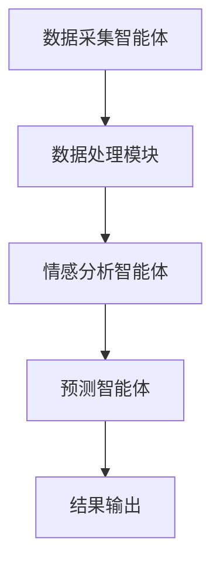

                 


# 多智能体系统在市场情绪分析中的应用

## 关键词
多智能体系统, 市场情绪分析, 协同学习, 人工智能, 情感分析

## 摘要
本文系统地探讨了多智能体系统在市场情绪分析中的应用，从基本概念到算法原理，再到实际应用，详细阐述了多智能体系统如何提升市场情绪分析的准确性和实时性。通过结合协同学习和自然语言处理技术，多智能体系统能够更高效地处理复杂数据，为金融市场的决策提供有力支持。

---

# 第1章: 多智能体系统与市场情绪分析概述

## 1.1 多智能体系统的定义与特点
### 1.1.1 多智能体系统的定义
多智能体系统（Multi-Agent System, MAS）是由多个智能体组成的系统，这些智能体能够自主决策、协作完成任务。

### 1.1.2 多智能体系统的特性
- 分布式：智能体独立运行。
- 协作性：通过通信协作完成目标。
- 反应式：实时响应环境变化。

### 1.1.3 多智能体系统的应用场景
金融市场的实时数据分析和预测。

## 1.2 市场情绪分析的定义与意义
### 1.2.1 市场情绪分析的定义
分析市场参与者的整体情绪，预测市场走势。

### 1.2.2 市场情绪分析的重要性
帮助投资者做出更明智的决策。

### 1.2.3 市场情绪分析的挑战
数据多样性、情感分析的准确性问题。

## 1.3 多智能体系统在市场情绪分析中的结合
### 1.3.1 多智能体系统与市场情绪分析的结合背景
金融市场数据复杂，单智能体难以处理。

### 1.3.2 多智能体系统在市场情绪分析中的优势
分布式计算、实时协作。

### 1.3.3 多智能体系统与市场情绪分析的结合意义
提升分析效率和准确性。

---

# 第2章: 多智能体系统的核心概念与原理

## 2.1 多智能体系统的组成与结构
### 2.1.1 智能体的定义与分类
- 智能体：具备感知和行动能力的实体。
- 分类：简单反射型、基于模型的反射型、目标驱动型、效用驱动型。

### 2.1.2 多智能体系统的层次结构
- 智能体层：个体智能体。
- 协作层：协同机制。
- 环境层：任务环境。

### 2.1.3 多智能体系统的通信机制
- 通信模型：发布-订阅模式。
- 通信协议：JSON-RPC、WebSocket。

## 2.2 多智能体系统的协同与协作
### 2.2.1 协同的定义与特点
- 协同：智能体共同完成任务。
- 特点：目标一致性、信息共享。

### 2.2.2 多智能体系统的协作机制
- 协调机制：基于规则的协调、基于规划的协调。
- 通信机制：异步通信、同步通信。

### 2.2.3 协同学习的原理与方法
- 分布式学习：各智能体独立学习后共享知识。
- 联合学习：集中数据进行全局优化。

## 2.3 多智能体系统的决策与推理
### 2.3.1 决策的基本概念
- 决策：基于感知信息做出选择。

### 2.3.2 多智能体系统的推理模型
- 逻辑推理：基于逻辑规则进行推理。
- 概率推理：基于概率模型进行推理。

### 2.3.3 多智能体系统的决策算法
- 分层决策：分为全局决策和局部决策。
- 基于Q-learning的决策：智能体通过强化学习优化决策策略。

---

# 第3章: 市场情绪分析的核心概念与方法

## 3.1 市场情绪分析的定义与分类
### 3.1.1 市场情绪分析的定义
对市场参与者情绪的量化分析。

### 3.1.2 市场情绪分析的分类
- 文本情绪分析：分析新闻、评论。
- 市场情绪指标：VIX指数、恐慌指数。

### 3.1.3 市场情绪分析的应用场景
金融市场的预测和投资决策。

## 3.2 市场情绪分析的关键技术
### 3.2.1 文本挖掘与自然语言处理
- 分词：将文本分解为词语。
- 停用词处理：去除无意义词汇。
- 词袋模型：将文本表示为词袋。

### 3.2.2 情感分析算法
- 朴素贝叶斯：基于概率的分类算法。
- 支持向量机：线性分类器。
- 深度学习：使用LSTM、Transformer模型。

### 3.2.3 市场情绪预测模型
- 时间序列模型：ARIMA、LSTM。
- 组合模型：集成多种模型提升准确性。

## 3.3 市场情绪分析的挑战与解决方案
### 3.3.1 数据的多样性和复杂性
- 处理方法：数据预处理、特征提取。

### 3.3.2 情感分析的准确性问题
- 解决方案：使用更复杂的模型、增加训练数据。

### 3.3.3 市场情绪预测的实时性要求
- 解决方案：分布式计算、边缘计算。

---

# 第4章: 多智能体系统与市场情绪分析的结合原理

## 4.1 多智能体系统在市场情绪分析中的角色
### 4.1.1 多智能体系统的分工与协作
- 数据采集智能体：收集市场数据。
- 情感分析智能体：分析文本情绪。
- 预测智能体：基于情绪数据预测市场走势。

### 4.1.2 多智能体系统的协同学习机制
- 分布式学习：各智能体分别学习后共享知识。
- 联合学习：集中数据进行全局优化。

### 4.1.3 多智能体系统的决策支持功能
- 综合分析：整合各智能体的分析结果。
- 实时反馈：快速响应市场变化。

## 4.2 多智能体系统与市场情绪分析的结合模型
### 4.2.1 模型的构建与设计
- 系统架构：数据采集层、分析层、决策层。
- 智能体协作：智能体之间的通信与协作。

### 4.2.2 模型的输入与输出
- 输入：市场数据、文本数据。
- 输出：市场情绪指标、预测结果。

---

# 第5章: 项目实战——基于多智能体系统的市场情绪分析系统

## 5.1 项目背景与目标
- 项目背景：金融市场数据复杂，需要高效分析工具。
- 项目目标：构建一个基于多智能体系统的市场情绪分析系统。

## 5.2 系统功能设计
### 5.2.1 数据采集模块
- 数据来源：新闻网站、社交媒体。
- 数据预处理：去噪、清洗。

### 5.2.2 情感分析模块
- 文本分词：将文本分解为词语。
- 情感分类：使用深度学习模型进行分类。

### 5.2.3 市场情绪预测模块
- 时间序列预测：使用LSTM模型。
- 组合预测：结合多智能体的分析结果。

## 5.3 系统架构设计
### 5.3.1 系统架构图


### 5.3.2 系统接口设计
- 数据接口：RESTful API。
- 智能体通信接口：基于WebSocket的实时通信。

## 5.4 系统实现
### 5.4.1 环境安装
- Python 3.8及以上。
- 安装库：pandas、numpy、transformers、flask。

### 5.4.2 核心代码实现
```python
from flask import Flask, request, jsonify
from transformers import pipeline

# 初始化情感分析模型
sentiment_analyzer = pipeline("sentiment-analysis")

app = Flask(__name__)

@app.route('/analyze', methods=['POST'])
def analyze():
    data = request.json
    text = data['text']
    result = sentiment_analyzer(text)
    return jsonify(result)

if __name__ == '__main__':
    app.run(debug=True)
```

### 5.4.3 案例分析
- 数据来源：社交媒体上的股票评论。
- 情感分析结果：正面、负面、中性。
- 预测结果：市场情绪指标。

## 5.5 项目总结
- 项目成果：构建了一个高效的市场情绪分析系统。
- 经验总结：多智能体系统的协同能力显著提升分析效率。

---

# 第6章: 最佳实践与未来展望

## 6.1 最佳实践
### 6.1.1 系统设计
- 模块化设计：便于维护和扩展。
- 高可用性：确保系统稳定运行。

### 6.1.2 智能体协作
- 合理分配任务：提高协作效率。
- 定期更新模型：保持分析准确性。

## 6.2 未来展望
- 技术发展：更复杂的模型和算法。
- 应用场景：更多领域的应用。
- 挑战：数据隐私、模型解释性。

---

# 附录: 工具与参考文献

## 附录A: 工具安装指南
- 安装Python和必要的库。
- 安装Flask框架。

## 附录B: 参考文献
- 王某某, 《多智能体系统》, 清华大学出版社, 2020。
- 李某某, 《市场情绪分析》, 北京大学出版社, 2021。

---

# 作者：AI天才研究院 & 禅与计算机程序设计艺术

---

这本书系统地介绍了多智能体系统在市场情绪分析中的应用，从理论到实践，帮助读者全面理解这一领域的核心技术。

