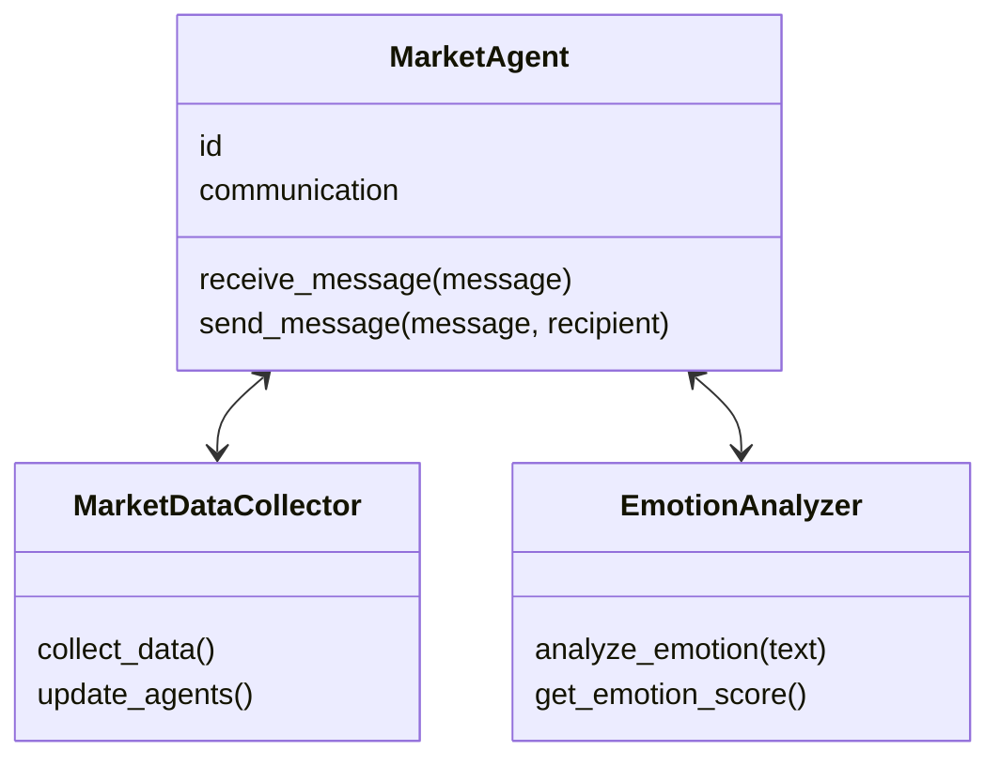
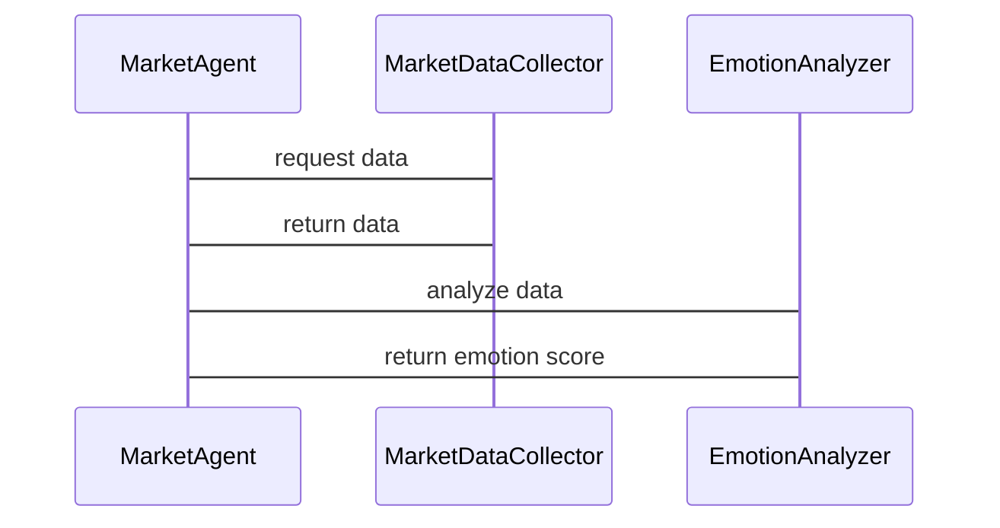

                 


# 多智能体系统在市场情绪分析中的应用：价值投资者的新工具

## 关键词：多智能体系统（MAS）、市场情绪分析、情感计算、价值投资、人工智能

## 摘要：
本文探讨多智能体系统（MAS）在市场情绪分析中的应用，特别是如何为价值投资者提供新的工具。通过分析MAS的基本概念、算法原理、系统架构和实际案例，本文展示了如何利用MAS提升市场情绪分析的准确性和效率，为投资者做出更明智的决策提供支持。

---

## 第一章: 多智能体系统概述

### 1.1 多智能体系统的定义与特点

#### 1.1.1 多智能体系统的定义
多智能体系统（Multi-Agent System, MAS）是由多个智能体（Agent）组成的分布式系统，每个智能体能够感知环境、自主决策并与其他智能体协作完成复杂任务。

#### 1.1.2 多智能体系统的核心特点
- **分布式计算**：智能体独立运行，通过通信协作完成任务。
- **协作性**：智能体之间通过信息共享和协作提高整体性能。
- **自主性**：每个智能体能够自主决策，适应环境变化。
- **反应性**：智能体能够实时感知环境并做出反应。

#### 1.1.3 多智能体系统的应用场景
- **金融交易**：用于实时市场分析和交易决策。
- **分布式计算**：处理大规模数据和复杂任务。
- **智能监控**：监控和管理复杂系统。

### 1.2 市场情绪分析的定义与重要性

#### 1.2.1 市场情绪分析的定义
市场情绪分析是通过分析市场参与者的情感倾向，预测市场走势的一种方法。它可以帮助投资者了解市场的乐观或悲观情绪，从而做出更明智的投资决策。

#### 1.2.2 市场情绪分析的重要性
- **预测市场趋势**：情绪分析可以揭示市场参与者的真实态度，帮助预测价格波动。
- **风险管理和投资决策**：通过分析情绪，投资者可以更好地管理风险，优化投资组合。

#### 1.2.3 市场情绪分析的常见方法
- **文本分析**：通过分析新闻、社交媒体和评论等文本数据，提取情感信息。
- **市场数据**：利用价格、成交量等市场数据，分析情绪变化。
- **混合方法**：结合文本和市场数据，综合分析市场情绪。

### 1.3 多智能体系统在市场情绪分析中的优势

#### 1.3.1 多智能体系统的分布式计算能力
MAS能够同时处理大量的数据，提高计算效率。

#### 1.3.2 多智能体系统的协作能力
智能体之间可以协作，共同完成复杂的情绪分析任务。

#### 1.3.3 多智能体系统的自适应能力
MAS能够根据市场变化动态调整策略，适应复杂多变的市场环境。

---

## 第二章: 多智能体系统与市场情绪分析

### 2.1 市场情绪分析的数学模型

#### 2.1.1 市场情绪分析的数学模型
市场情绪分析可以通过统计模型和机器学习模型来实现。例如，使用情感词典和情感分类算法对文本进行情感分析。

#### 2.1.2 情感分类算法
常用的情感分类算法包括朴素贝叶斯、支持向量机（SVM）和深度学习模型（如LSTM）。

### 2.2 多智能体系统与市场情绪分析的结合

#### 2.2.1 多智能体系统的协作流程
智能体之间通过通信协作，共同完成市场情绪分析任务。

#### 2.2.2 多智能体系统的任务分配
智能体根据自身能力和任务需求，自动分配任务。

### 2.3 多智能体系统在市场情绪分析中的具体应用

#### 2.3.1 数据采集与预处理
智能体负责采集市场数据和文本数据，并进行预处理。

#### 2.3.2 情感分析与市场预测
智能体通过情感分析算法，预测市场情绪，并根据情绪变化调整投资策略。

---

## 第三章: 算法原理

### 3.1 情感分析的分类算法

#### 3.1.1 朴素贝叶斯算法
朴素贝叶斯是一种基于概率的分类算法，常用于情感分类。

#### 3.1.2 支持向量机（SVM）
SVM是一种监督学习算法，适用于小规模数据的情感分类。

#### 3.1.3 深度学习模型
深度学习模型（如LSTM）适用于处理长文本数据的情感分类。

### 3.2 多智能体协作算法

#### 3.2.1 多智能体协作流程
智能体通过通信协作，共同完成市场情绪分析任务。

#### 3.2.2 多智能体协作算法的实现
通过分布式计算和任务分配，实现多智能体协作。

### 3.3 算法实现的Python代码示例

#### 3.3.1 情感分类的Python代码
```python
from sklearn.naive_bayes import MultinomialNB
from sklearn.feature_extraction.text import TfidfVectorizer

# 数据预处理
text_data = [...]  # 文本数据
labels = [...]     # 标签

# 特征提取
vectorizer = TfidfVectorizer()
X = vectorizer.fit_transform(text_data)

# 模型训练
model = MultinomialNB()
model.fit(X, labels)

# 预测
test_text = ["This is a positive review."]
X_test = vectorizer.transform([test_text])
prediction = model.predict(X_test)
print(prediction)
```

#### 3.3.2 多智能体协作的Python代码
```python
import agent_communication

class MarketAgent:
    def __init__(self, id):
        self.id = id
        self.communication = agent_communication.Communication()

    def receive_message(self, message):
        # 处理接收到的消息
        pass

    def send_message(self, message, recipient):
        # 发送消息
        self.communication.send(message, recipient)

# 初始化多个智能体
agents = [MarketAgent(i) for i in range(5)]

# 智能体协作
for agent in agents:
    agent.send_message("Market data update", "TradingAgent")
```

### 3.4 算法的数学模型

#### 3.4.1 朴素贝叶斯模型
$$ P(y|X) = \frac{P(X|y)P(y)}{P(X)} $$

#### 3.4.2 深度学习模型
$$ f(x) = \text{LSTM}(x) $$

---

## 第四章: 系统分析与架构设计

### 4.1 项目场景介绍

#### 4.1.1 项目背景
市场情绪分析对于投资者做出决策至关重要。

#### 4.1.2 项目目标
通过MAS实现高效、准确的市场情绪分析。

### 4.2 系统功能设计

#### 4.2.1 领域模型类图


#### 4.2.2 系统架构图


### 4.3 系统接口设计

#### 4.3.1 接口定义
- **数据采集接口**：MarketDataCollector负责采集市场数据。
- **情感分析接口**：EmotionAnalyzer负责分析文本情感。

#### 4.3.2 系统交互流程图


---

## 第五章: 项目实战

### 5.1 环境安装

#### 5.1.1 安装Python和相关库
- Python 3.8+
- NumPy、Scikit-learn、NLTK、Spacy

### 5.2 核心代码实现

#### 5.2.1 情感分析代码
```python
from sklearn.feature_extraction.text import TfidfVectorizer
from sklearn.naive_bayes import MultinomialNB

def train_emotion_classifier(text_data, labels):
    vectorizer = TfidfVectorizer()
    X = vectorizer.fit_transform(text_data)
    model = MultinomialNB()
    model.fit(X, labels)
    return model, vectorizer

def predict_emotion(model, vectorizer, text):
    X = vectorizer.transform([text])
    return model.predict(X)[0]
```

#### 5.2.2 多智能体协作代码
```python
from multiprocessing import Process, Queue

class Agent(Process):
    def __init__(self, agent_id, queue):
        super().__init__()
        self.agent_id = agent_id
        self.queue = queue

    def run(self):
        while True:
            if not self.queue.empty():
                message = self.queue.get()
                self.process_message(message)

    def process_message(self, message):
        # 处理消息
        pass

# 初始化智能体
queue = Queue()
agents = [Agent(i, queue) for i in range(5)]
for agent in agents:
    agent.start()
```

### 5.3 项目小结

#### 5.3.1 项目成果
通过MAS实现高效的市场情绪分析。

#### 5.3.2 经验总结
MAS能够提高市场情绪分析的准确性和效率。

---

## 第六章: 最佳实践

### 6.1 小结

#### 6.1.1 项目总结
MAS在市场情绪分析中具有重要的应用价值。

#### 6.1.2 经验分享
在实际应用中，需要注意数据质量和模型调优。

### 6.2 注意事项

#### 6.2.1 数据质量问题
确保数据的准确性和完整性。

#### 6.2.2 模型调优
定期更新模型，确保其适应市场变化。

### 6.3 拓展阅读

#### 6.3.1 相关领域
- 强化学习
- 分布式计算
- 大数据分析

#### 6.3.2 推荐书籍
- 《多智能体系统的理论与应用》
- 《市场情绪分析与投资决策》

---

## 作者：AI天才研究院/AI Genius Institute & 禅与计算机程序设计艺术 /Zen And The Art of Computer Programming

---

以上是《多智能体系统在市场情绪分析中的应用：价值投资者的新工具》的技术博客文章的完整目录和内容概览。

