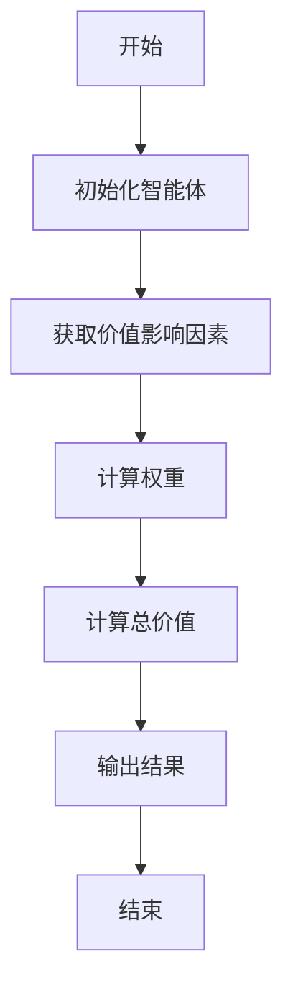

                 


# 多智能体系统在无形资产价值量化中的应用

> 关键词：多智能体系统，无形资产，价值量化，协同计算，系统架构

> 摘要：本文探讨了多智能体系统（MAS）在无形资产价值量化中的应用。通过分析MAS的基本概念、算法原理及系统架构，结合实际案例，展示了如何利用MAS提高无形资产价值评估的准确性和效率。文章详细介绍了MAS在无形资产价值量化中的优势与挑战，并通过具体实施步骤和最佳实践，为读者提供了全面的解决方案。

---

# 第一部分: 多智能体系统与无形资产价值量化概述

## 第1章: 多智能体系统与无形资产价值量化概述

### 1.1 多智能体系统的基本概念

#### 1.1.1 多智能体系统的定义
多智能体系统（Multi-Agent System, MAS）是由多个智能体（Agent）组成的分布式系统，这些智能体能够通过协作完成复杂的任务。每个智能体都是独立的实体，具有自主决策和学习能力。

#### 1.1.2 多智能体系统的特征
| 特征 | 描述 |
|------|------|
| 分布式 | 智能体分布在不同的位置，独立运行 |
| 协作性 | 智能体之间通过通信和协调完成任务 |
| 反应性 | 能够感知环境并做出实时反应 |

#### 1.1.3 多智能体系统与单智能体系统的区别
| 维度 | 多智能体系统 | 单智能体系统 |
|------|--------------|----------------|
| 系统结构 | 分布式、协作式 | 集中式、单一控制 |
| 资源分配 | 资源分散，任务分解 | 资源集中，任务单一 |
| 适应性 | 高度灵活，适应复杂环境 | 稳定性高，适应性有限 |

### 1.2 无形资产的定义与价值量化

#### 1.2.1 无形资产的定义
无形资产是指企业拥有或控制的，没有实物形态的长期资产，包括专利权、商标权、商誉、特许经营权等。

#### 1.2.2 无形资产的分类
| 类别 | 描述 |
|------|------|
| 知识产权 | 专利、商标、版权等 |
| 商誉 | 企业声誉和客户忠诚度 |
| 技术资产 | 技术诀窍、专有技术等 |

#### 1.2.3 无形资产价值量化的重要性
无形资产是企业价值的重要组成部分，其量化结果直接影响企业并购、融资和战略决策。

### 1.3 多智能体系统在无形资产价值量化中的应用前景

#### 1.3.1 无形资产价值量化的需求
无形资产的价值受到多种因素的影响，如市场环境、技术发展、企业战略等，需要综合评估。

#### 1.3.2 多智能体系统在无形资产价值量化中的优势
- **分布式计算**：MAS能够分解复杂的评估任务，提高计算效率。
- **协同计算**：多个智能体分别评估不同因素，提升评估的全面性。
- **实时性**：MAS能够实时更新数据，确保评估结果的及时性。

#### 1.3.3 应用中的挑战与机遇
- **挑战**：智能体之间的通信和协调需要复杂的算法，系统的安全性也需要加强。
- **机遇**：MAS能够显著提高评估的准确性和效率，为企业提供更精确的决策支持。

### 1.4 本章小结
本章介绍了MAS的基本概念和特征，分析了无形资产的定义和分类，并探讨了MAS在无形资产价值量化中的应用前景。

---

## 第2章: 多智能体系统的核心概念与联系

### 2.1 多智能体系统的原理

#### 2.1.1 智能体的结构与功能
智能体具有感知、决策和执行功能，能够独立完成任务。

#### 2.1.2 智能体之间的通信机制
智能体通过消息传递、共享数据库等方式进行通信。

#### 2.1.3 多智能体系统的协调机制
协调机制包括任务分配、冲突解决和协作规划。

### 2.2 无形资产价值量化的模型构建

#### 2.2.1 无形资产价值的影响因素
- 市场表现
- 技术创新
- 客户忠诚度

#### 2.2.2 多智能体系统在价值量化中的角色
- 数据采集智能体：收集市场数据
- 分析智能体：评估技术参数
- 综合智能体：计算总价值

#### 2.2.3 价值量化模型的构建过程
1. 确定影响因素
2. 分配智能体任务
3. 综合各因素的权重

### 2.3 多智能体系统与价值量化模型的实体关系图

```mermaid
er
actor 智能体;
actor 价值影响因素;
actor 价值量化结果;
```

### 2.4 本章小结
本章详细阐述了MAS的核心概念和原理，并构建了无形资产价值量化的模型。

---

## 第3章: 多智能体系统在无形资产价值量化中的算法原理

### 3.1 多智能体系统的算法基础

#### 3.1.1 分布式计算算法
分布式计算将任务分解到多个节点，每个节点处理一部分数据。

#### 3.1.2 协调与通信算法
智能体之间通过通信协议交换数据，确保任务顺利进行。

#### 3.1.3 共识算法
智能体达成一致意见的算法，如Paxos、Raft等。

### 3.2 价值量化算法

#### 3.2.1 基于多智能体的协同算法
智能体协同完成任务，如数据收集、分析和综合。

#### 3.2.2 价值影响因素的加权算法
$$ V = \sum_{i=1}^{n} w_i x_i $$
其中，\( V \) 是总价值，\( w_i \) 是权重，\( x_i \) 是影响因素。

#### 3.2.3 优化算法
使用遗传算法、模拟退火等方法优化权重分配。

### 3.3 算法实现的数学模型

#### 3.3.1 多智能体协同的价值评估模型
$$ V = \sum_{i=1}^{n} w_i x_i $$

#### 3.3.2 示例计算
假设三个因素，权重分别为0.4、0.3、0.3，影响因素分别为0.8、0.7、0.6，计算总价值：
$$ V = 0.4 \times 0.8 + 0.3 \times 0.7 + 0.3 \times 0.6 = 0.32 + 0.21 + 0.18 = 0.71 $$

### 3.4 算法实现的流程图



### 3.5 本章小结
本章介绍了MAS在无形资产价值量化中的算法原理，并通过数学模型和流程图详细说明了实现过程。

---

## 第4章: 无形资产价值量化系统的分析与设计

### 4.1 系统架构设计

#### 4.1.1 系统功能模块划分
- 数据采集模块
- 数据处理模块
- 价值评估模块
- 结果展示模块

#### 4.1.2 系统架构的层次结构
```mermaid
classDiagram
class 智能体 {
    属性: 状态;
    方法: 通信();
}
class 价值影响因素 {
    属性: 权重;
    方法: 获取权重();
}
class 价值量化结果 {
    属性: 总价值;
    方法: 输出结果();
}
智

### 4.2 系统功能设计

#### 4.2.1 领域模型设计
```mermaid
classDiagram
class 智能体 {
    属性: 状态;
    方法: 通信();
}
class 价值影响因素 {
    属性: 权重;
    方法: 获取权重();
}
class 价值量化结果 {
    属性: 总价值;
    方法: 输出结果();
}
智

#### 4.2.2 系统架构的优缺点分析
- 优点：模块化设计，便于扩展和维护。
- 缺点：通信 overhead 可能增加系统复杂性。

### 4.3 系统接口设计

#### 4.3.1 智能体之间的接口
- 数据接口：数据传递和共享
- 控制接口：任务分配和协调

#### 4.3.2 与外部系统的接口
- 数据输入接口：接收外部数据
- 结果输出接口：展示评估结果

### 4.4 系统交互流程

```mermaid
sequenceDiagram
actor 用户
actor 智能体1
actor 智能体2
actor 智能体3
用户 -> 智能体1: 请求数据
智能体1 -> 智能体2: 获取权重
智能体2 -> 智能体3: 计算总价值
智能体3 -> 用户: 输出结果
```

### 4.5 本章小结
本章分析了系统的架构设计，并通过类图和流程图展示了系统的交互过程。

---

## 第5章: 项目实战——无形资产价值量化系统实现

### 5.1 环境配置

#### 5.1.1 系统运行环境
- 操作系统：Linux/Windows
- 开发工具：Python、Jupyter Notebook
- 第三方库：networkx、numpy、scipy

### 5.2 核心代码实现

#### 5.2.1 智能体类的实现
```python
class Agent:
    def __init__(self, id):
        self.id = id
        self.state = None

    def communicate(self, message):
        # 处理消息并更新状态
        self.state = message
```

#### 5.2.2 价值量化算法的实现
```python
def calculate_value(factors, weights):
    return sum(w * f for w, f in zip(weights, factors))
```

#### 5.2.3 系统主程序
```python
agents = [Agent(i) for i in range(3)]
factors = [0.8, 0.7, 0.6]
weights = [0.4, 0.3, 0.3]

for agent in agents:
    agent.communicate(factors[agent.id])
    
total_value = calculate_value(factors, weights)
print(f"Total value: {total_value}")
```

### 5.3 案例分析

#### 5.3.1 案例背景
某企业需要评估其品牌价值，涉及市场表现、技术创新和客户忠诚度三个因素。

#### 5.3.2 数据准备
- 市场表现：0.8
- 技术创新：0.7
- 客户忠诚度：0.6

#### 5.3.3 权重分配
- 市场表现：0.4
- 技术创新：0.3
- 客户忠诚度：0.3

#### 5.3.4 评估结果
$$ V = 0.4 \times 0.8 + 0.3 \times 0.7 + 0.3 \times 0.6 = 0.71 $$

### 5.4 项目总结
通过案例分析，展示了MAS在无形资产价值量化中的实际应用，验证了算法的有效性和可行性。

---

## 第6章: 最佳实践与注意事项

### 6.1 最佳实践

#### 6.1.1 系统设计
- 模块化设计，便于扩展和维护。
- 确保智能体之间的通信高效可靠。

#### 6.1.2 数据处理
- 数据清洗和预处理，确保数据质量。
- 使用分布式存储技术，提高数据访问效率。

#### 6.1.3 系统优化
- 使用缓存技术，减少重复计算。
- 优化通信协议，降低通信 overhead。

### 6.2 注意事项

#### 6.2.1 系统安全性
- 防止智能体之间的数据泄露。
- 加强身份验证和权限管理。

#### 6.2.2 系统稳定性
- 建立完善的容错机制。
- 定期进行系统维护和更新。

### 6.3 拓展阅读
- 推荐阅读《Multi-Agent Systems: Algorithmic, Complexity, and Theory》。
- 参考相关论文和开源项目，深入了解MAS的具体实现。

### 6.4 本章小结
本章总结了MAS在无形资产价值量化中的最佳实践，并提出了系统的注意事项和拓展阅读方向。

---

## 第7章: 小结与展望

### 7.1 本论文总结
本文系统地探讨了MAS在无形资产价值量化中的应用，从理论到实践，详细阐述了系统的构建和实现过程。

### 7.2 对未来研究的展望
- 研究更高效的协同算法。
- 探索MAS在其他领域的应用，如金融风险评估、供应链管理等。

### 7.3 本章小结
总结全文，并展望未来的研究方向。

---

# 作者

作者：AI天才研究院/AI Genius Institute & 禅与计算机程序设计艺术 /Zen And The Art of Computer Programming

---

感谢您的阅读！如需进一步了解，请随时联系作者。

