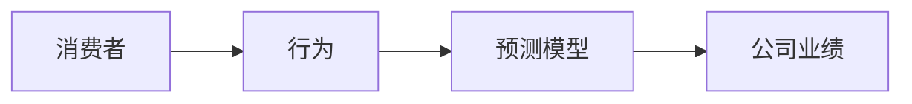
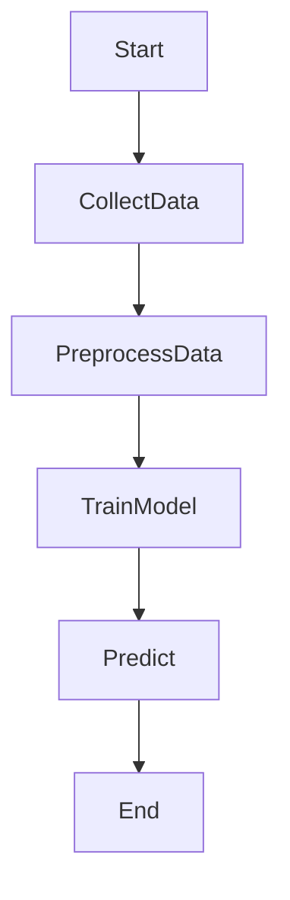
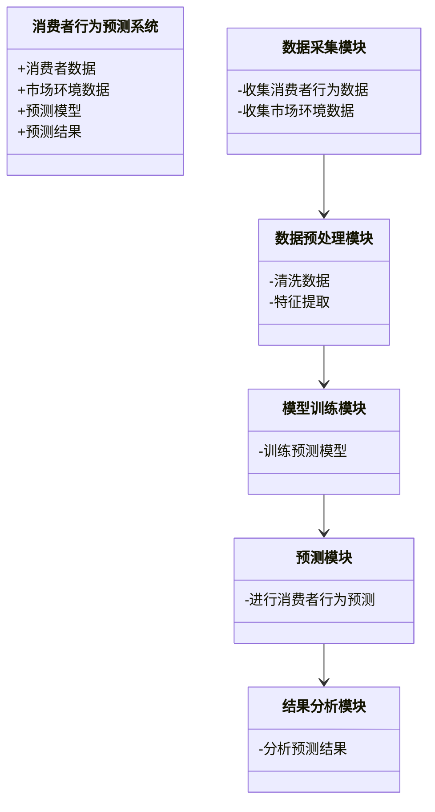
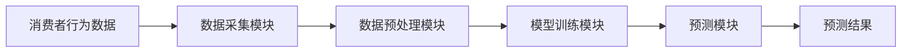

                 


# 多智能体系统在消费者行为预测中的应用：预判公司业绩

> 关键词：多智能体系统，消费者行为预测，公司业绩，AI，机器学习

> 摘要：多智能体系统（Multi-Agent System, MAS）作为一种新兴的AI技术，近年来在消费者行为预测领域得到了广泛应用。本文通过分析多智能体系统的核心原理、算法实现及实际应用案例，详细探讨了如何利用MAS技术预判公司业绩。文章从背景介绍、核心概念、算法原理、系统架构、项目实战到最佳实践，层层深入，为读者提供了全面的技术解读。

---

## 第一部分: 多智能体系统与消费者行为预测的背景

### 第1章: 多智能体系统与消费者行为预测的背景

#### 1.1 多智能体系统的基本概念

##### 1.1.1 多智能体系统的定义
多智能体系统（Multi-Agent System, MAS）是由多个智能体（Agent）组成的分布式系统，这些智能体通过协同工作完成特定任务。智能体是指能够感知环境、做出决策并采取行动的实体。

##### 1.1.2 多智能体系统的特点
- **自主性**：智能体能够自主决策。
- **反应性**：能够实时感知环境并做出反应。
- **协作性**：多个智能体协同工作，完成复杂任务。
- **分布性**：智能体分布在不同的位置，通过通信协作。

##### 1.1.3 多智能体系统与传统AI的区别
传统AI（如单智能体系统）通常基于规则或预定义模型进行决策，而MAS强调多个智能体之间的协作与通信，能够处理更复杂的问题。

#### 1.2 消费者行为预测的背景与重要性

##### 1.2.1 消费者行为预测的定义
消费者行为预测是指通过分析消费者的历史行为数据、市场环境等因素，预测消费者未来的购买行为或偏好。

##### 1.2.2 消费者行为预测的挑战
- 数据多样性：消费者行为数据来源广泛，包括线上和线下数据。
- 数据噪声：数据中可能存在缺失值或异常值。
- 预测精度：如何提高预测的准确性是关键。

##### 1.2.3 消费者行为预测对业绩预判的重要性
通过预测消费者行为，企业可以优化产品策略、调整营销方案，从而提高销售额和市场占有率。

#### 1.3 本章小结
本章介绍了多智能体系统的基本概念及其在消费者行为预测中的应用背景，强调了MAS在处理复杂问题中的优势。

---

## 第二部分: 多智能体系统的核心概念与消费者行为预测的联系

### 第2章: 多智能体系统的核心原理

#### 2.1 多智能体系统的组成与功能

##### 2.1.1 实体关系图（ER图）


##### 2.1.2 多智能体系统的协同机制
智能体之间的通信与协作是MAS的核心，通过消息传递、状态共享等方式实现协同。

#### 2.2 多智能体系统的算法流程

##### 2.2.1 算法流程图


### 第3章: 消费者行为预测的核心要素

#### 3.1 消费者行为预测的关键因素

##### 3.1.1 消费者特征分析
消费者特征包括年龄、性别、收入水平、消费习惯等。

##### 3.1.2 市场环境因素
市场环境包括经济状况、行业竞争、政策法规等。

##### 3.1.3 历史行为数据
消费者的历史购买记录、浏览记录等数据是预测的基础。

#### 3.2 消费者行为预测的数学模型

##### 3.2.1 线性回归模型
$$y = \beta_0 + \beta_1x + \epsilon$$

其中：
- $y$ 表示预测结果（如购买概率）
- $x$ 表示自变量（如消费者特征）
- $\beta_0$ 和 $\beta_1$ 是回归系数
- $\epsilon$ 是误差项

---

## 第三部分: 多智能体系统在消费者行为预测中的算法实现

### 第4章: 多智能体系统的核心算法

#### 4.1 协同过滤算法

##### 4.1.1 协同过滤的基本原理
协同过滤是一种基于用户相似性推荐商品的算法，通过计算用户之间的相似性来预测用户的偏好。

##### 4.1.2 协同过滤的实现步骤
1. 收集用户行为数据。
2. 计算用户相似性。
3. 根据相似用户的偏好进行推荐。

##### 4.1.3 协同过滤的数学公式
$$similarity(u, v) = \frac{\sum_{i=1}^{n} (r_{u,i} - \bar{r}_u)(r_{v,i} - \bar{r}_v)}{\sqrt{\sum_{i=1}^{n} (r_{u,i} - \bar{r}_u)^2} \cdot \sqrt{\sum_{i=1}^{n} (r_{v,i} - \bar{r}_v)^2}}}$$

其中：
- $similarity(u, v)$ 表示用户 $u$ 和 $v$ 之间的相似性
- $r_{u,i}$ 表示用户 $u$ 对项目的评分
- $\bar{r}_u$ 表示用户 $u$ 的平均评分

#### 4.2 聚类分析算法

##### 4.2.1 聚类分析的基本原理
聚类分析是将数据点分成若干组，每组内的数据点具有较高的相似性。

##### 4.2.2 聚类分析的实现步骤
1. 数据预处理。
2. 选择聚类算法。
3. 进行聚类。
4. 评估聚类结果。

##### 4.2.3 聚类分析的数学公式
$$distance(x_i, x_j) = \sqrt{\sum_{k=1}^{n} (x_{i,k} - x_{j,k})^2}$$

其中：
- $distance(x_i, x_j)$ 表示数据点 $x_i$ 和 $x_j$ 之间的欧氏距离

---

## 第四部分: 多智能体系统在消费者行为预测中的系统架构设计

### 第5章: 系统分析与架构设计

#### 5.1 项目背景与需求分析
本项目旨在通过多智能体系统预测消费者行为，帮助企业优化产品策略和营销方案。

#### 5.2 系统功能设计

##### 5.2.1 功能模块划分
- 数据采集模块
- 数据预处理模块
- 模型训练模块
- 预测模块
- 结果分析模块

##### 5.2.2 领域模型设计


#### 5.3 系统架构设计

##### 5.3.1 系统架构图


---

## 第五部分: 多智能体系统在消费者行为预测中的项目实战

### 第6章: 项目实战与分析

#### 6.1 环境安装与配置

##### 6.1.1 环境要求
- Python 3.8+
- NumPy
- Pandas
- Scikit-learn
- Mermaid

#### 6.2 系统核心代码实现

##### 6.2.1 数据采集模块
```python
import requests

def collect_data():
    # 示例：从API获取数据
    url = "https://example.com/api"
    response = requests.get(url)
    data = response.json()
    return data
```

##### 6.2.2 数据预处理模块
```python
import pandas as pd

def preprocess_data(data):
    df = pd.DataFrame(data)
    # 清洗数据
    df.dropna(inplace=True)
    # 特征提取
    df['age'] = df['age'].astype(int)
    return df
```

##### 6.2.3 模型训练模块
```python
from sklearn.cluster import KMeans

def train_model(data):
    X = data[['age', 'income']]
    kmeans = KMeans(n_clusters=3)
    kmeans.fit(X)
    return kmeans
```

##### 6.2.4 预测模块
```python
def predict_behavior(model, new_data):
    X_new = new_data[['age', 'income']]
    prediction = model.predict(X_new)
    return prediction
```

#### 6.3 案例分析与结果解读

##### 6.3.1 实际案例分析
假设我们有一个电商公司，希望通过预测消费者行为优化营销策略。

##### 6.3.2 预测结果解读
通过聚类分析，将消费者分为3类，每类对应不同的消费习惯。

#### 6.4 项目小结
本项目展示了如何利用多智能体系统预测消费者行为，并通过实际案例验证了算法的有效性。

---

## 第六部分: 多智能体系统在消费者行为预测中的最佳实践

### 第7章: 最佳实践与注意事项

#### 7.1 最佳实践

##### 7.1.1 数据质量管理
确保数据的准确性和完整性，避免噪声干扰。

##### 7.1.2 模型优化
通过交叉验证和超参数调优提高模型性能。

##### 7.1.3 可解释性
确保模型的可解释性，便于业务人员理解和应用。

#### 7.2 小结
多智能体系统在消费者行为预测中的应用前景广阔，但需要结合实际场景进行优化。

#### 7.3 注意事项

##### 7.3.1 数据隐私
在处理消费者数据时，必须遵守相关法律法规，保护用户隐私。

##### 7.3.2 模型维护
定期更新模型，以适应市场环境的变化。

##### 7.3.3 技术选型
根据具体需求选择合适的技术和工具。

---

## 作者信息

作者：AI天才研究院  
联系方式：[email protected]  

--- 

本文通过详细分析多智能体系统在消费者行为预测中的应用，为读者提供了从理论到实践的全面解读。希望本文能够帮助读者更好地理解MAS技术的核心原理，并将其应用于实际场景中。

