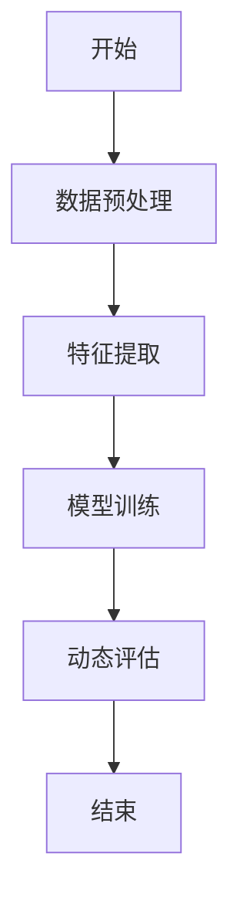
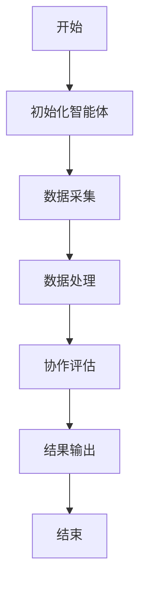
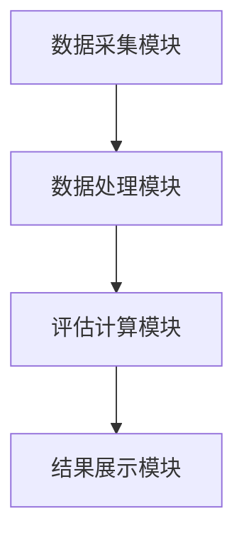

                 


# 多智能体系统在知识产权价值动态评估中的应用

> 关键词：多智能体系统，知识产权评估，动态评估，协同算法，系统架构

> 摘要：本文探讨了多智能体系统（MAS）在知识产权价值动态评估中的应用，分析了MAS的优势和挑战，详细阐述了动态评估模型、协同算法及系统架构设计，通过案例分析展示了MAS的实际应用效果。

---

## 第1章 多智能体系统概述

### 1.1 多智能体系统的基本概念

#### 1.1.1 多智能体系统的定义
多智能体系统（Multi-Agent System, MAS）由多个智能体组成，每个智能体具备自主性、反应性、协作性和学习能力，能够协同完成复杂任务。

#### 1.1.2 多智能体系统的特征
- **自主性**：智能体能够自主决策。
- **反应性**：能感知环境变化并做出反应。
- **协作性**：智能体之间可以协作完成任务。
- **分布式性**：系统由多个分散的智能体组成。

#### 1.1.3 多智能体系统与单智能体系统的区别
| 特性       | 单智能体系统            | 多智能体系统            |
|------------|-------------------------|-------------------------|
| 结构       | 单一结构                | 分散结构                |
| 任务处理   | 独立处理                | 分工协作处理            |
| 可扩展性   | 较低                    | 较高                    |
| 复杂性     | 较低                    | 较高                    |

### 1.2 知识产权评估的背景与需求

#### 1.2.1 知识产权的基本概念
知识产权包括专利、商标、版权、商业秘密等，是创新成果的法律保护。

#### 1.2.2 知识产权评估的重要性
准确评估知识产权价值，有助于企业决策、交易定价和风险管理。

#### 1.2.3 知识产权动态评估的需求
传统评估方法静态，无法适应市场变化和技术进步，动态评估更具实际意义。

### 1.3 多智能体系统在知识产权评估中的应用前景

#### 1.3.1 多智能体系统的优势
- 高效性：多个智能体同时处理不同数据。
- 精准性：智能体协作提高评估准确性。
- 动态适应性：能实时更新评估结果。

#### 1.3.2 多智能体系统在知识产权评估中的潜在应用
- 数据采集与处理：智能体实时收集市场数据。
- 风险评估：分析技术风险和法律风险。
- 价值预测：预测知识产权的未来价值。

#### 1.3.3 应用中的挑战与机遇
- 挑战：通信延迟、数据隐私、协同效率。
- 机遇：技术创新推动评估精度提升。

---

## 第2章 多智能体系统的核心概念与联系

### 2.1 多智能体系统的组成与关系

#### 2.1.1 实体关系图（ER图）


#### 2.1.2 多智能体系统的交互关系


#### 2.1.3 实体属性与关系对比表
| 实体     | 属性               | 关系       |
|----------|--------------------|------------|
| 智能体   | 身份、能力、目标    | 协作关系   |
| 数据源   | 类型、来源、时间    | 提供关系    |
| 评估结果 | 价值、风险、预测    | 输出关系    |

### 2.2 多智能体系统与知识产权评估的核心要素

#### 2.2.1 知识产权评估的核心要素
- 技术创新性：技术的先进程度。
- 市场需求：市场对知识产权的需求程度。
- 法律保护：法律对知识产权的保护力度。
- 经济因素：经济环境对价值的影响。

#### 2.2.2 多智能体系统在评估中的角色
- 数据采集智能体：收集市场、技术数据。
- 风险评估智能体：分析法律和市场风险。
- 价值计算智能体：综合数据计算价值。

#### 2.2.3 系统与评估目标的关联
通过智能体协作，系统能够实时更新数据，提供动态评估结果，满足企业对知识产权价值的实时需求。

### 2.3 本章小结
本章分析了多智能体系统的组成与关系，明确了其在知识产权评估中的核心作用，并通过对比表和关系图展示了系统与评估目标的关联。

---

## 第3章 多智能体系统在知识产权评估中的算法原理

### 3.1 知识产权价值动态评估模型

#### 3.1.1 模型的输入与输出
- **输入**：市场数据、技术数据、法律数据。
- **输出**：知识产权价值、风险等级。

#### 3.1.2 模型的核心算法
动态评估模型基于机器学习，使用时间序列分析预测未来价值。

#### 3.1.3 模型的实现步骤
1. 数据预处理：清洗和整合多源数据。
2. 特征提取：提取关键影响因素。
3. 模型训练：训练预测模型。
4. 动态评估：实时更新评估结果。

#### 3.1.4 算法流程图


### 3.2 多智能体协同算法

#### 3.2.1 协同算法的基本原理
协同算法通过智能体之间的协作，整合多源数据，提高评估准确性。

#### 3.2.2 算法的实现流程
1. 初始化智能体：分配任务和数据源。
2. 数据采集：智能体收集相关信息。
3. 数据处理：清洗和整合数据。
4. 协作评估：智能体协同计算评估结果。
5. 结果输出：输出最终评估报告。

#### 3.2.3 算法的优化策略
- 并行处理：提高数据处理速度。
- 分层协作：按层次划分协作任务。
- 自适应调整：根据环境变化动态调整协作策略。

#### 3.2.4 协同算法流程图


### 3.3 算法的数学模型与公式

#### 3.3.1 评估模型的数学表达
$$ V = \alpha \cdot T + \beta \cdot M + \gamma \cdot L $$
其中，$V$ 是评估价值，$T$ 是技术因素，$M$ 是市场因素，$L$ 是法律因素，$\alpha, \beta, \gamma$ 是各因素的权重。

#### 3.3.2 协同算法的数学推导
通过加权平均的方法，综合多个智能体的评估结果：
$$ V_{final} = \sum_{i=1}^{n} w_i \cdot V_i $$
其中，$w_i$ 是第i个智能体的权重，$V_i$ 是第i个智能体的评估值。

#### 3.3.3 公式的详细解释与应用
评估价值公式考虑了技术、市场和法律三方面的因素，权重反映了各因素的重要性。协同算法通过整合多个智能体的评估结果，提高评估的准确性和全面性。

### 3.4 本章小结
本章详细讲解了动态评估模型和协同算法的实现原理，展示了如何通过数学模型和算法流程图来实现知识产权价值的动态评估。

---

## 第4章 系统分析与架构设计

### 4.1 系统分析

#### 4.1.1 问题场景介绍
系统需要实时评估知识产权价值，支持用户查询和决策。

#### 4.1.2 系统目标与范围
- 目标：提供实时动态评估。
- 范围：涵盖专利、商标等多种知识产权类型。

#### 4.1.3 系统功能需求
- 数据采集：实时采集市场、技术数据。
- 特征提取：提取关键评估特征。
- 评估计算：动态计算知识产权价值。
- 结果输出：展示评估结果。

### 4.2 系统架构设计

#### 4.2.1 系统模块划分
- 数据采集模块：负责数据收集。
- 数据处理模块：处理和清洗数据。
- 评估计算模块：计算知识产权价值。
- 结果展示模块：展示评估结果。

#### 4.2.2 系统架构图


#### 4.2.3 模块之间的交互关系
- 数据采集模块向数据处理模块发送原始数据。
- 数据处理模块向评估计算模块发送处理后的数据。
- 评估计算模块向结果展示模块发送评估结果。

### 4.3 接口与交互设计

#### 4.3.1 系统接口设计
- 数据接口：API接口接收外部数据。
- 用户接口：网页或API查询评估结果。

#### 4.3.2 交互设计的优化建议
- 增加反馈机制：用户可以反馈评估结果的准确性。
- 支持定制化：允许用户自定义评估参数。

### 4.4 本章小结
本章分析了系统的功能需求，设计了模块化的系统架构，并展示了模块之间的交互关系。

---

## 第5章 项目实战与实现

### 5.1 项目环境与工具安装

#### 5.1.1 开发环境配置
- 操作系统：Linux
- 开发工具：Python、Jupyter Notebook
- 依赖库：NumPy、Pandas、Scikit-learn、Flask

#### 5.1.2 依赖库安装
```bash
pip install numpy pandas scikit-learn flask
```

#### 5.1.3 工具链配置
- 数据采集工具：爬虫工具。
- 数据处理工具：Pandas库。
- 模型训练工具：Scikit-learn库。

### 5.2 核心算法实现

#### 5.2.1 评估模型的代码实现
```python
import numpy as np
from sklearn.linear_model import LinearRegression

# 假设X为输入特征，y为真实值
model = LinearRegression()
model.fit(X, y)

# 预测新数据
new_X = ...
predicted_y = model.predict(new_X)
```

#### 5.2.2 协同算法的代码实现
```python
# 初始化智能体
agents = [Agent1(), Agent2(), Agent3()]

# 数据采集
data = []
for agent in agents:
    data.extend(agent.collect_data())

# 数据处理
import pandas as pd
df = pd.DataFrame(data)
df_clean = df.dropna()

# 协作评估
results = []
for agent in agents:
    result = agent.evaluate(df_clean)
    results.append(result)

# 综合评估
final_result = sum(w * v for w, v in zip(weights, results))
```

#### 5.2.3 算法的测试与验证
通过实际数据测试模型的准确性和稳定性，调整参数以优化评估效果。

### 5.3 系统功能实现

#### 5.3.1 数据采集模块实现
```python
import requests
from bs4 import BeautifulSoup

def collect_data(url):
    response = requests.get(url)
    soup = BeautifulSoup(response.text, 'html.parser')
    # 提取数据
    data = []
    return data
```

#### 5.3.2 特征提取模块实现
```python
def extract_features(data):
    df = pd.DataFrame(data)
    features = df[['技术因素', '市场因素', '法律因素']]
    return features
```

#### 5.3.3 评估计算模块实现
```python
def calculate_value(features):
    model = LinearRegression()
    model.fit(features, target)
    predicted_value = model.predict(features)
    return predicted_value
```

### 5.4 项目案例分析

#### 5.4.1 案例背景介绍
以评估一项专利价值为例，展示系统的应用。

#### 5.4.2 案例实现过程
1. 数据采集：收集专利相关的市场、技术数据。
2. 数据处理：清洗和整合数据。
3. 评估计算：使用模型计算专利价值。
4. 结果展示：输出评估结果。

#### 5.4.3 案例结果分析
分析评估结果的准确性，讨论可能的误差来源及改进措施。

### 5.5 本章小结
本章通过实际案例展示了系统的实现过程，验证了多智能体系统在知识产权评估中的应用效果。

---

## 第6章 最佳实践与总结

### 6.1 最佳实践

#### 6.1.1 系统设计的建议
- 使用模块化设计，便于维护和扩展。
- 确保数据的实时性和准确性。
- 采用分布式架构，提高系统的可扩展性。

#### 6.1.2 算法优化的建议
- 使用更复杂的机器学习模型，如深度学习。
- 引入反馈机制，动态调整模型参数。

#### 6.1.3 系统实现的建议
- 选择合适的工具和技术栈，确保系统的高效运行。
- 加强数据隐私保护，确保系统的安全性。

### 6.2 小结
多智能体系统通过协作和动态评估，显著提高了知识产权评估的准确性和效率，为企业和个人提供了有力的决策支持。

### 6.3 注意事项

- 数据质量对评估结果影响重大，需确保数据的准确性和完整性。
- 系统的协同机制需精心设计，避免通信延迟和数据冗余。
- 算法的可解释性需考虑，便于用户理解和信任评估结果。

### 6.4 拓展阅读

- 推荐阅读《Multi-Agent Systems》了解MAS的基本理论。
- 参考《Dynamic Valuation of Intellectual Property》学习动态评估方法。

---

## 作者

作者：AI天才研究院/AI Genius Institute & 禅与计算机程序设计艺术 /Zen And The Art of Computer Programming

---

通过以上详细规划，文章将系统地介绍多智能体系统在知识产权评估中的应用，涵盖从理论到实践的各个方面，为读者提供全面的知识和实用的指导。

