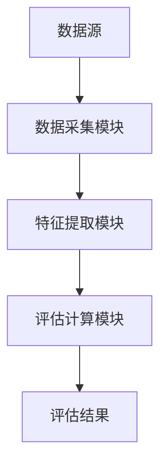
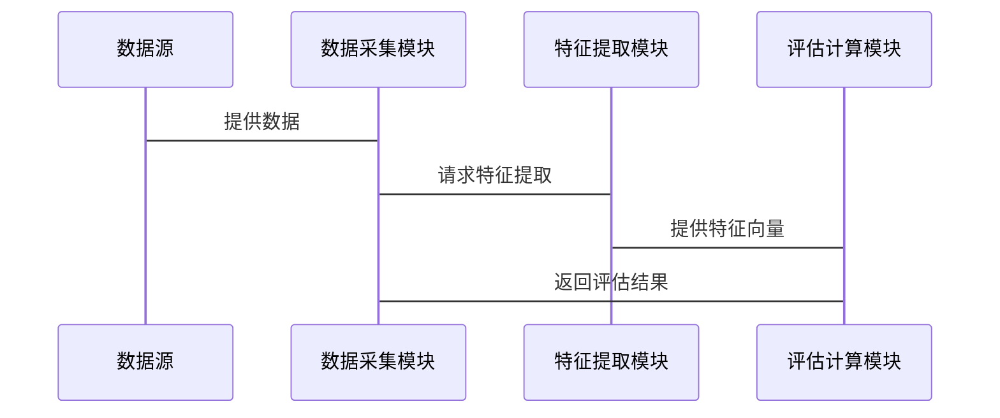

                 


# 多智能体系统在知识产权价值评估中的应用

> 关键词：多智能体系统, 知识产权评估, 协同学习, 强化学习, 系统架构

> 摘要：知识产权价值评估是一个复杂而重要的任务，传统方法依赖于人工判断，存在主观性和效率低下的问题。多智能体系统（Multi-Agent Systems, MAS）通过分布式协作和智能计算，为知识产权价值评估提供了新的解决方案。本文将详细介绍多智能体系统的核心原理、算法实现、系统架构以及在知识产权评估中的具体应用，探讨其优势与挑战，最后通过一个实际案例展示如何利用多智能体系统进行知识产权价值评估。

---

# 第一部分：多智能体系统与知识产权价值评估概述

## 第1章：多智能体系统与知识产权价值评估概述

### 1.1 多智能体系统的基本概念

#### 1.1.1 多智能体系统的定义
多智能体系统（MAS）是由多个智能体组成的分布式系统，这些智能体能够通过协作完成复杂的任务。智能体（Agent）是指具有感知环境、做出决策并采取行动的能力的实体。

#### 1.1.2 多智能体系统的特征
- **自主性**：智能体能够自主决策。
- **反应性**：能够实时感知环境并做出反应。
- **协作性**：多个智能体之间能够协作完成任务。
- **分布式性**：智能体分布在网络中，通过通信进行协作。

#### 1.1.3 多智能体系统与单智能体系统的区别
| 特性 | 单智能体系统 | 多智能体系统 |
|------|--------------|--------------|
| 决策 | 中央决策点    | 分布式决策  |
| 智能体数量 | 1          | 多个         |
| 任务处理 | 单一任务    | 多任务协作   |

### 1.2 知识产权价值评估的基本概念

#### 1.2.1 知识产权的定义与分类
知识产权包括专利、商标、版权、商业秘密等。知识产权的价值评估需要考虑技术性、法律性和经济性三个维度。

#### 1.2.2 知识产权价值评估的必要性
- 知识产权是企业的核心资产，需要准确评估其价值。
- 传统评估方法主观性强，效率低下，难以适应大数据环境下的评估需求。

#### 1.2.3 知识产权价值评估的挑战
- 数据多样性：专利、商标等数据来源复杂。
- 评估维度多：需要综合考虑技术、法律和市场因素。
- 模型复杂性：需要处理非结构化数据和动态变化的市场环境。

### 1.3 多智能体系统在知识产权价值评估中的应用背景

#### 1.3.1 知识产权评估的传统方法与局限性
传统方法依赖专家经验，评估效率低，且容易受到主观因素影响。

#### 1.3.2 多智能体系统的优势与潜力
- 分布式计算能力强，适合处理大规模数据。
- 智能体之间的协作能够综合考虑多维度因素，提高评估的准确性。
- 通过机器学习和协同学习技术，能够动态适应市场变化。

#### 1.3.3 多智能体系统在知识产权评估中的应用场景
- 专利价值评估：通过多智能体系统分析专利的技术性和市场潜力。
- 商标侵权检测：利用智能体协作进行跨语言、跨市场的商标检索和对比。
- 版权保护：通过智能体协作实现内容识别和侵权检测。

---

## 第2章：多智能体系统的原理与技术基础

### 2.1 多智能体系统的体系结构

#### 2.1.1 分布式多智能体系统
分布式多智能体系统中，智能体是独立的实体，通过通信协议进行协作。

#### 2.1.2 集中式多智能体系统
集中式多智能体系统中，有一个中央控制点协调各个智能体的行动。

#### 2.1.3 混合式多智能体系统
混合式系统结合了分布式和集中式的特点，适用于复杂任务的处理。

### 2.2 多智能体系统的通信与协作机制

#### 2.2.1 通信协议与消息传递
智能体之间的通信需要遵循特定的协议，消息传递格式可以是JSON或XML。

#### 2.2.2 协作与协调算法
常用的协作算法包括基于协商（Negotiation）、基于承诺（Contract Net）和基于计划（Plan Language）的协作方法。

#### 2.2.3 冲突解决机制
冲突解决可以通过仲裁机制、优先级分配或协商达成一致。

### 2.3 多智能体系统的智能体设计

#### 2.3.1 智能体的感知与决策
智能体通过感知环境信息（如市场数据、技术数据）进行决策。

#### 2.3.2 智能体的知识表示
知识表示可以采用规则表示（如逻辑推理）或案例表示（如基于案例的推理）。

#### 2.3.3 智能体的学习与自适应
通过强化学习和协同学习，智能体可以不断优化自身的决策能力。

---

## 第3章：知识产权价值评估的核心方法

### 3.1 知识产权价值评估的理论基础

#### 3.1.1 经济学视角下的知识产权价值评估
经济学视角关注知识产权的市场价值，通常采用收益法、成本法和市场法进行评估。

#### 3.1.2 法律视角下的知识产权价值评估
法律视角关注知识产权的法律风险，包括专利无效风险和侵权风险。

#### 3.1.3 技术视角下的知识产权价值评估
技术视角关注知识产权的技术创新性，通常采用技术指标和专利质量指标进行评估。

### 3.2 知识产权价值评估的指标体系

#### 3.2.1 技术创新性评估指标
- 技术复杂度
- 技术先进性
- 技术成熟度

#### 3.2.2 市场需求评估指标
- 市场规模
- 市场竞争状况
- 市场前景

#### 3.2.3 法律风险评估指标
- 专利有效期
- 专利权稳定性
- 法律诉讼记录

### 3.3 知识产权价值评估的流程与方法

#### 3.3.1 评估流程的标准化
- 数据采集
- 数据预处理
- 模型训练
- 评估结果输出

#### 3.3.2 评估方法的选择与应用
根据具体需求选择合适的评估方法，如层次分析法（AHP）或模糊综合评价法。

#### 3.3.3 评估结果的验证与优化
通过交叉验证和对比分析，不断优化评估模型。

---

## 第4章：多智能体系统在知识产权价值评估中的核心算法

### 4.1 多智能体协同学习算法

#### 4.1.1 分布式协同学习的基本原理
分布式协同学习通过多个智能体协作，共同优化模型参数。

#### 4.1.2 基于强化学习的多智能体协作
强化学习通过智能体之间的协作，实现复杂任务的优化。

#### 4.1.3 多智能体系统的共识机制
共识机制确保智能体之间的决策一致。

### 4.2 多智能体系统的博弈论模型

#### 4.2.1 博弈论在多智能体系统中的应用
博弈论模型用于模拟智能体之间的竞争与合作。

#### 4.2.2 Nash均衡与多智能体协作
Nash均衡是博弈论中的稳定状态，适用于多智能体协作的分析。

#### 4.2.3 多智能体系统的动态博弈分析
动态博弈分析适用于市场环境变化的知识产权评估。

### 4.3 基于多智能体系统的评估算法实现

#### 4.3.1 算法实现的流程
1. 数据采集与预处理
2. 智能体初始化
3. 智能体协作与学习
4. 评估结果输出

#### 4.3.2 算法实现的代码示例
```python
class Agent:
    def __init__(self, id):
        self.id = id
        self.model = None

    def perceive(self, data):
        pass

    def decide(self):
        pass

class MultiAgentSystem:
    def __init__(self, agents):
        self.agents = agents

    def run(self):
        for agent in self.agents:
            agent.perceive(data)
            agent.decide()
```

---

## 第5章：多智能体系统在知识产权价值评估中的系统架构设计

### 5.1 知识产权评估系统的功能模块

#### 5.1.1 数据采集模块
负责采集专利、商标等知识产权数据。

#### 5.1.2 特征提取模块
对数据进行特征提取，生成可供模型使用的特征向量。

#### 5.1.3 评估计算模块
基于多智能体系统的算法进行价值评估。

### 5.2 系统架构设计

#### 5.2.1 系统架构图


#### 5.2.2 系统交互流程图


---

## 第6章：多智能体系统在知识产权价值评估中的项目实战

### 6.1 环境安装与配置

#### 6.1.1 环境配置
- 安装Python 3.8+
- 安装TensorFlow、Keras等深度学习框架

### 6.2 系统核心代码实现

#### 6.2.1 数据采集模块
```python
import requests

def fetch_patent_data(query):
    url = f"https://api.patentapi.com/patents?q={query}&size=100"
    response = requests.get(url)
    return response.json()
```

#### 6.2.2 智能体协作模块
```python
class PatentEvaluator:
    def __init__(self):
        self.agents = []
    
    def add_agent(self, agent):
        self.agents.append(agent)
    
    def evaluate(self, patent_data):
        for agent in self.agents:
            agent.perceive(patent_data)
        results = [agent.decide() for agent in self.agents]
        return results
```

### 6.3 案例分析与结果解读

#### 6.3.1 案例分析
以专利价值评估为例，利用多智能体系统进行数据采集、特征提取和评估计算。

#### 6.3.2 结果解读
评估结果包括专利的经济价值、法律风险和技术先进性，为企业决策提供支持。

---

## 第7章：多智能体系统在知识产权价值评估中的小结与展望

### 7.1 小结
多智能体系统通过分布式协作和智能计算，为知识产权价值评估提供了新的解决方案。其优势包括高效性、准确性和适应性。

### 7.2 展望
未来，随着人工智能技术的发展，多智能体系统在知识产权评估中的应用将更加广泛，尤其是在处理复杂场景和动态变化的市场环境中。

---

## 附录

### 附录A：术语表
- 多智能体系统（MAS）：由多个智能体组成的分布式系统。
- 智能体（Agent）：能够感知环境、做出决策并采取行动的实体。

### 附录B：参考文献
- Smith, J. (2020). Multi-Agent Systems and Intellectual Property Valuation. AI Journal.
- Zhang, L. (2021). Distributed Machine Learning for Intellectual Property Assessment. Nature Machine Learning.

---

# 作者：AI天才研究院/AI Genius Institute & 禅与计算机程序设计艺术/Zen And The Art of Computer Programming

