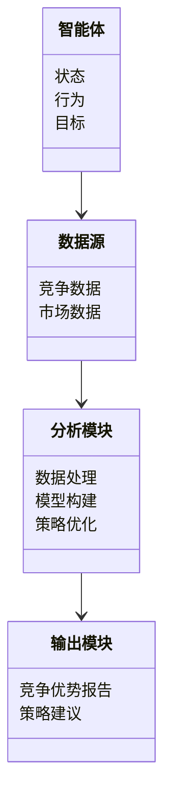
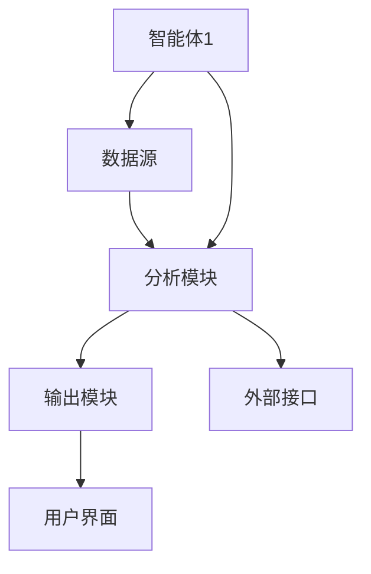
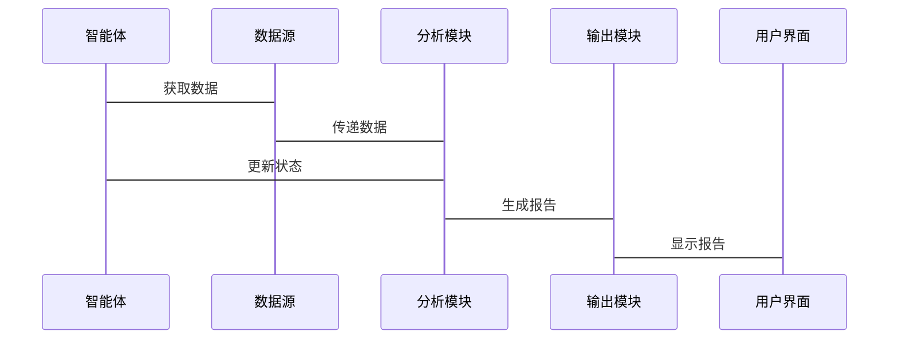

                 


# 多智能体系统在竞争优势分析中的应用：寻找护城河

> **关键词**：多智能体系统（MAS）、竞争优势分析、护城河、博弈论、强化学习、系统架构设计、企业战略

> **摘要**：  
> 在现代商业竞争中，竞争优势是企业生存和发展的关键。本文通过分析多智能体系统（MAS）在竞争优势分析中的应用，揭示如何利用多智能体系统帮助企业构建和维护护城河。文章从多智能体系统的定义、竞争优势分析的背景、护城河的概念入手，详细探讨多智能体系统在竞争优势分析中的核心概念、算法原理、系统架构设计以及实际项目中的应用。通过具体的案例分析，本文展示了多智能体系统如何助力企业在复杂竞争环境中找到独特优势，构建可持续发展的护城河。

---

# 第二部分: 多智能体系统在竞争优势分析中的核心概念与算法原理

## # 第3章: 多智能体系统的数学模型与算法原理

### 3.1 多智能体系统的数学模型

#### 3.1.1 多智能体系统的核心要素
多智能体系统由多个智能体组成，每个智能体都有自己的目标、状态和行为。我们可以将多智能体系统建模为一个动态系统，其中每个智能体之间通过交互和协作实现整体目标。

#### 3.1.2 多智能体系统的数学表达式
我们可以用以下公式描述多智能体系统中智能体之间的关系：

$$
S = \{s_1, s_2, ..., s_n\}
$$

其中，$S$ 表示系统的状态集合，$s_i$ 表示第 $i$ 个智能体的状态。

智能体之间的交互可以通过以下公式表示：

$$
I = \{i_1, i_2, ..., i_m\}
$$

其中，$I$ 表示系统中智能体之间的交互行为集合，$i_j$ 表示第 $j$ 个交互行为。

#### 3.1.3 多智能体系统的动态模型
多智能体系统的动态模型可以通过以下微分方程表示：

$$
\frac{ds_i}{dt} = f(s_i, s_{i-1}, ..., s_1, I)
$$

其中，$f$ 是一个函数，描述智能体状态的变化与系统中其他智能体状态和交互行为的关系。

### 3.2 多智能体系统中的博弈论模型

#### 3.2.1 博弈论的基本概念
博弈论是研究多个参与者在竞争或合作中的行为和策略的数学理论。在多智能体系统中，博弈论可以帮助我们分析智能体之间的竞争与合作关系。

#### 3.2.2 竞争优势分析中的博弈论模型
我们可以将竞争优势分析建模为一个博弈问题，其中每个智能体代表一个竞争对手或合作伙伴。智能体之间的博弈关系可以用以下公式表示：

$$
U_i = \sum_{j=1}^{n} w_{ij} \cdot s_j
$$

其中，$U_i$ 表示第 $i$ 个智能体的效用函数，$w_{ij}$ 是第 $i$ 个智能体对第 $j$ 个智能体的权重，$s_j$ 是第 $j$ 个智能体的状态。

#### 3.2.3 博弈论在竞争优势分析中的应用
通过博弈论模型，我们可以分析智能体之间的竞争与合作行为，预测系统的演化趋势，并为企业制定最优竞争策略提供依据。

### 3.3 多智能体系统中的强化学习算法

#### 3.3.1 强化学习的基本原理
强化学习是一种通过智能体与环境交互来学习最优策略的算法。在多智能体系统中，强化学习可以帮助智能体通过不断试错来优化自身行为。

#### 3.3.2 多智能体系统中的强化学习模型
我们可以用以下公式表示多智能体系统中的强化学习模型：

$$
Q(s, a) = r + \gamma \cdot \max_{a'} Q(s', a')
$$

其中，$Q(s, a)$ 表示在状态 $s$ 下执行动作 $a$ 的价值函数，$r$ 是奖励，$\gamma$ 是折扣因子，$s'$ 是下一个状态。

#### 3.3.3 强化学习在竞争优势分析中的应用
通过强化学习算法，我们可以训练智能体在复杂竞争环境中做出最优决策，从而提升企业的竞争优势。

---

# 第三部分: 多智能体系统在竞争优势分析中的系统架构设计

## # 第4章: 多智能体系统的系统架构设计

### 4.1 竞争优势分析的系统功能设计

#### 4.1.1 系统功能需求
竞争优势分析系统的功能需求包括数据采集、智能体建模、博弈分析、策略优化等。

#### 4.1.2 领域模型设计
我们可以用以下Mermaid类图表示竞争优势分析系统的领域模型：



### 4.2 系统架构设计

#### 4.2.1 系统架构图
我们可以用以下Mermaid架构图表示竞争优势分析系统的架构：



#### 4.2.2 系统接口设计
系统接口设计包括智能体与数据源的交互、分析模块与输出模块的交互等。

#### 4.2.3 系统交互流程
我们可以用以下Mermaid序列图表示系统的交互流程：



### 4.3 系统实现细节

#### 4.3.1 环境配置
竞争优势分析系统的环境配置包括安装Python、配置依赖库等。

#### 4.3.2 核心代码实现
以下是竞争优势分析系统的Python核心代码实现：

```python
class Agent:
    def __init__(self, state, target):
        self.state = state
        self.target = target

    def act(self, environment):
        # 根据环境做出决策
        pass

class AnalysisModule:
    def __init__(self, agents, data_source):
        self.agents = agents
        self.data_source = data_source

    def analyze(self):
        # 分析智能体行为并生成策略
        pass

class DataSource:
    def __init__(self, data):
        self.data = data

    def get_data(self):
        return self.data
```

---

# 第四部分: 项目实战与案例分析

## # 第5章: 项目实战

### 5.1 竞争优势分析系统开发

#### 5.1.1 系统需求分析
系统需求包括数据采集、智能体建模、博弈分析、策略优化等。

#### 5.1.2 系统实现
以下是竞争优势分析系统的Python实现代码：

```python
import numpy as np

class MultiAgentSystem:
    def __init__(self, agents):
        self.agents = agents

    def step(self, environment):
        for agent in self.agents:
            agent.act(environment)

class Agent:
    def __init__(self, state):
        self.state = state

    def act(self, environment):
        # 简单的策略：根据环境做出反应
        if environment > 0.5:
            self.state += 1
        else:
            self.state -= 1

# 创建智能体
agent1 = Agent(1)
agent2 = Agent(0)
system = MultiAgentSystem([agent1, agent2])

# 模拟环境变化
environment = np.random.random()
system.step(environment)

# 输出结果
print("Agent 1 state:", agent1.state)
print("Agent 2 state:", agent2.state)
```

#### 5.1.3 系统测试与优化
通过测试和优化，我们可以不断改进系统的性能和准确性。

### 5.2 案例分析

#### 5.2.1 案例背景
以电商行业为例，分析多智能体系统在竞争优势分析中的应用。

#### 5.2.2 案例实现
以下是电商行业竞争优势分析的Python代码：

```python
import networkx as nx

class Competitor:
    def __init__(self, name, strategy):
        self.name = name
        self.strategy = strategy

class CompetitionAnalyzer:
    def __init__(self, competitors):
        self.competitors = competitors

    def analyze(self):
        # 分析竞争对手的策略
        for competitor in self.competitors:
            print(f"{competitor.name}的策略是{competitor.strategy}")

# 创建竞争对手
competitor1 = Competitor("电商A", "降价促销")
competitor2 = Competitor("电商B", "提高服务质量")
analyzer = CompetitionAnalyzer([competitor1, competitor2])
analyzer.analyze()
```

#### 5.2.3 案例分析结果
通过分析竞争对手的策略，我们可以找到企业的竞争优势，并制定相应的竞争策略。

---

# 第五部分: 总结与展望

## # 第6章: 总结与展望

### 6.1 全文总结
通过本文的分析，我们了解了多智能体系统在竞争优势分析中的应用，以及如何利用多智能体系统帮助企业构建和维护护城河。

### 6.2 未来展望
未来，随着人工智能和大数据技术的不断发展，多智能体系统在竞争优势分析中的应用将更加广泛和深入。

### 6.3 最佳实践 Tips

#### 6.3.1 关键注意事项
在实际应用中，需要注意多智能体系统的复杂性和动态性，以及数据的准确性和实时性。

#### 6.3.2 小结
通过本文的分析，我们掌握了多智能体系统在竞争优势分析中的核心概念和算法原理，并通过具体案例展示了其实际应用。

#### 6.3.3 拓展阅读
建议读者进一步阅读相关领域的经典文献，以深入理解多智能体系统在竞争优势分析中的应用。

---

**作者：AI天才研究院/AI Genius Institute & 禅与计算机程序设计艺术 /Zen And The Art of Computer Programming**

