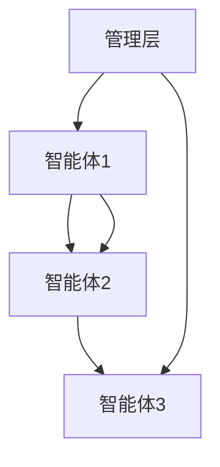
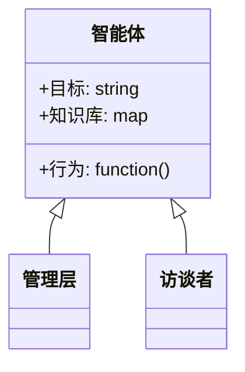

                 


# 多智能体系统在管理层访谈策略优化中的应用

> 关键词：多智能体系统、访谈策略优化、协同决策、算法原理、系统架构

> 摘要：本文探讨多智能体系统在管理层访谈策略优化中的应用，分析其核心概念、算法原理、系统架构，并通过实例展示其实际应用价值。

---

# 第1章 多智能体系统与管理层访谈策略优化概述

## 1.1 多智能体系统的定义与特点

### 1.1.1 多智能体系统的定义

多智能体系统（Multi-Agent Systems, MAS）是由多个智能体（Agent）组成的系统，这些智能体能够自主决策、协作完成任务。每个智能体都有自己的目标、知识库和行动策略。

### 1.1.2 多智能体系统的核心特点

- **自主性**：智能体能够独立决策，无需外部干预。
- **协作性**：智能体之间通过通信协作，共同完成任务。
- **分布式**：系统中的智能体分布在不同的位置，各自处理不同的任务。
- **动态性**：系统状态和环境不断变化，智能体需实时调整策略。

### 1.1.3 多智能体系统与其他协作技术的区别

| 技术 | 特点 |
|------|------|
| 多智能体系统 | 分布式协作，智能体自主决策 |
| 分布式系统 | 资源共享，无智能体协作 |
| 并行计算 | 多线程处理，无智能体交互 |

## 1.2 访谈策略优化的基本概念

### 1.2.1 访谈策略的定义与作用

访谈策略是指在访谈过程中，通过提问、引导对话等方式，最大化获取有价值信息的策略。优化访谈策略能提高访谈效率和成果质量。

### 1.2.2 优化的目标与意义

- **目标**：提高访谈效率，获取高质量信息，减少沟通成本。
- **意义**：优化策略能帮助访谈者更好地理解被访谈者的需求和意图。

### 1.2.3 传统方法的局限性

传统访谈策略优化通常依赖经验，缺乏系统性。多智能体系统则通过协作和数据驱动的方式，实现更高效的优化。

## 1.3 多智能体系统在企业管理中的应用前景

### 1.3.1 应用领域

- 人力资源管理
- 市场调研
- 战略规划

### 1.3.2 优势

- **高效协作**：多个智能体协同工作，提高决策效率。
- **数据驱动**：利用大数据分析，优化策略。

### 1.3.3 挑战与机遇

- **挑战**：智能体间的通信与协调复杂，系统设计难度大。
- **机遇**：技术进步推动多智能体系统在企业管理中的广泛应用。

---

# 第2章 多智能体系统的核心概念与原理

## 2.1 多智能体系统的原理

### 2.1.1 协作机制

智能体通过共享信息和协调行动，共同完成任务。

### 2.1.2 通信协议

智能体之间通过特定协议交换信息，确保协作顺利进行。

### 2.1.3 协同决策算法

基于多智能体的协同决策算法，通过信息共享和协商，制定最优策略。

## 2.2 多智能体系统的核心要素

### 2.2.1 智能体的定义与属性

- **智能体**：具有自主性、反应性、协作性的实体。
- **属性**：目标、知识、行为。

### 2.2.2 智能体之间的关系与交互

| 关系 | 描述 |
|------|------|
| 协作 | 智能体共同完成任务 |
| 竞争 | 智能体争夺资源 |

### 2.2.3 系统的动态性与复杂性

系统状态和环境不断变化，智能体需实时调整策略。

## 2.3 多智能体系统的数学模型与公式

### 2.3.1 协作优化的数学表达

$$ \text{目标函数} = \sum_{i=1}^{n} \text{智能体} i 的贡献 $$

### 2.3.2 信息交换的数学模型

$$ \text{信息流} = \text{智能体} 1 的信息 + \text{智能体} 2 的信息 + \dots $$

---

# 第3章 访谈策略优化的核心概念与联系

## 3.1 访谈策略优化的原理

### 3.1.1 访谈目标的设定

根据访谈目的，设定具体目标，如获取市场反馈、评估员工表现。

### 3.1.2 策略的选择与优化

通过分析不同策略的效果，选择最优策略。

### 3.1.3 效果的评估与反馈

评估策略效果，根据反馈调整策略。

## 3.2 多智能体系统与访谈策略优化的联系

### 3.2.1 系统协作机制

智能体协作优化访谈策略，提高效率。

### 3.2.2 协作对策略优化的促进

通过协作，智能体能综合更多信息，制定更优策略。

### 3.2.3 提升策略效率与效果

多智能体系统通过数据共享和协同决策，提升策略的执行效果。

## 3.3 多智能体系统与访谈策略优化的关系图



---

# 第4章 多智能体系统在访谈策略优化中的算法原理

## 4.1 基于多智能体的协同优化算法

### 4.1.1 算法的基本原理

通过信息共享和协商，多个智能体共同优化访谈策略。

### 4.1.2 算法实现步骤

1. 初始化智能体。
2. 智能体交换信息。
3. 协商制定策略。
4. 执行策略并反馈结果。
5. 调整策略并重复。

### 4.1.3 算法的数学模型与公式

$$ \text{最优策略} = \argmax_{s} \sum_{i=1}^{n} v_i(s) $$

其中，$v_i(s)$ 是智能体 $i$ 对策略 $s$ 的评价。

## 4.2 多智能体系统中的通信与协调机制

### 4.2.1 通信协议的设计

智能体之间通过特定协议交换信息，如JSON格式。

### 4.2.2 协调机制

通过协商确定策略，确保各智能体行动一致。

---

# 第5章 系统分析与架构设计

## 5.1 系统功能设计

### 5.1.1 领域模型类图



### 5.1.2 系统架构图

```mermaid
archiecture
    管理层 --> 访谈者
    访谈者 --> 智能体1
    智能体1 --> 智能体2
```

---

# 第6章 项目实战

## 6.1 环境安装

安装Python和相关库，如numpy、pandas。

## 6.2 核心代码实现

```python
class Agent:
    def __init__(self, goal):
        self.goal = goal
        self.knowledge = {}

    def communicate(self, other):
        # 信息交换
        pass

    def decide(self):
        # 决策
        pass

# 示例代码
agent1 = Agent("优化策略")
agent2 = Agent("数据收集")
agent1.communicate(agent2)
```

## 6.3 代码功能解读

解释代码的功能，如信息交换、决策过程。

---

# 第7章 总结与展望

## 7.1 总结

多智能体系统通过协作优化访谈策略，提高效率和效果。

## 7.2 展望

未来，随着AI技术进步，多智能体系统在企业管理中的应用将更加广泛。

---

作者：AI天才研究院/AI Genius Institute & 禅与计算机程序设计艺术 /Zen And The Art of Computer Programming

---

通过以上结构，文章详细探讨了多智能体系统在管理层访谈策略优化中的应用，从理论到实践，为读者提供了全面的指导。

