                 


# 多智能体系统在行业分析中的创新应用

## 关键词
- 多智能体系统
- 行业分析
- 创新应用
- 人工智能
- 算法原理

## 摘要
多智能体系统（Multi-Agent Systems, MAS）是一种由多个智能体组成的系统，每个智能体都能自主决策并协作完成复杂任务。在行业分析中，MAS的应用可以帮助企业更高效地进行市场分析、风险评估和决策优化。本文将详细介绍MAS的核心概念、算法原理、系统架构，并通过实际案例展示其在行业分析中的创新应用，为读者提供全面的技术指导和实践参考。

---

# 第1章 多智能体系统与行业分析概述

## 1.1 多智能体系统的基本概念

### 1.1.1 多智能体系统的定义
多智能体系统是由多个智能体组成的分布式系统，这些智能体能够通过自主决策和协作完成特定任务。智能体是具有感知、推理和行动能力的实体，可以是软件程序或物理设备。

### 1.1.2 多智能体系统的分类
多智能体系统可以根据智能体的结构、功能和环境进行分类：

| 分类维度 | 类型 |
|----------|------|
| 智能体结构 | 集中式、分布式、层次式 |
| 功能 | 行为型、知识型、反应型 |
| 环境 | 静态、动态、确定性、不确定性 |

### 1.1.3 多智能体系统的核心特征
- **自主性**：智能体能够自主决策。
- **反应性**：智能体能够感知环境并实时响应。
- **协作性**：智能体之间能够通过通信和协作完成任务。
- **分布式性**：智能体分布在不同的位置，协同工作。

## 1.2 行业分析的基本概念

### 1.2.1 行业分析的定义
行业分析是对特定行业内部结构、市场趋势、竞争格局和潜在风险进行系统性研究的过程。目的是为企业制定战略决策提供数据支持。

### 1.2.2 行业分析的主要方法
- **PEST分析**：分析政治、经济、社会和技术因素。
- **SWOT分析**：分析优势、劣势、机会和威胁。
- **波特五力模型**：分析行业内竞争结构。

### 1.2.3 行业分析的应用场景
- 市场进入策略
- 竞争对手分析
- 市场趋势预测
- 风险评估

## 1.3 多智能体系统在行业分析中的创新应用

### 1.3.1 多智能体系统在行业分析中的优势
- **高效性**：多个智能体同时处理数据，提高分析效率。
- **智能性**：智能体能够自主学习和优化分析模型。
- **协作性**：智能体之间可以共享信息，提高分析精度。

### 1.3.2 多智能体系统在行业分析中的应用场景
- **实时数据处理**：智能体实时收集和分析市场数据。
- **竞争分析**：智能体分析竞争对手的市场策略。
- **风险预警**：智能体预测行业风险并发出预警。

### 1.3.3 多智能体系统在行业分析中的未来趋势
- **智能化**：智能体更加智能化，能够自主优化分析模型。
- **分布式计算**：利用分布式计算技术提高系统的处理能力。
- **跨领域应用**：MAS在金融、医疗、教育等多个行业的应用。

## 1.4 本章小结
本章介绍了多智能体系统的基本概念和行业分析的主要方法，探讨了MAS在行业分析中的创新应用及其优势。通过MAS的应用，行业分析将更加高效和智能。

---

# 第2章 多智能体系统的数学模型与算法原理

## 2.1 多智能体系统的数学模型

### 2.1.1 多智能体系统的状态空间
状态空间描述了智能体在某一时刻所处的状态，可以用向量表示：

$$ s = (s_1, s_2, ..., s_n) $$

其中，$s_i$ 表示第 $i$ 个智能体的状态。

### 2.1.2 多智能体系统的动作空间
动作空间描述了智能体在某一状态下可执行的动作，可以用集合表示：

$$ a = \{a_1, a_2, ..., a_m\} $$

### 2.1.3 多智能体系统的奖励函数
奖励函数用于评估智能体的行为，可以用数学公式表示：

$$ r = f(s, a) $$

其中，$s$ 是状态，$a$ 是动作，$f$ 是奖励函数。

## 2.2 多智能体系统的算法原理

### 2.2.1 多智能体系统的基本算法
多智能体系统的算法包括分布式算法、协作算法和通信算法。以下是一个简单的协作算法流程图：

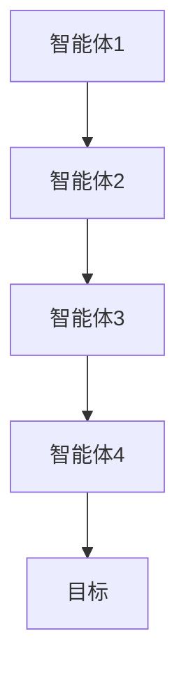

### 2.2.2 多智能体系统的协作机制
协作机制是智能体之间通过通信和协作完成任务的方式。以下是协作机制的实现步骤：

1. 智能体感知环境并确定目标。
2. 智能体通过通信协议与其他智能体交换信息。
3. 智能体协作完成任务并返回结果。

### 2.2.3 多智能体系统的通信协议
通信协议是智能体之间通信的规则，可以用协议栈表示：

```
TCP/IP
    |
    |-- HTTP
    |-- MQTT
    |-- REST
```

## 2.3 多智能体系统的数学公式

### 2.3.1 状态空间的表示
$$ s = (s_1, s_2, ..., s_n) $$

### 2.3.2 动作选择的公式
$$ a = \arg\max_{a_i} Q(s, a_i) $$

其中，$Q(s, a_i)$ 是智能体在状态 $s$ 下选择动作 $a_i$ 的期望奖励。

### 2.3.3 奖励函数的表示
$$ r = f(s, a) $$

## 2.4 本章小结
本章详细介绍了多智能体系统的数学模型和算法原理，包括状态空间、动作空间、奖励函数以及协作机制。这些内容为后续的系统设计和项目实现奠定了基础。

---

# 第3章 多智能体系统的系统架构与设计

## 3.1 多智能体系统的系统架构

### 3.1.1 分层架构
分层架构将系统分为感知层、决策层和执行层。

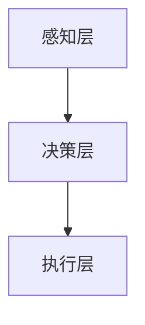

### 3.1.2 分布式架构
分布式架构将智能体分布在不同的节点上，通过通信协议进行协作。

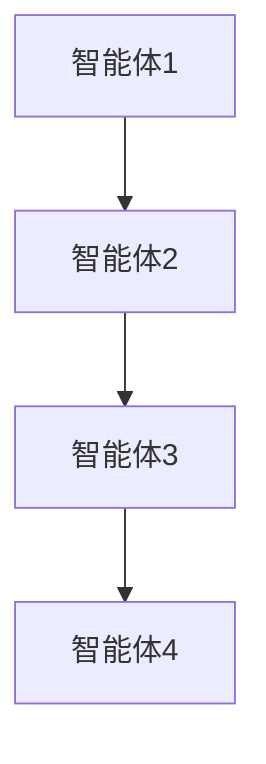

### 3.1.3 集中式架构
集中式架构有一个中心节点协调所有智能体的协作。

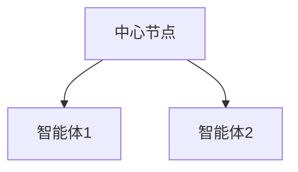

## 3.2 多智能体系统的功能设计

### 3.2.1 智能体的感知与决策
智能体通过感知环境数据并进行推理，做出决策。

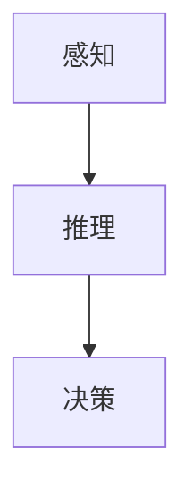

### 3.2.2 智能体的协作与通信
智能体之间通过通信协议交换信息，实现协作。

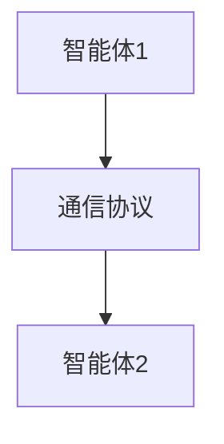

### 3.2.3 智能体的自适应与学习
智能体通过学习算法不断优化自身的决策能力。

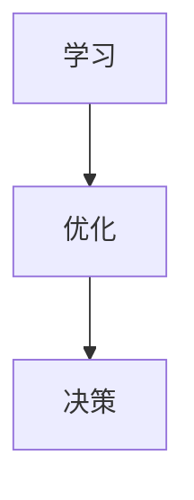

## 3.3 多智能体系统的架构图

### 3.3.1 领域模型类图
领域模型类图展示了系统中的主要类及其关系。

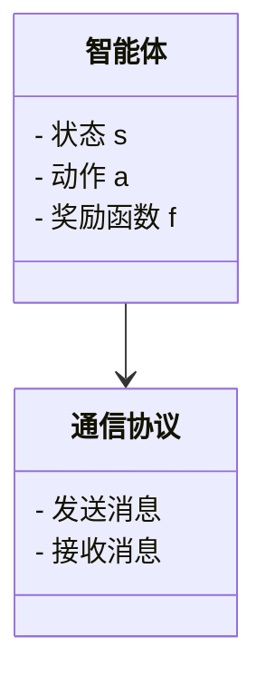

### 3.3.2 系统架构图
系统架构图展示了系统的整体架构。

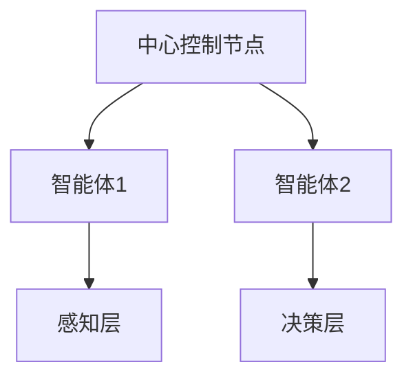

### 3.3.3 接口和交互序列图
接口和交互序列图展示了智能体之间的通信流程。

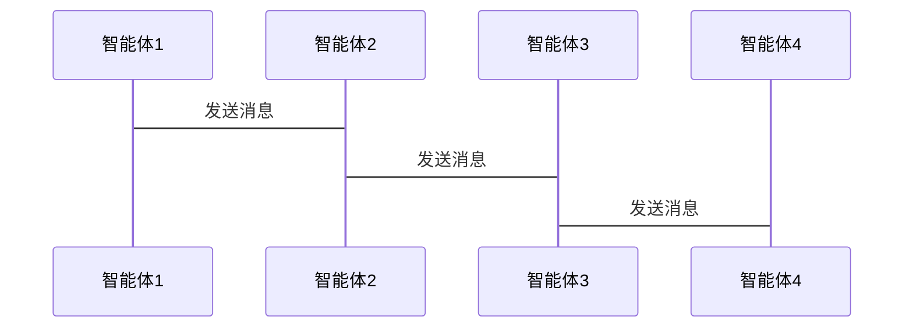

## 3.4 本章小结
本章详细介绍了多智能体系统的系统架构和功能设计，包括分层架构、分布式架构、集中式架构以及智能体的感知、协作和学习功能。通过系统架构图和类图，读者可以更好地理解MAS的结构和运作方式。

---

# 第4章 多智能体系统的项目实战

## 4.1 项目背景与目标

### 4.1.1 项目背景
本项目旨在利用多智能体系统进行行业分析，选择金融行业作为案例，分析市场趋势和竞争对手策略。

### 4.1.2 项目目标
- 实时监控金融市场数据。
- 分析竞争对手的交易策略。
- 预测市场风险并发出预警。

## 4.2 项目环境与工具安装

### 4.2.1 开发环境配置
- 操作系统：Linux/Windows/MacOS
- 开发工具：PyCharm/VSCode
- 依赖管理：pip/virtualenv

### 4.2.2 工具安装与配置
安装以下Python库：

```bash
pip install numpy pandas matplotlib scikit-learn
```

### 4.2.3 数据集准备
从金融数据API获取历史数据和实时数据。

## 4.3 项目核心代码实现

### 4.3.1 智能体的感知与决策代码
```python
import numpy as np
import pandas as pd

class Agent:
    def __init__(self, state_size, action_size):
        self.state_size = state_size
        self.action_size = action_size
        self.q_table = np.zeros((state_size, action_size))
    
    def perceive(self, state):
        return state
    
    def decide(self, state):
        return np.argmax(self.q_table[state])
    
    def learn(self, state, action, reward):
        self.q_table[state][action] += reward
```

### 4.3.2 智能体的协作与通信代码
```python
import zmq

class Communicator:
    def __init__(self, port):
        self.port = port
        self.context = zmq.Context()
        self.socket = self.context.socket(zmq.PAIR)
        self.socket.bind(f"tcp://*:{self.port}")
    
    def send(self, message):
        self.socket.send_string(message)
    
    def receive(self):
        return self.socket.recv_string()
```

### 4.3.3 系统实现流程图
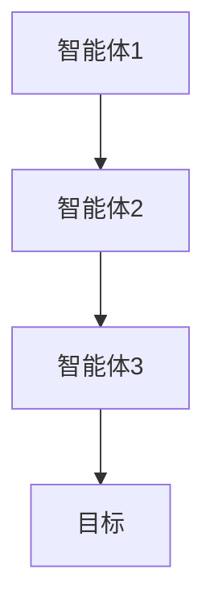

## 4.4 案例分析与详细讲解

### 4.4.1 案例分析
以金融行业为例，智能体实时监控市场数据并分析竞争对手的交易策略。

### 4.4.2 实现步骤
1. 安装开发环境和工具。
2. 编写智能体的感知、决策和学习代码。
3. 实现智能体之间的通信协议。
4. 采集和处理金融数据。
5. 部署系统并进行测试。

## 4.5 本章小结
本章通过一个金融行业的实际案例，详细讲解了多智能体系统的项目实战，包括环境配置、核心代码实现和案例分析。通过本章的学习，读者可以掌握MAS在行业分析中的具体应用方法。

---

# 第5章 多智能体系统的最佳实践

## 5.1 小结
本章总结了多智能体系统在行业分析中的创新应用，强调了MAS的优势和应用场景。

## 5.2 注意事项
在实际应用中，需要注意以下几点：
- 确保智能体之间的通信安全。
- 处理好智能体之间的协作冲突。
- 定期更新智能体的知识库。

## 5.3 拓展阅读
建议读者阅读以下书籍和论文：
- 《Multi-Agent Systems: Algorithmic Foundations》
- 《Multi-Agent Machine Learning: A Decentralized Approach》

## 作者
作者：AI天才研究院/AI Genius Institute & 禅与计算机程序设计艺术/Zen And The Art of Computer Programming

---

通过以上目录大纲，您可以逐步撰写完整的文章，每个章节和小节都包含详细的内容和代码示例，确保文章的完整性和实用性。

