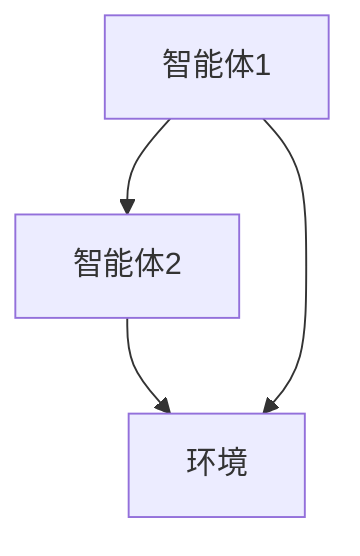
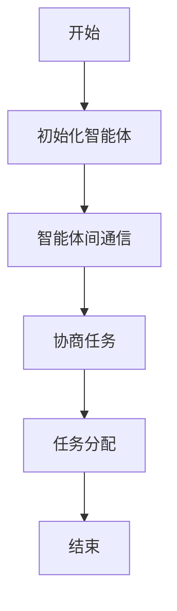
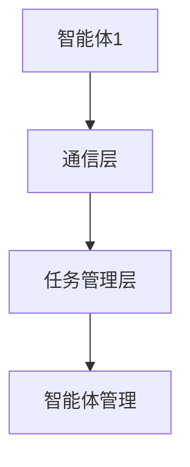
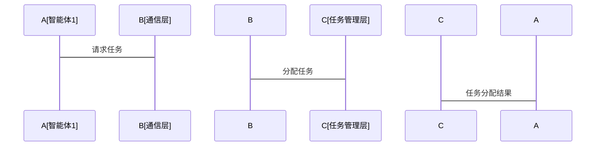

                 


# 多智能体系统在行业分析中的应用

> **关键词**：多智能体系统、行业分析、协作机制、通信协议、算法原理  
> **摘要**：本文深入探讨多智能体系统（MAS）在行业分析中的应用，从系统概述、核心概念、算法原理、系统架构到实际案例，全面解析MAS在金融、医疗、交通等领域的应用场景、实现技术及未来发展方向。

---

## 目录大纲

1. [多智能体系统概述](#多智能体系统概述)
   - 1.1 多智能体系统的定义与特点
   - 1.2 多智能体系统的组成与架构
   - 1.3 多智能体系统的应用场景

2. [多智能体系统的核心概念与联系](#多智能体系统的核心概念与联系)
   - 2.1 多智能体系统的实体关系图
   - 2.2 多智能体系统的通信协议
   - 2.3 多智能体系统的协作机制

3. [多智能体系统的算法原理](#多智能体系统的算法原理)
   - 3.1 多智能体系统的算法概述
   - 3.2 多智能体系统的算法实现
   - 3.3 多智能体系统的算法流程图

4. [多智能体系统的系统分析与架构设计](#多智能体系统的系统分析与架构设计)
   - 4.1 系统功能设计
   - 4.2 系统架构设计
   - 4.3 系统接口设计
   - 4.4 系统交互设计

5. [多智能体系统的项目实战](#多智能体系统的项目实战)
   - 5.1 项目背景与目标
   - 5.2 系统核心实现
   - 5.3 项目总结与优化建议

6. [多智能体系统的未来趋势与挑战](#多智能体系统的未来趋势与挑战)
   - 6.1 未来发展趋势
   - 6.2 当前面临的主要挑战

---

## 详细文章内容

### 1. 多智能体系统概述

#### 1.1 多智能体系统的定义与特点

多智能体系统（Multi-Agent System，MAS）是由多个智能体组成的分布式系统，这些智能体通过协作完成复杂的任务。与单智能体系统相比，MAS具有以下特点：

- **分布式性**：智能体分布在不同的节点上，每个智能体负责部分任务。
- **协作性**：智能体之间需要通过通信和协商完成任务。
- **自主性**：每个智能体都具有一定的自主决策能力。
- **动态性**：系统环境和任务需求可能动态变化。

#### 1.2 多智能体系统的组成与架构

MAS由以下几个核心部分组成：

- **智能体**：智能体是MAS的基本单元，具有感知、决策和执行能力。
- **环境**：环境是智能体所处的外部世界，包括物理环境和任务环境。
- **通信机制**：通信机制是智能体之间进行信息交换的渠道。
- **协作机制**：协作机制是智能体之间协同工作的规则和策略。

常见的MAS架构包括：

- **集中式架构**：有一个中心节点负责协调和管理智能体。
- **分布式架构**：没有中心节点，智能体之间直接协作。

#### 1.3 多智能体系统的应用场景

MAS在多个行业中有广泛的应用，以下是几个典型场景：

- **金融行业**：用于风险评估、投资决策。
- **医疗行业**：用于患者诊断、治疗方案制定。
- **交通行业**：用于交通调度、路径规划。

---

### 2. 多智能体系统的核心概念与联系

#### 2.1 多智能体系统的实体关系图

以下是一个简单的MAS实体关系图：



#### 2.2 多智能体系统的通信协议

通信协议是智能体之间进行信息交换的规则。常见的通信协议包括：

- **HTTP/HTTPS**：用于Web服务之间的通信。
- **WebSocket**：用于实时通信。
- **AMQP**：用于消息队列的通信。

#### 2.3 多智能体系统的协作机制

协作机制是智能体之间协同工作的规则和策略。常见的协作机制包括：

- **协商机制**：智能体之间通过协商分配任务。
- **任务分配机制**：根据智能体的能力分配任务。
- **冲突解决机制**：解决智能体之间的冲突。

---

### 3. 多智能体系统的算法原理

#### 3.1 多智能体系统的算法概述

MAS的算法主要包括以下几种：

- **分布式计算算法**：用于多智能体之间的协作计算。
- **协商算法**：用于智能体之间的任务分配。
- **路径规划算法**：用于智能体的移动路径规划。

#### 3.2 多智能体系统的算法实现

以下是一个简单的协商算法实现：

```python
def negotiate_task(agents, task):
    for agent in agents:
        if agent.is_capable(task):
            return agent
    return None
```

#### 3.3 多智能体系统的算法流程图

协商算法的流程图如下：



---

### 4. 多智能体系统的系统分析与架构设计

#### 4.1 系统功能设计

系统功能设计包括以下几个方面：

- **智能体管理**：管理智能体的注册、登录和退出。
- **任务管理**：分配和跟踪任务的执行情况。
- **通信管理**：管理智能体之间的通信。

#### 4.2 系统架构设计

以下是系统的架构设计图：



#### 4.3 系统接口设计

系统接口设计包括以下几个方面：

- **智能体接口**：智能体与系统之间的接口。
- **通信接口**：智能体之间的通信接口。
- **任务接口**：任务分配和执行的接口。

#### 4.4 系统交互设计

以下是系统交互的序列图：



---

### 5. 多智能体系统的项目实战

#### 5.1 项目背景与目标

项目背景：在金融行业中，风险评估是一个复杂的任务，需要多个智能体协作完成。

项目目标：开发一个基于MAS的金融风险评估系统。

#### 5.2 系统核心实现

以下是系统的核心实现代码：

```python
class Agent:
    def __init__(self, id):
        self.id = id
        self.tasks = []

    def add_task(self, task):
        self.tasks.append(task)

    def remove_task(self, task):
        self.tasks.remove(task)

    def execute_task(self, task):
        # 执行任务的具体实现
        pass

# 初始化智能体
agent1 = Agent(1)
agent2 = Agent(2)

# 分配任务
task = "风险评估"
negotiate_task([agent1, agent2], task)
```

#### 5.3 项目总结与优化建议

项目总结：通过MAS实现金融风险评估系统，能够提高评估的准确性和效率。

优化建议：进一步优化智能体的协作机制，提高系统的实时性和响应速度。

---

### 6. 多智能体系统的未来趋势与挑战

#### 6.1 未来发展趋势

未来的MAS将更加智能化和自适应，能够更好地应对复杂环境的变化。

#### 6.2 当前面临的主要挑战

当前MAS面临的主要挑战包括：

- **通信延迟**：智能体之间的通信可能存在延迟。
- **数据隐私**：智能体之间的数据共享可能存在隐私问题。
- **系统安全**：MAS的安全性需要进一步提高。

---

## 总结

多智能体系统在行业分析中的应用具有广泛的应用前景。通过本文的分析，我们可以看到MAS在金融、医疗、交通等领域的巨大潜力。未来，随着技术的不断发展，MAS将变得更加智能和高效，为行业分析提供更强大的支持。

---

## 作者

**作者：AI天才研究院/AI Genius Institute & 禅与计算机程序设计艺术 /Zen And The Art of Computer Programming**

---

**致谢**：感谢您耐心阅读本文，希望本文对您理解多智能体系统有所帮助。

