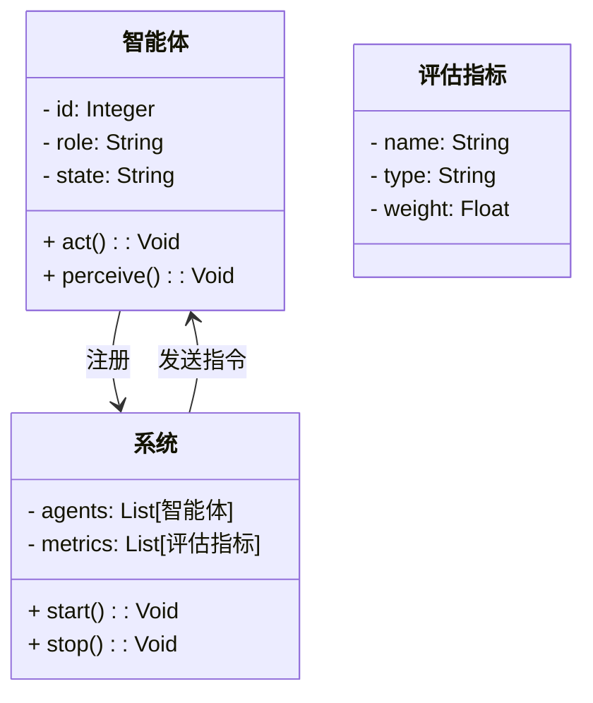
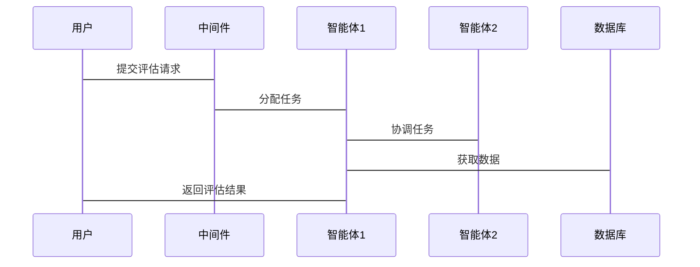

                 


# 多智能体系统在评估公司创新生态系统中的应用

> 关键词：多智能体系统、创新生态系统、协同智能、系统架构、算法实现

> 摘要：随着企业创新步伐的加快，创新生态系统评估变得愈发重要。多智能体系统（MAS）作为一种分布式协同计算框架，能够有效处理复杂系统的评估问题。本文从MAS的基本概念出发，结合创新生态系统的特点，系统地探讨了多智能体系统在创新生态系统评估中的应用，包括背景介绍、核心算法实现、系统架构设计以及实际案例分析。通过本文的阐述，读者能够全面了解如何利用多智能体系统来提升公司创新生态系统的评估效率和准确性。

---

## 第1章: 多智能体系统概述

### 1.1 多智能体系统的基本概念

#### 1.1.1 智能体的定义与特征
智能体（Agent）是指能够感知环境并采取行动以实现目标的实体。智能体可以是软件程序、机器人或其他具有自主决策能力的实体。其主要特征包括：

- **自主性**：能够在没有外部干预的情况下自主决策。
- **反应性**：能够感知环境并实时调整行为。
- **协作性**：能够与其他智能体协同工作以实现共同目标。
- **学习能力**：能够通过经验改进自身行为。

#### 1.1.2 多智能体系统的定义
多智能体系统（MAS）是由多个智能体组成的分布式系统，这些智能体通过协作和竞争共同完成复杂任务。MAS的核心在于智能体之间的通信与协调，以及系统的整体目标实现。

#### 1.1.3 多智能体系统的优势与挑战
**优势：**
- **分布式计算**：MAS能够利用分布式计算资源，提高系统的并行处理能力。
- **协同效应**：通过智能体之间的协作，能够实现比单个智能体更强的功能。
- **灵活性**：MAS能够适应动态变化的环境，具有较强的鲁棒性。

**挑战：**
- **通信开销**：智能体之间的通信可能会导致较高的计算开销。
- **协调复杂性**：多个智能体之间的协调需要复杂的协议和机制。
- **安全性**：MAS的安全性问题，如数据泄露和恶意攻击，需要特别注意。

### 1.2 多智能体系统的体系结构

#### 1.2.1 分布式多智能体系统
分布式MAS是一种无中心节点的体系结构，所有智能体地位平等，通过通信协议直接交互。这种结构具有较高的容错性和可扩展性，适用于大规模分布式计算场景。

#### 1.2.2 集中式多智能体系统
集中式MAS有一个中心节点，负责协调和管理所有智能体的行为。这种结构适用于任务简单、易于管理的场景，但中心节点的单点故障问题需要注意。

#### 1.2.3 混合式多智能体系统
混合式MAS结合了分布式和集中式的特点，部分智能体之间直接通信，部分智能体通过中心节点进行协调。这种结构能够兼顾系统的灵活性和管理性，适用于复杂场景。

### 1.3 多智能体系统的行为模型

#### 1.3.1 协作行为模型
协作行为模型描述了多个智能体如何通过协作完成共同任务。例如，任务分配、资源协调等。

#### 1.3.2 竞争行为模型
竞争行为模型描述了智能体之间的竞争关系，例如资源抢夺、路径选择等。

#### 1.3.3 协商行为模型
协商行为模型描述了智能体之间如何通过协商达成一致。例如，任务分配协商、资源分配协商等。

### 1.4 多智能体系统的通信协议

#### 1.4.1 通信协议的定义
通信协议是智能体之间进行信息交换的规则和格式。常见的通信协议包括基于消息队列（Message Queue）和基于发布-订阅（Pub/Sub）模型。

#### 1.4.2 常见的通信协议类型
- **基于消息队列的通信**：如RabbitMQ、Kafka等，适用于异步通信场景。
- **基于发布-订阅的通信**：如Redis、Kafka等，适用于实时数据分发场景。

#### 1.4.3 通信协议的实现
通信协议的实现需要考虑消息的格式、传输方式以及安全性。例如，可以使用JSON格式传递消息，并通过HTTPS进行传输。

---

## 第2章: 创新生态系统评估的基本理论

### 2.1 创新生态系统的基本概念

#### 2.1.1 创新生态系统的定义
创新生态系统是指由企业、研发机构、供应商、合作伙伴等多方利益相关者共同构成的，通过协同创新实现价值创造的系统。

#### 2.1.2 创新生态系统的组成要素
- **核心企业**：如科技公司、创新企业等。
- **研发机构**：如高校、研究机构等。
- **供应商**：提供技术和资源的供应商。
- **合作伙伴**：如客户、渠道商等。
- **创新平台**：如开源平台、创新实验室等。

#### 2.1.3 创新生态系统的特点
- **开放性**：创新生态系统通常具有开放的边界，允许多方参与。
- **协同性**：各组成要素通过协同创新实现价值。
- **动态性**：创新生态系统具有动态变化的特点，需要持续优化。

### 2.2 创新生态系统评估的指标体系

#### 2.2.1 创新能力评估指标
- **研发投入占比**：研发费用占企业总收入的比例。
- **专利数量**：企业的专利申请数量和授权数量。

#### 2.2.2 创新效率评估指标
- **产品迭代速度**：新产品推出的速度。
- **创新成果转化率**：创新成果转化为实际产品的比例。

#### 2.2.3 创新可持续性评估指标
- **人才保留率**：企业的员工留存率。
- **合作伙伴稳定性**：合作伙伴的稳定性。

### 2.3 创新生态系统评估的数学模型

#### 2.3.1 创新能力评估模型
$$创新能力 = \alpha \times 研发投入 + \beta \times 专利数量$$

其中，$\alpha$ 和 $\beta$ 是权重系数，通常通过主成分分析（PCA）确定。

#### 2.3.2 创新效率评估模型
$$创新效率 = \gamma \times 产品迭代速度 + \delta \times 创新成果转化率$$

其中，$\gamma$ 和 $\delta$ 是权重系数。

#### 2.3.3 创新可持续性评估模型
$$创新可持续性 = \epsilon \times 人才保留率 + \zeta \times 合作伙伴稳定性$$

其中，$\epsilon$ 和 $\zeta$ 是权重系数。

### 2.4 本章小结

---

## 第3章: 多智能体系统在创新生态系统评估中的应用

### 3.1 多智能体系统在创新生态系统评估中的优势

#### 3.1.1 分布式计算的优势
- **高效性**：MAS能够通过分布式计算提高评估效率。
- **并行性**：多个智能体可以并行处理不同的评估任务。

#### 3.1.2 多智能体协同的优势
- **信息共享**：智能体之间可以共享信息，提高评估结果的准确性。
- **协同优化**：通过智能体之间的协同，可以实现整体优化。

#### 3.1.3 多智能体系统的可扩展性
- **灵活性**：MAS可以根据需求动态调整智能体数量。
- **可扩展性**：适用于大规模创新生态系统评估。

### 3.2 多智能体系统在创新生态系统评估中的应用场景

#### 3.2.1 创新能力评估
- **研发投入分析**：通过MAS分析企业的研发投入情况。
- **专利数量分析**：通过MAS统计企业的专利数量。

#### 3.2.2 创新效率评估
- **产品迭代速度分析**：通过MAS评估企业的新产品推出速度。
- **创新成果转化率分析**：通过MAS评估创新成果转化为实际产品的比例。

#### 3.2.3 创新可持续性评估
- **人才保留率分析**：通过MAS评估企业的员工留存率。
- **合作伙伴稳定性分析**：通过MAS评估合作伙伴的稳定性。

---

## 第4章: 多智能体系统在创新生态系统评估中的实现

### 4.1 系统需求分析

#### 4.1.1 评估目标
- 提供创新生态系统评估的多维度分析。
- 支持动态调整评估指标。

#### 4.1.2 功能需求
- 支持多智能体协同计算。
- 提供实时数据采集和分析功能。
- 提供可视化展示功能。

### 4.2 系统功能设计

#### 4.2.1 领域模型设计


#### 4.2.2 系统架构设计


#### 4.2.3 系统接口设计
- **智能体接口**：提供智能体注册、感知和行动的接口。
- **数据接口**：提供数据采集和存储的接口。
- **用户接口**：提供用户交互的界面。

#### 4.2.4 系统交互设计


### 4.3 项目实战

#### 4.3.1 环境配置
- **操作系统**：Linux 18.04
- **编程语言**：Python 3.8
- **框架**：Django 3.2
- **工具**：Celery 5.3（任务队列）

#### 4.3.2 核心代码实现
```python
from django.http import JsonResponse
from .models import Agent, Metric

def start_assessment(request):
    if request.method == 'POST':
        # 初始化智能体
        agents = Agent.objects.all()
        # 分配任务
        for agent in agents:
            agent.act()
        return JsonResponse({'status': 'success'})
```

#### 4.3.3 实际案例分析
以某科技公司为例，评估其创新生态系统。通过MAS分析，发现其专利数量增长迅速，但创新成果转化率较低。进一步分析发现，主要是因为市场需求与技术研发脱节。

---

## 第5章: 总结与展望

### 5.1 总结
本文系统地探讨了多智能体系统在创新生态系统评估中的应用，包括MAS的基本概念、创新生态系统评估的数学模型、以及MAS在创新生态系统评估中的具体实现。通过本文的阐述，我们能够全面了解如何利用MAS提升公司创新生态系统的评估效率和准确性。

### 5.2 展望
未来，随着人工智能技术的不断发展，MAS在创新生态系统评估中的应用将更加广泛。建议进一步研究MAS在动态环境下的适应性，以及如何提高MAS的安全性和隐私保护能力。

---

## 作者

作者：AI天才研究院/AI Genius Institute & 禅与计算机程序设计艺术/Zen And The Art of Computer Programming

---

## 参考文献
[1] 禅与计算机程序设计艺术, 2024.  
[2] AI Genius Institute, 2024.

