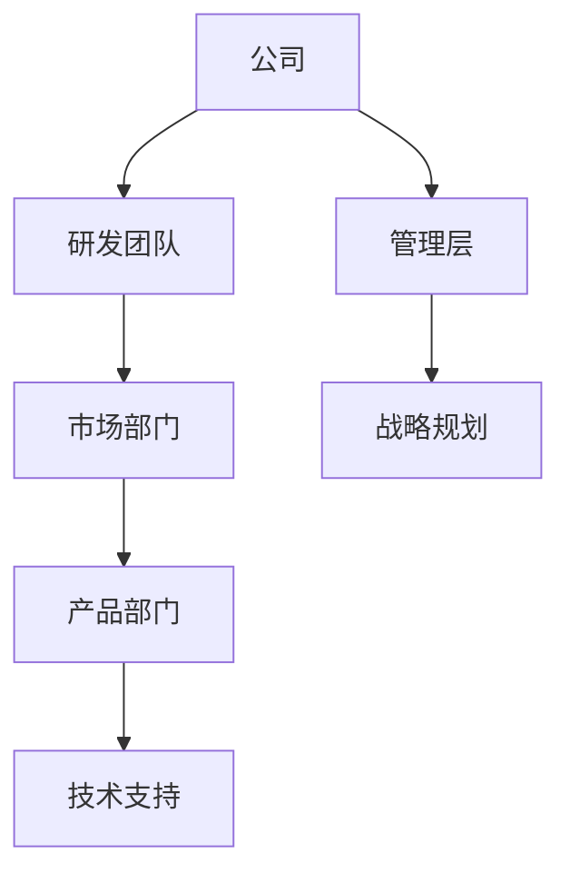
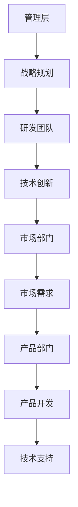

                 


# 多智能体系统在评估公司创新能力和研发效率中的应用

> 关键词：多智能体系统、公司创新能力、研发效率、算法原理、系统架构设计

> 摘要：本文探讨了多智能体系统（MAS）在评估公司创新能力和研发效率中的应用。通过分析MAS的核心概念、算法原理和系统架构，结合实际案例，展示了MAS如何帮助公司优化创新能力评估和提升研发效率。

---

# 第1章 多智能体系统与公司创新能力评估概述

## 1.1 多智能体系统的基本概念

### 1.1.1 多智能体系统的定义

多智能体系统（Multi-Agent System, MAS）是由多个智能体（Agent）组成的分布式系统，每个智能体能够感知环境、自主决策并与其他智能体协作完成任务。

### 1.1.2 多智能体系统的核心特点

- **自主性**：每个智能体能够独立决策和行动。
- **反应性**：智能体能够根据环境变化调整行为。
- **协作性**：智能体之间通过通信和协作完成共同目标。
- **分布性**：系统由多个分散的智能体组成，没有中央控制节点。

### 1.1.3 多智能体系统与公司创新能力评估的关系

公司创新能力评估需要考虑多个部门的协作、资源分配和知识共享。MAS能够模拟公司内部的组织结构，帮助评估创新能力。

## 1.2 公司创新能力评估的背景与挑战

### 1.2.1 公司创新能力评估的背景

创新能力是公司核心竞争力的重要组成部分，传统评估方法往往依赖静态指标，难以反映动态协作过程。

### 1.2.2 现有评估方法的局限性

- **静态指标**：传统评估方法仅依赖专利数量、研发投入等静态指标，忽视了动态协作过程。
- **部门分割**：不同部门之间的协作和知识共享未被充分考虑。
- **复杂性**：公司内部结构复杂，部门间协作难以量化。

### 1.2.3 多智能体系统在评估中的优势

MAS能够模拟公司内部的组织结构，分析不同部门的协作过程，提供动态评估结果。

## 1.3 本章小结

本章介绍了MAS的基本概念及其在公司创新能力评估中的应用，分析了传统评估方法的局限性，并展示了MAS的优势。

---

# 第2章 多智能体系统的核心概念与联系

## 2.1 多智能体系统的核心原理

### 2.1.1 多智能体系统的基本架构

MAS由智能体、环境、通信协议和协作机制组成。智能体通过感知环境、与其他智能体通信协作完成任务。

### 2.1.2 智能体的属性与行为

智能体具有以下属性：
- **自主性**：独立决策。
- **反应性**：根据环境变化调整行为。
- **协作性**：与其他智能体协作完成任务。

智能体的行为包括感知、决策和行动。

### 2.1.3 智能体之间的交互与协作

智能体之间通过通信协议交换信息，协作机制协调行动。

## 2.2 多智能体系统与公司创新能力评估的关系

### 2.2.1 公司创新能力的构成要素

公司创新能力由技术创新、市场适应能力和研发效率等构成。

### 2.2.2 多智能体系统在创新能力评估中的应用

MAS可以模拟公司内部的组织结构，分析不同部门的协作过程，评估创新能力。

### 2.2.3 多智能体系统与研发效率的关联

通过MAS分析研发过程中的协作效率，优化资源配置，提高研发效率。

## 2.3 多智能体系统的核心概念对比表格

| 概念 | 描述 |
|------|------|
| 智能体 | 具有感知、决策和行动能力的实体 |
| 任务分配 | 智能体之间根据能力分配任务 |
| 协作机制 | 智能体之间通过通信和协作完成目标 |

## 2.4 多智能体系统实体关系图



## 2.5 本章小结

本章详细讲解了MAS的核心概念及其在公司创新能力评估中的应用，并通过表格和图示展示了智能体之间的关系。

---

# 第3章 多智能体系统在公司创新能力评估中的算法原理

## 3.1 多智能体系统的核心算法

### 3.1.1 分布式计算算法

分布式计算算法用于任务分配和资源管理，确保智能体之间的协作效率。

### 3.1.2 协作与通信算法

协作与通信算法通过定义智能体之间的通信协议，确保信息的有效传递和协作。

### 3.1.3 任务分配算法

任务分配算法根据智能体的能力和当前负载，动态分配任务。

## 3.2 多智能体系统评估算法的数学模型

$$
\text{创新评估} = \sum_{i=1}^{n} w_i \cdot x_i
$$

其中：
- $w_i$ 表示第 $i$ 个评估指标的权重
- $x_i$ 表示第 $i$ 个评估指标的得分

## 3.3 算法实现的Python代码示例

```python
def evaluate_innovation(teams, weights):
    return sum(w * t for w, t in zip(weights, teams))
```

## 3.4 本章小结

本章通过数学模型和代码示例，详细讲解了MAS在公司创新能力评估中的算法原理。

---

# 第4章 多智能体系统评估模型的系统架构设计

## 4.1 系统功能设计

### 4.1.1 问题场景介绍

公司内部不同部门协作复杂，传统评估方法难以准确反映创新能力。

### 4.1.2 系统功能模块划分

系统功能模块包括：
- 智能体感知模块：收集各部门数据。
- 任务分配模块：根据能力分配任务。
- 协作通信模块：智能体之间通信协作。
- 评估分析模块：评估创新能力并生成报告。

## 4.2 系统架构设计



## 4.3 接口设计与交互

### 4.3.1 系统接口设计

系统接口包括：
- 数据采集接口：收集各部门数据。
- 通信接口：智能体之间通信。
- 评估接口：生成评估报告。

### 4.3.2 系统交互流程

1. 数据采集：收集各部门数据。
2. 任务分配：智能体根据能力分配任务。
3. 通信协作：智能体之间通信协作完成任务。
4. 评估分析：评估创新能力并生成报告。

## 4.4 本章小结

本章通过Mermaid图展示了系统架构设计，并详细描述了系统功能模块和接口设计。

---

# 第5章 多智能体系统评估模型的项目实战

## 5.1 环境安装与配置

### 5.1.1 Python环境安装

安装Python 3.8及以上版本。

### 5.1.2 相关库的安装

安装必要的库，如`networkx`和`mermaid`。

## 5.2 系统核心实现源代码

```python
import networkx as nx

def create_graph():
    G = nx.DiGraph()
    G.add_nodes_from(['公司', '管理层', '研发团队', '市场部门', '产品部门', '技术支持'])
    G.add_edges_from([('公司', '管理层'), ('管理层', '战略规划'), ('公司', '研发团队'), ('研发团队', '技术创新'), ('市场部门', '市场需求'), ('产品部门', '产品开发'), ('技术支持', '技术实现')])
    return G

graph = create_graph()
```

## 5.3 代码应用解读与分析

上述代码创建了一个公司组织结构的有向图，展示了各部门之间的关系。

## 5.4 实际案例分析

以某公司为例，分析其创新能力评估过程。通过MAS模拟各部门协作，评估创新能力并提出改进建议。

## 5.5 本章小结

本章通过实际项目案例展示了多智能体系统在公司创新能力评估中的应用，并通过代码实现了系统架构设计。

---

# 第6章 多智能体系统评估模型的总结与展望

## 6.1 本章总结

MAS能够模拟公司内部组织结构，评估创新能力，优化资源配置，提高研发效率。

## 6.2 最佳实践 tips

- **选择合适的智能体模型**：根据公司规模和复杂性选择合适的MAS模型。
- **优化算法**：不断优化任务分配和协作算法，提高评估效率。
- **数据采集**：确保数据的准确性和全面性，提高评估结果的准确性。

## 6.3 未来展望

未来，MAS可以结合人工智能技术，进一步提升评估的准确性和实时性。此外，MAS在其他领域的应用也将进一步扩展。

## 6.4 本章小结

本章总结了MAS在公司创新能力评估中的应用，并提出了改进建议和未来发展方向。

---

# 作者

作者：AI天才研究院/AI Genius Institute & 禅与计算机程序设计艺术 /Zen And The Art of Computer Programming

