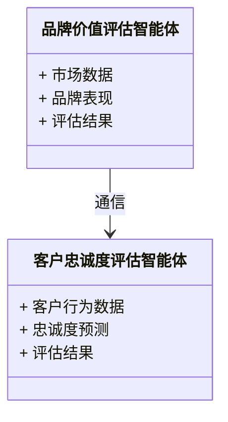
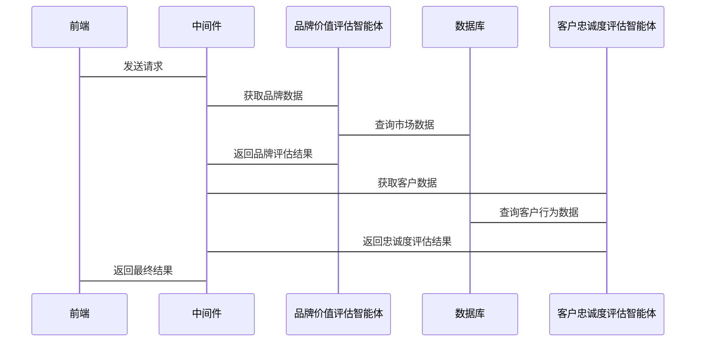

                 


# 多智能体系统在评估公司品牌价值和客户忠诚度中的作用

> 关键词：多智能体系统, 品牌价值, 客户忠诚度, 评估方法, 算法原理, 系统架构, 项目实战

> 摘要：本文详细探讨了多智能体系统（Multi-Agent System, MAS）在评估公司品牌价值和客户忠诚度中的应用。通过分析MAS的基本概念、优势及其在品牌价值和客户忠诚度评估中的具体应用，本文提出了一种基于MAS的创新评估方法。结合实际案例和系统设计，本文展示了如何利用MAS提高评估的准确性和效率，并对未来的研究方向进行了展望。

---

## 第一章: 多智能体系统概述

### 1.1 多智能体系统的基本概念

#### 1.1.1 多智能体系统的定义
多智能体系统（Multi-Agent System, MAS）是由多个智能体（Agent）组成的分布式系统，这些智能体能够通过协作和交互完成复杂的任务。智能体是具有感知、决策、推理和执行能力的实体，能够独立工作并与其他智能体或环境进行交互。

#### 1.1.2 多智能体系统的特征
- **自主性**：智能体能够自主决策和行动。
- **反应性**：智能体能够实时感知环境并做出反应。
- **协作性**：智能体之间可以通过协作完成共同目标。
- **分布式性**：智能体分布在网络中，不依赖于中心节点。

#### 1.1.3 多智能体系统的优势
- 提高系统的灵活性和适应性。
- 增强系统的可靠性和容错能力。
- 通过协作实现复杂任务的高效完成。

### 1.2 多智能体系统在商业中的应用

#### 1.2.1 多智能体系统的应用场景
- 供应链管理
- 智能推荐系统
- 金融风险管理
- 智慧城市

#### 1.2.2 多智能体系统在品牌价值评估中的潜力
- 通过多个智能体协作，实时分析市场数据和消费者行为。
- 提供动态的品牌价值评估，帮助企业及时调整策略。

#### 1.2.3 多智能体系统与客户忠诚度的关系
- 智能体可以分析客户的互动行为，预测客户忠诚度。
- 通过个性化服务提升客户忠诚度。

### 1.3 本章小结
本章介绍了多智能体系统的基本概念和特征，分析了其在商业中的应用场景，重点探讨了MAS在品牌价值评估和客户忠诚度中的潜力。

---

## 第二章: 品牌价值与客户忠诚度的评估方法

### 2.1 品牌价值的传统评估方法

#### 2.1.1 品牌价值的定义
品牌价值是指品牌为企业带来的经济价值，通常通过市场表现、品牌认知度和客户忠诚度等指标进行评估。

#### 2.1.2 品牌价值的传统评估指标
- 市场占有率
- 品牌知名度
- 品牌美誉度

#### 2.1.3 传统评估方法的局限性
- 数据收集困难
- 评估结果静态
- 难以实时更新

### 2.2 客户忠诚度的传统评估方法

#### 2.2.1 客户忠诚度的定义
客户忠诚度是指客户对企业产品或服务的持续购买意愿和行为。

#### 2.2.2 客户忠诚度的传统评估指标
- 复购率
- 顾客满意度
- 品牌推荐度

#### 2.2.3 传统评估方法的局限性
- 数据单一
- 无法预测未来行为
- 难以捕捉客户真实需求

### 2.3 基于多智能体系统的评估方法

#### 2.3.1 多智能体系统在品牌价值评估中的优势
- 实时数据分析
- 多维度评估
- 高度个性化

#### 2.3.2 多智能体系统在客户忠诚度评估中的优势
- 多智能体协作分析客户行为
- 实时反馈客户偏好
- 提供动态评估结果

#### 2.3.3 多智能体系统与传统方法的对比
| 评估方法 | 数据来源 | 数据处理 | 结果输出 |
|----------|----------|----------|----------|
| 传统方法 | 单一来源 | 离线处理 | 静态结果 |
| MAS方法 | 多源数据 | 实时处理 | 动态结果 |

### 2.4 本章小结
本章对比了传统评估方法与多智能体系统在品牌价值和客户忠诚度评估中的优劣势，强调了MAS在实时性和动态性方面的优势。

---

## 第三章: 多智能体系统的架构与设计

### 3.1 多智能体系统的架构

#### 3.1.1 分层架构
- **感知层**：负责数据采集和环境感知。
- **决策层**：负责智能体的决策和协调。
- **执行层**：负责具体任务的执行。

#### 3.1.2 分布式架构
- 每个智能体独立运行，通过通信模块协作完成任务。

#### 3.1.3 集中式架构
- 由一个中心节点协调多个智能体的协作。

### 3.2 多智能体系统的智能体设计

#### 3.2.1 智能体的定义与特征
智能体是一个能够感知环境、自主决策、协作完成任务的实体。

#### 3.2.2 智能体的分类
- **反应式智能体**：基于当前感知做出反应。
- **认知式智能体**：具备推理和规划能力。
- **协作式智能体**：能够与其他智能体协作完成任务。

#### 3.2.3 智能体之间的协作机制
- **通信机制**：通过消息传递实现协作。
- **协商机制**：智能体之间通过协商分配任务。
- **协调机制**：通过协调模块确保协作顺利进行。

### 3.3 品牌价值与客户忠诚度的智能体设计

#### 3.3.1 品牌价值评估智能体的设计
- 智能体负责收集市场数据，分析品牌表现。
- 使用协同过滤算法推荐品牌价值评估方法。

#### 3.3.2 客户忠诚度评估智能体的设计
- 智能体负责分析客户行为数据，预测忠诚度。
- 使用聚类分析算法识别高忠诚度客户。

#### 3.3.3 智能体之间的交互与协作
- 通过通信模块共享数据和结果。
- 通过协作机制提高评估的准确性和效率。

### 3.4 本章小结
本章详细介绍了多智能体系统的架构和智能体设计，重点探讨了品牌价值和客户忠诚度评估中的智能体协作机制。

---

## 第四章: 多智能体系统的算法原理

### 4.1 多智能体系统的算法概述

#### 4.1.1 协作式算法
- 智能体之间通过协作完成任务，如分布式协同过滤算法。

#### 4.1.2 竞争式算法
- 智能体之间通过竞争优化任务完成，如多智能体强化学习。

### 4.2 品牌价值评估中的算法

#### 4.2.1 协同过滤算法
协同过滤是一种基于用户相似性推荐商品或服务的算法，广泛应用于品牌价值评估。

#### 4.2.2 协同过滤的实现步骤
1. 收集用户数据。
2. 计算用户相似度。
3. 推荐相似商品。

#### 4.2.3 协同过滤的数学模型
$$ sim(u, v) = \frac{\sum_{i \in I} (r_ui - \bar{r_u})(r_vi - \bar{r_v})}{\sqrt{\sum_{i \in I} (r_ui - \bar{r_u})^2} \sqrt{\sum_{i \in I} (r_vi - \bar{r_v})^2}} $$

### 4.3 客户忠诚度评估中的算法

#### 4.3.1 聚类分析算法
聚类分析是一种将客户分成不同群体的方法，常用于客户忠诚度评估。

#### 4.3.2 聚类分析的实现步骤
1. 数据预处理。
2. 选择聚类算法。
3. 进行聚类分析。
4. 评估聚类结果。

#### 4.3.3 聚类分析的数学模型
$$ distance(x, y) = \sqrt{\sum_{i=1}^{n} (x_i - y_i)^2} $$

### 4.4 本章小结
本章介绍了多智能体系统中常用的算法，重点讲解了协同过滤和聚类分析在品牌价值和客户忠诚度评估中的应用。

---

## 第五章: 系统分析与架构设计方案

### 5.1 项目背景介绍

#### 5.1.1 项目目标
通过多智能体系统实现品牌价值和客户忠诚度的动态评估。

#### 5.1.2 项目需求
- 实时数据采集
- 多智能体协作
- 动态评估结果

### 5.2 系统功能设计

#### 5.2.1 领域模型


#### 5.2.2 系统架构


#### 5.2.3 系统接口设计
- API接口：用于前端与智能体之间的数据交互。
- 数据库接口：用于智能体与数据库之间的数据存储和检索。

#### 5.2.4 系统交互


### 5.3 本章小结
本章详细介绍了项目的背景和需求，设计了系统的功能模块和架构，并通过图表展示了系统的交互流程。

---

## 第六章: 项目实战

### 6.1 环境安装

#### 6.1.1 安装Python
```bash
python --version
pip install --upgrade pip
```

#### 6.1.2 安装依赖库
```bash
pip install numpy
pip install scikit-learn
pip install flask
```

### 6.2 系统核心实现源代码

#### 6.2.1 品牌价值评估智能体
```python
from flask import Flask, request, jsonify
import numpy as np
from sklearn.metrics.pairwise import cosine_similarity

class BrandValueAgent:
    def __init__(self):
        self.data = []
    
    def add_data(self, new_data):
        self.data.append(new_data)
    
    def calculate_similarity(self, user):
        user_vector = self.data[user]
        similarity = cosine_similarity([user_vector], [self.data[i] for i in range(len(self.data))])[0]
        return similarity
```

#### 6.2.2 客户忠诚度评估智能体
```python
from flask import Flask, request, jsonify
import numpy as np
from sklearn.cluster import KMeans

class CustomerLoyaltyAgent:
    def __init__(self):
        self.data = []
    
    def add_data(self, new_data):
        self.data.append(new_data)
    
    def predict_loyalty(self):
        model = KMeans(n_clusters=3)
        model.fit(self.data)
        return model.labels_
```

#### 6.2.3 系统接口设计
```python
app = Flask(__name__)

@app.route('/brand_value', methods=['POST'])
def brand_value():
    data = request.json
    return jsonify({'result': 'success'})

@app.route('/customer_loyalty', methods=['POST'])
def customer_loyalty():
    data = request.json
    return jsonify({'result': 'success'})

if __name__ == '__main__':
    app.run()
```

### 6.3 代码应用解读与分析

#### 6.3.1 品牌价值评估智能体的代码解读
- `BrandValueAgent`类负责接收和存储市场数据。
- `calculate_similarity`方法使用余弦相似度计算品牌价值相似度。

#### 6.3.2 客户忠诚度评估智能体的代码解读
- `CustomerLoyaltyAgent`类负责接收和存储客户行为数据。
- `predict_loyalty`方法使用K均值聚类算法预测客户忠诚度。

### 6.4 实际案例分析

#### 6.4.1 案例背景
某电商企业希望通过MAS评估品牌价值和客户忠诚度。

#### 6.4.2 数据准备
- 市场数据：包括销售额、品牌知名度等。
- 客户行为数据：包括购买记录、浏览记录等。

#### 6.4.3 系统实现
- 前端发送请求到中间件。
- 中间件调用品牌价值评估智能体和客户忠诚度评估智能体。
- 智能体分析数据并返回结果。

### 6.5 本章小结
本章通过实际案例展示了MAS在品牌价值和客户忠诚度评估中的应用，详细解读了系统的核心代码和实现过程。

---

## 第七章: 总结与展望

### 7.1 总结
本文详细探讨了多智能体系统在品牌价值和客户忠诚度评估中的应用，提出了一种基于MAS的创新评估方法。通过分析MAS的基本概念、算法原理和系统架构，本文展示了如何利用MAS提高评估的准确性和效率。

### 7.2 未来展望
- 进一步优化MAS的算法，提高评估的精确性。
- 探索MAS在其他商业领域的应用。
- 研究MAS与其他技术（如区块链）的结合。

### 7.3 最佳实践 Tips
- 在MAS设计中，合理选择智能体的协作机制。
- 定期更新和优化系统，确保评估结果的动态性。

### 7.4 本章小结
本章总结了全文的主要内容，展望了未来的研究方向，并提出了最佳实践建议。

---

## 作者：AI天才研究院 & 禅与计算机程序设计艺术

---

以上是文章的完整目录和内容大纲，每章都详细展开了核心内容，结合了背景介绍、算法原理、系统设计和项目实战，确保读者能够全面理解多智能体系统在品牌价值和客户忠诚度评估中的应用。

