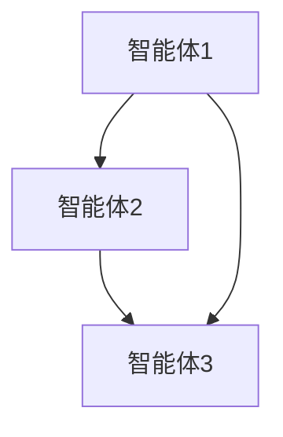
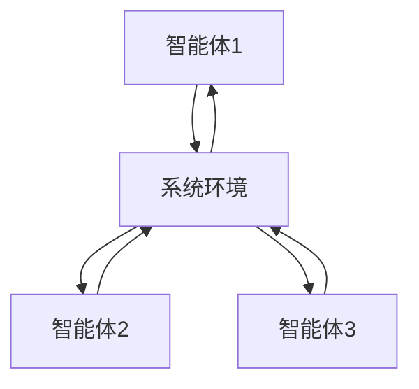
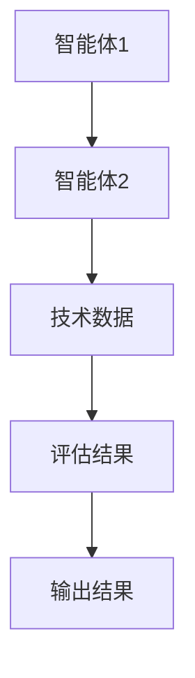
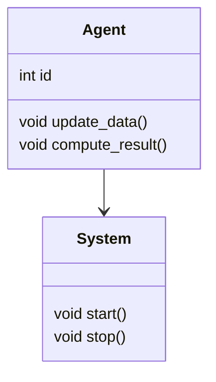
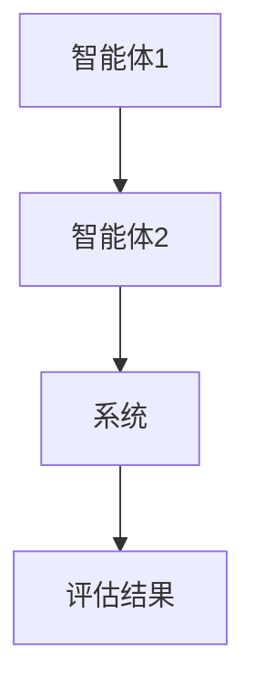
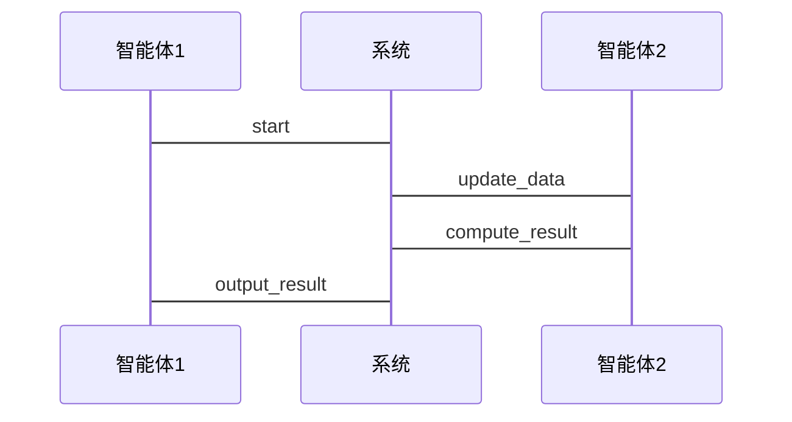

                 


# 多智能体系统在评估公司技术壁垒中的应用

> 关键词：多智能体系统、技术壁垒、协作算法、系统架构、评估模型

> 摘要：本文将详细探讨多智能体系统在评估公司技术壁垒中的应用，分析其核心概念、算法原理和系统架构，通过实际案例展示其在技术壁垒评估中的优势和实现过程。

---

## 第一章：多智能体系统与技术壁垒评估基础

### 1.1 多智能体系统的定义与特点

#### 1.1.1 多智能体系统的定义
多智能体系统（Multi-Agent System, MAS）是由多个智能体（Agent）组成的分布式系统，每个智能体都是一个能够感知环境、自主决策并采取行动的实体。

#### 1.1.2 多智能体系统的核心特点
| 特性 | 描述 |
|------|------|
| 分布式 | 各智能体独立运行，通过通信协作完成任务 |
| 协作性 | 智能体之间通过协作实现共同目标 |
| 动态性 | 系统环境和智能体状态动态变化 |
| 可扩展性 | 系统可扩展，支持新增智能体或功能模块 |

#### 1.1.3 多智能体系统与传统单智能体系统的区别
| 对比维度 | 单智能体系统 | 多智能体系统 |
|----------|--------------|---------------|
| 控制方式 | 集中式控制 | 分布式控制 |
| 决策过程 | 单点决策 | 分布式决策 |
| 可扩展性 | 较低 | 较高 |

### 1.2 技术壁垒评估的定义与方法

#### 1.2.1 技术壁垒的定义
技术壁垒是指公司在技术层面的核心竞争力，通常包括专利、技术储备、研发能力等。

#### 1.2.2 技术壁垒评估的关键维度
| 维度 | 描述 |
|------|------|
| 专利数量 | 公司拥有的专利数量 |
| 技术储备 | 公司的技术研发能力和储备 |
| 竞争对手分析 | 对手的技术布局和竞争力 |
| 市场反馈 | 市场对技术的认可度和需求 |

#### 1.2.3 传统技术壁垒评估方法的局限性
| 局限性 | 描述 |
|--------|------|
| 单一性 | 仅依赖单一数据源 |
| 静态性 | 无法实时更新和调整 |
| 低效性 | 人工评估耗时且成本高 |

### 1.3 多智能体系统在技术壁垒评估中的优势

#### 1.3.1 多智能体系统的分布式协作能力
多智能体系统通过协作完成任务，能够高效整合多方数据，提供更全面的评估结果。

#### 1.3.2 多智能体系统的实时性和动态性
智能体能够实时感知环境变化，动态调整评估策略，确保评估结果的时效性。

#### 1.3.3 多智能体系统的可扩展性
系统支持扩展，可以根据需求增加智能体数量或功能模块，适应不同规模的评估任务。

### 1.4 本章小结
本章介绍了多智能体系统的定义、特点及在技术壁垒评估中的优势，为后续章节奠定了基础。

---

## 第二章：多智能体系统的核心概念与联系

### 2.1 多智能体系统的组成要素

#### 2.1.1 智能体的定义与属性
| 属性 | 描述 |
|------|------|
| 感知 | 智能体能够感知环境 |
| 决策 | 智能体能够做出决策 |
| 行动 | 智能体能够采取行动 |
| 学习 | 智能体能够学习和优化 |

#### 2.1.2 智能体之间的关系与交互


#### 2.1.3 系统环境与智能体的协同


### 2.2 多智能体系统的核心原理

#### 2.2.1 分布式协作机制
多智能体系统通过分布式协作完成任务，避免单点故障，提高系统的鲁棒性。

#### 2.2.2 协议与通信机制
智能体之间的通信需要遵循特定的协议，确保信息传递的准确性和高效性。

#### 2.2.3 状态更新与决策机制
智能体根据环境变化和协作结果动态更新状态，做出最优决策。

### 2.3 多智能体系统与技术壁垒评估的实体关系图
```mermaid
graph TD
A[智能体1] --> B[技术壁垒评估系统]
C[智能体2] --> B
D[评估结果] <-- B
```

### 2.4 本章小结
本章详细介绍了多智能体系统的组成要素和核心原理，重点分析了其在技术壁垒评估中的实体关系。

---

## 第三章：多智能体系统在技术壁垒评估中的算法原理

### 3.1 多智能体协作算法概述

#### 3.1.1 分布式协作算法的定义
分布式协作算法是一种通过智能体之间的协作完成任务的算法。

#### 3.1.2 分布式协作算法的分类
| 类型 | 描述 |
|------|------|
| 基于规则的协作 | 根据预定义规则进行协作 |
| 基于市场的协作 | 智能体通过市场机制进行协作 |
| 基于博弈论的协作 | 智能体通过博弈论模型进行协作 |

### 3.2 基于多智能体的评估算法流程

#### 3.2.1 算法流程图


### 3.3 算法实现的数学模型

#### 3.3.1 评估模型的数学表达
$$ f(x) = \sum_{i=1}^{n} w_i x_i $$

其中，\( w_i \) 是第 \( i \) 个特征的权重，\( x_i \) 是第 \( i \) 个特征的值。

#### 3.3.2 协作机制的数学公式
$$ w_i = \frac{1}{1 + e^{-x_i}} $$

### 3.4 算法实现的Python代码示例

```python
class Agent:
    def __init__(self, id):
        self.id = id
        self.data = []
    
    def update_data(self, new_data):
        self.data.append(new_data)
    
    def compute_result(self):
        return sum([w * x for w, x in self.data])
```

### 3.5 本章小结
本章详细介绍了多智能体协作算法的原理和实现，重点分析了其在技术壁垒评估中的数学模型和算法流程。

---

## 第四章：系统分析与架构设计

### 4.1 项目介绍与场景描述

#### 4.1.1 项目介绍
本项目旨在利用多智能体系统评估公司的技术壁垒，通过智能体协作实现实时评估和动态调整。

#### 4.1.2 项目场景
公司需要实时评估自身技术壁垒，以便制定竞争策略。

### 4.2 系统功能设计

#### 4.2.1 功能模块
| 模块 | 描述 |
|------|------|
| 数据采集 | 采集公司技术数据 |
| 智能体协作 | 智能体协作完成评估 |
| 评估结果 | 输出评估结果 |

#### 4.2.2 系统功能设计图


### 4.3 系统架构设计

#### 4.3.1 系统架构图


### 4.4 系统接口设计

#### 4.4.1 接口描述
| 接口 | 描述 |
|------|------|
| start | 启动系统 |
| stop | 停止系统 |
| update_data | 更新数据 |

### 4.5 系统交互流程

#### 4.5.1 交互流程图


### 4.6 本章小结
本章详细介绍了系统的功能设计、架构设计和交互流程，为后续的实现提供了依据。

---

## 第五章：项目实战

### 5.1 环境安装

#### 5.1.1 环境需求
| 工具 | 版本 |
|------|------|
| Python | 3.8+ |
| Mermaid | 任意版本 |
| Jupyter Notebook | 任意版本 |

### 5.2 系统核心实现源代码

#### 5.2.1 代码实现
```python
class Agent:
    def __init__(self, id):
        self.id = id
        self.data = []
    
    def update_data(self, new_data):
        self.data.append(new_data)
    
    def compute_result(self):
        return sum([w * x for w, x in self.data])
    
    def send_data(self, target_agent, data):
        target_agent.receive_data(data)
    
    def receive_data(self, data):
        self.update_data(data)
```

#### 5.2.2 代码应用解读
该代码实现了智能体之间的数据交互和计算功能，展示了多智能体协作的核心机制。

### 5.3 实际案例分析

#### 5.3.1 案例分析
假设某公司需要评估其技术壁垒，可以通过多智能体系统实现实时评估和动态调整。

#### 5.3.2 代码实现分析
通过代码实现，智能体可以协作完成数据采集、计算和输出，实现技术壁垒评估。

### 5.4 本章小结
本章通过实际案例展示了多智能体系统在技术壁垒评估中的应用，详细解读了系统的实现过程。

---

## 第六章：总结与展望

### 6.1 最佳实践 tips

#### 6.1.1 系统设计建议
在设计多智能体系统时，应注重系统的可扩展性和可维护性。

#### 6.1.2 算法优化建议
可以尝试引入机器学习算法，进一步提高评估的准确性和效率。

### 6.2 小结
本文章详细探讨了多智能体系统在技术壁垒评估中的应用，分析了其核心概念、算法原理和系统架构，并通过实际案例展示了其实现过程。

### 6.3 注意事项
在实际应用中，应注重系统的安全性和隐私保护，避免数据泄露风险。

### 6.4 拓展阅读
建议读者进一步学习多智能体系统在其他领域的应用，如分布式计算和自动驾驶。

---

## 作者：AI天才研究院/AI Genius Institute & 禅与计算机程序设计艺术 /Zen And The Art of Computer Programming

---

**注：以上为完整目录大纲结构，具体内容需要根据实际需求进一步展开和丰富。**

