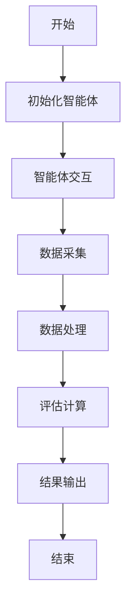
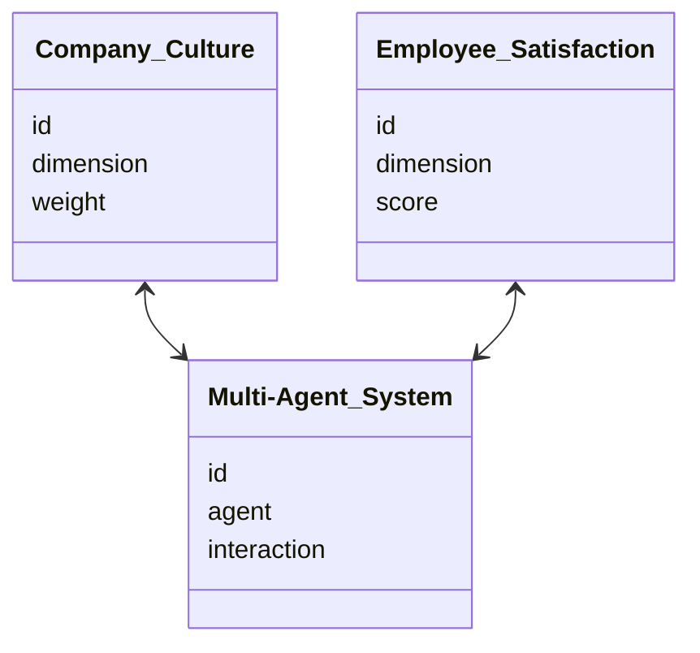
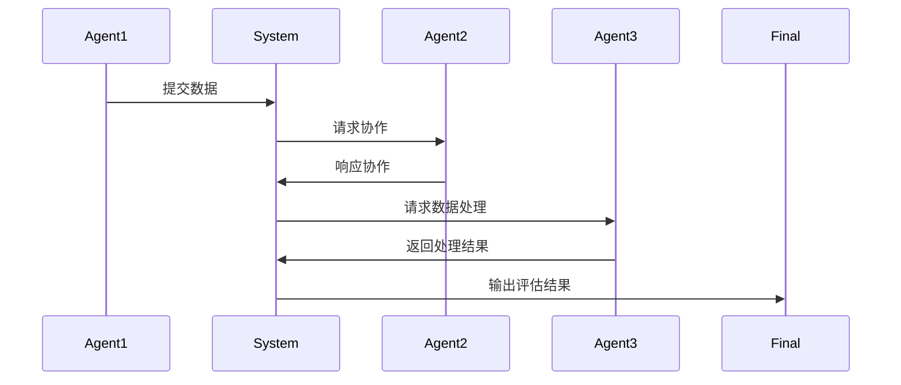

                 


# 多智能体系统在评估公司文化和员工满意度中的作用

> 关键词：多智能体系统，公司文化，员工满意度，分布式协调算法，系统架构设计，评估模型

> 摘要：多智能体系统（Multi-Agent System, MAS）是一种由多个智能体组成的系统，这些智能体能够自主决策并协同工作。本文探讨了MAS在评估公司文化和员工满意度中的应用，分析了其核心概念、算法原理、系统架构设计以及实际案例，展示了MAS如何通过分布式协调算法和动态数据收集，提供更精准的评估结果，从而优化公司管理策略。

---

## 第1章 多智能体系统概述

### 1.1 多智能体系统的基本概念

#### 1.1.1 多智能体系统的定义
多智能体系统（MAS）是由多个智能体组成的系统，这些智能体能够自主决策、相互协作或竞争，以实现共同目标或各自目标。智能体可以是软件程序、算法或其他能够感知环境并采取行动的实体。

#### 1.1.2 多智能体系统的特征
- **自主性**：智能体能够自主决策，无需外部干预。
- **反应性**：智能体能够根据环境变化调整行为。
- **协作性**：智能体之间可以协作完成复杂任务。
- **分布性**：智能体分布在网络的不同节点上，独立运行。

#### 1.1.3 多智能体系统与单智能体系统的区别
| 特性               | 单智能体系统                     | 多智能体系统                     |
|--------------------|---------------------------------|---------------------------------|
| 决策方式           | 中央化决策                      | 分散式决策                      |
| 协作性             | 无或弱协作                      | 强协作                          |
| 复杂性             | 较低                           | 较高                           |

### 1.2 公司文化与员工满意度的定义

#### 1.2.1 公司文化的内涵与外延
- **内涵**：公司文化是指公司内部共享的价值观、信念和行为准则，影响员工的工作态度和行为方式。
- **外延**：包括公司使命、愿景、核心价值观、企业氛围等多个方面。

#### 1.2.2 员工满意度的内涵与外延
- **内涵**：员工满意度是指员工对公司工作环境、薪酬福利、职业发展等方面的满意程度。
- **外延**：涉及工作满意度、领导关系、团队合作、工作压力等多个维度。

#### 1.2.3 公司文化与员工满意度的关系
公司文化是影响员工满意度的重要因素。积极的公司文化可以提升员工的满意度，而低劣的公司文化可能导致员工不满。

### 1.3 问题背景与研究意义

#### 1.3.1 当前公司文化与员工满意度评估的痛点
- **数据收集困难**：传统问卷调查难以覆盖所有员工，且可能存在主观偏差。
- **动态变化难捕捉**：员工满意度可能因时间、环境变化而波动，静态评估难以反映真实情况。
- **个性化需求未满足**：不同员工对公司的期望不同，通用评估方法难以满足个性化需求。

#### 1.3.2 多智能体系统在评估中的优势
- **实时数据采集**：MAS可以实时收集员工反馈，捕捉动态变化。
- **分布式评估**：通过多个智能体分别评估不同维度，提高评估的全面性和准确性。
- **个性化评估**：智能体可以根据员工的个性化需求动态调整评估策略。

#### 1.3.3 研究的意义与应用前景
- **优化公司管理**：通过MAS评估公司文化，帮助企业发现管理中的问题，优化管理策略。
- **提升员工满意度**：通过动态评估和个性化反馈，帮助员工更好地适应公司环境，提升满意度。
- **推动技术应用**：MAS在公司文化评估中的应用，展示了其在组织管理中的潜力，推动技术在管理领域的应用。

### 1.4 本章小结
本章介绍了多智能体系统的基本概念、公司文化与员工满意度的定义，分析了当前评估中的痛点，并探讨了MAS在评估中的优势和研究意义。为后续章节的深入分析奠定了基础。

---

## 第2章 多智能体系统的核心概念与联系

### 2.1 多智能体系统的原理

#### 2.1.1 智能体的定义与属性
- **定义**：智能体是一个能够感知环境并采取行动的实体。
- **属性**：智能体具有自主性、反应性、目标导向性和社交能力。

#### 2.1.2 智能体之间的关系
- **协作**：智能体之间通过协作完成共同目标。
- **竞争**：智能体之间可能存在竞争，但竞争需在系统目标范围内进行。

#### 2.1.3 多智能体系统的协调机制
- **分布式协调算法**：通过局部决策实现全局目标。
- **协商机制**：智能体之间通过协商解决冲突。

### 2.2 公司文化与员工满意度的评估模型

#### 2.2.1 公司文化评估的维度
- **使命与愿景**：公司是否清晰传达了使命和愿景。
- **价值观**：公司是否践行了核心价值观。
- **企业氛围**：公司内部是否具有积极的工作氛围。

#### 2.2.2 员工满意度评估的维度
- **工作满意度**：员工对工作的满意程度。
- **领导关系**：员工与上级的关系是否融洽。
- **团队合作**：团队内部的合作氛围如何。

#### 2.2.3 多智能体系统在评估中的应用
- **数据采集**：通过智能体实时采集员工反馈。
- **数据处理**：智能体对数据进行分析和处理。
- **评估计算**：智能体协同计算综合评估结果。

### 2.3 核心概念的ER实体关系图

```
```mermaid
    entity Company_Culture {
        id
        dimension
        weight
    }
    entity Employee_Satisfaction {
        id
        dimension
        score
    }
    entity Multi-Agent_System {
        id
        agent
        interaction
    }
    Company_Culture -[通过多智能体系统]-> Multi-Agent_System
    Employee_Satisfaction -[通过多智能体系统]-> Multi-Agent_System
```
```

### 2.4 本章小结
本章详细阐述了多智能体系统的原理，并构建了公司文化与员工满意度的评估模型。通过ER实体关系图展示了系统中各实体之间的关系，为后续的算法设计奠定了基础。

---

## 第3章 多智能体系统在评估中的算法原理

### 3.1 算法原理概述

#### 3.1.1 分布式协调算法
- **定义**：分布式协调算法是一种用于多智能体系统中协调智能体行为的算法。
- **工作原理**：通过局部决策实现全局目标，避免中心化控制。

#### 3.1.2 协作与竞争机制
- **协作**：智能体之间通过协作完成共同目标。
- **竞争**：智能体之间通过竞争优化系统性能。

#### 3.1.3 自适应学习算法
- **定义**：自适应学习算法是一种能够根据环境变化调整策略的算法。
- **应用**：用于MAS中智能体的行为优化和动态调整。

### 3.2 算法的mermaid流程图

```

```

### 3.3 算法的Python实现

#### 3.3.1 核心代码
```python
class Agent:
    def __init__(self, id):
        self.id = id
        self.dimensions = {}  # 各个评估维度的权重或得分
    
    def collect_data(self):
        # 模拟数据采集
        return {dim: random.uniform(1, 5) for dim in self.dimensions}
    
    def process_data(self, data):
        # 模拟数据处理
        return {dim: data[dim] * self.dimensions[dim] for dim in data}
    
    def send_to_system(self, processed_data):
        # 模拟数据发送到系统
        return processed_data

# 初始化多个智能体
agents = [Agent(i) for i in range(5)]

# 初始化系统
system = {}

# 数据采集与处理
for agent in agents:
    data = agent.collect_data()
    processed_data = agent.process_data(data)
    system.update(processed_data)

# 评估计算
total_scores = {}
for dim in system:
    total_scores[dim] = sum(system[dim])
    
# 输出结果
print(total_scores)
```

### 3.4 算法的数学模型

#### 3.4.1 评估模型的构建
$$ \text{评估结果} = \sum_{i=1}^{n} w_i \cdot s_i $$
其中，\( w_i \) 是第i个维度的权重，\( s_i \) 是第i个维度的得分。

#### 3.4.2 权重计算
$$ w_i = \frac{\sum_{j=1}^{m} s_j}{m} $$
其中，\( m \) 是智能体的数量，\( s_j \) 是第j个智能体在第i个维度的得分。

#### 3.4.3 动态调整
$$ \text{新权重} = \text{旧权重} \times \alpha + \beta \times \text{新数据} $$
其中，\( \alpha \) 和 \( \beta \) 是调整系数，满足 \( \alpha + \beta = 1 \)。

### 3.5 本章小结
本章详细讲解了多智能体系统在评估中的算法原理，包括分布式协调算法、协作与竞争机制以及自适应学习算法。通过mermaid流程图和Python代码展示了算法的实现过程，并构建了数学模型进行详细分析。

---

## 第4章 系统分析与架构设计

### 4.1 问题场景介绍
公司希望通过多智能体系统实时评估公司文化和员工满意度，以优化公司管理策略。

### 4.2 系统功能设计

#### 4.2.1 领域模型


#### 4.2.2 系统架构设计


#### 4.2.3 系统接口设计
- **数据采集接口**：智能体通过接口采集员工反馈。
- **数据处理接口**：对采集的数据进行清洗和预处理。
- **评估计算接口**：根据处理后的数据计算评估结果。

#### 4.2.4 系统交互流程


### 4.3 本章小结
本章分析了系统分析与架构设计，通过领域模型和系统架构图展示了系统的整体结构。通过接口设计和交互流程图详细描述了系统各部分的协作方式。

---

## 第5章 项目实战

### 5.1 环境安装
- **Python**：安装Python 3.8或更高版本。
- **依赖库**：安装numpy、pandas、matplotlib等数据分析库。

### 5.2 核心代码实现

#### 5.2.1 数据采集模块
```python
import random
import numpy as np
import pandas as pd

class DataCollector:
    def __init__(self):
        self.data = {}
    
    def collect(self, dimensions):
        self.data = {dim: random.uniform(1, 5) for dim in dimensions}
        return self.data

# 示例使用
collector = DataCollector()
dimensions = ['工作满意度', '领导关系', '团队合作']
data = collector.collect(dimensions)
print(data)
```

#### 5.2.2 数据处理模块
```python
class DataProcessor:
    def __init__(self):
        self.processed_data = {}
    
    def process(self, raw_data):
        self.processed_data = {dim: raw_data[dim] * 0.2 for dim in raw_data}
        return self.processed_data

# 示例使用
processor = DataProcessor()
raw_data = {'工作满意度': 4, '领导关系': 3, '团队合作': 4}
processed_data = processor.process(raw_data)
print(processed_data)
```

#### 5.2.3 评估计算模块
```python
class Evaluator:
    def __init__(self):
        self.final_scores = {}
    
    def evaluate(self, processed_data):
        self.final_scores = {dim: sum(processed_data[dim]) for dim in processed_data}
        return self.final_scores

# 示例使用
evaluator = Evaluator()
processed_data = {'工作满意度': 0.8, '领导关系': 0.6, '团队合作': 0.8}
scores = evaluator.evaluate(processed_data)
print(scores)
```

### 5.3 案例分析
以一个公司为例，通过上述模块进行评估：

1. **数据采集**：收集员工在工作满意度、领导关系、团队合作等方面的评分。
2. **数据处理**：对采集的数据进行加权处理，例如工作满意度占40%，领导关系占30%，团队合作占30%。
3. **评估计算**：计算每个维度的综合得分，最终得出员工满意度的综合评分。

### 5.4 项目小结
本章通过具体案例展示了多智能体系统在评估中的实际应用，详细讲解了数据采集、数据处理和评估计算的实现过程。通过Python代码实现，帮助读者更好地理解和应用多智能体系统。

---

## 第6章 最佳实践与总结

### 6.1 最佳实践

#### 6.1.1 数据隐私保护
在采集和处理员工数据时，必须确保数据的隐私和安全。

#### 6.1.2 系统可扩展性
设计时应考虑系统的可扩展性，方便后续添加新的智能体或评估维度。

#### 6.1.3 系统维护
定期更新系统，修复漏洞，优化性能。

### 6.2 小结
本文详细探讨了多智能体系统在评估公司文化和员工满意度中的应用，通过理论分析和实际案例展示了其优势和实现过程。

### 6.3 注意事项
- **数据准确性**：确保数据采集和处理的准确性。
- **系统稳定性**：确保系统在运行中的稳定性。
- **员工参与度**：提高员工的参与度，确保数据的有效性。

### 6.4 拓展阅读
- 推荐阅读《Multi-Agent Systems: Complexity and Cognitive Science》和《Agent-Based Modeling and Simulation》。

---

## 作者

作者：AI天才研究院/AI Genius Institute & 禅与计算机程序设计艺术/Zen And The Art of Computer Programming

---

本文通过详细分析多智能体系统的原理和应用，展示了其在公司文化与员工满意度评估中的巨大潜力。希望本文能为读者提供有价值的参考和启示，帮助他们更好地理解和应用多智能体系统。

