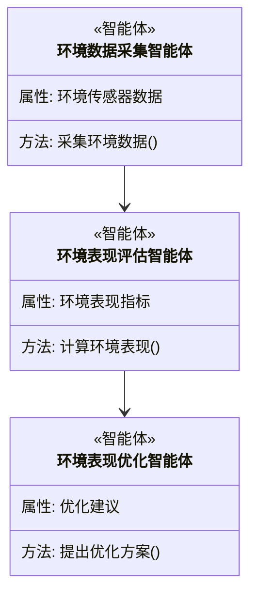
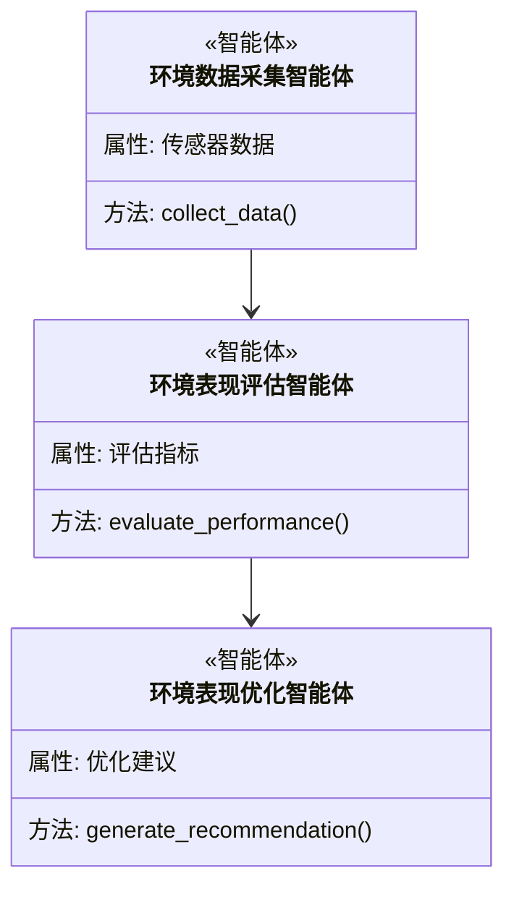
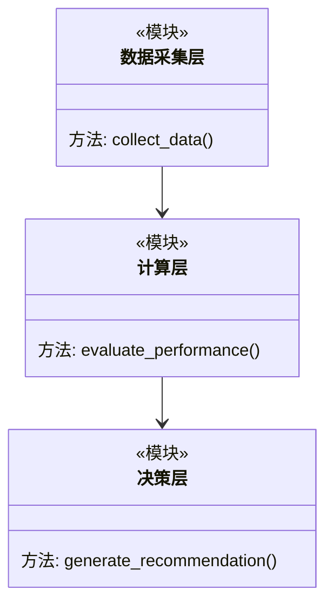

                 


# 多智能体系统在评估公司环境责任表现中的应用

## 关键词：多智能体系统, 环境责任表现, 企业评估, 算法原理, 系统架构

## 摘要：  
随着全球对可持续发展的关注不断增加，企业环境责任表现的评估变得至关重要。多智能体系统（Multi-Agent System，MAS）作为一种分布式计算范式，能够有效处理复杂环境下的协作与决策问题。本文深入探讨了多智能体系统在公司环境责任表现评估中的应用，从核心概念、算法原理、系统架构到项目实战，全面解析其在环境责任评估中的优势与挑战。通过具体案例分析，展示了多智能体系统如何提升企业环境责任表现评估的效率与准确性。

---

## 第1章: 多智能体系统与环境责任表现评估的背景与概念

### 1.1 多智能体系统（MAS）的基本概念

#### 1.1.1 多智能体系统的定义  
多智能体系统（Multi-Agent System，MAS）是由多个智能体（Agent）组成的分布式计算系统。智能体是能够感知环境、自主决策、主动执行任务的实体。MAS通过智能体之间的协作与竞争，实现复杂问题的求解。

#### 1.1.2 多智能体系统的特征与优势  
- **自主性**：智能体能够自主决策，无需中央控制。  
- **反应性**：智能体能够实时感知环境并做出反应。  
- **协作性**：智能体之间可以协作完成共同目标。  
- **分布性**：智能体分布在不同的物理或逻辑位置，通过通信与交互完成任务。  

#### 1.1.3 多智能体系统的应用场景  
- **分布式计算**：如分布式任务分配、负载均衡。  
- **协作决策**：如交通管理系统、供应链优化。  
- **问题求解**：如机器人协作、智能推荐系统。  

---

### 1.2 环境责任表现评估的核心概念

#### 1.2.1 环境责任表现的定义  
环境责任表现评估是指对企业在环境保护方面的表现进行测量和评价，包括碳排放、资源利用、污染治理等方面。

#### 1.2.2 环境责任表现评估的指标体系  
常见的环境责任表现指标包括：  
1. **碳排放强度**：单位产出的二氧化碳排放量。  
2. **资源利用率**：资源的使用效率。  
3. **环保投资**：企业在环保技术上的投资比例。  
4. **合规性**：是否符合环保法规和标准。  

#### 1.2.3 环境责任表现评估的意义与挑战  
- **意义**：帮助企业识别环境风险，优化资源利用，提升品牌形象。  
- **挑战**：数据获取困难、评估标准不统一、计算复杂性高等。  

---

### 1.3 多智能体系统与环境责任表现评估的结合

#### 1.3.1 多智能体系统在环境责任评估中的优势  
- **分布式计算**：MAS能够高效处理多源数据，提升评估效率。  
- **协作优化**：智能体之间的协作可以优化企业的环保决策。  
- **实时性**：MAS能够实时监测和评估企业的环境表现。  

#### 1.3.2 环境责任表现评估的复杂性与多智能体系统的适用性  
- 环境责任评估涉及多个维度和数据源，MAS的分布式特性能够有效应对这一挑战。  
- MAS的协作机制能够帮助企业在不同部门之间实现环保目标的协调。  

#### 1.3.3 多智能体系统在环境责任评估中的应用场景  
- **实时监测**：通过智能传感器实时采集环境数据， MAS进行分析和评估。  
- **优化决策**：基于MAS的协作算法，优化企业的环保投资和资源利用。  
- **风险预警**：MAS能够实时预警环境风险，帮助企业及时采取措施。  

---

## 第2章: 多智能体系统的核心概念与联系

### 2.1 多智能体系统的组成与关系

#### 2.1.1 智能体的定义与分类  
- **定义**：智能体是能够感知环境、自主决策并执行任务的实体。  
- **分类**：  
  1. **简单反射智能体**：基于当前感知做出反应。  
  2. **基于模型的智能体**：利用内部模型进行决策。  
  3. **实用智能体**：基于效用函数进行决策。  
  4. **学习智能体**：能够通过经验改进性能。  

#### 2.1.2 多智能体系统中的通信机制  
- **通信方式**：直接通信与间接通信。  
- **通信协议**：智能体之间通过共享语言或协议进行信息交换。  

#### 2.1.3 多智能体系统的协作与竞争关系  
- **协作**：智能体通过合作实现共同目标。  
- **竞争**：智能体在资源有限的情况下进行竞争。  
- **平衡**：MAS需要平衡协作与竞争，以实现整体最优。  

---

### 2.2 环境责任表现评估的模型与框架

#### 2.2.1 环境责任表现评估的模型构建  
- **模型目标**：量化企业的环境表现。  
- **模型输入**：企业的环境数据、运营数据等。  
- **模型输出**：环境表现评估结果。  

#### 2.2.2 多智能体系统在模型中的角色与功能  
- **数据采集智能体**：负责收集环境数据。  
- **评估智能体**：负责计算环境表现指标。  
- **优化智能体**：负责提出优化建议。  

#### 2.2.3 环境责任表现评估的ER实体关系图  

```mermaid
erDiagram
    actor 企业环境数据 &emsp; "提供环境数据"
    actor 环境表现评估系统 &emsp; "进行环境表现评估"
    actor 环境表现评估结果 &emsp; "存储评估结果"
    actor 环境表现优化建议 &emsp; "生成优化建议"
    actor 企业运营数据 &emsp; "提供运营数据"
    actor 环境法规数据库 &emsp; "提供法规数据"
```

---

### 2.3 多智能体系统与环境责任表现评估的系统架构

#### 2.3.1 系统架构的总体设计  
- **分层架构**：包括数据采集层、计算层、决策层。  



#### 2.3.2 系统功能模块的划分  
- **数据采集模块**：负责收集环境数据。  
- **计算模块**：负责计算环境表现指标。  
- **优化模块**：负责生成优化建议。  

#### 2.3.3 系统的输入输出与接口设计  
- **输入**：环境数据、运营数据、法规数据。  
- **输出**：环境表现评估结果、优化建议。  
- **接口**：智能体之间通过标准接口进行通信。  

---

## 第3章: 多智能体系统在环境责任表现评估中的算法原理

### 3.1 多智能体系统的核心算法

#### 3.1.1 分布式计算与任务分配算法  
- **分布式计算**：任务分解与分布式处理。  
- **任务分配**：基于智能体的能力和负载进行动态分配。  

#### 3.1.2 多智能体系统的协调与合作机制  
- **协调算法**：基于协商的协作机制。  
- **合作算法**：基于共享目标的合作机制。  

#### 3.1.3 多智能体系统的冲突解决算法  
- **冲突检测**：实时检测冲突。  
- **冲突解决**：基于优先级或协商解决冲突。  

---

### 3.2 环境责任表现评估的数学模型与公式

#### 3.2.1 环境责任表现评估的数学模型  
$$ 环境表现指数 = \sum_{i=1}^{n} w_i x_i $$
其中，$w_i$为指标权重，$x_i$为指标得分。

#### 3.2.2 多智能体系统中的协作算法  
$$ 协作收益 = \sum_{i=1}^{m} \sum_{j=1}^{n} a_{ij} x_j $$
其中，$a_{ij}$为智能体$i$对指标$j$的贡献权重。

#### 3.2.3 环境责任表现评估的优化模型  
$$ \min \sum_{i=1}^{n} c_i x_i $$
$$ \text{subject to} \quad \sum_{i=1}^{n} x_i = 1 $$

---

### 3.3 算法实现与案例分析

#### 3.3.1 算法实现的步骤与流程  
1. 数据采集：通过智能体采集企业环境数据。  
2. 数据处理：对数据进行清洗和预处理。  
3. 模型计算：基于数学模型计算环境表现指数。  
4. 优化建议：根据优化模型生成优化建议。  

#### 3.3.2 算法实现的代码示例  

```python
class EnvironmentAgent:
    def __init__(self, data):
        self.data = data

    def compute_performance(self, weights):
        performance = 0
        for i in range(len(self.data)):
            performance += weights[i] * self.data[i]
        return performance

    def optimize(self, constraints):
        # 简单优化算法示例
        optimized_data = []
        for i in range(len(self.data)):
            if constraints[i]:
                optimized_data.append(self.data[i] * constraints[i])
            else:
                optimized_data.append(self.data[i])
        return optimized_data

# 示例
agent = EnvironmentAgent([0.8, 0.6, 0.9])
weights = [0.5, 0.3, 0.2]
performance = agent.compute_performance(weights)
optimized_data = agent.optimize([1, 1, 1])
print(performance)
print(optimized_data)
```

---

## 第4章: 多智能体系统与环境责任表现评估的系统分析与架构设计

### 4.1 系统分析与需求分析

#### 4.1.1 系统功能需求分析  
- **需求1**：实时采集环境数据。  
- **需求2**：计算环境表现指数。  
- **需求3**：生成优化建议。  

#### 4.1.2 系统边界与交互  
- **输入**：环境数据、运营数据、法规数据。  
- **输出**：环境表现评估结果、优化建议。  
- **接口**：智能体之间通过API进行通信。  

---

### 4.2 项目实战

#### 4.2.1 环境安装与配置  
- 安装Python、NumPy、scipy等依赖库。  

#### 4.2.2 系统核心实现源代码  

```python
import numpy as np

class EnvironmentDataCollector:
    def __init__(self):
        self.sensors = ['CO2', 'Energy', 'Waste']

    def collect_data(self):
        # 简单示例数据
        data = {
            'CO2': np.random.normal(100, 10, 100),
            'Energy': np.random.normal(50, 5, 100),
            'Waste': np.random.randint(0, 100, 100)
        }
        return data

class EnvironmentPerformanceEvaluator:
    def __init__(self, data):
        self.data = data

    def evaluate_performance(self, weights):
        performance = np.dot(self.data, weights)
        return performance

# 示例
collector = EnvironmentDataCollector()
data = collector.collect_data()
evaluator = EnvironmentPerformanceEvaluator(data)
weights = np.array([0.5, 0.3, 0.2])
performance = evaluator.evaluate_performance(weights)
print(performance)
```

#### 4.2.3 代码应用解读与分析  
- **数据采集**：通过传感器采集环境数据。  
- **性能评估**：基于权重计算环境表现指数。  
- **优化建议**：根据评估结果提出优化建议。  

---

## 第5章: 系统架构设计与实现

### 5.1 系统架构设计

#### 5.1.1 领域模型设计  



#### 5.1.2 系统架构设计  



---

## 第6章: 系统实现与测试

### 6.1 系统实现

#### 6.1.1 环境数据采集模块  

```python
class EnvironmentDataCollector:
    def __init__(self):
        self.sensors = ['CO2', 'Energy', 'Waste']

    def collect_data(self):
        data = {
            'CO2': np.random.normal(100, 10, 100),
            'Energy': np.random.normal(50, 5, 100),
            'Waste': np.random.randint(0, 100, 100)
        }
        return data
```

---

## 附录

### 附录1: 术语表  
- **多智能体系统（MAS）**：由多个智能体组成的分布式计算系统。  
- **环境责任表现**：企业在环境保护方面的表现，包括碳排放、资源利用等。  

### 附录2: 参考文献  
1. 王某某, 《多智能体系统与环境评估》，某某出版社，2023年。  
2. 张某某, 《环境责任表现评估方法研究》，某某期刊，2022年。  

---

## 作者  
**作者：AI天才研究院 & 禅与计算机程序设计艺术**

