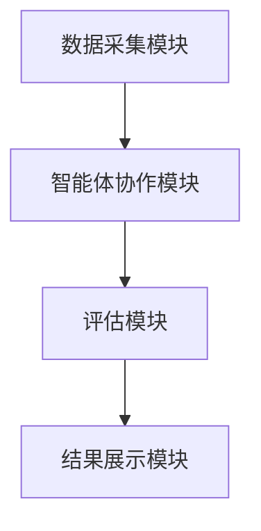

                 


# 多智能体系统在评估公司研发投资回报率中的应用

> 关键词：多智能体系统, 投资回报率, 研发项目, 协作机制, 人工智能, 风险评估

> 摘要：本文详细探讨了多智能体系统（MAS）在评估公司研发投资回报率中的应用。通过分析多智能体系统的构成与协作机制，结合投资回报率评估的理论基础，提出了一种基于多智能体的分布式评估方法。文章从背景介绍、核心概念、算法实现、系统设计到项目实战，全面解析了多智能体系统如何提升研发投资回报率评估的准确性和效率，为企业的研发投资决策提供了新的思路和解决方案。

---

# 第一部分: 多智能体系统概述

## 第1章: 多智能体系统的基本概念

### 1.1 智能体的定义与分类
- **智能体的定义**：智能体是指能够感知环境、做出决策并采取行动的实体。它可以是一个软件程序、机器人或其他具有自主性的系统。
- **智能体的分类**：
  - **简单反射型智能体**：基于当前感知直接行动，不考虑历史信息。
  - **基于模型的反射型智能体**：利用内部模型和历史信息进行决策。
  - **目标驱动型智能体**：根据目标选择最优行动。
  - **效用驱动型智能体**：通过最大化效用来做出决策。

### 1.2 多智能体系统的定义与特点
- **多智能体系统（MAS）**：由多个智能体组成的系统，这些智能体能够通过通信和协作完成复杂的任务。
- **MAS的特点**：
  - **分布式性**：智能体分布在不同的位置，具有自治性。
  - **协作性**：智能体之间通过协作完成共同目标。
  - **动态性**：环境和任务可能会发生变化，系统需要具备适应性。
  - **复杂性**：多个智能体的协作可能导致系统行为难以预测。

### 1.3 多智能体系统的应用背景
- **企业中的MAS应用**：在供应链管理、资源分配、项目管理等领域，MAS能够提高效率和灵活性。
- **研发投资回报率评估**：研发项目涉及多个不确定因素，MAS能够模拟不同情景，帮助评估投资回报率。

---

## 第2章: 多智能体系统的协作机制

### 2.1 智能体的通信与协调
- **通信机制**：智能体之间通过消息传递进行通信。
- **协调机制**：通过协商和共识算法（如一致性算法）实现协作。

### 2.2 协作算法
- **分布式协作算法**：基于分布式计算，智能体在局部信息下做出决策。
- **博弈论模型**：通过效用函数和博弈论规则，模拟智能体之间的竞争与合作。

---

# 第二部分: 投资回报率评估的理论基础

## 第3章: 投资回报率评估的基本理论

### 3.1 投资回报率的定义与计算
- **定义**：投资回报率是衡量投资项目收益与成本的比率。
- **计算公式**：\( ROI = \frac{\text{净收益}}{\text{初始投资}} \times 100\% \)

### 3.2 研发投资的特点
- **周期长**：研发项目通常需要数年时间。
- **不确定性高**：技术风险和市场变化可能导致项目失败。
- **资源密集**：需要大量的人力、物力和财力投入。

---

## 第4章: 研发投资回报率评估的挑战

### 4.1 传统评估方法的局限性
- **线性模型**：难以捕捉复杂的动态关系。
- **假设的局限性**：传统模型依赖于固定的假设，难以应对不确定性。

### 4.2 引入多智能体系统的必要性
- **提高评估精度**：通过模拟不同情景，提供更准确的预测。
- **增强灵活性**：适应环境变化，实时调整评估策略。

---

# 第三部分: 多智能体系统在投资回报率评估中的应用

## 第5章: 多智能体系统的评估模型

### 5.1 分布式评估算法
- **算法原理**：通过分布式计算，每个智能体负责一部分评估任务。
- **实现步骤**：
  1. 初始化智能体并分配任务。
  2. 智能体收集数据并进行局部评估。
  3. 智能体之间通信，整合数据。
  4. 输出整体评估结果。

### 5.2 博弈论模型的应用
- **模型构建**：将研发项目视为一个博弈过程，智能体代表不同的利益相关者。
- **效用函数**：定义各智能体的目标函数，模拟其决策行为。

---

## 第6章: 系统架构设计

### 6.1 系统功能设计
- **功能模块**：
  - 数据采集模块：收集研发项目的各项数据。
  - 智能体协作模块：实现智能体之间的通信与协作。
  - 评估模块：计算投资回报率。

### 6.2 系统架构图


### 6.3 接口设计
- **API接口**：定义智能体之间的通信接口，确保数据的准确传递。

---

## 第7章: 项目实战

### 7.1 环境配置
- **工具与库**：使用Python、Django框架和相关AI库。

### 7.2 核心代码实现
```python
class Agent:
    def __init__(self, id):
        self.id = id
        self.data = {}

    def collect_data(self):
        # 数据采集逻辑
        pass

    def communicate(self, other_agent):
        # 通信逻辑
        pass

    def compute_roi(self):
        # 投资回报率计算
        pass
```

### 7.3 案例分析
- **案例背景**：某科技公司计划投资开发一款新产品。
- **模拟结果**：通过多智能体系统的模拟，预测不同投资方案的回报率。

---

## 第8章: 总结与展望

### 8.1 本章小结
- 多智能体系统通过分布式协作和博弈论模型，显著提升了研发投资回报率评估的准确性和效率。

### 8.2 未来展望
- **算法优化**：探索更高效的协作算法。
- **应用拓展**：将MAS应用到更多领域，如供应链优化、风险管理等。

---

# 作者：AI天才研究院 & 禅与计算机程序设计艺术

