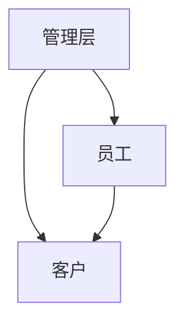
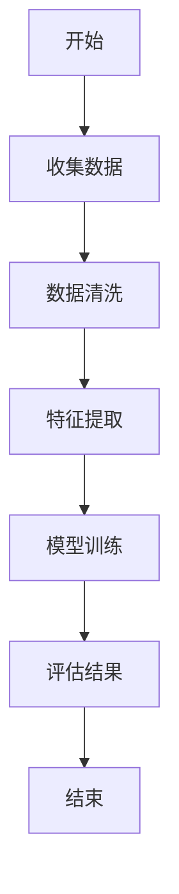
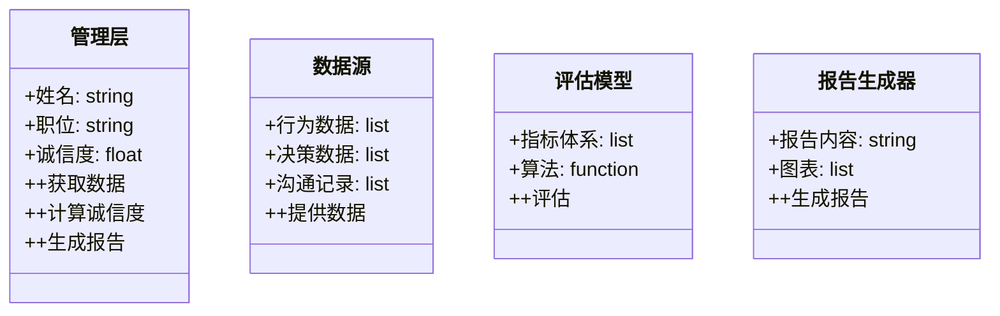
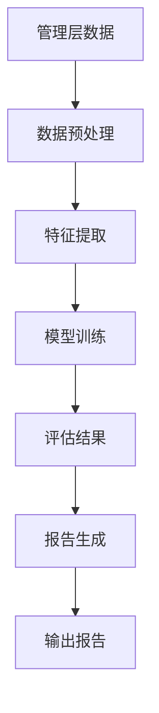
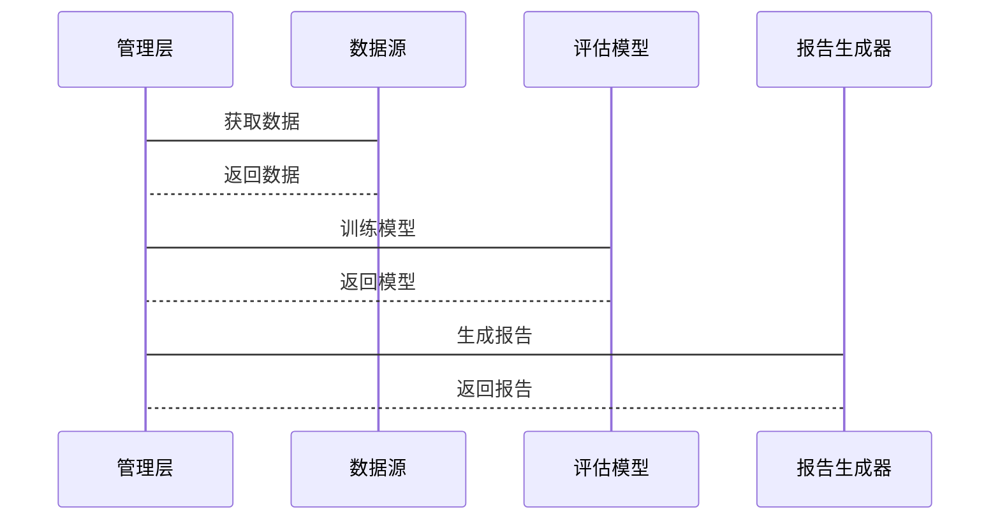

                 


# 多智能体系统在评估公司管理层诚信度中的应用

> 关键词：多智能体系统, 诚信度评估, 分布式计算, 信誉模型, 管理层评估

> 摘要：  
> 本文探讨了多智能体系统（Multi-Agent Systems, MAS）在公司管理层诚信度评估中的应用。通过分析MAS的核心原理、算法模型和系统架构，结合实际案例，展示了如何利用MAS技术实现对管理层诚信度的智能化评估。本文还详细介绍了系统的实现过程，包括环境搭建、核心算法实现、案例分析以及系统的优化建议。

---

# 第一部分: 多智能体系统与公司管理层诚信度评估概述

## 第1章: 多智能体系统与公司管理层诚信度评估的背景

### 1.1 多智能体系统的定义与特点

#### 1.1.1 多智能体系统的定义  
多智能体系统（MAS）是由多个自主智能体组成的分布式系统，这些智能体能够通过局部信息协作完成复杂任务。MAS的核心在于智能体之间的协作与通信，每个智能体都有自己的目标和行为策略。

#### 1.1.2 多智能体系统的核心特点  
| 特性 | 描述 |
|------|------|
| 分布式 | 智能体独立运行，通过通信协作完成任务 |
| 自主性 | 智能体具备自主决策能力 |
| 协作性 | 智能体之间通过协商完成共同目标 |
| 反应性 | 智能体能够实时感知环境并做出反应 |

#### 1.1.3 多智能体系统的主要应用场景  
- 分布式计算  
- 智能推荐系统  
- 机器人协作  
- 组织行为分析  

### 1.2 公司管理层诚信度评估的定义与重要性

#### 1.2.1 诚信度评估的定义  
诚信度评估是对管理层在组织中的行为是否符合道德规范和公司价值观的评价。诚信度评估的核心在于分析管理层的行为是否透明、公正且负责任。

#### 1.2.2 诚信度评估的重要性  
- 提高组织的信任度  
- 优化管理层决策质量  
- 预防企业风险  

#### 1.2.3 诚信度评估的边界与外延  
- 评估范围：管理层的行为、决策和沟通  
- 评估外延：影响企业声誉、员工士气和客户关系  

### 1.3 本章小结  
本章介绍了多智能体系统的定义、特点及其应用场景，重点阐述了公司管理层诚信度评估的定义、重要性及其边界。通过这些背景知识的铺垫，为后续的系统设计奠定了基础。

---

# 第二部分: 多智能体系统的核心概念与诚信度评估的联系

## 第2章: 多智能体系统的核心原理

### 2.1 多智能体系统的组成与结构

#### 2.1.1 实体与行为  
- 实体：智能体的主体，例如公司管理层、员工、客户等。  
- 行为：智能体在特定情境下的动作，例如决策、沟通、协作等。  

#### 2.1.2 通信与协调  
- 通信：智能体之间的信息传递，例如通过消息传递协议。  
- 协调：智能体之间通过协商达成一致，例如任务分配和资源分配。  

#### 2.1.3 协议与规则  
- 协议：智能体之间通信的规则，例如使用特定的协议格式。  
- 规则：智能体行为的约束条件，例如公司内部的规章制度。  

### 2.2 诚信度评估的数学模型

#### 2.2.1 诚信度评估的指标体系  
诚信度评估的指标通常包括：  
- 透明度：管理层决策的透明程度。  
- 正直性：管理层行为是否符合道德规范。  
- 责任感：管理层在出现问题时的应对能力。  

#### 2.2.2 评估模型的构建  
诚信度评估模型可以基于贝叶斯网络或社会网络分析模型构建。以下是一个简单的贝叶斯网络模型：

$$ P(诚信度|行为) = \frac{P(行为|诚信度)P(诚信度)}{P(行为)} $$  

#### 2.2.3 模型的验证与优化  
通过收集实际数据对模型进行验证，并根据验证结果调整模型参数，以提高评估的准确性。

### 2.3 多智能体系统与诚信度评估的实体关系

#### 2.3.1 实体关系图（ER图）  
以下是公司管理层诚信度评估的实体关系图：



#### 2.3.2 诚信度评估的流程图  
以下是诚信度评估的流程图：



## 第3章: 多智能体系统与诚信度评估的交互机制

### 3.1 分布式计算与多智能体协作

#### 3.1.1 分布式计算的基本原理  
分布式计算通过将任务分解到多个智能体上完成，每个智能体负责处理特定部分的数据，并通过通信共享结果。

#### 3.1.2 多智能体协作的机制  
- 任务分配：智能体根据自身能力和当前负载情况主动申请任务。  
- 协商机制：智能体之间通过协商确定任务的具体执行方式。  
- 信息共享：智能体之间通过通信共享必要的信息，确保任务顺利执行。  

#### 3.1.3 分布式算法的实现  
以下是分布式计算的简单实现示例：

```python
import threading

class Agent:
    def __init__(self, id):
        self.id = id
        self.task = None

    def assign_task(self, task):
        self.task = task
        print(f"Agent {self.id} assigned task: {task}")

    def execute_task(self):
        if self.task:
            print(f"Agent {self.id} executing task: {self.task}")
            # 模拟任务执行时间
            threading.sleep(1)
            print(f"Agent {self.id} completed task: {self.task}")

# 创建多个智能体
agents = [Agent(i) for i in range(1, 5)]

# 分配任务
for agent in agents:
    agent.assign_task(f"Task {i}")

# 执行任务
for agent in agents:
    agent.execute_task()
```

### 3.2 信誉评估模型的构建

#### 3.2.1 信誉评估的定义  
信誉评估是对智能体行为的长期表现进行评价，通常基于历史数据和行为记录。

#### 3.2.2 信誉评估模型的实现  
信誉评估模型可以通过社会网络分析方法构建，例如：

$$ S(A) = \sum_{i=1}^{n} w_{i,j} \cdot R(i,j) $$  

其中，$S(A)$ 表示智能体 $A$ 的信誉值，$w_{i,j}$ 是智能体 $i$ 和 $j$ 之间的关系权重，$R(i,j)$ 是智能体 $i$ 对智能体 $j$ 的评价。

### 3.3 本章小结  
本章详细介绍了多智能体系统的核心原理，包括分布式计算、协作机制和信誉评估模型，并通过具体的算法实现和流程图展示了这些概念的实际应用。

---

# 第三部分: 系统分析与架构设计

## 第4章: 系统分析与架构设计

### 4.1 系统需求分析

#### 4.1.1 功能需求  
- 收集管理层行为数据  
- 构建诚信度评估模型  
- 生成评估报告  

#### 4.1.2 性能需求  
- 实时性：能够快速响应管理层行为  
- 可扩展性：支持大规模数据处理  

#### 4.1.3 用户需求  
- 管理层：希望了解自身诚信度的评估结果  
- 员工：希望了解管理层的透明度和责任感  

### 4.2 系统功能设计

#### 4.2.1 领域模型  
以下是系统领域的模型：



#### 4.2.2 系统架构设计  
以下是系统架构设计的示意图：



### 4.3 系统接口设计

#### 4.3.1 接口定义  
- 数据接口：负责数据的输入和输出  
- 模型接口：负责模型的训练和评估  
- 报告接口：负责报告的生成和展示  

#### 4.3.2 接口实现  
以下是数据接口的简单实现示例：

```python
class DataInterface:
    def __init__(self):
        self.data = {}

    def load_data(self, source):
        """从数据源加载数据"""
        self.data = source
        return self.data

    def save_data(self, data):
        """保存数据到数据源"""
        self.data = data
        return self.data
```

### 4.4 系统交互设计

#### 4.4.1 交互流程  
- 数据预处理：对原始数据进行清洗和标准化  
- 特征提取：从数据中提取有助于诚信度评估的特征  
- 模型训练：基于提取的特征训练诚信度评估模型  
- 评估结果：根据模型输出评估结果并生成报告  

#### 4.4.2 交互序列图  
以下是系统交互的序列图：



## 第5章: 系统实现与优化

### 5.1 环境搭建

#### 5.1.1 系统环境  
- 操作系统：Linux/Windows  
- 开发工具：PyCharm/VS Code  
- 依赖库：Python（3.8+）、numpy、pandas、scikit-learn  

### 5.2 核心算法实现

#### 5.2.1 诚信度评估模型  
以下是诚信度评估模型的实现示例：

```python
from sklearn.naive_bayes import GaussianNB

class TrustworthinessEvaluator:
    def __init__(self):
        self.model = GaussianNB()

    def train(self, X, y):
        """训练模型"""
        self.model.fit(X, y)
        return self.model

    def predict(self, X):
        """预测诚信度"""
        return self.model.predict(X)
```

#### 5.2.2 信誉评估模型  
以下是信誉评估模型的实现示例：

```python
import networkx as nx

class ReputationModel:
    def __init__(self):
        self.graph = nx.Graph()

    def add_edge(self, node1, node2, weight=1):
        """添加节点之间的关系"""
        self.graph.add_edge(node1, node2, weight=weight)

    def calculate_reputation(self):
        """计算信誉值"""
        # 简单实现，实际可以使用更复杂的算法
        reputations = {}
        for node in self.graph.nodes():
            reputations[node] = sum([self.graph[node][neighbor]['weight'] for neighbor in self.graph.neighbors(node)])
        return reputations
```

### 5.3 优化建议

#### 5.3.1 系统优化  
- 数据预处理：使用更高效的算法对数据进行清洗和标准化  
- 模型优化：尝试不同的机器学习算法以提高评估准确率  

#### 5.3.2 系统扩展  
- 支持更大规模的数据处理  
- 增加更多的评估指标  

---

# 第四部分: 总结与展望

## 第6章: 总结与展望

### 6.1 总结  
本文详细探讨了多智能体系统在公司管理层诚信度评估中的应用，从系统原理到具体实现，展示了如何利用MAS技术实现智能化的诚信度评估。

### 6.2 未来展望  
随着人工智能技术的不断发展，多智能体系统在诚信度评估中的应用将更加广泛。未来的研究方向包括：  
- 更加智能化的信誉评估模型  
- 更高效的分布式计算算法  
- 更加人性化的系统交互设计  

### 6.3 最佳实践 Tips  
- 在实际应用中，建议结合企业的具体需求进行系统定制  
- 定期更新模型以适应环境的变化  

### 6.4 小结  
通过本文的介绍，读者可以深入了解多智能体系统在诚信度评估中的应用，并能够将其应用于实际场景中。

---

# 作者信息

**作者：** AI天才研究院/AI Genius Institute & 禅与计算机程序设计艺术/Zen And The Art of Computer Programming

---

感谢您的阅读！希望本文能够为您提供有价值的信息和启发！

