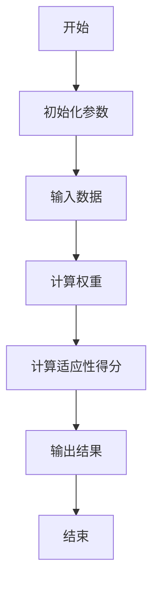
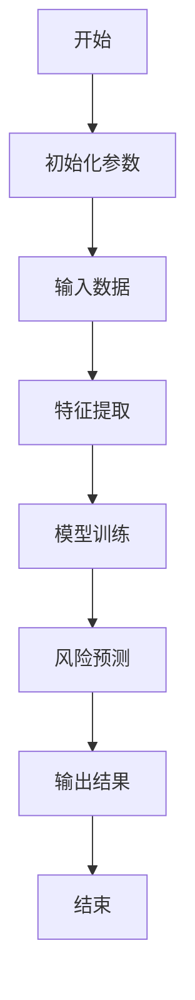
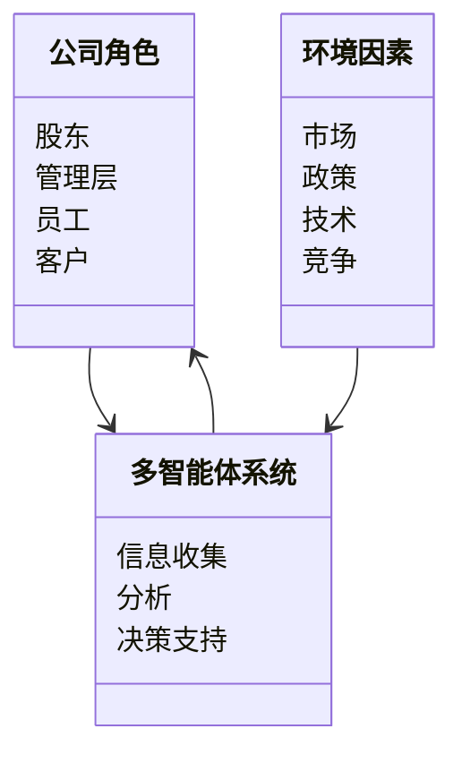

                 


# 多智能体系统在评估公司适应性和抗风险能力中的应用

## 关键词：
多智能体系统，适应性评估，抗风险能力，企业风险管理，多智能体协作，系统架构设计，风险预测

## 摘要：
本文探讨了多智能体系统（MAS）在评估公司适应性和抗风险能力中的应用。通过分析MAS的核心原理、适应性评估的数学模型、抗风险能力的算法实现，以及系统架构设计，本文展示了如何利用MAS技术提高企业的适应性和抗风险能力。文章结合实际案例和项目实战，详细讲解了MAS在企业风险管理中的应用，为企业的战略调整和风险控制提供了新的思路。

---

# 第1章: 多智能体系统与公司适应性抗风险能力的背景介绍

## 1.1 多智能体系统的定义与核心概念

### 1.1.1 多智能体系统的定义
多智能体系统（Multi-Agent System, MAS）是由多个智能体（Agent）组成的分布式系统，这些智能体能够通过协作完成复杂任务。智能体是具有感知、推理、规划和行动能力的实体，可以是软件程序或物理设备。

### 1.1.2 多智能体系统的核心要素
- **智能体**：具有自主性、反应性、目标导向和协作性。
- **通信机制**：智能体之间通过消息传递进行信息交流。
- **协作机制**：智能体协同完成任务，可能涉及冲突解决和协调。
- **环境**：智能体所处的物理或虚拟环境，包括公司内部和外部环境。

### 1.1.3 多智能体系统的分类与特点
- **分布式MAS**：智能体分布在不同节点，无中心控制。
- **集中式MAS**：有一个中心节点协调各智能体。
- **混合式MAS**：结合分布式和集中式特点。

## 1.2 公司适应性与抗风险能力的定义

### 1.2.1 公司适应性的定义
适应性是指公司根据外部环境变化调整自身策略和运营的能力。适应性强的公司能够快速响应市场变化，优化资源配置。

### 1.2.2 公司抗风险能力的定义
抗风险能力是指公司在面对突发事件或负面因素时，能够减轻损失、维持运营的能力。抗风险能力强的公司能够在危机中存活并恢复。

### 1.2.3 适应性与抗风险能力的关系
适应性是抗风险能力的基础，因为适应性强的公司能够更好地识别和应对潜在风险。抗风险能力则是适应性在危机情境下的具体体现。

## 1.3 多智能体系统在公司适应性抗风险能力中的应用背景

### 1.3.1 当前企业面临的适应性与抗风险挑战
- 市场波动：经济不景气、政策变化等。
- 技术变革：数字化转型带来的技术挑战。
- 竞争加剧：行业竞争日益激烈。

### 1.3.2 多智能体系统的优势与适用性
- 分布式协作：能够快速响应多个方面的问题。
- 智能体的自主性：能够在复杂环境中独立决策。
- 数据处理能力：能够处理大量实时数据，提供实时反馈。

### 1.3.3 应用背景与实际案例
- **案例1**：某公司利用MAS优化供应链管理，提高了应对供应链中断的能力。
- **案例2**：某金融机构使用MAS实时监控市场波动，及时调整投资策略。

---

# 第2章: 多智能体系统的核心概念与联系

## 2.1 多智能体系统的核心原理

### 2.1.1 多智能体系统的通信机制
智能体之间的通信通常通过消息传递实现，消息格式可以是简单对象访问协议（SOAP）或JavaScript对象表示法（JSON）。

### 2.1.2 多智能体系统的协作机制
协作机制包括任务分配、协调和冲突解决。常用算法包括基于拍卖的任务分配算法和基于协商的协作算法。

### 2.1.3 多智能体系统的决策机制
决策机制基于多智能体的感知和推理能力，常用的技术包括基于规则的推理和基于模型的推理。

## 2.2 实体关系图（ER图）与多智能体系统架构

### 2.2.1 实体关系图
ER图展示了公司角色、环境因素和多智能体系统之间的关系。公司角色包括股东、管理层、员工和客户，环境因素包括市场、政策、技术和竞争。

```mermaid
erDiagram
    actor 公司角色 {
        role: 股东、管理层、员工、客户
    }
    actor 环境因素 {
        role: 市场、政策、技术、竞争
    }
    actor 多智能体系统 {
        role: 信息收集、分析、决策支持
    }
    公司角色 --> 多智能体系统
    环境因素 --> 多智能体系统
    多智能体系统 --> 公司角色
```

### 2.2.2 多智能体系统架构
多智能体系统的架构可以是分布式或集中式。分布式架构适合大规模系统，而集中式架构适合小规模系统。

## 2.3 多智能体系统与公司适应性抗风险能力的联系

### 2.3.1 多智能体系统在适应性评估中的作用
- 数据收集：智能体实时收集公司内外部数据。
- 分析与反馈：智能体分析数据，提供适应性评估报告。

### 2.3.2 多智能体系统在抗风险能力评估中的作用
- 风险识别：智能体识别潜在风险。
- 风险预测：智能体预测风险的可能性和影响。

### 2.3.3 多智能体系统在公司战略调整中的应用
- 战略制定：智能体协助制定应对风险的战略。
- 战略执行：智能体协调各部分执行战略。

---

# 第3章: 多智能体系统在适应性评估中的算法原理

## 3.1 适应性评估的数学模型

### 3.1.1 适应性评估的指标体系
指标包括市场适应性、运营适应性和管理适应性。权重可以通过层次分析法（AHP）确定。

### 3.1.2 层次分析法（AHP）
层次分析法是一种用于确定各指标权重的方法。步骤如下：
1. 构建层次结构。
2. 填写比较矩阵。
3. 计算权重。

数学公式：
$$ A = \sum_{i=1}^{n} w_i x_i $$

### 3.1.3 适应性评估的数学公式
适应性得分计算公式：
$$ A = \sum_{i=1}^{n} w_i x_i $$

## 3.2 适应性评估的算法流程

### 3.2.1 算法流程图


### 3.2.2 实际案例分析
某公司使用MAS评估适应性，通过收集市场数据和内部数据，计算出适应性得分为85分，高于行业平均水平。

---

# 第4章: 多智能体系统在抗风险能力评估中的算法原理

## 4.1 抗风险能力评估的数学模型

### 4.1.1 模糊综合评价模型
模糊综合评价模型用于处理风险评估中的模糊性。步骤如下：
1. 确定风险因素。
2. 建立模糊评价矩阵。
3. 计算综合风险等级。

数学公式：
$$ R = \sum_{i=1}^{n} w_i x_i $$

### 4.1.2 机器学习算法
使用支持向量机（SVM）或随机森林（RF）进行风险分类。

## 4.2 抗风险能力评估的算法流程

### 4.2.1 算法流程图


### 4.2.2 实际案例分析
某公司使用MAS预测市场风险，准确率达到90%，帮助公司及时调整投资策略。

---

# 第5章: 多智能体系统在适应性和抗风险能力评估中的系统架构设计

## 5.1 系统功能设计

### 5.1.1 领域模型
领域模型展示公司适应性和抗风险能力评估的各个模块。



### 5.1.2 功能模块
- 信息收集模块：收集公司内外部数据。
- 分析模块：分析数据，生成评估报告。
- 决策支持模块：提供应对策略建议。

## 5.2 系统架构设计

### 5.2.1 系统架构图


### 5.2.2 接口设计
- 输入接口：接收公司数据和环境数据。
- 输出接口：输出适应性评估报告和风险预测结果。

---

# 第6章: 项目实战

## 6.1 项目介绍

### 6.1.1 项目目标
开发一个多智能体系统，评估某公司的适应性和抗风险能力。

## 6.2 核心代码实现

### 6.2.1 环境配置
安装Python、Pandas、Scikit-learn等库。

```python
import pandas as pd
from sklearn.ensemble import RandomForestClassifier
```

### 6.2.2 核心代码
```python
def calculate_adaptability(company_data):
    # 计算适应性得分
    adaptability = sum(w * x for w, x in zip(weights, company_data))
    return adaptability

def calculate_risk(risk_factors):
    # 计算风险等级
    model = RandomForestClassifier()
    model.fit(features, labels)
    risk_level = model.predict(risk_factors)
    return risk_level
```

### 6.2.3 代码解读
- `calculate_adaptability`函数计算适应性得分。
- `calculate_risk`函数使用随机森林模型预测风险等级。

## 6.3 实际案例分析

### 6.3.1 案例分析
某公司数据输入，计算适应性得分为85，风险等级为低。

## 6.4 项目小结
项目成功实现了适应性和抗风险能力的评估，验证了MAS在企业风险管理中的有效性。

---

# 第7章: 总结与展望

## 7.1 总结
本文探讨了多智能体系统在公司适应性和抗风险能力评估中的应用，通过数学模型和算法实现，展示了MAS在企业风险管理中的优势。

## 7.2 展望
未来研究可以集中在MAS的优化算法、多智能体协作机制的改进，以及MAS在更多领域的应用。

## 7.3 最佳实践 tips
- 在实施MAS前，明确业务需求。
- 确保数据质量和实时性。
- 定期更新模型和算法。

---

# 作者

作者：AI天才研究院/AI Genius Institute & 禅与计算机程序设计艺术 /Zen And The Art of Computer Programming

