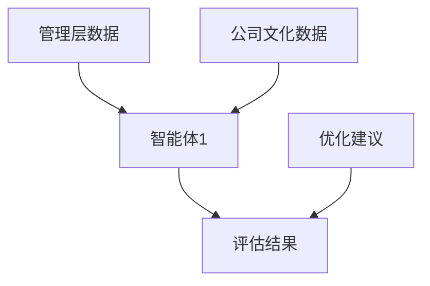

                 

# 多智能体系统在评估管理层质量和公司文化中的应用

> **关键词**：多智能体系统（MAS）、管理层质量评估、公司文化评估、智能化管理、分布式计算、协作智能

> **摘要**：  
> 本文探讨了多智能体系统（MAS）在企业管理中的创新应用，重点分析了MAS在评估管理层质量和公司文化中的潜力。通过结合MAS的分布式计算、协作智能和自适应学习能力，本文提出了全新的企业管理评估方法，为企业管理者提供了基于智能技术的决策支持工具。文章从 MAS 的基础理论出发，详细分析了其在管理层质量评估和公司文化评估中的具体应用场景，并通过案例展示了其实际效果。

---

# 第一部分：多智能体系统基础

## 第1章：多智能体系统概述

### 1.1 多智能体系统的基本概念

#### 1.1.1 多智能体系统的定义  
多智能体系统（Multi-Agent System, MAS）是由多个具有智能性、自主性和协作性的智能体（Agent）组成的分布式系统。智能体能够感知环境、自主决策、与其他智能体协作，并通过通信完成复杂任务。

#### 1.1.2 多智能体系统的特征  
- **自主性**：智能体能够自主决策，无需外部干预。  
- **反应性**：智能体能够实时感知环境并做出反应。  
- **协作性**：多个智能体通过通信和协作完成共同目标。  
- **分布式性**：系统中的智能体分布在不同的空间或时间维度上。  

#### 1.1.3 多智能体系统与单智能体系统的区别  
| 特性 | 单智能体系统 | 多智能体系统 |
|------|--------------|--------------|
| 决策 | 中央决策     | 分布式决策   |
| 通信 | 无           | 高           |
| 协作 | 无           | 强           |
| 效率 | 单点故障     | 高容错性     |

---

### 1.2 多智能体系统的理论基础

#### 1.2.1 分布式计算与多智能体系统  
分布式计算是 MAS 的核心理论基础。通过将任务分解为多个智能体的子任务，实现系统的并行计算和协作。

#### 1.2.2 博弈论与多智能体系统  
博弈论为 MAS 的协作与竞争提供了理论框架。智能体之间的互动可以看作是博弈过程，通过纳什均衡等理论优化决策。

#### 1.2.3 多智能体系统的通信与协作机制  
- **通信机制**：智能体之间通过消息传递进行信息交换。  
- **协作机制**：通过协商、分配和协调实现任务的协同完成。  

---

### 1.3 多智能体系统的应用领域

#### 1.3.1 多智能体系统在企业管理中的应用  
- **资源分配**：优化企业资源的分配和利用。  
- **任务协作**：通过协作智能体完成复杂任务。  
- **风险管理**：通过分布式计算降低系统风险。  

---

## 第2章：多智能体系统的架构与通信

### 2.1 多智能体系统的架构设计

#### 2.1.1 分层架构  
分层架构将 MAS 分为感知层、决策层和执行层，各层之间通过接口通信。

#### 2.1.2 分布式架构  
分布式架构将智能体分布在不同的节点上，通过网络通信实现协作。

#### 2.1.3 混合架构  
混合架构结合了分层和分布式架构的优势，适用于复杂的多智能体系统。

---

### 2.2 多智能体系统的通信机制

#### 2.2.1 通信协议的选择  
选择合适的通信协议（如 HTTP、WebSocket）是实现 MAS 通信的关键。

#### 2.2.2 通信模型的设计  
通信模型包括消息格式、消息队列和消息路由设计。

#### 2.2.3 通信中的安全问题  
通过加密和认证技术确保 MAS 通信的安全性。

---

### 2.3 多智能体系统的协作机制

#### 2.3.1 协作协议的选择  
选择合适的协作协议（如 P2P 协议）是实现 MAS 协作的基础。

#### 2.3.2 协作任务的分配  
通过任务分解和负载均衡算法实现协作任务的合理分配。

#### 2.3.3 协作中的冲突解决  
通过协商和仲裁机制解决协作中的冲突。

---

## 第3章：管理层质量评估的背景与需求

### 3.1 管理层质量评估的重要性

#### 3.1.1 管理层质量对企业的影响  
管理层的决策和领导风格直接影响企业的绩效和员工满意度。

#### 3.1.2 管理层质量评估的必要性  
通过科学的评估方法，帮助企业识别和优化管理层的不足。

---

### 3.2 管理层质量评估的核心指标

#### 3.2.1 领导力评估指标  
- 领导风格（如变革型领导、交易型领导）。  
- 领导能力（如决策能力、沟通能力）。  

#### 3.2.2 决策能力评估指标  
- 决策速度与准确性。  
- 决策的前瞻性和创新性。  

#### 3.2.3 团队协作能力评估指标  
- 团队凝聚力。  
- 团队协作效率。  

---

### 3.3 管理层质量评估的现有方法

#### 3.3.1 基于问卷的评估方法  
通过员工反馈和专家评分进行评估。  

#### 3.3.2 基于行为观察的评估方法  
通过观察管理层的行为表现进行评估。  

#### 3.3.3 基于数据分析的评估方法  
通过分析企业绩效数据推断管理层能力。  

---

## 第4章：公司文化评估的核心指标

### 4.1 公司文化评估的重要性

#### 4.1.1 公司文化对企业绩效的影响  
- 健康的文化促进企业创新和员工满意度。  
- 不良的文化可能导致内部冲突和低效。

#### 4.1.2 公司文化评估的必要性  
通过科学的评估方法帮助企业识别文化问题并优化文化氛围。

---

### 4.2 公司文化评估的核心指标

#### 4.2.1 价值观一致性评估  
- 员工是否认同企业核心价值观。  
- 价值观与企业目标的匹配度。  

#### 4.2.2 员工满意度评估  
- 员工对工作环境和领导的满意度。  
- 员工对企业的忠诚度。  

#### 4.2.3 企业氛围评估  
- 团队协作氛围。  
- 创新氛围。  

---

## 第5章：多智能体系统在管理层和公司文化评估中的综合应用

### 5.1 综合评估模型的设计

#### 5.1.1 智能体的设计  
- 每个智能体对应一个评估维度（如领导力、团队协作）。  
- 智能体通过数据采集、分析和反馈完成评估任务。

#### 5.1.2 评估指标的权重分配  
- 根据企业需求设置不同评估指标的权重。

---

### 5.2 多智能体系统在评估中的优势

#### 5.2.1 高效性  
通过分布式计算快速完成大规模数据处理。  

#### 5.2.2 精准性  
通过智能体的协作实现数据的深度分析和评估。  

#### 5.2.3 自适应性  
系统能够根据企业需求动态调整评估模型。  

---

## 第6章：多智能体系统在公司文化评估中的应用

### 6.1 公司文化评估的 MAS 实现

#### 6.1.1 文化特征提取  
- 通过自然语言处理技术分析企业文档和员工反馈。  

#### 6.1.2 文化健康度评估  
- 基于智能体的协作实现文化健康度的综合评估。  

---

### 6.2 文化优化建议

#### 6.2.1 基于 MAS 的文化优化方案  
- 根据评估结果提出文化优化建议。  
- 通过智能体的协作实现文化的动态优化。  

---

## 第7章：系统实现与开发

### 7.1 系统架构设计

#### 7.1.1 系统功能模块  
- 数据采集模块：负责采集企业数据。  
- 数据分析模块：负责分析数据并生成评估结果。  
- 评估报告生成模块：负责生成评估报告。  

#### 7.1.2 系统架构图  

---

### 7.2 算法实现

#### 7.2.1 数据分析算法  
- 使用机器学习算法（如聚类、分类）进行数据分析。  

#### 7.2.2 优化算法  
- 使用遗传算法优化评估模型。  

---

## 第8章：实际案例分析

### 8.1 案例背景

#### 8.1.1 案例介绍  
某企业希望通过 MAS 优化管理层质量和公司文化评估。  

---

### 8.2 案例分析

#### 8.2.1 数据采集与分析  
- 采集管理层的决策数据和员工反馈。  
- 使用智能体进行数据分析和评估。  

#### 8.2.2 评估结果与优化建议  
- 根据评估结果提出文化优化建议。  

---

## 第9章：总结与展望

### 9.1 总结

#### 9.1.1 本文的主要内容  
本文探讨了 MAS 在企业管理中的应用，提出了基于智能体的评估方法。  

---

### 9.2 展望

#### 9.2.1 MAS 的未来发展  
MAS 在企业管理中的应用将更加广泛，智能化管理将成为趋势。

---

## 作者信息

作者：AI天才研究院 & 禅与计算机程序设计艺术

---

通过以上目录，文章将逐步展开每个部分的具体内容，涵盖从 MAS 基础到实际应用的完整流程。

