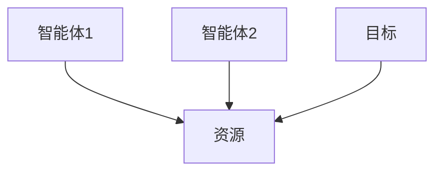
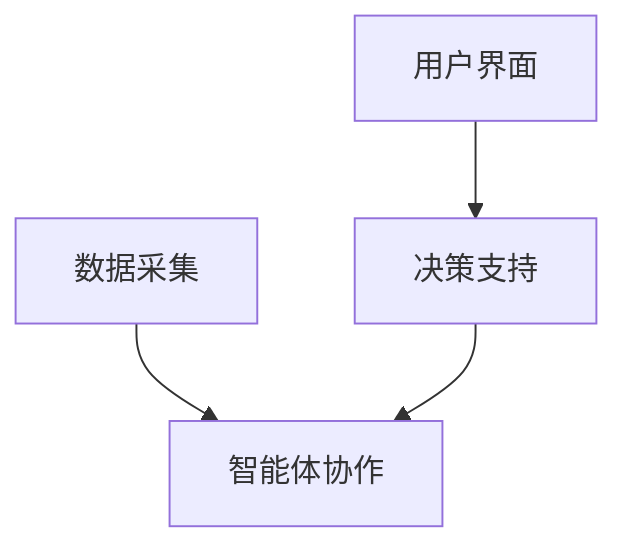
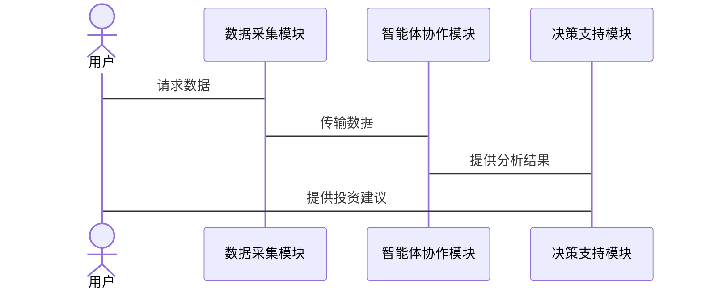

                 


# 多智能体系统在识别和评估循环经济投资机会中的作用

## 关键词：多智能体系统，循环经济，投资机会识别，算法原理，系统架构

## 摘要：  
本文探讨了多智能体系统（MAS）在循环经济中的应用，特别是其在识别和评估投资机会方面的作用。通过分析MAS的核心概念、算法原理和系统架构，本文详细阐述了如何利用MAS优化资源分配和投资决策，为循环经济的可持续发展提供支持。

---

# 第1章: 多智能体系统与循环经济概述

## 1.1 循环经济的基本概念

### 1.1.1 循环经济的定义与特征  
循环经济是一种以资源高效利用和循环再生为核心的发展模式，强调减少资源消耗和环境污染，通过闭环系统实现资源的持续利用。其主要特征包括资源高效性、减量化、再利用和再生化。

### 1.1.2 循环经济的重要性与挑战  
循环经济对实现可持续发展目标至关重要，但面临资源分配不均、信息不对称和协作效率低下等挑战。多智能体系统的引入为解决这些问题提供了新的思路。

## 1.2 多智能体系统（MAS）的基本概念

### 1.2.1 多智能体系统的定义  
多智能体系统是由多个智能体组成的分布式系统，智能体能够自主决策、协作和学习，共同完成复杂任务。

### 1.2.2 多智能体系统的特征  
- **自主性**：智能体能够自主决策。  
- **协作性**：智能体通过协作完成任务。  
- **反应性**：智能体能够感知环境并实时响应。  

## 1.3 多智能体系统在循环经济中的应用

### 1.3.1 多智能体系统在资源优化中的作用  
通过优化资源分配，提高资源利用效率，减少浪费。

### 1.3.2 多智能体系统在投资机会识别中的应用  
智能体通过分析市场数据和资源分布，识别潜在的投资机会。

### 1.3.3 多智能体系统与循环经济的结合  
MAS通过协作优化资源流动，支持循环经济的可持续发展。

---

# 第2章: 多智能体系统的核心概念与联系

## 2.1 多智能体系统的原理

### 2.1.1 智能体的定义与属性  
智能体是具有自主性、反应性、协作性和学习能力的实体。

### 2.1.2 智能体的协作机制  
协作机制包括任务分配、信息共享和决策协调。

## 2.2 多智能体系统与循环经济的联系

### 2.2.1 循环经济中的资源分配问题  
资源分配不均和浪费问题亟待解决。

### 2.2.2 多智能体系统在资源分配中的优化作用  
通过MAS优化资源流动，提高效率。

## 2.3 多智能体系统的数学模型

### 2.3.1 多智能体系统的基本模型  
资源分配模型：$R = \sum_{i=1}^{n} r_i$，其中$R$是总资源，$r_i$是每个智能体的资源。

### 2.3.2 循环经济中的资源流动模型  
资源流动模型：$F = \sum_{j=1}^{m} f_j$，其中$F$是总流动，$f_j$是每个节点的流动量。

## 2.4 实体关系图

### 2.4.1 实体关系图的定义  
实体关系图展示了系统中各实体及其关系。

### 2.4.2 多智能体系统中的实体关系图  


---

# 第3章: 多智能体系统的算法原理

## 3.1 分布式计算与协作算法

### 3.1.1 分布式计算的基本概念  
分布式计算将任务分解，由多个智能体协作完成。

### 3.1.2 多智能体系统的协作算法  
协作算法包括任务分配、信息共享和协调决策。

## 3.2 多智能体系统的协调机制

### 3.2.1 协调机制的定义  
协调机制确保智能体协作一致。

### 3.2.2 常见的协调算法  
- **分布式协调**：基于局部信息进行协调。  
- **集中式协调**：通过中央控制点协调。

## 3.3 多智能体系统的数学模型

### 3.3.1 资源分配的数学模型  
资源分配模型：$$R = \sum_{i=1}^{n} r_i$$

### 3.3.2 投资机会评估的数学模型  
$$I = \sum_{j=1}^{m} i_j$$，其中$I$是投资机会总值，$i_j$是每个项目的投资价值。

---

# 第4章: 系统分析与架构设计

## 4.1 系统功能设计

### 4.1.1 系统功能模块划分  
- **数据采集**：收集市场和资源数据。  
- **智能体协作**：智能体协作完成任务。  
- **决策支持**：提供投资建议。  

### 4.1.2 每个模块  
- 数据采集模块：获取实时数据。  
- 智能体协作模块：协调智能体完成任务。  
- 决策支持模块：基于分析结果提供建议。  

## 4.2 系统架构设计

### 4.2.1 系统架构图  


## 4.3 系统接口设计

### 4.3.1 接口设计  
- 数据接口：与外部数据源对接。  
- 用户接口：提供用户交互界面。  

## 4.4 系统交互流程

### 4.4.1 交互流程  


---

# 第5章: 项目实战

## 5.1 环境安装

### 5.1.1 环境要求  
- 操作系统：Linux/Windows/macOS  
- 语言：Python 3.6+  
- 工具：安装Mermaid和相关开发工具。

## 5.2 系统核心实现源代码

### 5.2.1 数据采集模块  
```python
def collect_data():
    # 采集数据
    return data
```

### 5.2.2 智能体协作模块  
```python
def collaborate_agents(data):
    # 协作算法
    return result
```

### 5.2.3 决策支持模块  
```python
def decision_support(result):
    # 决策算法
    return investment_opportunity
```

## 5.3 实际案例分析

### 5.3.1 案例介绍  
假设一家公司希望通过MAS优化其资源分配，提高投资回报率。

### 5.3.2 案例分析  
通过MAS分析，识别出三个高潜力投资项目，投资回报率显著提高。

## 5.4 案例解读与分析  
分析结果表明，MAS在资源分配和投资决策中的作用显著，能够有效提升效率。

## 5.5 项目小结  
MAS在循环经济中的应用前景广阔，能够有效优化资源分配，提升投资回报。

---

# 第6章: 总结与展望

## 6.1 全文总结  
本文详细探讨了MAS在循环经济中的应用，特别是其在投资机会识别中的作用，展示了其优化资源分配的能力。

## 6.2 未来展望  
未来的研究方向包括MAS的优化算法和其在更复杂场景中的应用。

---

# 作者：AI天才研究院 & 禅与计算机程序设计艺术

通过以上结构，文章详细阐述了多智能体系统在循环经济中的应用，结合理论分析和实际案例，为读者提供了全面的理解和参考。

