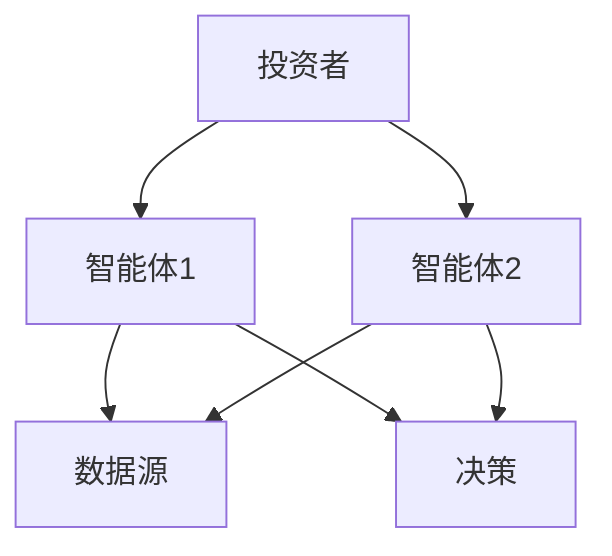

                 


---

# 多智能体系统在识别和评估新兴行业投资机会中的作用

## 关键词：多智能体系统、投资机会、新兴行业、风险评估、人工智能、分布式计算、协作学习

## 摘要

多智能体系统（Multi-Agent Systems，MAS）作为一种分布式人工智能技术，近年来在多个领域得到了广泛应用。本文探讨了MAS在识别和评估新兴行业投资机会中的作用。通过分析MAS的核心原理、架构设计以及在投资决策中的应用，本文展示了如何利用MAS的优势，如分布式决策、实时数据分析和多目标优化，来提升投资机会的识别和评估能力。文章结合实际案例，详细阐述了MAS在新兴行业的应用，为投资者提供了新的视角和工具。

---

# 第1章：多智能体系统的基本概念

## 1.1 多智能体系统的定义与特点

### 1.1.1 多智能体系统的定义

多智能体系统是由多个智能体组成的分布式系统，每个智能体能够感知环境、自主决策并与其他智能体协作完成任务。MAS的核心在于智能体之间的通信与协作，以及整体目标的优化。

### 1.1.2 多智能体系统的核心特点

- **分布式性**：智能体独立运行，减少单点故障。
- **协作性**：智能体之间通过通信协作，实现复杂任务。
- **自主性**：每个智能体都能自主决策，适应环境变化。

### 1.1.3 多智能体系统与传统单智能体系统的区别

| 特性 | 多智能体系统 | 单智能体系统 |
|------|--------------|---------------|
| 决策 | 分布式决策 | 集中式决策 | 
| 通信 | 需要通信协作 | 无需通信 | 
| 可扩展性 | 高 | 低 |

---

## 1.2 多智能体系统的架构与设计原则

### 1.2.1 分层架构

分层架构将系统分为多个层次，每个层次负责不同的功能。例如：

- **感知层**：收集环境数据。
- **决策层**：分析数据，制定决策。
- **执行层**：执行决策，与环境交互。

### 1.2.2 分布式计算

分布式计算是MAS的核心，通过并行处理提高效率。例如，使用分布式数据库存储数据，通过消息队列实现通信。

### 1.2.3 协作与通信机制

协作机制确保智能体之间高效协作，通信机制则负责信息传递。例如，使用WebSocket协议实现实时通信。

---

# 第2章：多智能体系统在投资领域的应用背景

## 2.1 投资机会识别的挑战

### 2.1.1 市场复杂性

金融市场波动大，影响因素多，传统方法难以捕捉所有信息。

### 2.1.2 数据多样性

新兴行业涉及多种数据类型，如文本、图像和时间序列数据，处理难度大。

### 2.1.3 投资风险评估的难度

新兴行业不确定性高，风险评估复杂，传统模型难以准确预测。

---

## 2.2 多智能体系统的优势

### 2.2.1 分布式决策

MAS通过分布式决策降低单点失败风险，提高决策效率。

### 2.2.2 实时数据分析

MAS能够实时处理大量数据，快速识别市场趋势。

### 2.2.3 多目标优化

MAS可以同时优化多个目标，如收益、风险和流动性。

---

## 2.3 多智能体系统在新兴行业的潜力

### 2.3.1 新兴行业识别

通过MAS分析市场数据，识别潜在的高增长行业。

### 2.3.2 投资机会评估

利用MAS评估多个项目，优化投资组合。

### 2.3.3 动态市场适应性

MAS能够快速适应市场变化，及时调整投资策略。

---

# 第3章：多智能体系统的通信与协作机制

## 3.1 通信协议

### 3.1.1 消息传递机制

智能体之间通过消息传递共享信息，如使用JSON格式。

### 3.1.2 通信模型

设计通信模型，确保智能体间高效协作。

### 3.1.3 通信效率优化

通过压缩算法和分批处理提高通信效率。

---

## 3.2 协作与协调算法

### 3.2.1 分布式协调算法

使用分布式算法实现智能体间的协调，如Dijkstra算法。

### 3.2.2 协作任务分配

根据任务特点分配智能体，优化资源利用。

### 3.2.3 冲突解决机制

建立冲突解决机制，确保智能体协作顺利。

---

# 第4章：多智能体系统的决策与学习

## 4.1 分布式决策算法

### 4.1.1 基于博弈论的决策

通过博弈论模型优化决策，如纳什均衡。

### 4.1.2 基于强化学习的决策

使用强化学习算法，如Q-learning。

### 4.1.3 基于监督学习的决策

利用监督学习模型，如随机森林。

---

## 4.2 多智能体学习框架

### 4.2.1 集中式学习

智能体将数据发送到中心节点，进行集中训练。

### 4.2.2 分布式学习

智能体独立学习，通过通信共享结果。

### 4.2.3 联合学习

智能体协同学习，共同优化模型。

---

# 第5章：系统实现与案例分析

## 5.1 系统架构设计

### 5.1.1 系统功能设计

- 数据采集：收集市场数据。
- 数据分析：分析数据，识别机会。
- 投资决策：制定投资策略。

### 5.1.2 系统架构图



---

## 5.2 项目实战

### 5.2.1 环境搭建

安装Python和相关库，如Flask和Pandas。

### 5.2.2 核心算法实现

实现分布式决策算法，如：

```python
def distributed_decision(data):
    # 分割数据
    chunks = split_data(data)
    # 分布式处理
    results = [process_chunk(chunk) for chunk in chunks]
    # 合并结果
    return merge_results(results)
```

### 5.2.3 实际案例分析

以电动汽车行业为例，分析投资机会，展示如何通过MAS优化投资组合。

---

# 第6章：总结与展望

## 6.1 总结

多智能体系统在投资机会识别和评估中具有巨大潜力，能够有效应对复杂市场环境。

## 6.2 未来展望

随着人工智能技术的发展，MAS在投资领域的应用将更加广泛和深入。

## 6.3 最佳实践 Tips

- **数据质量**：确保数据准确可靠。
- **智能体设计**：合理设计智能体功能。
- **通信效率**：优化通信机制，减少延迟。

---

# 作者

作者：AI天才研究院/AI Genius Institute & 禅与计算机程序设计艺术/Zen And The Art of Computer Programming

--- 

通过以上思考，我系统地分析了多智能体系统在识别和评估新兴行业投资机会中的作用，涵盖了从基础概念到实际应用的各个方面。

