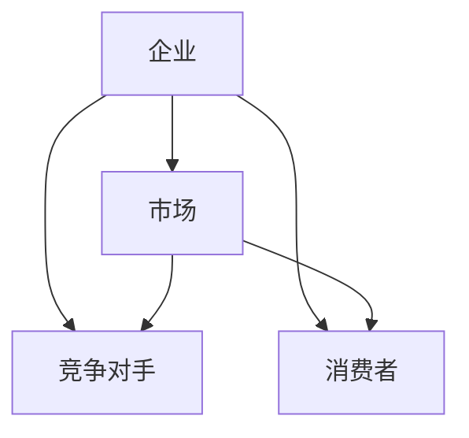
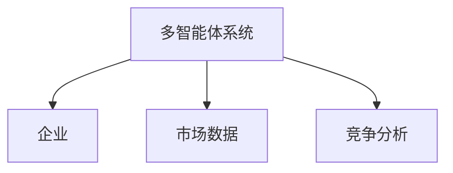
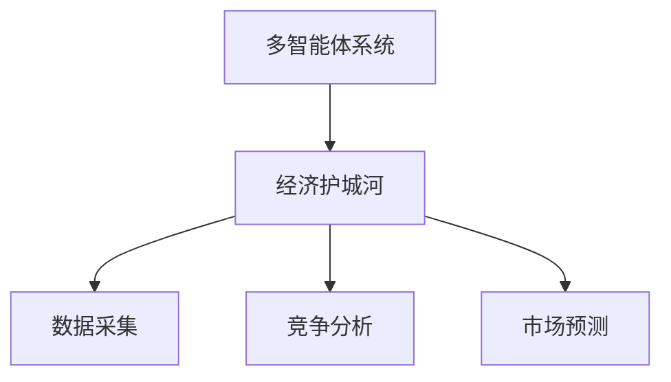
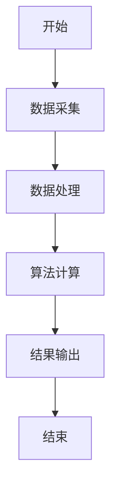
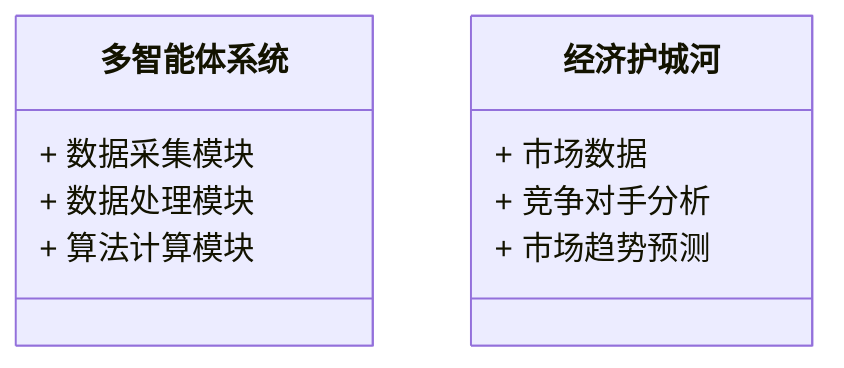
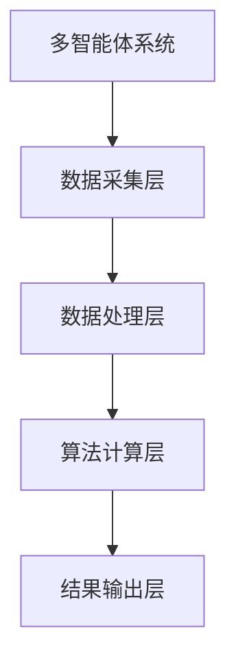
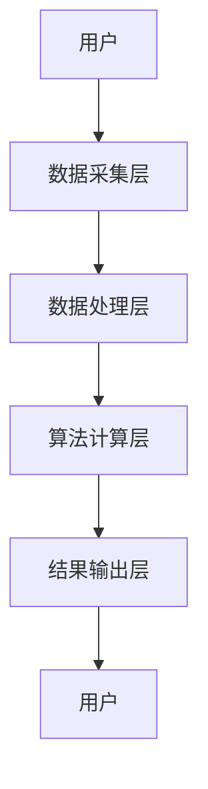

                 


# 多智能体系统在识别和评估经济护城河中的作用

> 关键词：多智能体系统，经济护城河，协作算法，系统架构，数据挖掘

> 摘要：本文探讨了多智能体系统在识别和评估经济护城河中的应用，分析了多智能体系统的定义、核心概念及其在经济护城河识别中的作用，详细讲解了相关算法原理和系统架构设计，最后通过项目实战展示了多智能体系统在经济护城河评估中的实际应用。

---

## 第1章 多智能体系统与经济护城河的背景介绍

### 1.1 多智能体系统的定义与特点

#### 1.1.1 多智能体系统的定义
多智能体系统（Multi-Agent System, MAS）是由多个智能体组成的系统，这些智能体能够自主决策、协作完成任务，并通过交互实现复杂问题的解决。

#### 1.1.2 多智能体系统的特征
- **自主性**：每个智能体都有自主决策的能力。
- **反应性**：能够实时感知环境并做出反应。
- **协作性**：多个智能体协同工作，共同完成目标。
- **分布式性**：智能体分布在网络的不同节点上，各自承担部分任务。

#### 1.1.3 多智能体系统的应用场景
- **经济分析**：用于市场趋势预测、竞争分析。
- **网络安全**：用于威胁检测和防御。
- **交通管理**：用于智能交通系统的优化。

### 1.2 经济护城河的定义与重要性

#### 1.2.1 经济护城河的定义
经济护城河是指企业在市场竞争中建立的持久竞争优势，通常包括技术壁垒、品牌忠诚度、网络效应等因素。

#### 1.2.2 经济护城河的核心要素
- **技术壁垒**：企业拥有的专利和技术优势。
- **品牌忠诚度**：消费者对品牌的依赖程度。
- **成本优势**：企业生产成本低于竞争对手。
- **网络效应**：产品使用价值随着用户数量增加而增加。

#### 1.2.3 经济护城河的评估标准
- **市场竞争地位**：企业在市场中的占有率和竞争力。
- **技术领先性**：企业技术的先进性和创新性。
- **财务稳定性**：企业的财务状况和盈利能力。

---

## 第2章 多智能体系统在经济护城河中的作用

### 2.1 多智能体系统与经济护城河的关系

#### 2.1.1 多智能体系统如何构建经济护城河
- **数据采集**：智能体通过收集市场数据，帮助企业识别潜在的竞争优势。
- **竞争分析**：通过分析竞争对手的策略，制定应对方案。
- **市场预测**：基于历史数据和当前趋势，预测市场未来的发展。

#### 2.1.2 多智能体系统在经济护城河中的优势
- **高效协作**：多智能体系统能够快速响应市场变化。
- **智能决策**：通过协作算法，优化企业的决策过程。
- **实时监控**：实时监控市场动态，及时调整策略。

### 2.2 多智能体系统在经济护城河识别中的应用

#### 2.2.1 数据采集与分析
- **数据采集**：通过网络爬虫、传感器等手段采集市场数据。
- **数据清洗**：对采集到的数据进行清洗和预处理。
- **数据分析**：利用机器学习算法，分析数据中的潜在规律。

#### 2.2.2 竞争对手分析
- **竞争情报收集**：通过公开数据和内部信息，了解竞争对手的动向。
- **竞争策略分析**：分析竞争对手的市场策略，制定应对措施。
- **竞争优势识别**：识别企业的独特竞争优势，巩固经济护城河。

#### 2.2.3 市场趋势预测
- **市场预测模型**：基于历史数据，建立市场趋势预测模型。
- **预测结果分析**：分析预测结果，制定相应的市场策略。
- **动态调整**：根据市场变化，动态调整预测模型和策略。

---

## 第3章 多智能体系统的核心概念与联系

### 3.1 多智能体系统的核心原理

#### 3.1.1 分布式计算与协作
- **分布式计算**：任务分布在多个智能体上，通过协作完成整体目标。
- **协作机制**：智能体之间通过通信和协调，实现任务的协同完成。

#### 3.1.2 博弈论与策略制定
- **博弈论模型**：利用博弈论模型，分析市场中的竞争与合作。
- **策略制定**：基于博弈论模型，制定最优策略。

### 3.2 经济护城河的实体关系图

#### 3.2.1 实体关系图（ER图）分析


#### 3.2.2 多智能体系统与经济护城河的实体关系


### 3.3 多智能体系统与经济护城河的关系图



---

## 第4章 多智能体系统的算法原理

### 4.1 多智能体协作算法

#### 4.1.1 分布式计算算法
- **算法步骤**：
  1. 分配任务给多个智能体。
  2. 智能体分别处理自己的任务。
  3. 智能体之间共享结果，完成整体任务。

#### 4.1.2 博弈论算法
- **算法模型**：纳什均衡模型。
- **数学公式**：
  $$ 纳什均衡：对于所有参与人i，策略s_i是最佳反应。 $$

### 4.2 经济护城河评估算法

#### 4.2.1 数据分析算法
- **算法步骤**：
  1. 数据清洗和预处理。
  2. 数据建模，选择合适的模型。
  3. 模型训练和优化。

#### 4.2.2 竞争对手分析算法
- **算法模型**：基于文本挖掘的竞争对手分析。
- **数学公式**：
  $$ 竞争对手优势：S = \sum_{i=1}^{n} w_i x_i $$
  其中，$w_i$ 是权重，$x_i$ 是竞争对手的特征。

### 4.3 算法流程图



---

## 第5章 系统分析与架构设计方案

### 5.1 系统应用场景

#### 5.1.1 企业
- **应用场景**：企业利用多智能体系统识别和评估经济护城河，制定市场策略。

### 5.2 系统功能设计

#### 5.2.1 领域模型类图



#### 5.2.2 系统架构图



### 5.3 系统接口设计

#### 5.3.1 接口设计
- **数据接口**：与数据源对接，获取市场数据。
- **算法接口**：与算法模块对接，调用协作算法。

### 5.4 系统交互流程图



---

## 第6章 项目实战

### 6.1 环境安装

#### 6.1.1 安装Python和相关库
```bash
pip install numpy
pip install pandas
pip install matplotlib
```

### 6.2 系统核心实现源代码

#### 6.2.1 数据采集代码
```python
import requests
from bs4 import BeautifulSoup

def get_market_data(url):
    response = requests.get(url)
    soup = BeautifulSoup(response.text, 'html.parser')
    data = []
    for item in soup.find_all('div', class_='market-item'):
        data.append({
            'name': item.find('h3').text,
            'price': float(item.find('p').text)
        })
    return data
```

#### 6.2.2 数据处理代码
```python
import pandas as pd

def process_data(data):
    df = pd.DataFrame(data)
    df['price_change'] = df['price'].diff()
    return df
```

#### 6.2.3 算法计算代码
```python
import numpy as np

def calculate_nash_equilibrium(players, strategies):
    payoff = {}
    for player in players:
        payoff[player] = {}
        for strategy in strategies:
            payoff[player][strategy] = np.random.rand()
    return payoff
```

### 6.3 案例分析与结果解读

#### 6.3.1 案例分析
- **案例背景**：某企业希望利用多智能体系统评估其经济护城河。
- **数据采集**：采集市场数据，包括竞争对手的价格、销量等。
- **数据处理**：对数据进行清洗和预处理。
- **算法计算**：利用协作算法，评估经济护城河的强弱。

#### 6.3.2 结果解读
- **结果展示**：通过图表展示经济护城河的评估结果。
- **结果分析**：分析结果，制定相应的市场策略。

### 6.4 项目小结

---

## 第7章 最佳实践与总结

### 7.1 小结
- **小结**：多智能体系统在经济护城河的识别和评估中具有重要作用，能够提高企业的市场竞争力。

### 7.2 注意事项
- **数据隐私**：注意数据的隐私和安全问题。
- **算法优化**：不断优化算法，提高系统的效率和准确性。

### 7.3 拓展阅读
- **推荐书籍**：《多智能体系统与博弈论》。
- **推荐文章**：《多智能体系统在经济分析中的应用》。

---

## 附录

### 附录1：术语表
- **多智能体系统（MAS）**：由多个智能体组成的系统。
- **经济护城河**：企业在市场竞争中的持久竞争优势。

### 附录2：参考文献
- [1] 多智能体系统与博弈论.
- [2] 经济护城河的识别与评估.

---

作者：AI天才研究院/AI Genius Institute & 禅与计算机程序设计艺术 /Zen And The Art of Computer Programming

